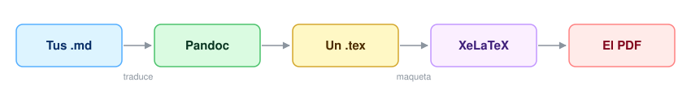
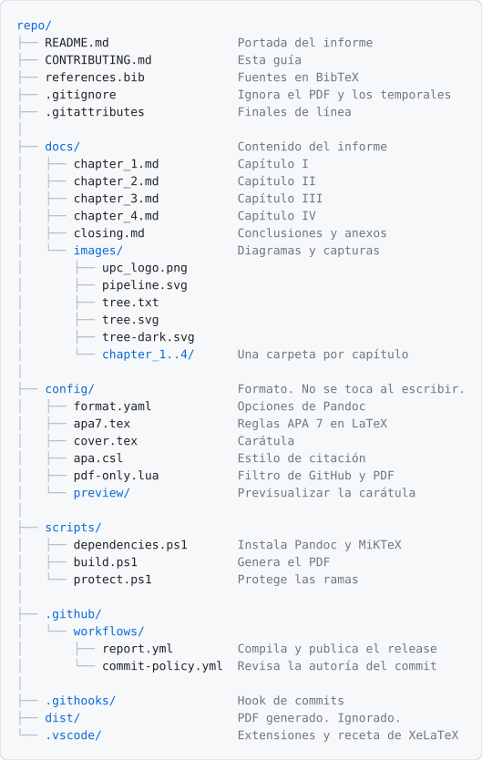

# Guía para contribuir al informe

El informe se escribe en Markdown y se exporta a PDF con formato APA 7. Dos
herramientas hacen ese trabajo:



Pandoc traduce el Markdown y resuelve las citas y el índice. No sabe nada de
páginas ni de márgenes: eso lo calcula XeLaTeX, que es quien decide dónde corta
cada línea y aplica el interlineado, las sangrías y las reglas contra viudas y
huérfanas. Pandoc llama a XeLaTeX por su cuenta, así que tú corres un comando y no
dos.

## Dependencias

| Herramienta | Uso |
| --- | --- |
| Pandoc | Convierte el Markdown a LaTeX |
| MiKTeX (XeLaTeX) | Convierte ese LaTeX en el PDF |
| `tex-gyre` | Fuente TeX Gyre Termes, el clon libre de Times que pide APA 7 |

Abre PowerShell en la raíz de la carpeta del proyecto y corre esto antes de
compilar por primera vez:

```powershell
.\scripts\dependencies.ps1
```

Comprueba las tres, instala las que falten previa confirmación y no hace nada si ya
están. Puedes correrlo las veces que quieras.

> [!NOTE]
> Después de una instalación hay que abrir una terminal nueva. Windows no refresca
> el PATH en las ventanas que ya estaban abiertas.

## Compilación

Desde la raíz del proyecto:

```powershell
.\scripts\build.ps1 <av1|tb1|av2|tb2>
```

El parámetro es obligatorio. Decide qué capítulos entran y cómo se llama el archivo
que sale:

```
dist/upc-pre-<periodo>-1acc0238-<nrc>-<startup>-report-<entrega>.pdf
```

## Estructura

<picture>
  <source media="(prefers-color-scheme: dark)" srcset="docs/images/tree-dark.svg">
  
</picture>

## Flujo de trabajo

| Rama | Para qué sirve |
| --- | --- |
| `main` | Solo estados entregables. De aquí salen las entregas. |
| `develop` | Donde se integra el trabajo del equipo. |
| `feature/*` | Una por sección del informe. Vive uno o dos días. |

### Escribir una sección

Sales de `develop` actualizada y abres tu rama:

```powershell
git switch develop
git pull
git switch -c feature/2-3-needfinding
```

El nombre lleva el número de la sección y una palabra que la identifique. Así el
historial dice quién escribió qué, que es parte de lo que se califica.

Escribes, haces tus commits y cuando la sección esté lista la subes:

```powershell
git push -u origin feature/2-3-needfinding
```

Abres la Pull Request hacia `develop`, un compañero la revisa, y al mergear se borra
la rama:

```powershell
gh pr merge --merge --delete-branch
```

Ese `--delete-branch` no es cosmético. En un ciclo se acumulan decenas de ramas y sin
borrarlas nadie distingue las vivas de las terminadas.

> [!TIP]
> Cierra tus ramas rápido. Una rama abierta una semana acumula divergencia con
> `develop` y termina en conflictos de cosas que ni tocaste. Si una sección te va a
> llevar más de dos días, pártela.

Como cada capítulo es un solo archivo, dos personas escribiendo a la vez en
secciones distintas del mismo capítulo van a chocar al mergear la segunda rama. El
conflicto se resuelve en un minuto, porque los dos bloques se conservan, pero
conviene repartirse los capítulos para no toparse.

### Entregar

Cuando el informe está listo para AV1, TB1, AV2 o TB2, una Pull Request de `develop`
a `main`. Es la única forma en que `main` cambia.

Con eso mergeado, el tag dispara la compilación y publica el release con el PDF:

```powershell
git tag av1
git push origin av1
```

### Protección de ramas

`main` y `develop` rechazan los pushes directos. Todo entra por Pull Request y con
el check `no-ai-authorship` en verde, incluidos los administradores.

> [!WARNING]
> Esa configuración vive en los ajustes del repositorio, no en sus archivos, así que
> no se copia al crear un repositorio nuevo a partir de este. Para replicarla:
>
> ```powershell
> .\scripts\protect.ps1 <owner/repo>
> ```
>
> Las dos ramas tienen que existir en el remoto y el workflow tiene que haber
> corrido al menos una vez, para que GitHub conozca el check.

## Commits

Los mensajes van **en inglés** y siguen [Conventional Commits](https://www.conventionalcommits.org):
un tipo, dos puntos y qué hace el cambio.

```
feat: add user personas to chapter 2
fix: correct the sprint 1 backlog table
docs: update the version log
```

`feat` para contenido nuevo, `fix` para correcciones, `docs` para la documentación
del repositorio y `chore` para configuración.

> [!IMPORTANT]
> El enunciado exige GitFlow y Conventional Commits, y los evalúa mirando el
> historial y los analíticos de colaboración. No es una preferencia del equipo: es
> parte de la nota, igual que el contenido del informe.

El historial es evidencia que se califica, así que ningún commit puede atribuir
autoría a una herramienta de IA. Hay dos controles, uno en tu máquina y otro en el
servidor:

| Control | Dónde actúa | Se salta con |
| --- | --- | --- |
| `.githooks/commit-msg` | Al hacer commit, en tu equipo | `git commit --no-verify` |
| `commit-policy.yml` | En cada push y cada Pull Request | Nada |

El hook lo activa `dependencies.ps1`. Si un commit ya salió con esa línea y todavía
no lo subiste, `git commit --amend` lo arregla.

## Convenciones de escritura

> [!IMPORTANT]
> Varias de estas reglas no producen ningún error al compilar. El PDF se genera
> igual, pero con el contenido mal formado, y te enteras al abrirlo.

### Encabezados

La numeración se escribe a mano, dentro del título. LaTeX no numera nada, para que
el PDF diga exactamente lo que pide el enunciado.

```markdown
# Capítulo I: Presentación
## 1.1. Startup Profile
### 1.1.1. Descripción de la Startup
#### 1.1.1.1. Subnivel
```

Cada `#` de primer nivel abre página nueva. El índice llega hasta el tercer nivel;
los más profundos salen en el documento pero no se listan. Para forzar un salto,
`\newpage` en una línea propia.

### Separadores y emojis

Usa `***` para una línea separadora, con una línea en blanco antes y después.

> [!CAUTION]
> No uses `---`. Esa secuencia también significa "cabecera de tabla" y "bloque de
> metadatos" en Markdown, y según lo que tenga alrededor convierte tu texto en una
> tabla o lo hace desaparecer del PDF sin avisar.

El build desactiva la interpretación como metadatos con
`--from=markdown-yaml_metadata_block`, que era la que borraba contenido en silencio.
La ambigüedad con las tablas sigue ahí.

Los emojis no se imprimen. TeX Gyre Termes es una fuente de texto y no tiene glifos
para ✕, ⊘ o 🔗: en GitHub se ven y en el PDF desaparecen sin dejar hueco. Si
necesitas marcar estados en una tabla, escríbelos con palabras.

### Tablas

Hay dos formas de escribir una tabla. Para tablas cortas y simples, las de tuberías
de Markdown. Para cualquier tabla con celdas largas, varias columnas o celdas
combinadas, HTML.

#### Tablas HTML (recomendado para tablas grandes)

```html
<table>
  <colgroup>
    <col style="width:20%">
    <col style="width:50%">
    <col style="width:30%">
  </colgroup>
  <thead>
    <tr><th>Story ID</th><th>User</th><th>Priority</th></tr>
  </thead>
  <tbody>
    <tr><td>US01</td><td>Integrante</td><td>Alta</td></tr>
    <tr>
      <td><strong>Acceptance Criteria</strong></td>
      <td colspan="2">
        <strong>Escenario 1</strong><br>
        Dado que...<br>
        Cuando...<br>
        Entonces...
      </td>
    </tr>
  </tbody>
</table>
```

El build la convierte en una tabla nativa con `config/html-tables.lua`, así que en
el PDF sale igual que en GitHub. Reglas:

- El ancho de cada columna se fija con `<col style="width:NN%">`. Sin `colgroup`,
  LaTeX reparte el ancho según el contenido y las columnas con texto largo se
  aplastan.
- Dentro de una celda vale Markdown o HTML, como prefieras: `**negrita**` o
  `<strong>`, `*cursiva*` o `<em>`, `` `código` ``, `[enlace](url)`,
  `` o ``. `<br>` baja de línea y `<p>` separa párrafos.
- `colspan` y `rowspan` funcionan.
- Las líneas en blanco dentro de la tabla no la rompen, a diferencia de las tablas
  de tuberías.

#### Tablas de tuberías (solo para tablas simples)

```markdown
| Versión | Fecha      | Autor |
| ------- | ---------- | ----- |
| AV1     | 02/04/2026 | Todos |
```

> [!CAUTION]
> En una tabla de tuberías, la cantidad de guiones bajo cada encabezado es el ancho
> relativo de esa columna en el PDF. Si una columna tiene 120 guiones y las otras
> 4, las otras salen de un centímetro y con las palabras partidas sílaba por sílaba.
> Dale a cada columna al menos tantos guiones como caracteres tiene su encabezado y
> reparte el resto según cuánto texto lleva cada una. Tables Generator no hace esto
> por ti: alinea las tuberías con el contenido de la primera fila, que suele ser
> justo lo contrario de lo que el PDF necesita.

Una fila entera tiene que caber en una sola línea del archivo, y dentro de una celda
se baja de línea con `<br>`:

```markdown
| Criterio | Acciones realizadas |
| --- | --- |
| Comunica oralmente | **Apellido, Nombre**<br>*AV1:* Lo que hizo.<br>*TB1:* Lo que hizo. |
```

`<br>` es la única etiqueta HTML que sobrevive dentro de una tabla de tuberías,
porque `config/pdf-only.lua` la traduce a un salto de línea antes de exportar.

### Centrar y otros bloques HTML

`<div align="center">` centra su contenido en el PDF, sea texto, una imagen en
Markdown o un ``. El mismo filtro lo resuelve:

```markdown
<div align="center">

{width=70%}

**Figura centrada** con su descripción.

</div>
```

Deja una línea en blanco después de `<div ...>` y otra antes de `</div>` cuando el
contenido es Markdown; si es una sola línea de HTML (`<br>texto`), puede ir
todo junto.

Un `` suelto dentro de un párrafo también sobrevive al
PDF. Cualquier otra etiqueta HTML de bloque (`<span>`, `<p align>`, `<font>`) sigue
perdiéndose: Pandoc conserva solo el texto.

### Imágenes

La ruta se escribe relativa al archivo `.md` que la referencia, y así funciona tanto
en GitHub como en el PDF.

```markdown
{width=85%}
```

Cada imagen va en la carpeta de su capítulo. El logo y las fotos del equipo, en la
raíz de `docs/images/`.

### Contenido distinto en GitHub y en el PDF

El `README.md` necesita las dos cosas: una tabla de contenidos con enlaces para
navegar los `.md` en GitHub, y el índice con números de página en el PDF. Los
marcadores en comentarios HTML lo resuelven, porque GitHub los ignora y Pandoc los
lee.

```markdown
<!-- pdf:omit-start -->
Esto se ve en GitHub y no sale en el PDF.
<!-- pdf:omit-end -->

<!-- pdf:only
\tableofcontents
-->
```

Lo que va dentro de `pdf:only` se interpreta como Markdown, así que acepta comandos
de LaTeX (`\tableofcontents`) y bloques de Pandoc (`::: {#refs}`). Como está dentro
de un comentario, en GitHub no se ve nada.

De eso se encarga `config/pdf-only.lua`, que el build pasa con `--lua-filter`.

> [!NOTE]
> La tabla de contenidos con enlaces del README se mantiene a mano. Si agregas o
> renombras un encabezado, actualiza también el enlace. El índice del PDF sí se
> genera solo.

### Citas y bibliografía

La lista de referencias se genera sola. No se escribe a mano.

**Uno.** Agrega la fuente a `references.bib`. En Google Scholar la sacas del botón
de comillas, opción BibTeX. La primera palabra de la entrada es la clave con la que
la vas a citar.

```bibtex
@book{evans2003ddd,
  author    = {Evans, Eric},
  title     = {Domain-Driven Design},
  publisher = {Addison-Wesley},
  year      = {2003}
}
```

Para herramientas de software usa `@software` en lugar de `@book`. APA añade sola la
etiqueta `[Computer software]` y el número de versión.

**Dos.** Cítala en el texto.

| Sintaxis | Resultado |
| --- | --- |
| `[@evans2003ddd]` | (Evans, 2003) |
| `[-@evans2003ddd]` | (2003), para citas narrativas |
| `[@evans2003ddd, p. 45]` | (Evans, 2003, p. 45) |
| `[@clave1; @clave2]` | (Autor A, 2020; Autor B, 2021) |

**Tres.** Ya está. La entrada aparece en la bibliografía, ordenada alfabéticamente y
con sangría francesa.

Una fuente que no cites no aparece, y así debe ser: APA solo lista lo que se cita.

> [!CAUTION]
> En `docs/closing.md` hay un bloque que parece vacío y que no se debe borrar:
>
> ```markdown
> # Bibliografía
>
> <!-- pdf:only
> ::: {#refs}
> :::
> -->
> ```
>
> Marca el punto donde se inserta la lista de referencias. Sin él, Pandoc la pega al
> final de todo el documento, o sea después de los anexos.
