# Capítulo II: Requirements Development and Software Solution Design

## 2.1. Competidores

Para el análisis competitivo de Pozzo se identificaron tres alternativas del mercado vinculadas a la gestión de ahorros rotativos (tandas/ROSCAs), recaudación grupal y división de gastos compartidos:

1. **Tandapp (o MiTandita)** [@tandapp2026]: Aplicación móvil para organizar tandas tradicionales, asignando turnos y registrando abonos de forma manual.
2. **Moneypool** [@moneypool2026]: Plataforma fintech mexicana para crear fondos comunes ("pools") con saldo digital en app, cobro mediante tarjeta y custodia de dinero.
3. **Splitwise** [@splitwise2026]: Aplicación global orientada al registro, cálculo y división equitativa de gastos compartidos entre amigos, compañeros de vivienda o viajes.

Pozzo se diferencia por resolver la realidad operativa de las juntas peruanas: opera sobre transferencias directas por Yape y Plin sin custodiar el dinero (evitando comisiones y trámites financieros), automatiza el registro de aportes leyendo los vouchers mediante OCR, despersonaliza la cobranza con recordatorios automáticos y permite gestionar turnos (por sorteo, orden acordado o subasta) junto a un historial de cumplimiento para futuros ciclos.

### 2.1.1. Análisis Competitivo

#### ¿Por qué llevar a cabo este análisis?

El propósito de este análisis es examinar las fortalezas y vacíos de las aplicaciones existentes para definir una propuesta de valor realista y diferenciada para Pozzo. En el Perú, las juntas se pagan por canales digitales (Yape/Plin), pero su administración sigue atrapada en cuadernos y grupos de WhatsApp saturados de capturas. Identificar las carencias de los competidores permite enfocar el desarrollo en solucionar el desorden administrativo, los errores de conteo y las discusiones sobre aportes sin alterar la dinámica de confianza del grupo.

#### Competitive Analysis Landscape

| Característica | Pozzo                                                                                                                   | Tandapp / MiTandita | Moneypool | Splitwise |
| :--- |:------------------------------------------------------------------------------------------------------------------------| :--- | :--- | :--- |
| **Perfil / Overview** | Plataforma móvil y web para administrar juntas de ahorro en tiempo real, validando vouchers sin custodiar dinero.       | App móvil para registrar integrantes, armar tandas, asignar turnos y marcar pagos manualmente. | Plataforma fintech para recaudar fondos grupales mediante saldo digital y links de pago. | Aplicación para registrar, calcular y saldar gastos compartidos entre grupos de personas. |
| **Ventaja competitiva** | Validación OCR de vouchers de Yape/Plin y modelo 100 % no custodial adaptado a las juntas en Perú.                      | Interfaz enfocada únicamente en la dinámica de tandas sin requerir cuentas bancarias. | Cobro integrado con tarjeta de crédito/débito y dispersión a cuentas bancarias vía SPEI. | Marca global consolidada con algoritmo para optimizar y simplificar deudas cruzadas. |
| **Valor ofrecido** | Elimina el conteo manual, evita reclamos ("yo sí pagué"), despersonaliza la cobranza y transparenta el estado del pozo. | Permite calendarizar montos, fechas y turnos para consultar el avance de la tanda desde el celular. | Centraliza dinero en un fondo digital compartido para eventos o compras conjuntas antes de retirarlo. | Otorga claridad continua sobre quién le debe a quién en gastos diarios compartidos y viajes. |
| **Mercado objetivo** | Organizadores y participantes de juntas de ahorro en zonas urbanas del Perú (NSE B, C y D).                             | Organizadores y miembros de tandas comunitarias y familiares en México y Latinoamérica. | Grupos de amigos, familias y organizadores de eventos sociales en México. | Compañeros de departamento, grupos de viaje, parejas y amigos a nivel internacional. |
| **Estrategias de marketing** | Invitación directa vía enlace de WhatsApp y recomendación orgánica dentro de redes de confianza.                        | Posicionamiento en tiendas de aplicaciones (ASO) mediante palabras clave ("tanda", "ahorro grupal"). | Marketing digital B2C, campañas en redes sociales y alianzas en el ecosistema fintech mexicano. | Crecimiento guiado por el producto (PLG) y optimización en Google Play y App Store. |
| **Productos y servicios** | Panel de organizador, app de participante, validador OCR de vouchers, gestión de turnos e historial de cumplimiento.    | Creación de tandas, lista de participantes, asignador de turnos/fechas y registro manual de aportes. | Creación de "pools", links de cobro, saldo virtual interno y transferencias vía SPEI. | Calculadora de división de cuentas, balance de saldos, registro de abonos y reportes exportables. |
| **Precios & costos** | Modelo freemium / microcomisión por ciclo de junta administrada.                                                        | Descarga gratuita con anuncios publicitarios invasivos; opción de compra in-app para retirarlos. | Comisión por transacción con tarjeta (aprox. 3.9 %) y tarifas según el tamaño del pool. | Versión gratuita básica; suscripción prémium (*Splitwise Pro*) para escaneo de recibos y gráficos. |
| **Canales de distribución** | Aplicación móvil nativa (Android/iOS), version multiplataforma (PWA) y enlaces por WhatsApp.                            | Google Play Store y Apple App Store. | Sitio web oficial (moneypool.mx) y app en Google Play / App Store. | Sitio web oficial (splitwise.com) y app en Google Play / App Store. |

* **Tandapp / MiTandita** se enfoca exclusivamente en la calendarización de tandas, permitiendo registrar participantes y definir el orden de entrega. Su limitación principal radica en que el registro de aportes es enteramente manual por parte del administrador, no cuenta con herramientas para validar transferencias bancarias y monetiza mediante anuncios publicitarios invasivos.
* **Moneypool** resuelve la recaudación colectiva centralizando los fondos en una cuenta virtual propia y habilitando cobros con tarjeta. Esta infraestructura presenta fricciones para el ahorro tradicional: la plataforma retiene el dinero y cobra comisiones por transacción, lo cual desincentiva a grupos informales habituados a transferencias directas, inmediatas y gratuitas entre cuentas bancarias personales.
* **Splitwise** destaca en la división de gastos comunes diarios o viajes. Sin embargo, su estructura está diseñada para liquidar saldos netos variables entre integrantes, no para el modelo de cuotas fijas rotativas con fechas estrictas de adjudicación de una junta, y restringe la lectura automatizada de recibos a su versión de pago prémium.

#### Análisis SWOT

##### Pozzo

| Fortalezas | Debilidades |
| :--- | :--- |
| • Adaptada al flujo de pago real en Perú mediante lectura OCR de comprobantes de Yape y Plin. • Modelo 100 % no custodial: no retiene dinero, eliminando riesgos legales y desconfianza de los usuarios. • Transparencia en tiempo real: calendario compartido donde todos ven el estado de aportes y el pozo. • Cobranza automatizada mediante recordatorios escalonados que evitan el desgaste entre conocidos. • Flexibilidad para asignar turnos según la costumbre del grupo (sorteo, orden acordado o subasta). | • Producto nuevo en etapa de desarrollo, sin base instalada de usuarios previa. • Dependencia técnica de la legibilidad de vouchers y de posibles cambios visuales en Yape/Plin. • Capacidad operativa y recursos de difusión acotados frente a plataformas comerciales consolidadas. • Resistencia inicial al uso de herramientas digitales en participantes poco familiarizados con apps. |
| **Oportunidades** | **Amenazas** |
| • Uso masivo y cotidiano de billeteras móviles en el Perú (más de 16 millones de usuarios activos). • Alto porcentaje de la población no bancarizada o sub-bancarizada que ahorra activamente en juntas. • Adquisición viral de bajo costo: cada organizador incorpora directamente a su grupo por WhatsApp. • Reutilización del historial de cumplimiento para facilitar la organización de siguientes ciclos. | • Hábito arraigado de organizadores de llevar sus cuentas en cuadernos físicos o libretas de notas. • Posibilidad de que billeteras como Yape incorporen herramientas nativas de ahorro grupal. • Ingreso de comprobantes duplicados, ilegibles o manipulados que requieran revisión manual. • Casos de morosidad o deserción de integrantes que comprometan la continuidad de la junta. |

##### Tandapp / MiTandita

| Fortalezas | Debilidades |
| :--- | :--- |
| • Especialización directa en el flujo tradicional de tandas y ahorro rotativo. • Configuración rápida y uso ligero sin solicitar vinculación de cuentas bancarias. • Buen posicionamiento orgánico en tiendas móviles para búsquedas relacionadas con tandas. | • Registro de pagos 100 % manual por parte del organizador. • Experiencia de uso deteriorada por la presencia de publicidad en la versión gratuita. • Nula validación de comprobantes ni compatibilidad con billeteras móviles peruanas. |
| **Oportunidades** | **Amenazas** |
| • Interés de sectores populares por ordenar el seguimiento de sus tandas desde el celular. • Posibilidad de transicionar hacia esquemas de suscripción accesibles sin anuncios. | • Pérdida de usuarios ante aplicaciones que automaticen la verificación de abonos. • Alta tasa de abandono provocada por la saturación de anuncios dentro de la app. |

##### Moneypool

| Fortalezas | Debilidades |
| :--- | :--- |
| • Respaldo formal como entidad fintech regulada (IFPE) en México. • Infraestructura propia con links de cobro y recepción de pagos con tarjeta de débito/crédito. • Marca reconocida en recaudación de fondos y eventos sociales en su país de origen. | • Cobro de comisiones que reducen el monto final del ahorro acumulado. • Fricción y rechazo de usuarios informales a dejar su dinero bajo custodia de un tercero. • Operatividad restringida al sistema bancario mexicano, sin soporte para soles peruanos. |
| **Oportunidades** | **Amenazas** |
| • Generación de microrendimientos financieros sobre los saldos depositados en la plataforma. • Expansión hacia cobros colectivos corporativos, institucionales y eventos masivos. | • Preferencia del público por transferencias interbancarias directas y sin comisión. • Mayor rigidez en normativas sobre captación de fondos y billeteras electrónicas. |

##### Splitwise

| Fortalezas | Debilidades |
| :--- | :--- |
| • Marca global líder en administración y liquidación de gastos compartidos. • Algoritmo optimizado para consolidar saldos y reducir transferencias entre integrantes. • Plataforma madura con sincronización multidispositivo y respaldo en la nube. | • No contempla la estructura de turnos rotativos ni el cobro de cuotas periódicas de una junta. • La lectura automática de recibos (OCR) está restringida al plan de pago prémium. • Carece de recordatorios de cobro escalonados diseñados para la disciplina de ahorro. |
| **Oportunidades** | **Amenazas** |
| • Integración con medios de pago locales en mercados emergentes. • Desarrollo de funciones orientadas a metas de ahorro grupal para viajes o proyectos. | • Fuga de usuarios hacia aplicaciones verticales enfocadas en esquemas de ahorro rotativo. • Descontento de los usuarios frente a la limitación progresiva de opciones gratuitas. |

### 2.1.2. Estrategias y tácticas frente a competidores

Pozzo no busca competir como pasarela de pagos ni como un divisor de gastos general. La propuesta se fundamenta en resolver la carga operativa y los conflictos de las juntas peruanas sin intervenir en el dinero y respetando la relación de confianza del grupo.

#### Estrategia 1: Validación automatizada de pagos sin custodia de fondos

Pozzo se posiciona como una herramienta de administración y auditoría: el dinero continúa transfiriéndose directamente de persona a persona por Yape o Plin, mientras la plataforma se encarga de conciliar los aportes mediante lectura de comprobantes.

**Tácticas:**

* Desarrollar un motor OCR entrenado para reconocer con precisión monto, fecha, destinatario y número de operación en vouchers de Yape y Plin.
* Mostrar una pantalla de previsualización para que el participante confirme o corrija los datos leídos antes de registrar el aporte, resolviendo fallos por capturas borrosas.
* Incorporar validaciones automáticas contra datos esperados (destinatario y fecha) y alertar sobre comprobantes duplicados para que el organizador solo intervenga ante inconsistencias.
* Explicar de forma clara en la interfaz que Pozzo no retiene ni maneja los fondos, eliminando dudas de seguridad y barreras legales.

***

#### Estrategia 2: Adopción sin fricción y experiencia mobile-first

Para que una junta adopte la solución, todo el grupo debe poder utilizarla sin trámites complejos ni barreras tecnológicas.

**Tácticas:**

* Permitir el ingreso mediante un enlace de invitación distribuido por WhatsApp, facilitando que los participantes consulten el calendario en pocos segundos.
* Diseñar un flujo de registro mínimo que requiera únicamente nombre y número de celular, priorizando la facilidad de uso sobre la carga de datos.
* Disponer de una versión multiplataforma (PWA) junto a la app móvil, permitiendo consultar turnos y subir vouchers sin exigir una descarga obligatoria a quienes tengan limitaciones de almacenamiento.
* Presentar una interfaz gráfica limpia y visual que permita entender de un vistazo el avance de la junta, accesible para usuarios con poca experiencia digital.

#### Estrategia 3: Cobranza despersonalizada y transparencia de recaudación

Pozzo asume el seguimiento de pagos para liberar al organizador del desgaste de perseguir a familiares o amigos, reduciendo la morosidad y las discusiones sobre aportes.

**Tácticas:**

* Configurar notificaciones automáticas escalonadas que incrementen su periodicidad conforme se aproxime la fecha límite de aporte.
* Mostrar en un calendario compartido el estado de aportes en tiempo real, de manera que la visibilidad colectiva funcione como un incentivo natural de puntualidad.
* Proveer al participante que cobra en el turno vigente un indicador directo de cuánto falta para completar el pozo acordado.
* Mantener un registro verificable de cada aporte validado para resolver de inmediato controversias del tipo "yo sí pagué".

#### Estrategia 4: Gestión integral del ciclo e historial de cumplimiento

La herramienta acompaña a la junta durante todo su ciclo operativo, desde la organización inicial hasta el cierre y apertura de nuevas rondas.

**Tácticas:**

* Ofrecer opciones flexibles para asignar los turnos adaptadas a cómo opera cada grupo: por sorteo aleatorio, orden acordado entre integrantes o mecanismo de subasta.
* Generar al término del ciclo un historial de cumplimiento individual que acredite la puntualidad de cada miembro.
* Permitir que el historial sirva de referencia de confianza para organizar siguientes juntas con el mismo grupo o incorporar participantes a rondas de mayor monto.

## 2.2. Entrevistas

Esta sección presenta el estudio cualitativo basado en entrevistas semiestructuradas orientadas a validar Pozzo, una aplicación para administrar juntas (o panderos) informales sin que el dinero pase por la plataforma. El estudio exploró cómo se administran hoy las juntas, cómo se registran y comprueban los aportes por Yape o Plin, cómo se reparten los turnos y cómo se maneja la cobranza y los reclamos dentro del grupo. Participaron cabezas de junta con experiencia organizando varios ciclos y participantes de juntas activas, lo que permitió identificar que el registro manual en cuadernos y la revisión de capturas una por una son las principales fuentes de errores y desconfianza en la administración.

### 2.2.1. Diseño de entrevistas

"Antes de iniciar la entrevista, se brinda un saludo cordial y una breve presentación del entrevistador, explicando que el propósito de la conversación es conocer cómo las personas organizan y participan en juntas de ahorro en su día a día. Se aclara que la información recopilada será utilizada únicamente con fines académicos para el desarrollo del proyecto Pozzo y se mantendrá en estricta confidencialidad. Como primer paso, se solicita al entrevistado brindar su nombre completo, edad y lugar de residencia para fines de registro. Asimismo, se señala que la entrevista tendrá una duración aproximada de 10 a 15 minutos y se desarrollará de manera abierta, por lo que se le invita a responder con total libertad y basándose en ejemplos de su experiencia real, destacando que no existen respuestas correctas o incorrectas."

**Preguntas introductorias**

-   ¿Cuál es su nombre completo?

**Segmento 1: Cabezas de junta (organizadores)**

1. Para empezar, cuéntame de ti: ¿qué edad tienes, en qué distrito vives y a qué te dedicas?

2. ¿Cómo terminaste organizando juntas? ¿Hace cuánto y cuántas has administrado?

3. La junta que llevas ahora, ¿de quiénes se compone? ¿Trabajo, familia, vecinos, una mezcla?

4. Descríbeme la última junta que organizaste de principio a fin: cuánta gente, cuánto aportaba cada uno y cada cuánto tiempo.

5. ¿Cómo decidieron quién cobra primero y quién al final?

6. ¿Cómo te llegan los aportes? ¿Yape, Plin, efectivo, una mezcla?

7. En el último ciclo, ¿dónde anotaste quién había depositado y quién no?

8. Cuéntame paso a paso qué hiciste en la última fecha de corte, desde que se acercaba el día hasta que confirmaste que el pozo estaba completo.

9. En ese ciclo, ¿a cuántas personas tuviste que recordarles el pago? ¿Y cuántas veces a cada una?

10. ¿Cuántos comprobantes revisaste ese ciclo y cómo los revisabas?

11. Cuéntame la última vez que la cuenta no cuadró, o que alguien dijo haber pagado y no te aparecía. ¿Qué pasó y cómo se resolvió?

12. De todas las juntas que has organizado, ¿en cuántas pasó algo parecido? ¿Alguna se rompió por eso?

13. ¿Qué es lo que menos te gusta de organizar la junta?

14. ¿Has intentado llevarlo con Excel, alguna app o algo parecido? ¿Qué pasó?

15. ¿Qué celular usas y qué aplicaciones abres todos los días?

**Segmento 2: Participantes de junta**

1. Cuéntame de ti: ¿qué edad tienes, en qué distrito vives y a qué te dedicas?

2. ¿Cómo entraste a tu primera junta? ¿Quién te invitó?

3. El dinero que cobraste, ¿para qué lo usaste?

4. Descríbeme la junta en la que estás ahora: cuánta gente, cuánto aportas y cada cuánto.

5. Cuéntame paso a paso qué haces cuando toca aportar, desde que te acuerdas hasta que terminas.

6. ¿Cómo supiste qué turno te tocaba?

7. Después de yapear, ¿qué haces con la captura?

8. ¿Alguna vez te dijeron que no habías pagado cuando sí lo habías hecho? Cuéntame qué pasó.

9. Si el organizador te dijera hoy que falta un aporte tuyo de hace tres meses, ¿podrías demostrar que sí pagaste? ¿Cómo lo buscarías?

10. Antes de que te toque cobrar, ¿cómo sabes si el pozo va a estar completo?

11. Cuéntame cómo fue la última vez que te tocó cobrar.

12. ¿Has estado en una junta que se rompió o donde alguien dejó de pagar? ¿Qué pasó?

13. Cuando te invitan a una junta nueva, ¿qué te hace decidir si entras o no?

14. ¿Alguna vez pediste ver cómo iba la cuenta de la junta? ¿Qué te respondieron?

15. ¿Qué celular usas y qué aplicaciones abres todos los días?

### 2.2.2. Registro de entrevistas

**Segmento 1: Cabezas de junta (organizadores)**

- **Primera entrevista**

| Campo | Detalle |
| --- | --- |
| **Entrevistado(a)** | Shirley Romy Becerra Pinchi |
| **Género** | Femenino |
| **Edad** | 33 |
| **Lugar de residencia** | Tarapoto |
| **Entrevistador(a)** | Fernando Flores |
| **Duración** | 22:31 |
| **Link de la entrevista** | https://upcedupe-my.sharepoint.com/:v:/g/personal/u20241a290_upc_edu_pe/IQDdvQoO5oy9TryDnR0F1bBHAb2aLP_LWFC5botPe_XVj3Q?nav=eyJyZWZlcnJhbEluZm8iOnsicmVmZXJyYWxBcHAiOiJTdHJlYW1XZWJBcHAiLCJyZWZlcnJhbFZpZXciOiJTaGFyZURpYWxvZy1MaW5rIiwicmVmZXJyYWxBcHBQbGF0Zm9ybSI6IldlYiIsInJlZmVycmFsTW9kZSI6InZpZXcifX0%3D&e=FpKimc |

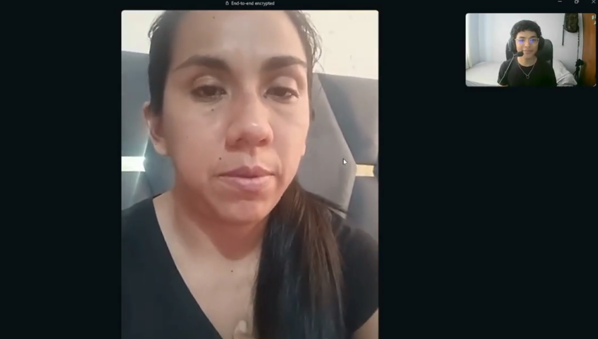{width=90%}

Shirley organiza panderos desde el colegio y lo ve como una forma de ahorrar; por eso suele quedarse con el último turno en vez del primero. Hoy administra, junto a su mamá, dos juntas mensuales: una de S/100 formada por maestros conocidos de su mamá y otra de S/200, con un total de 24 números, de los cuales seis participantes van a dejar el aporte en efectivo a su casa y el resto paga por Yape o Plin. Los turnos se definen por sorteo o por preferencia de meses, según la necesidad de cada quien (por ejemplo, quien necesita el dinero para la matrícula escolar pide ese mes). Lleva el control en un cuaderno y, el mismo día de corte, verifica los pagos revisando uno por uno sus movimientos de Yape; para la cobranza arma un grupo de WhatsApp donde manda un recordatorio el 25 y vuelve a insistir el 28. En cada ciclo tiene que recordarle el pago a dos o tres personas, hasta tres o cuatro veces cada una. Su peor experiencia ocurrió cuando su mamá sufrió un infarto cerebral y no quedó registro de quién había aportado: tuvieron que llamar uno por uno para reconstruir la cuenta, y hubo un reclamo de "yo sí pagué" imposible de comprobar. También recuerda un caso en pandemia en el que un integrante perdió su trabajo y dejó de aportar a mitad del ciclo, por lo que su mamá tuvo que cubrir esas cuotas; desde entonces son más cuidadosas al elegir personas responsables. No usa Excel ni aplicaciones, aunque reconoce que con más juntas un sistema le sería necesario. Usa un celular Redmi y a diario abre Yape y TikTok.

***

- **Segunda entrevista**

| Campo | Detalle |
| --- | --- |
| **Entrevistado(a)** | Ariel Roberto Mendoza Blanco |
| **Género** | Masculino |
| **Edad** | 29 |
| **Lugar de residencia** | Pueblo Libre, Lima |
| **Entrevistador(a)** | Fernando Flores |
| **Duración** | 8:22 |
| **Link de la entrevista** | https://upcedupe-my.sharepoint.com/:v:/g/personal/u20241a290_upc_edu_pe/IQDRpPL_neBqRL0gl1hTRH-lAWqb_FLzHgtfgUrKclzgcQE?nav=eyJyZWZlcnJhbEluZm8iOnsicmVmZXJyYWxBcHAiOiJTdHJlYW1XZWJBcHAiLCJyZWZlcnJhbFZpZXciOiJTaGFyZURpYWxvZy1MaW5rIiwicmVmZXJyYWxBcHBQbGF0Zm9ybSI6IldlYiIsInJlZmVycmFsTW9kZSI6InZpZXcifX0%3D&e=AL0giv |

{width=90%}

Ariel organiza juntas desde los 20 años como una forma de obligarse a ahorrar, ya que le cuesta juntar el dinero por su cuenta. Hoy lleva dos, una familiar y una del trabajo, de hasta 12 personas para completar un año, con un cobro por mes. Los turnos se acuerdan dialogando según la urgencia de cada quien, y él siempre se deja el último turno; al principio ponía el dinero él, hasta que vio que era una mejor forma de ahorrar. Recibe los aportes en efectivo y por transferencia, y lleva un doble registro, en un cuaderno y en un Excel: cuando alguien paga por transferencia, verifica contra su estado de cuenta y le pide la captura antes de marcarlo con un check. Tiene que recordar el pago a varias personas, hasta cuatro o cinco veces en el grupo familiar y dos o tres en el del trabajo. Su incidente más claro fue un pago hecho de madrugada que el banco retuvo 24 horas: el compañero afirmaba haber pagado, le mandó la captura, pero a Ariel no le llegaba nada. En otros casos ha tenido que poner algo de su propio dinero cuando alguien se atrasa por temas de salud. Lo que menos le gusta es tener que insistir para cobrar, y le gustaría una aplicación que verifique los pagos automáticamente y le informe cuando cada persona ya pagó. Usa un iPhone 15 y la computadora para su archivo de Excel.

***

- **Tercera entrevista**

| Campo | Detalle |
| --- | --- |
| **Entrevistado(a)** | Jorge Chávez |
| **Género** | Masculino |
| **Edad** | 25 |
| **Lugar de residencia** | San Martín de Porres, Lima |
| **Entrevistador(a)** | Fernando Flores |
| **Duración** | 8:11 |
| **Link de la entrevista** | https://upcedupe-my.sharepoint.com/:v:/g/personal/u20241a290_upc_edu_pe/IQBMwoKhRDb-Ta5sFdnCJm7SATYbCURZgS1q9Fn4MKZ6yZ8?nav=eyJyZWZlcnJhbEluZm8iOnsicmVmZXJyYWxBcHAiOiJTdHJlYW1XZWJBcHAiLCJyZWZlcnJhbFZpZXciOiJTaGFyZURpYWxvZy1MaW5rIiwicmVmZXJyYWxBcHBQbGF0Zm9ybSI6IldlYiIsInJlZmVycmFsTW9kZSI6InZpZXcifX0%3D&e=iNPW0v |

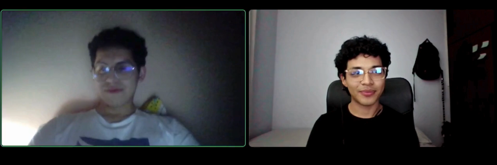{width=90%}

Jorge organiza juntas desde hace unos cinco años; empezó entre hermanos y primos para juntar dinero para gastos comunes, y luego se sumaron amigos del trabajo y quedó él a cargo. Su junta actual es de unas diez personas, entre familia y amigos cercanos, con un aporte de S/500 al mes y un pozo de S/5000 mensual; antes de empezar arman una lista con todos y definen el orden de cobro, y él participa y aporta igual que el resto. Los turnos se deciden por urgencia —quien tiene una compra o un pago pendiente cobra primero— y un cambio de turno se acuerda conversando en el grupo. Los aportes llegan por Yape y lleva el control en un Excel de doble entrada (meses por nombres, como un checklist mensual), apoyándose también en el grupo de WhatsApp. En cada corte avisa días antes por el grupo, el día de pago compara los Yapes contra su lista (a veces alguien paga por Plin y se confunde), revisa el saldo de su cuenta, escribe a quien falta y, cuando el pozo llega a los S/5000, avisa y transfiere al que le toca. Suele recordar el pago a dos o tres personas y revisa entre 15 y 20 comprobantes por ciclo. Su incidente más claro fue hace dos meses: un integrante afirmaba haber pagado y hasta mandó una captura, pero el dinero no le llegaba; resultó que había yapeado a otra persona por equivocarse de número, y tuvieron que contactar a ese tercero para recuperarlo. Lo que menos le gusta es perseguir a la gente para que pague, algo incómodo tratándose de familia y amigos. No usa aplicaciones para gestionar la junta, solo Excel. Usa un Honor X8 y a diario abre WhatsApp, Yape e Instagram.

**Segmento 2: Participantes de junta**

- **Primera entrevista**

| Campo | Detalle |
| --- | --- |
| **Entrevistado(a)** | Elizabeth Díaz |
| **Género** | Femenino |
| **Edad** | 22 |
| **Lugar de residencia** | Callao |
| **Entrevistador(a)** | Fernando Flores |
| **Duración** | 7:57 |
| **Link de la entrevista** | https://upcedupe-my.sharepoint.com/:v:/g/personal/u20241a290_upc_edu_pe/IQCFSDS82wYXTLbYwVMsMQKqAYFMxBZ7A2ITCzsY__4CGdI?nav=eyJyZWZlcnJhbEluZm8iOnsicmVmZXJyYWxBcHAiOiJTdHJlYW1XZWJBcHAiLCJyZWZlcnJhbFZpZXciOiJTaGFyZURpYWxvZy1MaW5rIiwicmVmZXJyYWxBcHBQbGF0Zm9ybSI6IldlYiIsInJlZmVycmFsTW9kZSI6InZpZXcifX0%3D&e=MGNr2M |

{width=90%}

Elizabeth entró a su primera junta invitada por una amiga de la universidad, que le comentó que varias amigas estaban ahorrando en grupo para recibir una cantidad más grande de dinero; al principio dudó, pero como conocía a todas, decidió entrar, y ese primer cobro lo usó para comprarse una laptop que necesitaba para estudiar. Hoy participa en una junta de ocho personas que aportan S/300 al mes durante ocho meses, con los turnos definidos por sorteo y publicados por la organizadora en el grupo de WhatsApp. Cuando toca aportar, la organizadora avisa por el grupo, ella revisa que tenga el dinero, yapea, toma la captura del comprobante y se la envía; la organizadora confirma en el grupo que el aporte se hizo. Guarda las capturas en su galería, pero mezcladas con todas las demás, sin una carpeta propia. Ya le pasó que la organizadora pensó que no había pagado y tuvo que buscar la conversación y reenviar la captura de Yape para demostrarlo; si le pidieran probar un aporte de hace tres meses, revisaría primero el chat de WhatsApp, luego la galería y, por último, sus movimientos de Yape. Antes de cobrar le preocupa que alguien se atrase, sobre todo si ya cuenta con ese dinero, aunque confía porque son amigas y la organizadora avisa quiénes ya pagaron. Para decidir entrar a una junta le importa quién la organiza y quiénes participan, porque con desconocidos sería más difícil reclamar si ocurre un problema. Usa un celular Android y hace todo lo de la junta desde el teléfono, con WhatsApp y Yape.

***

- **Segunda entrevista**

| Campo | Detalle |
| --- | --- |
| **Entrevistado(a)** | Mariana López |
| **Género** | Femenino |
| **Edad** | 35 |
| **Lugar de residencia** | San Juan de Lurigancho |
| **Entrevistador(a)** | Fernando Flores |
| **Duración** | 8:12 |
| **Link de la entrevista** | https://upcedupe-my.sharepoint.com/:v:/g/personal/u20241a290_upc_edu_pe/IQBGVs0x_7sNQqDkjCTOiN9nAYOPzQ04mGl01GjuDQbolVg?nav=eyJyZWZlcnJhbEluZm8iOnsicmVmZXJyYWxBcHAiOiJTdHJlYW1XZWJBcHAiLCJyZWZlcnJhbFZpZXciOiJTaGFyZURpYWxvZy1MaW5rIiwicmVmZXJyYWxBcHBQbGF0Zm9ybSI6IldlYiIsInJlZmVycmFsTW9kZSI6InZpZXcifX0%3D&e=uhHyGn |

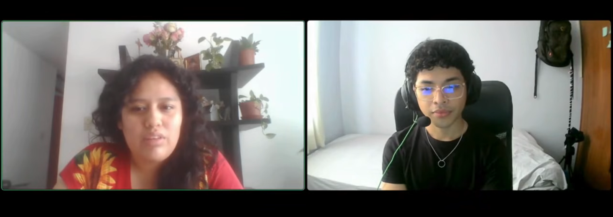{width=90%}

Mariana entró a su primera junta invitada por una amiga del trabajo; prefirió la junta a un préstamo bancario para no pagar intereses ni endeudarse, y porque ya conocía a las personas. Ese primer cobro lo usó para comprar mercadería para su negocio de venta de ropa. Hoy participa en una junta de diez personas que aportan S/200 al mes durante diez meses, con los turnos definidos por sorteo y publicados por el organizador en el grupo de WhatsApp. Anota la fecha en su calendario y, cuando se acerca el día, revisa que tenga el dinero, aporta por Yape o en efectivo y envía la captura al grupo y al organizador; guarda los comprobantes en su galería sin ordenarlos, por lo que puede ser difícil encontrarlos. Ya le pasó que el organizador le dijo que faltaba un pago y tuvo que revisar hasta encontrar el comprobante para demostrarlo. Antes de cobrar le preocupa que alguien se atrase, y se apoya en que el organizador recuerda los pagos unos días antes, lo que en su última cobranza ayudó a que le llegara el monto completo y a tiempo. Conoció el caso de una persona que dijo que pagaría después, dejó de responder y el grupo tuvo que ponerse de acuerdo para resolverlo, algo incómodo porque no sabían cómo contactarla. Para entrar a una junta valora que el organizador sea conocido y responsable, además del tiempo que durará. Usa un celular Samsung y a diario WhatsApp, Yape, Facebook, Instagram y TikTok.

***

- **Tercera entrevista**

| Campo | Detalle |
| --- | --- |
| **Entrevistado(a)** | Catherine Villar |
| **Género** | Femenino |
| **Edad** | 27 |
| **Lugar de residencia** | Los Olivos, Lima |
| **Entrevistador(a)** | Fernando Flores |
| **Duración** | 7:33 |
| **Link de la entrevista** | https://upcedupe-my.sharepoint.com/:v:/g/personal/u20241a290_upc_edu_pe/IQCj6omQVLR0RLcd9rwXUD8RAbMbkbsxrhkpd7shCpX2DGM?nav=eyJyZWZlcnJhbEluZm8iOnsicmVmZXJyYWxBcHAiOiJTdHJlYW1XZWJBcHAiLCJyZWZlcnJhbFZpZXciOiJTaGFyZURpYWxvZy1MaW5rIiwicmVmZXJyYWxBcHBQbGF0Zm9ybSI6IldlYiIsInJlZmVycmFsTW9kZSI6InZpZXcifX0%3D&e=yhcfhQ |

{width=90%}

Catherine entró a su primera junta invitada por una compañera del trabajo y ya ha estado en dos. Su primer cobro lo usó para pagar un curso que le interesaba y bajar la deuda de un crédito; prefirió la junta a un préstamo bancario para no pagar intereses. Hoy participa en una junta de ocho personas que aportan S/250 al mes durante ocho meses, con los turnos definidos por sorteo y publicados por el organizador en el grupo de WhatsApp. Cuando toca aportar, revisa que tenga el dinero, yapea al organizador —que a veces avisa porque se les pasa la fecha—, toma la captura y la manda por WhatsApp para dejar constancia; luego la guarda en su galería, pero sin ningún orden. En su segunda junta le dijeron que no había pagado y, como no ordena las capturas, tuvo que buscarla y reenviarla para que la verificaran y corrigieran; reconoce que probar un aporte de hace tres meses le costaría y sería incómodo, aunque lo buscaría sí o sí por WhatsApp o por sus movimientos de Yape y del banco. Antes de cobrar no puede estar segura de que el pozo esté completo: para ella es cosa de confiar y de preguntar quién ya pagó, y sabe de casos en que el pozo no llega completo y se termina cobrando por partes. En su última cobranza el pago se le retrasó dos o tres días porque dos integrantes no habían aportado a tiempo. Ya vivió una junta en la que alguien dejó de pagar a la mitad, algo difícil e incómodo que el grupo tuvo que resolver. Para entrar a una junta le importa que quien la organiza sea de confianza y conocer a los demás participantes; con desconocidos no entra. Usa un celular Xiaomi y a diario WhatsApp, Yape, Instagram, TikTok y las aplicaciones de su trabajo.

### 2.2.3. Análisis de entrevistas

Se realizaron 6 entrevistas semiestructuradas distribuidas en dos segmentos objetivos: 3 cabezas de junta que organizan y administran los aportes, y 3 participantes que aportan cada mes y esperan su turno para cobrar. El propósito fue identificar patrones comunes en sus experiencias, frustraciones y expectativas en torno al registro de aportes, la validación de pagos, la asignación de turnos y la cobranza. A partir de los resúmenes obtenidos, se extrajeron características objetivas y subjetivas de cada perfil, las cuales se presentan con respaldo estadístico expresado en porcentajes sobre el total de entrevistados por segmento.

#### Segmento objetivo #1: Cabezas de junta (organizadores)

**Hallazgos**

- El 100% administra la junta de forma manual, con un cuaderno y/o un Excel, y ninguno usa una aplicación dedicada para gestionarla.
- El 100% valida los pagos revisando uno por uno sus movimientos de Yape y las capturas que le envían, normalmente el mismo día de corte.
- El 100% debe recordar el pago a dos o tres integrantes en cada ciclo, a veces varias veces a cada uno.
- El 100% ha enfrentado al menos un incidente de descuadre o un reclamo de pago no verificable (registro perdido, pago retenido por el banco o transferencia a la persona equivocada).
- El 67% ha tenido que cubrir con su propio dinero, o el de un familiar, el atraso o incumplimiento de un integrante para que la cadena no se cayera.
- El 100% recibe los aportes por billetera digital (Yape o Plin) y el 67% además recibe una parte en efectivo.

**Prácticas y problemas comunes**

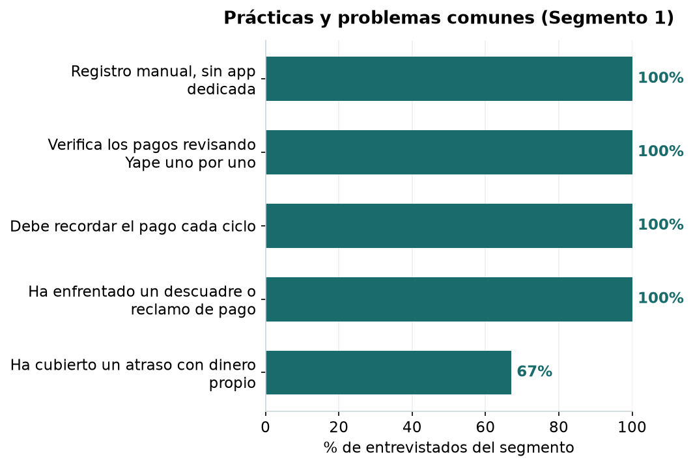{width=75%}

El registro manual, la verificación uno por uno de los pagos, la necesidad de recordar la cuota cada ciclo y los incidentes de descuadre aparecen en el 100% del segmento, lo que los posiciona como los problemas centrales y compartidos por todas las cabezas de junta. El 67% incluso ha tenido que poner dinero propio para cubrir un atraso, lo que muestra que el costo del desorden no es solo de tiempo, sino también económico.

**Herramienta de registro actual**

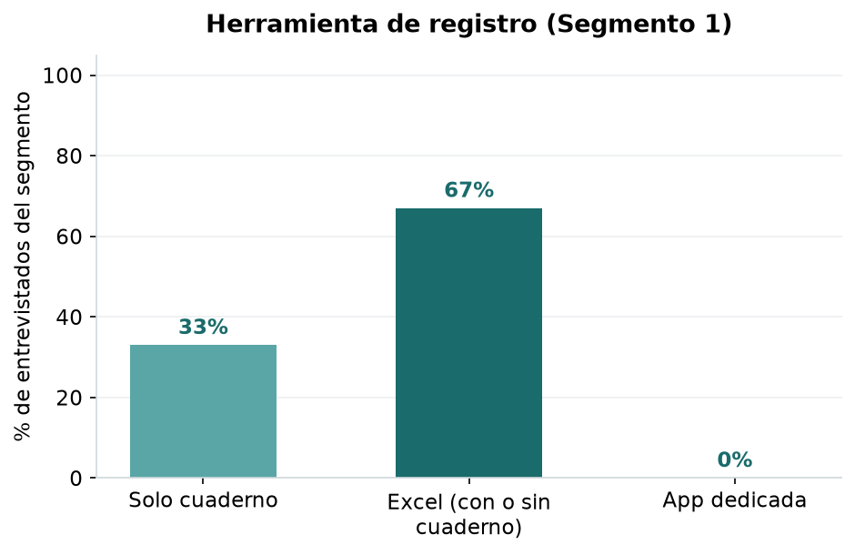{width=60%}

El 67% del segmento ya se apoya en Excel, con o sin cuaderno, y el 33% restante lleva todo únicamente en un cuaderno; ninguno usa una aplicación dedicada. Esto indica que Pozzo no compite con un sistema digital consolidado, sino que se posiciona como la primera herramienta formal de gestión de la junta, lo que reduce la resistencia al cambio y facilita la adopción.

**Canal de recepción de aportes**

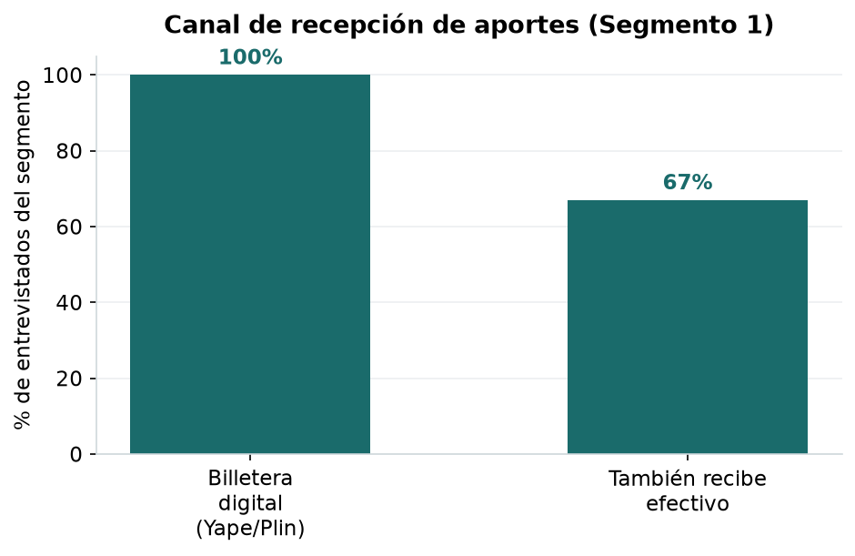{width=60%}

El 100% recibe los aportes por billetera digital (Yape o Plin) y el 67% además maneja algo de efectivo. La preferencia por la billetera valida directamente el enfoque de Pozzo de leer los vouchers de Yape/Plin sin custodiar el dinero, ya que el pago ya ocurre por ese canal y solo falta ordenar su registro y validación.

**Conclusiones**

Las cabezas de junta administran con herramientas insuficientes: dependen del cuaderno o de un Excel, validan los pagos revisando movimientos uno por uno y asumen personalmente la cobranza. Esa carga operativa se traduce en errores de conteo, reclamos difíciles de resolver e incluso en pérdidas cuando toca cubrir un atraso. La totalidad del segmento paga y cobra por billeteras digitales, lo que confirma que existe una necesidad real de una herramienta que automatice el registro y la validación de aportes sin intervenir en el dinero.

#### Segmento objetivo #2: Participantes de junta

**Hallazgos**

- El 100% aporta por billetera digital (Yape) y guarda las capturas en su galería sin ningún orden, mezcladas con las demás.
- El 100% ya vivió que le dijeran que no había pagado cuando sí lo había hecho, y tuvo que buscar y reenviar la captura para demostrarlo.
- El 100% reconoce que probar un aporte antiguo (por ejemplo, de hace tres meses) le costaría y sería incómodo.
- El 100% siente incertidumbre antes de cobrar sobre si el pozo estará completo, y se apoya en la confianza y en preguntar quién ya pagó.
- El 100% conoce o vivió una junta en la que alguien dejó de pagar, lo que generó incomodidad en el grupo.
- El 67% tuvo un retraso en su última cobranza porque algún integrante no había aportado a tiempo, y el 67% prefiere la junta a un préstamo bancario para no pagar intereses.

**Experiencias y percepciones**

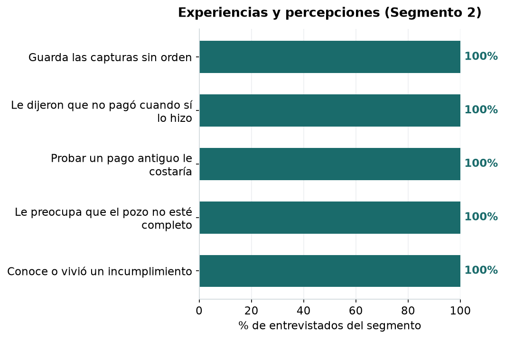{width=75%}

El desorden de las capturas, los reclamos de "no pagaste" cuando sí se pagó, la dificultad para probar un aporte antiguo, la incertidumbre sobre el pozo y el conocimiento de casos de incumplimiento aparecen en el 100% del segmento. Todos estos puntos apuntan al mismo vacío: la falta de una prueba de pago ordenada y de visibilidad del estado de la junta.

**Última cobranza**

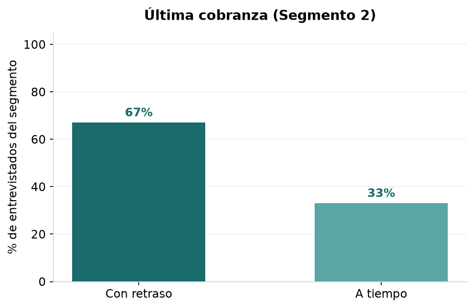{width=60%}

El 67% del segmento tuvo un retraso en su última cobranza porque algún integrante no aportó a tiempo, frente a un 33% que cobró sin contratiempos. Esto confirma que la incertidumbre sobre completar el pozo no es solo una preocupación, sino un problema que efectivamente ocurre.

**Factores para entrar a una junta**

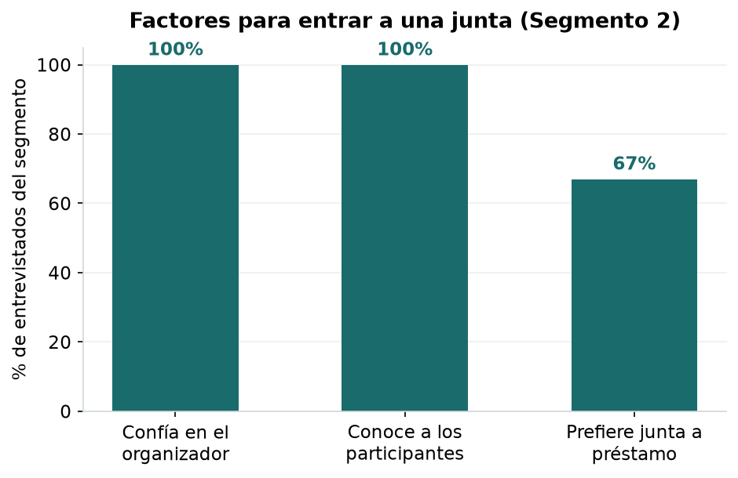{width=60%}

El 100% decide entrar a una junta según la confianza en quien la organiza y el conocer a los demás participantes, y el 67% además la prefiere frente a un préstamo bancario para no pagar intereses. La confianza es el factor decisivo, lo que refuerza que Pozzo debe apoyarse en las redes existentes del grupo y aportar transparencia sin reemplazar esa relación.

**Conclusiones**

Los participantes viven la junta con poca visibilidad y sin una prueba de pago ordenada: guardan las capturas sin criterio, ya han tenido que defender un pago que sí hicieron y sienten incertidumbre cada vez que se acerca su turno. La totalidad conoce casos de incumplimiento y la mayoría ya sufrió un retraso al cobrar. La confianza en el organizador es lo que los hace entrar, por lo que valoran una herramienta que dé transparencia del estado del pozo y respaldo verificable de sus aportes, sin alterar la dinámica de confianza del grupo.
***
## 2.3. Needfinding
En esta sección se presentan los artefactos resultantes del análisis de la información recolectada en las entrevistas de la sección 2.2. A partir de los patrones identificados en los dos segmentos objetivo se construyeron los arquetipos de usuario, se mapearon las tareas que realizan hoy con independencia de la existencia de Pozzo, se representaron sus recorridos actuales y su marco emocional, y se consolidó el lenguaje del dominio que el equipo utilizará de forma uniforme durante todo el proyecto.

Cada característica presente en los arquetipos proviene de los resúmenes y del análisis estadístico de las seis entrevistas registradas; no se incorporó ningún atributo que no tenga respaldo en dicha información.
### 2.3.1. User Personas

Se elaboró una ficha de User Persona por cada segmento objetivo, utilizando UXPressia. Para cada segmento se construyó un arquetipo representativo a partir de los patrones recurrentes identificados en las tres entrevistas, contrastando sus características con los resultados consolidados de la sección 2.2.3.

### User Persona 1: Cabeza de junta

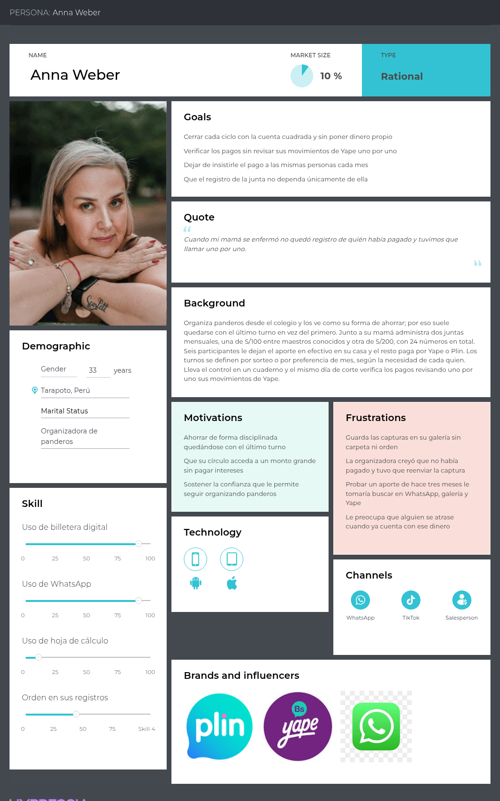

### User Persona 2: Participante de junta
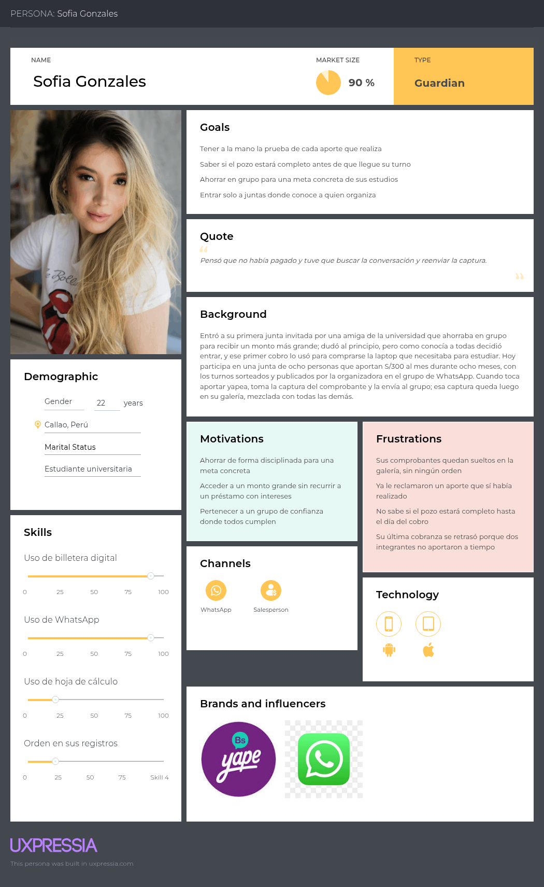

***
### 2.3.2. User Task Matrix
El User Task Matrix concentra las tareas que los User Personas realizan para cumplir sus objetivos dentro de una junta, con independencia de que exista o no una solución de software. No se trata de funcionalidades de Pozzo, sino de actividades que ambos segmentos ya ejecutan hoy con cuaderno, hoja de cálculo y mensajería.

| User Task Matrix                                                | Anna Weber (Frecuencia) | Anna Weber (Importancia) | Sofia Gonzales (Frecuencia) | Sofia Gonzales (Importancia) |
|:----------------------------------------------------------------|:-----------------------:|:------------------------:| :---: | :---: |
|Convocar y conformar el grupo de la junta                        |          Media          |           Alta           | Baja | Media |
|Definir monto, periodicidad y número de integrantes            |          Media          |           Alta           | Baja | Media |
|Acordar o sortear el orden de los turnos                         |          Baja           |           Alta           | Baja | Alta |
|Transferir el aporte por billetera digital          |          Media          |           Alta           | Alta | Alta |
|Guardar el comprobante del aporte propio                  |          Media          |          Media           | Alta | Alta |
|Registrar quién aportó en cada fecha de corte                   |          Alta           |           Alta           | Baja | Baja |
|Verificar el comprobante de cada aporte recibido                           |          Alta           |           Alta           | Baja | Media |
|Recordar el pago a los integrantes atrasados                    |          Alta           |           Alta           | Baja | Baja |
|Consultar cuánto falta para completar el pozo                   |          Media          |           Alta           | Media | Alta |
|Entregar el pozo al integrante del turno |          Media          |           Alta           | Baja | Media |
|Resolver un reclamo sobre un aporte no registrado   |          Media          |           Alta           | Media | Alta |
|Demostrar que un aporte propio sí se realizó   |          Baja           |          Media           | Media | Alta |
|Cubrir el atraso de un integrante para no romper la cadena  |          Baja           |           Alta           | Baja | Baja |
|Decidir si acepta entrar a una nueva junta  |          Baja           |          Media           | Media | Alta |

**Leyenda:** Frecuencia e Importancia se expresan en tres niveles: Baja, Media y Alta.

Del cuadro se desprenden tres lecturas. La primera es que **las tareas de mayor frecuencia e importancia para Anna son precisamente las administrativas**: registrar aportes, verificar comprobantes y recordar el pago. Son actividades que no aportan valor al ahorro en sí mismo y que, sin embargo, consumen la mayor parte de su esfuerzo. La segunda es que **para Sofia las tareas de alta frecuencia son las de ejecución y resguardo**, transferir el aporte y guardar el comprobante, mientras que las de mayor importancia relativa son las defensivas: demostrar un aporte y saber si el pozo estará completo.

Entre las tareas compartidas por ambos segmentos, destacan especialmente consultar cuánto falta para completar el pozo y resolver reclamos sobre aportes no registrados, porque ambas están directamente relacionadas con la transparencia y trazabilidad del ciclo.
***
### 2.3.3. User Journey Mapping

Los User Journey Maps representan el recorrido actual de los dos segmentos objetivo durante su participación en una junta de ahorro, antes de la introducción de Pozzo. A partir de los patrones identificados en las entrevistas, se modelan las actividades, objetivos, dificultades y emociones que experimentan tanto la cabeza de junta como el participante a lo largo de un ciclo.

### 2.3.4. Empathy Mapping

#### User Journey Map 1: Anna Weber — Cabeza de junta

El journey de Anna Weber representa el recorrido de una cabeza de junta desde la conformación del grupo hasta la entrega del pozo correspondiente a cada período. El proceso se caracteriza por una alta carga administrativa: coordinación mediante WhatsApp, registro manual de aportes, revisión individual de comprobantes y seguimiento constante a los participantes atrasados. La angustia y estres se concentran cerca de la fecha de corte, cuando Anna necesita comprobar que todos los aportes hayan sido recibidos y resolver cualquier inconsistencia antes de realizar la entrega.

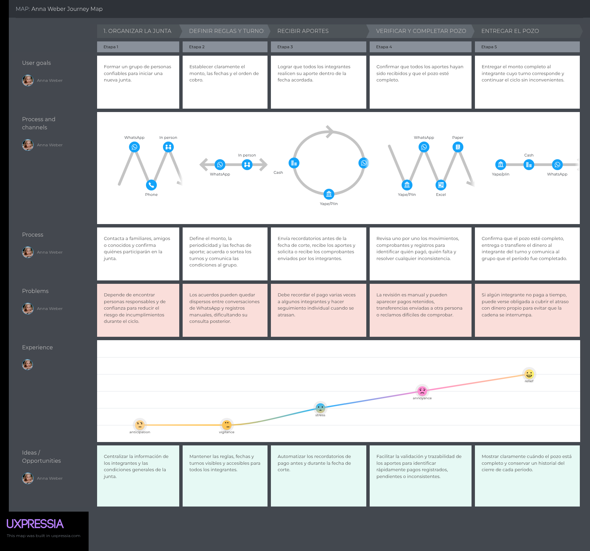

#### User Journey Map 2: Sofia Gonzales — Participante de junta

El journey de Sofia Gonzales representa la experiencia de una participante desde que evalúa incorporarse a una junta hasta que recibe el pozo en el turno asignado. Su decisión inicial depende principalmente de la confianza en el organizador y en los demás integrantes. Durante el ciclo realiza sus aportes mediante Yape o, eventualmente, otros medios acordados, envía comprobantes por WhatsApp y conserva las capturas como respaldo. Los principales aparecen al intentar demostrar aportes anteriores y durante la espera previa a su turno, cuando no existe certeza de que todos los integrantes hayan pagado a tiempo.

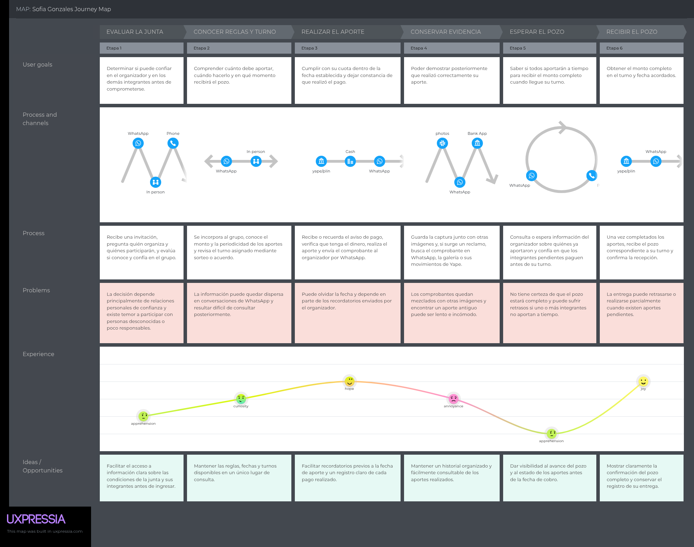

### 2.3.5. Big Picture EventStorming

### 2.3.6. Ubiquitous Language

El siguiente glosario reúne los términos y conceptos del dominio del ahorro rotativo que el equipo utiliza de forma uniforme en todos los artefactos, en el código y en la comunicación con los interesados. Se incluyen únicamente términos del negocio, no términos técnicos de ingeniería de software. Los términos se registran en inglés, con su equivalente de uso corriente en el Perú entre paréntesis.

| Término | Definición |
| :--- | :--- |
| **Savings Group** (Junta, pandero) | Asociación rotativa de ahorro y crédito conformada por personas conocidas entre sí, que aportan un monto fijo con periodicidad acordada para que el fondo acumulado se entregue íntegro a un integrante distinto en cada turno. |
| **Cycle** (Ciclo) | Duración total de una junta, equivalente al número de períodos necesarios para que todos los integrantes hayan cobrado una vez. |
| **Contribution Period** (Período de aporte) | Intervalo de tiempo acordado entre un aporte y el siguiente. Puede ser semanal, quincenal o mensual. |
| **Contribution** (Aporte) | Monto fijo que cada integrante entrega en cada período de aporte. |
| **Pot** (Pozo) | Suma de todos los aportes de un período, que se entrega completa al integrante cuyo turno corresponde. |
| **Turn** (Turno) | Posición dentro del ciclo que determina en qué período le corresponde cobrar el pozo a cada integrante. |
| **Turn Assignment** (Asignación de turnos) | Mecanismo mediante el cual el grupo determina el orden de cobro al constituir la junta. |
| **Draw** (Sorteo) | Mecanismo de asignación de turnos en el que el orden se determina al azar entre los integrantes. |
| **Agreed Order** (Orden acordado) | Mecanismo de asignación de turnos en el que el orden se define por consenso, generalmente según la urgencia de cada integrante. |
| **Bidding** (Subasta) | Mecanismo de asignación de turnos en el que un integrante cede parte del pozo a cambio de cobrar en un período anterior al que le correspondería. |
| **Organizer** (Cabeza de junta) | Integrante que convoca al grupo, define las reglas de la junta, registra los aportes y entrega el pozo en cada turno. |
| **Member** (Participante) | Integrante que aporta en cada período y recibe el pozo cuando llega su turno. |
| **Cut-off Date** (Fecha de corte) | Fecha límite acordada para que todos los aportes de un período estén realizados. |
| **Payout** (Cobro, adjudicación) | Entrega del pozo completo al integrante cuyo turno corresponde en el período vigente. |
| **Payment Proof** (Comprobante, voucher) | Constancia de la transferencia realizada por un integrante, que acredita el monto, la fecha y el destinatario de su aporte. |
| **Delinquency** (Morosidad) | Situación en la que un integrante no realiza su aporte dentro de la fecha de corte. |
| **Coverage** (Cobertura) | Práctica por la cual el organizador u otro integrante asume con dinero propio el aporte de un moroso para que el pozo se complete y la cadena no se rompa. |
| **Dropout** (Deserción) | Abandono definitivo de un integrante antes de finalizar el ciclo, habitualmente después de haber cobrado su turno. |
| **Compliance History** (Historial de cumplimiento) | Registro del comportamiento de pago de un integrante a lo largo de los ciclos en los que ha participado. |
| **Reminder** (Recordatorio) | Aviso dirigido a un integrante para que realice su aporte antes de la fecha de corte. |
***

## 2.4. Requirements specification

### 2.4.1. User Stories

### 2.4.2. Impact Mapping

### 2.4.3. Product Backlog

## 2.5. Strategic-Level Domain-Driven Design

### 2.5.1. EventStorming

#### 2.5.1.1. Candidate Context Discovery

#### 2.5.1.2. Domain Message Flows Modeling

#### 2.5.1.3. Bounded Context Canvases

### 2.5.2. Context Mapping

### 2.5.3. Software Architecture

#### 2.5.3.1. Software Architecture Context Level Diagrams

#### 2.5.3.2. Software Architecture Container Level Diagrams

#### 2.5.3.3. Software Architecture Deployment Diagrams

## 2.6. Tactical-Level Domain-Driven Design

### 2.6.1. Bounded Context: NombreDelBoundedContext

#### 2.6.1.1. Domain Layer

#### 2.6.1.2. Interface Layer

#### 2.6.1.3. Application Layer

#### 2.6.1.4. Infrastructure Layer

#### 2.6.1.5. Bounded Context Software Architecture Component Level Diagrams

#### 2.6.1.6. Bounded Context Software Architecture Code Level Diagrams

##### 2.6.1.6.1. Bounded Context Domain Layer Class Diagrams

##### 2.6.1.6.2. Bounded Context Database Design Diagram
