# Capítulo II: Requirements Development and Software Solution Design

## 2.1. Competidores

Para el análisis competitivo de Pozzo se identificaron tres alternativas del mercado vinculadas a la gestión de ahorros rotativos (tandas/ROSCAs), recaudación grupal y división de gastos compartidos:

1. **Tandapp (o MiTandita)** [@tandapp2026]: Aplicación móvil para organizar tandas tradicionales, asignando turnos y registrando abonos de forma manual.
2. **Moneypool** [@moneypool2026]: Plataforma fintech mexicana para crear fondos comunes ("pools") con saldo digital en app, cobro mediante tarjeta y custodia de dinero.
3. **Splitwise** [@splitwise2026]: Aplicación global orientada al registro, cálculo y división equitativa de gastos compartidos entre amigos, compañeros de vivienda o viajes.

Pozzo se diferencia por resolver la realidad operativa de las juntas peruanas: opera sobre transferencias directas por Yape y Plin sin custodiar el dinero (evitando comisiones y trámites financieros), automatiza el registro de aportes leyendo los vouchers mediante OCR, despersonaliza la cobranza con recordatorios automáticos y permite gestionar turnos (por sorteo, orden acordado o subasta) junto a un historial de cumplimiento para futuros ciclos.

### 2.1.1. Análisis Competitivo

#### ¿Por qué llevar a cabo este análisis?

El propósito de este análisis es examinar las fortalezas y vacíos de las aplicaciones existentes para definir una propuesta de valor realista y diferenciada para Pozzo. En el Perú, las juntas se pagan por canales digitales (Yape/Plin), pero su administración sigue atrapada en cuadernos y grupos de WhatsApp saturados de capturas. Identificar las carencias de los competidores permite enfocar el desarrollo en solucionar el desorden administrativo, los errores de conteo y las discusiones sobre aportes sin alterar la dinámica de confianza del grupo.

#### Competitive Analysis Landscape

<table>
  <thead>
    <tr>
      <th>Característica</th>
      <th>Pozzo</th>
      <th>Tandapp / MiTandita</th>
      <th>Moneypool</th>
      <th>Splitwise</th>
    </tr>
  </thead>
  <tbody>
    <tr>
      <td><b>Perfil / Overview</b></td>
      <td>Plataforma móvil y web para administrar juntas de ahorro en tiempo real, validando vouchers sin custodiar dinero.</td>
      <td>App móvil para registrar integrantes, armar tandas, asignar turnos y marcar pagos manualmente.</td>
      <td>Plataforma fintech para recaudar fondos grupales mediante saldo digital y links de pago.</td>
      <td>Aplicación para registrar, calcular y saldar gastos compartidos entre grupos de personas.</td>
    </tr>
    <tr>
      <td><b>Ventaja competitiva</b></td>
      <td>Validación OCR de vouchers de Yape/Plin y modelo 100 % no custodial adaptado a las juntas en Perú.</td>
      <td>Interfaz enfocada únicamente en la dinámica de tandas sin requerir cuentas bancarias.</td>
      <td>Cobro integrado con tarjeta de crédito/débito y dispersión a cuentas bancarias vía SPEI.</td>
      <td>Marca global consolidada con algoritmo para optimizar y simplificar deudas cruzadas.</td>
    </tr>
    <tr>
      <td><b>Valor ofrecido</b></td>
      <td>Elimina el conteo manual, evita reclamos ("yo sí pagué"), despersonaliza la cobranza y transparenta el estado del pozo.</td>
      <td>Permite calendarizar montos, fechas y turnos para consultar el avance de la tanda desde el celular.</td>
      <td>Centraliza dinero en un fondo digital compartido para eventos o compras conjuntas antes de retirarlo.</td>
      <td>Otorga claridad continua sobre quién le debe a quién en gastos diarios compartidos y viajes.</td>
    </tr>
    <tr>
      <td><b>Mercado objetivo</b></td>
      <td>Organizadores y participantes de juntas de ahorro en zonas urbanas del Perú (NSE B, C y D).</td>
      <td>Organizadores y miembros de tandas comunitarias y familiares en México y Latinoamérica.</td>
      <td>Grupos de amigos, familias y organizadores de eventos sociales en México.</td>
      <td>Compañeros de departamento, grupos de viaje, parejas y amigos a nivel internacional.</td>
    </tr>
    <tr>
      <td><b>Estrategias de marketing</b></td>
      <td>Invitación directa vía enlace de WhatsApp y recomendación orgánica dentro de redes de confianza.</td>
      <td>Posicionamiento en tiendas de aplicaciones (ASO) mediante palabras clave ("tanda", "ahorro grupal").</td>
      <td>Marketing digital B2C, campañas en redes sociales y alianzas en el ecosistema fintech mexicano.</td>
      <td>Crecimiento guiado por el producto (PLG) y optimización en Google Play y App Store.</td>
    </tr>
    <tr>
      <td><b>Productos y servicios</b></td>
      <td>Panel de organizador, app de participante, validador OCR de vouchers, gestión de turnos e historial de cumplimiento.</td>
      <td>Creación de tandas, lista de participantes, asignador de turnos/fechas y registro manual de aportes.</td>
      <td>Creación de "pools", links de cobro, saldo virtual interno y transferencias vía SPEI.</td>
      <td>Calculadora de división de cuentas, balance de saldos, registro de abonos y reportes exportables.</td>
    </tr>
    <tr>
      <td><b>Precios & costos</b></td>
      <td>Modelo freemium / microcomisión por ciclo de junta administrada.</td>
      <td>Descarga gratuita con anuncios publicitarios invasivos; opción de compra in-app para retirarlos.</td>
      <td>Comisión por transacción con tarjeta (aprox. 3.9 %) y tarifas según el tamaño del pool.</td>
      <td>Versión gratuita básica; suscripción prémium (<i>Splitwise Pro</i>) para escaneo de recibos y gráficos.</td>
    </tr>
    <tr>
      <td><b>Canales de distribución</b></td>
      <td>Aplicación móvil nativa (Android/iOS), version multiplataforma (PWA) y enlaces por WhatsApp.</td>
      <td>Google Play Store y Apple App Store.</td>
      <td>Sitio web oficial (moneypool.mx) y app en Google Play / App Store.</td>
      <td>Sitio web oficial (splitwise.com) y app en Google Play / App Store.</td>
    </tr>
  </tbody>
</table>

* **Tandapp / MiTandita** se enfoca exclusivamente en la calendarización de tandas, permitiendo registrar participantes y definir el orden de entrega. Su limitación principal radica en que el registro de aportes es enteramente manual por parte del administrador, no cuenta con herramientas para validar transferencias bancarias y monetiza mediante anuncios publicitarios invasivos.
* **Moneypool** resuelve la recaudación colectiva centralizando los fondos en una cuenta virtual propia y habilitando cobros con tarjeta. Esta infraestructura presenta fricciones para el ahorro tradicional: la plataforma retiene el dinero y cobra comisiones por transacción, lo cual desincentiva a grupos informales habituados a transferencias directas, inmediatas y gratuitas entre cuentas bancarias personales.
* **Splitwise** destaca en la división de gastos comunes diarios o viajes. Sin embargo, su estructura está diseñada para liquidar saldos netos variables entre integrantes, no para el modelo de cuotas fijas rotativas con fechas estrictas de adjudicación de una junta, y restringe la lectura automatizada de recibos a su versión de pago prémium.

#### Análisis SWOT

##### Pozzo

<table>
  <thead>
    <tr>
      <th>Fortalezas</th>
      <th>Debilidades</th>
    </tr>
  </thead>
  <tbody>
    <tr>
      <td>• Adaptada al flujo de pago real en Perú mediante lectura OCR de comprobantes de Yape y Plin. • Modelo 100 % no custodial: no retiene dinero, eliminando riesgos legales y desconfianza de los usuarios. • Transparencia en tiempo real: calendario compartido donde todos ven el estado de aportes y el pozo. • Cobranza automatizada mediante recordatorios escalonados que evitan el desgaste entre conocidos. • Flexibilidad para asignar turnos según la costumbre del grupo (sorteo, orden acordado o subasta).</td>
      <td>• Producto nuevo en etapa de desarrollo, sin base instalada de usuarios previa. • Dependencia técnica de la legibilidad de vouchers y de posibles cambios visuales en Yape/Plin. • Capacidad operativa y recursos de difusión acotados frente a plataformas comerciales consolidadas. • Resistencia inicial al uso de herramientas digitales en participantes poco familiarizados con apps.</td>
    </tr>
    <tr>
      <td><b>Oportunidades</b></td>
      <td><b>Amenazas</b></td>
    </tr>
    <tr>
      <td>• Uso masivo y cotidiano de billeteras móviles en el Perú (más de 16 millones de usuarios activos). • Alto porcentaje de la población no bancarizada o sub-bancarizada que ahorra activamente en juntas. • Adquisición viral de bajo costo: cada organizador incorpora directamente a su grupo por WhatsApp. • Reutilización del historial de cumplimiento para facilitar la organización de siguientes ciclos.</td>
      <td>• Hábito arraigado de organizadores de llevar sus cuentas en cuadernos físicos o libretas de notas. • Posibilidad de que billeteras como Yape incorporen herramientas nativas de ahorro grupal. • Ingreso de comprobantes duplicados, ilegibles o manipulados que requieran revisión manual. • Casos de morosidad o deserción de integrantes que comprometan la continuidad de la junta.</td>
    </tr>
  </tbody>
</table>

##### Tandapp / MiTandita

<table>
  <thead>
    <tr>
      <th>Fortalezas</th>
      <th>Debilidades</th>
    </tr>
  </thead>
  <tbody>
    <tr>
      <td>• Especialización directa en el flujo tradicional de tandas y ahorro rotativo. • Configuración rápida y uso ligero sin solicitar vinculación de cuentas bancarias. • Buen posicionamiento orgánico en tiendas móviles para búsquedas relacionadas con tandas.</td>
      <td>• Registro de pagos 100 % manual por parte del organizador. • Experiencia de uso deteriorada por la presencia de publicidad en la versión gratuita. • Nula validación de comprobantes ni compatibilidad con billeteras móviles peruanas.</td>
    </tr>
    <tr>
      <td><b>Oportunidades</b></td>
      <td><b>Amenazas</b></td>
    </tr>
    <tr>
      <td>• Interés de sectores populares por ordenar el seguimiento de sus tandas desde el celular. • Posibilidad de transicionar hacia esquemas de suscripción accesibles sin anuncios.</td>
      <td>• Pérdida de usuarios ante aplicaciones que automaticen la verificación de abonos. • Alta tasa de abandono provocada por la saturación de anuncios dentro de la app.</td>
    </tr>
  </tbody>
</table>

##### Moneypool

<table>
  <thead>
    <tr>
      <th>Fortalezas</th>
      <th>Debilidades</th>
    </tr>
  </thead>
  <tbody>
    <tr>
      <td>• Respaldo formal como entidad fintech regulada (IFPE) en México. • Infraestructura propia con links de cobro y recepción de pagos con tarjeta de débito/crédito. • Marca reconocida en recaudación de fondos y eventos sociales en su país de origen.</td>
      <td>• Cobro de comisiones que reducen el monto final del ahorro acumulado. • Fricción y rechazo de usuarios informales a dejar su dinero bajo custodia de un tercero. • Operatividad restringida al sistema bancario mexicano, sin soporte para soles peruanos.</td>
    </tr>
    <tr>
      <td><b>Oportunidades</b></td>
      <td><b>Amenazas</b></td>
    </tr>
    <tr>
      <td>• Generación de microrendimientos financieros sobre los saldos depositados en la plataforma. • Expansión hacia cobros colectivos corporativos, institucionales y eventos masivos.</td>
      <td>• Preferencia del público por transferencias interbancarias directas y sin comisión. • Mayor rigidez en normativas sobre captación de fondos y billeteras electrónicas.</td>
    </tr>
  </tbody>
</table>

##### Splitwise

<table>
  <thead>
    <tr>
      <th>Fortalezas</th>
      <th>Debilidades</th>
    </tr>
  </thead>
  <tbody>
    <tr>
      <td>• Marca global líder en administración y liquidación de gastos compartidos. • Algoritmo optimizado para consolidar saldos y reducir transferencias entre integrantes. • Plataforma madura con sincronización multidispositivo y respaldo en la nube.</td>
      <td>• No contempla la estructura de turnos rotativos ni el cobro de cuotas periódicas de una junta. • La lectura automática de recibos (OCR) está restringida al plan de pago prémium. • Carece de recordatorios de cobro escalonados diseñados para la disciplina de ahorro.</td>
    </tr>
    <tr>
      <td><b>Oportunidades</b></td>
      <td><b>Amenazas</b></td>
    </tr>
    <tr>
      <td>• Integración con medios de pago locales en mercados emergentes. • Desarrollo de funciones orientadas a metas de ahorro grupal para viajes o proyectos.</td>
      <td>• Fuga de usuarios hacia aplicaciones verticales enfocadas en esquemas de ahorro rotativo. • Descontento de los usuarios frente a la limitación progresiva de opciones gratuitas.</td>
    </tr>
  </tbody>
</table>

### 2.1.2. Estrategias y tácticas frente a competidores

Pozzo no busca competir como pasarela de pagos ni como un divisor de gastos general. La propuesta se fundamenta en resolver la carga operativa y los conflictos de las juntas peruanas sin intervenir en el dinero y respetando la relación de confianza del grupo.

#### Estrategia 1: Validación automatizada de pagos sin custodia de fondos

Pozzo se posiciona como una herramienta de administración y auditoría: el dinero continúa transfiriéndose directamente de persona a persona por Yape o Plin, mientras la plataforma se encarga de conciliar los aportes mediante lectura de comprobantes.

**Tácticas:**

* Desarrollar un motor OCR entrenado para reconocer con precisión monto, fecha, destinatario y número de operación en vouchers de Yape y Plin.
* Mostrar una pantalla de previsualización para que el participante confirme o corrija los datos leídos antes de registrar el aporte, resolviendo fallos por capturas borrosas.
* Incorporar validaciones automáticas contra datos esperados (destinatario y fecha) y alertar sobre comprobantes duplicados para que el organizador solo intervenga ante inconsistencias.
* Explicar de forma clara en la interfaz que Pozzo no retiene ni maneja los fondos, eliminando dudas de seguridad y barreras legales.

#### Estrategia 2: Adopción sin fricción y experiencia mobile-first

Para que una junta adopte la solución, todo el grupo debe poder utilizarla sin trámites complejos ni barreras tecnológicas.

**Tácticas:**

* Permitir el ingreso mediante un enlace de invitación distribuido por WhatsApp, facilitando que los participantes consulten el calendario en pocos segundos.
* Diseñar un flujo de registro mínimo que requiera únicamente nombre y número de celular, priorizando la facilidad de uso sobre la carga de datos.
* Disponer de una versión multiplataforma (PWA) junto a la app móvil, permitiendo consultar turnos y subir vouchers sin exigir una descarga obligatoria a quienes tengan limitaciones de almacenamiento.
* Presentar una interfaz gráfica limpia y visual que permita entender de un vistazo el avance de la junta, accesible para usuarios con poca experiencia digital.

#### Estrategia 3: Cobranza despersonalizada y transparencia de recaudación

Pozzo asume el seguimiento de pagos para liberar al organizador del desgaste de perseguir a familiares o amigos, reduciendo la morosidad y las discusiones sobre aportes.

**Tácticas:**

* Configurar notificaciones automáticas escalonadas que incrementen su periodicidad conforme se aproxime la fecha límite de aporte.
* Mostrar en un calendario compartido el estado de aportes en tiempo real, de manera que la visibilidad colectiva funcione como un incentivo natural de puntualidad.
* Proveer al participante que cobra en el turno vigente un indicador directo de cuánto falta para completar el pozo acordado.
* Mantener un registro verificable de cada aporte validado para resolver de inmediato controversias del tipo "yo sí pagué".

#### Estrategia 4: Gestión integral del ciclo e historial de cumplimiento

La herramienta acompaña a la junta durante todo su ciclo operativo, desde la organización inicial hasta el cierre y apertura de nuevas rondas.

**Tácticas:**

* Ofrecer opciones flexibles para asignar los turnos adaptadas a cómo opera cada grupo: por sorteo aleatorio, orden acordado entre integrantes o mecanismo de subasta.
* Generar al término del ciclo un historial de cumplimiento individual que acredite la puntualidad de cada miembro.
* Permitir que el historial sirva de referencia de confianza para organizar siguientes juntas con el mismo grupo o incorporar participantes a rondas de mayor monto.

## 2.2. Entrevistas

Esta sección presenta el estudio cualitativo basado en entrevistas semiestructuradas orientadas a validar Pozzo, una aplicación para administrar juntas (o panderos) informales sin que el dinero pase por la plataforma. El estudio exploró cómo se administran hoy las juntas, cómo se registran y comprueban los aportes por Yape o Plin, cómo se reparten los turnos y cómo se maneja la cobranza y los reclamos dentro del grupo. Participaron cabezas de junta con experiencia organizando varios ciclos y participantes de juntas activas, lo que permitió identificar que el registro manual en cuadernos y la revisión de capturas una por una son las principales fuentes de errores y desconfianza en la administración.

### 2.2.1. Diseño de entrevistas

"Antes de iniciar la entrevista, se brinda un saludo cordial y una breve presentación del entrevistador, explicando que el propósito de la conversación es conocer cómo las personas organizan y participan en juntas de ahorro en su día a día. Se aclara que la información recopilada será utilizada únicamente con fines académicos para el desarrollo del proyecto Pozzo y se mantendrá en estricta confidencialidad. Como primer paso, se solicita al entrevistado brindar su nombre completo, edad y lugar de residencia para fines de registro. Asimismo, se señala que la entrevista tendrá una duración aproximada de 10 a 15 minutos y se desarrollará de manera abierta, por lo que se le invita a responder con total libertad y basándose en ejemplos de su experiencia real, destacando que no existen respuestas correctas o incorrectas."

**Preguntas introductorias**

-   ¿Cuál es su nombre completo?

**Segmento 1: Cabezas de junta (organizadores)**

1. Para empezar, cuéntame de ti: ¿qué edad tienes, en qué distrito vives y a qué te dedicas?

2. ¿Cómo terminaste organizando juntas? ¿Hace cuánto y cuántas has administrado?

3. La junta que llevas ahora, ¿de quiénes se compone? ¿Trabajo, familia, vecinos, una mezcla?

4. Descríbeme la última junta que organizaste de principio a fin: cuánta gente, cuánto aportaba cada uno y cada cuánto tiempo.

5. ¿Cómo decidieron quién cobra primero y quién al final?

6. ¿Cómo te llegan los aportes? ¿Yape, Plin, efectivo, una mezcla?

7. En el último ciclo, ¿dónde anotaste quién había depositado y quién no?

8. Cuéntame paso a paso qué hiciste en la última fecha de corte, desde que se acercaba el día hasta que confirmaste que el pozo estaba completo.

9. En ese ciclo, ¿a cuántas personas tuviste que recordarles el pago? ¿Y cuántas veces a cada una?

10. ¿Cuántos comprobantes revisaste ese ciclo y cómo los revisabas?

11. Cuéntame la última vez que la cuenta no cuadró, o que alguien dijo haber pagado y no te aparecía. ¿Qué pasó y cómo se resolvió?

12. De todas las juntas que has organizado, ¿en cuántas pasó algo parecido? ¿Alguna se rompió por eso?

13. ¿Qué es lo que menos te gusta de organizar la junta?

14. ¿Has intentado llevarlo con Excel, alguna app o algo parecido? ¿Qué pasó?

15. ¿Qué celular usas y qué aplicaciones abres todos los días?

**Segmento 2: Participantes de junta**

1. Cuéntame de ti: ¿qué edad tienes, en qué distrito vives y a qué te dedicas?

2. ¿Cómo entraste a tu primera junta? ¿Quién te invitó?

3. El dinero que cobraste, ¿para qué lo usaste?

4. Descríbeme la junta en la que estás ahora: cuánta gente, cuánto aportas y cada cuánto.

5. Cuéntame paso a paso qué haces cuando toca aportar, desde que te acuerdas hasta que terminas.

6. ¿Cómo supiste qué turno te tocaba?

7. Después de yapear, ¿qué haces con la captura?

8. ¿Alguna vez te dijeron que no habías pagado cuando sí lo habías hecho? Cuéntame qué pasó.

9. Si el organizador te dijera hoy que falta un aporte tuyo de hace tres meses, ¿podrías demostrar que sí pagaste? ¿Cómo lo buscarías?

10. Antes de que te toque cobrar, ¿cómo sabes si el pozo va a estar completo?

11. Cuéntame cómo fue la última vez que te tocó cobrar.

12. ¿Has estado en una junta que se rompió o donde alguien dejó de pagar? ¿Qué pasó?

13. Cuando te invitan a una junta nueva, ¿qué te hace decidir si entras o no?

14. ¿Alguna vez pediste ver cómo iba la cuenta de la junta? ¿Qué te respondieron?

15. ¿Qué celular usas y qué aplicaciones abres todos los días?

### 2.2.2. Registro de entrevistas

**Segmento 1: Cabezas de junta (organizadores)**

- **Primera entrevista**

<table>
  <thead>
    <tr>
      <th>Campo</th>
      <th>Detalle</th>
    </tr>
  </thead>
  <tbody>
    <tr>
      <td><b>Entrevistado(a)</b></td>
      <td>Shirley Romy Becerra Pinchi</td>
    </tr>
    <tr>
      <td><b>Género</b></td>
      <td>Femenino</td>
    </tr>
    <tr>
      <td><b>Edad</b></td>
      <td>33</td>
    </tr>
    <tr>
      <td><b>Lugar de residencia</b></td>
      <td>Tarapoto</td>
    </tr>
    <tr>
      <td><b>Entrevistador(a)</b></td>
      <td>Fernando Flores</td>
    </tr>
    <tr>
      <td><b>Duración</b></td>
      <td>22:31</td>
    </tr>
    <tr>
      <td><b>Link de la entrevista</b></td>
      <td><a href="https://upcedupe-my.sharepoint.com/:v:/g/personal/u20241a290_upc_edu_pe/IQDdvQoO5oy9TryDnR0F1bBHAb2aLP_LWFC5botPe_XVj3Q?nav=eyJyZWZlcnJhbEluZm8iOnsicmVmZXJyYWxBcHAiOiJTdHJlYW1XZWJBcHAiLCJyZWZlcnJhbFZpZXciOiJTaGFyZURpYWxvZy1MaW5rIiwicmVmZXJyYWxBcHBQbGF0Zm9ybSI6IldlYiIsInJlZmVycmFsTW9kZSI6InZpZXcifX0%3D&e=FpKimc">https://upcedupe-my.sharepoint.com/:v:/g/personal/u20241a290_upc_edu_pe/IQDdvQoO5oy9TryDnR0F1bBHAb2aLP_LWFC5botPe_XVj3Q?nav=eyJyZWZlcnJhbEluZm8iOnsicmVmZXJyYWxBcHAiOiJTdHJlYW1XZWJBcHAiLCJyZWZlcnJhbFZpZXciOiJTaGFyZURpYWxvZy1MaW5rIiwicmVmZXJyYWxBcHBQbGF0Zm9ybSI6IldlYiIsInJlZmVycmFsTW9kZSI6InZpZXcifX0%3D&e=FpKimc</a></td>
    </tr>
  </tbody>
</table>

{width=90%}

Shirley organiza panderos desde el colegio y lo ve como una forma de ahorrar; por eso suele quedarse con el último turno en vez del primero. Hoy administra, junto a su mamá, dos juntas mensuales: una de S/100 formada por maestros conocidos de su mamá y otra de S/200, con un total de 24 números, de los cuales seis participantes van a dejar el aporte en efectivo a su casa y el resto paga por Yape o Plin. Los turnos se definen por sorteo o por preferencia de meses, según la necesidad de cada quien (por ejemplo, quien necesita el dinero para la matrícula escolar pide ese mes). Lleva el control en un cuaderno y, el mismo día de corte, verifica los pagos revisando uno por uno sus movimientos de Yape; para la cobranza arma un grupo de WhatsApp donde manda un recordatorio el 25 y vuelve a insistir el 28. En cada ciclo tiene que recordarle el pago a dos o tres personas, hasta tres o cuatro veces cada una. Su peor experiencia ocurrió cuando su mamá sufrió un infarto cerebral y no quedó registro de quién había aportado: tuvieron que llamar uno por uno para reconstruir la cuenta, y hubo un reclamo de "yo sí pagué" imposible de comprobar. También recuerda un caso en pandemia en el que un integrante perdió su trabajo y dejó de aportar a mitad del ciclo, por lo que su mamá tuvo que cubrir esas cuotas; desde entonces son más cuidadosas al elegir personas responsables. No usa Excel ni aplicaciones, aunque reconoce que con más juntas un sistema le sería necesario. Usa un celular Redmi y a diario abre Yape y TikTok.

- **Segunda entrevista**

<table>
  <thead>
    <tr>
      <th>Campo</th>
      <th>Detalle</th>
    </tr>
  </thead>
  <tbody>
    <tr>
      <td><b>Entrevistado(a)</b></td>
      <td>Ariel Roberto Mendoza Blanco</td>
    </tr>
    <tr>
      <td><b>Género</b></td>
      <td>Masculino</td>
    </tr>
    <tr>
      <td><b>Edad</b></td>
      <td>29</td>
    </tr>
    <tr>
      <td><b>Lugar de residencia</b></td>
      <td>Pueblo Libre, Lima</td>
    </tr>
    <tr>
      <td><b>Entrevistador(a)</b></td>
      <td>Fernando Flores</td>
    </tr>
    <tr>
      <td><b>Duración</b></td>
      <td>8:22</td>
    </tr>
    <tr>
      <td><b>Link de la entrevista</b></td>
      <td><a href="https://upcedupe-my.sharepoint.com/:v:/g/personal/u20241a290_upc_edu_pe/IQDRpPL_neBqRL0gl1hTRH-lAWqb_FLzHgtfgUrKclzgcQE?nav=eyJyZWZlcnJhbEluZm8iOnsicmVmZXJyYWxBcHAiOiJTdHJlYW1XZWJBcHAiLCJyZWZlcnJhbFZpZXciOiJTaGFyZURpYWxvZy1MaW5rIiwicmVmZXJyYWxBcHBQbGF0Zm9ybSI6IldlYiIsInJlZmVycmFsTW9kZSI6InZpZXcifX0%3D&e=AL0giv">https://upcedupe-my.sharepoint.com/:v:/g/personal/u20241a290_upc_edu_pe/IQDRpPL_neBqRL0gl1hTRH-lAWqb_FLzHgtfgUrKclzgcQE?nav=eyJyZWZlcnJhbEluZm8iOnsicmVmZXJyYWxBcHAiOiJTdHJlYW1XZWJBcHAiLCJyZWZlcnJhbFZpZXciOiJTaGFyZURpYWxvZy1MaW5rIiwicmVmZXJyYWxBcHBQbGF0Zm9ybSI6IldlYiIsInJlZmVycmFsTW9kZSI6InZpZXcifX0%3D&e=AL0giv</a></td>
    </tr>
  </tbody>
</table>

{width=90%}

Ariel organiza juntas desde los 20 años como una forma de obligarse a ahorrar, ya que le cuesta juntar el dinero por su cuenta. Hoy lleva dos, una familiar y una del trabajo, de hasta 12 personas para completar un año, con un cobro por mes. Los turnos se acuerdan dialogando según la urgencia de cada quien, y él siempre se deja el último turno; al principio ponía el dinero él, hasta que vio que era una mejor forma de ahorrar. Recibe los aportes en efectivo y por transferencia, y lleva un doble registro, en un cuaderno y en un Excel: cuando alguien paga por transferencia, verifica contra su estado de cuenta y le pide la captura antes de marcarlo con un check. Tiene que recordar el pago a varias personas, hasta cuatro o cinco veces en el grupo familiar y dos o tres en el del trabajo. Su incidente más claro fue un pago hecho de madrugada que el banco retuvo 24 horas: el compañero afirmaba haber pagado, le mandó la captura, pero a Ariel no le llegaba nada. En otros casos ha tenido que poner algo de su propio dinero cuando alguien se atrasa por temas de salud. Lo que menos le gusta es tener que insistir para cobrar, y le gustaría una aplicación que verifique los pagos automáticamente y le informe cuando cada persona ya pagó. Usa un iPhone 15 y la computadora para su archivo de Excel.

- **Tercera entrevista**

<table>
  <thead>
    <tr>
      <th>Campo</th>
      <th>Detalle</th>
    </tr>
  </thead>
  <tbody>
    <tr>
      <td><b>Entrevistado(a)</b></td>
      <td>Jorge Chávez</td>
    </tr>
    <tr>
      <td><b>Género</b></td>
      <td>Masculino</td>
    </tr>
    <tr>
      <td><b>Edad</b></td>
      <td>25</td>
    </tr>
    <tr>
      <td><b>Lugar de residencia</b></td>
      <td>San Martín de Porres, Lima</td>
    </tr>
    <tr>
      <td><b>Entrevistador(a)</b></td>
      <td>Fernando Flores</td>
    </tr>
    <tr>
      <td><b>Duración</b></td>
      <td>8:11</td>
    </tr>
    <tr>
      <td><b>Link de la entrevista</b></td>
      <td><a href="https://upcedupe-my.sharepoint.com/:v:/g/personal/u20241a290_upc_edu_pe/IQBMwoKhRDb-Ta5sFdnCJm7SATYbCURZgS1q9Fn4MKZ6yZ8?nav=eyJyZWZlcnJhbEluZm8iOnsicmVmZXJyYWxBcHAiOiJTdHJlYW1XZWJBcHAiLCJyZWZlcnJhbFZpZXciOiJTaGFyZURpYWxvZy1MaW5rIiwicmVmZXJyYWxBcHBQbGF0Zm9ybSI6IldlYiIsInJlZmVycmFsTW9kZSI6InZpZXcifX0%3D&e=iNPW0v">https://upcedupe-my.sharepoint.com/:v:/g/personal/u20241a290_upc_edu_pe/IQBMwoKhRDb-Ta5sFdnCJm7SATYbCURZgS1q9Fn4MKZ6yZ8?nav=eyJyZWZlcnJhbEluZm8iOnsicmVmZXJyYWxBcHAiOiJTdHJlYW1XZWJBcHAiLCJyZWZlcnJhbFZpZXciOiJTaGFyZURpYWxvZy1MaW5rIiwicmVmZXJyYWxBcHBQbGF0Zm9ybSI6IldlYiIsInJlZmVycmFsTW9kZSI6InZpZXcifX0%3D&e=iNPW0v</a></td>
    </tr>
  </tbody>
</table>

{width=90%}

Jorge organiza juntas desde hace unos cinco años; empezó entre hermanos y primos para juntar dinero para gastos comunes, y luego se sumaron amigos del trabajo y quedó él a cargo. Su junta actual es de unas diez personas, entre familia y amigos cercanos, con un aporte de S/500 al mes y un pozo de S/5000 mensual; antes de empezar arman una lista con todos y definen el orden de cobro, y él participa y aporta igual que el resto. Los turnos se deciden por urgencia, quien tiene una compra o un pago pendiente cobra primero, y un cambio de turno se acuerda conversando en el grupo. Los aportes llegan por Yape y lleva el control en un Excel de doble entrada (meses por nombres, como un checklist mensual), apoyándose también en el grupo de WhatsApp. En cada corte avisa días antes por el grupo, el día de pago compara los Yapes contra su lista (a veces alguien paga por Plin y se confunde), revisa el saldo de su cuenta, escribe a quien falta y, cuando el pozo llega a los S/5000, avisa y transfiere al que le toca. Suele recordar el pago a dos o tres personas y revisa entre 15 y 20 comprobantes por ciclo. Su incidente más claro fue hace dos meses: un integrante afirmaba haber pagado y hasta mandó una captura, pero el dinero no le llegaba; resultó que había yapeado a otra persona por equivocarse de número, y tuvieron que contactar a ese tercero para recuperarlo. Lo que menos le gusta es perseguir a la gente para que pague, algo incómodo tratándose de familia y amigos. No usa aplicaciones para gestionar la junta, solo Excel. Usa un Honor X8 y a diario abre WhatsApp, Yape e Instagram.

**Segmento 2: Participantes de junta**

- **Primera entrevista**

<table>
  <thead>
    <tr>
      <th>Campo</th>
      <th>Detalle</th>
    </tr>
  </thead>
  <tbody>
    <tr>
      <td><b>Entrevistado(a)</b></td>
      <td>Elizabeth Díaz</td>
    </tr>
    <tr>
      <td><b>Género</b></td>
      <td>Femenino</td>
    </tr>
    <tr>
      <td><b>Edad</b></td>
      <td>22</td>
    </tr>
    <tr>
      <td><b>Lugar de residencia</b></td>
      <td>Callao</td>
    </tr>
    <tr>
      <td><b>Entrevistador(a)</b></td>
      <td>Fernando Flores</td>
    </tr>
    <tr>
      <td><b>Duración</b></td>
      <td>7:57</td>
    </tr>
    <tr>
      <td><b>Link de la entrevista</b></td>
      <td><a href="https://upcedupe-my.sharepoint.com/:v:/g/personal/u20241a290_upc_edu_pe/IQCFSDS82wYXTLbYwVMsMQKqAYFMxBZ7A2ITCzsY__4CGdI?nav=eyJyZWZlcnJhbEluZm8iOnsicmVmZXJyYWxBcHAiOiJTdHJlYW1XZWJBcHAiLCJyZWZlcnJhbFZpZXciOiJTaGFyZURpYWxvZy1MaW5rIiwicmVmZXJyYWxBcHBQbGF0Zm9ybSI6IldlYiIsInJlZmVycmFsTW9kZSI6InZpZXcifX0%3D&e=MGNr2M">https://upcedupe-my.sharepoint.com/:v:/g/personal/u20241a290_upc_edu_pe/IQCFSDS82wYXTLbYwVMsMQKqAYFMxBZ7A2ITCzsY__4CGdI?nav=eyJyZWZlcnJhbEluZm8iOnsicmVmZXJyYWxBcHAiOiJTdHJlYW1XZWJBcHAiLCJyZWZlcnJhbFZpZXciOiJTaGFyZURpYWxvZy1MaW5rIiwicmVmZXJyYWxBcHBQbGF0Zm9ybSI6IldlYiIsInJlZmVycmFsTW9kZSI6InZpZXcifX0%3D&e=MGNr2M</a></td>
    </tr>
  </tbody>
</table>

{width=90%}

Elizabeth entró a su primera junta invitada por una amiga de la universidad, que le comentó que varias amigas estaban ahorrando en grupo para recibir una cantidad más grande de dinero; al principio dudó, pero como conocía a todas, decidió entrar, y ese primer cobro lo usó para comprarse una laptop que necesitaba para estudiar. Hoy participa en una junta de ocho personas que aportan S/300 al mes durante ocho meses, con los turnos definidos por sorteo y publicados por la organizadora en el grupo de WhatsApp. Cuando toca aportar, la organizadora avisa por el grupo, ella revisa que tenga el dinero, yapea, toma la captura del comprobante y se la envía; la organizadora confirma en el grupo que el aporte se hizo. Guarda las capturas en su galería, pero mezcladas con todas las demás, sin una carpeta propia. Ya le pasó que la organizadora pensó que no había pagado y tuvo que buscar la conversación y reenviar la captura de Yape para demostrarlo; si le pidieran probar un aporte de hace tres meses, revisaría primero el chat de WhatsApp, luego la galería y, por último, sus movimientos de Yape. Antes de cobrar le preocupa que alguien se atrase, sobre todo si ya cuenta con ese dinero, aunque confía porque son amigas y la organizadora avisa quiénes ya pagaron. Para decidir entrar a una junta le importa quién la organiza y quiénes participan, porque con desconocidos sería más difícil reclamar si ocurre un problema. Usa un celular Android y hace todo lo de la junta desde el teléfono, con WhatsApp y Yape.

- **Segunda entrevista**

<table>
  <thead>
    <tr>
      <th>Campo</th>
      <th>Detalle</th>
    </tr>
  </thead>
  <tbody>
    <tr>
      <td><b>Entrevistado(a)</b></td>
      <td>Mariana López</td>
    </tr>
    <tr>
      <td><b>Género</b></td>
      <td>Femenino</td>
    </tr>
    <tr>
      <td><b>Edad</b></td>
      <td>35</td>
    </tr>
    <tr>
      <td><b>Lugar de residencia</b></td>
      <td>San Juan de Lurigancho</td>
    </tr>
    <tr>
      <td><b>Entrevistador(a)</b></td>
      <td>Fernando Flores</td>
    </tr>
    <tr>
      <td><b>Duración</b></td>
      <td>8:12</td>
    </tr>
    <tr>
      <td><b>Link de la entrevista</b></td>
      <td><a href="https://upcedupe-my.sharepoint.com/:v:/g/personal/u20241a290_upc_edu_pe/IQBGVs0x_7sNQqDkjCTOiN9nAYOPzQ04mGl01GjuDQbolVg?nav=eyJyZWZlcnJhbEluZm8iOnsicmVmZXJyYWxBcHAiOiJTdHJlYW1XZWJBcHAiLCJyZWZlcnJhbFZpZXciOiJTaGFyZURpYWxvZy1MaW5rIiwicmVmZXJyYWxBcHBQbGF0Zm9ybSI6IldlYiIsInJlZmVycmFsTW9kZSI6InZpZXcifX0%3D&e=uhHyGn">https://upcedupe-my.sharepoint.com/:v:/g/personal/u20241a290_upc_edu_pe/IQBGVs0x_7sNQqDkjCTOiN9nAYOPzQ04mGl01GjuDQbolVg?nav=eyJyZWZlcnJhbEluZm8iOnsicmVmZXJyYWxBcHAiOiJTdHJlYW1XZWJBcHAiLCJyZWZlcnJhbFZpZXciOiJTaGFyZURpYWxvZy1MaW5rIiwicmVmZXJyYWxBcHBQbGF0Zm9ybSI6IldlYiIsInJlZmVycmFsTW9kZSI6InZpZXcifX0%3D&e=uhHyGn</a></td>
    </tr>
  </tbody>
</table>

{width=90%}

Mariana entró a su primera junta invitada por una amiga del trabajo; prefirió la junta a un préstamo bancario para no pagar intereses ni endeudarse, y porque ya conocía a las personas. Ese primer cobro lo usó para comprar mercadería para su negocio de venta de ropa. Hoy participa en una junta de diez personas que aportan S/200 al mes durante diez meses, con los turnos definidos por sorteo y publicados por el organizador en el grupo de WhatsApp. Anota la fecha en su calendario y, cuando se acerca el día, revisa que tenga el dinero, aporta por Yape o en efectivo y envía la captura al grupo y al organizador; guarda los comprobantes en su galería sin ordenarlos, por lo que puede ser difícil encontrarlos. Ya le pasó que el organizador le dijo que faltaba un pago y tuvo que revisar hasta encontrar el comprobante para demostrarlo. Antes de cobrar le preocupa que alguien se atrase, y se apoya en que el organizador recuerda los pagos unos días antes, lo que en su última cobranza ayudó a que le llegara el monto completo y a tiempo. Conoció el caso de una persona que dijo que pagaría después, dejó de responder y el grupo tuvo que ponerse de acuerdo para resolverlo, algo incómodo porque no sabían cómo contactarla. Para entrar a una junta valora que el organizador sea conocido y responsable, además del tiempo que durará. Usa un celular Samsung y a diario WhatsApp, Yape, Facebook, Instagram y TikTok.

- **Tercera entrevista**

<table>
  <thead>
    <tr>
      <th>Campo</th>
      <th>Detalle</th>
    </tr>
  </thead>
  <tbody>
    <tr>
      <td><b>Entrevistado(a)</b></td>
      <td>Catherine Villar</td>
    </tr>
    <tr>
      <td><b>Género</b></td>
      <td>Femenino</td>
    </tr>
    <tr>
      <td><b>Edad</b></td>
      <td>27</td>
    </tr>
    <tr>
      <td><b>Lugar de residencia</b></td>
      <td>Los Olivos, Lima</td>
    </tr>
    <tr>
      <td><b>Entrevistador(a)</b></td>
      <td>Fernando Flores</td>
    </tr>
    <tr>
      <td><b>Duración</b></td>
      <td>7:33</td>
    </tr>
    <tr>
      <td><b>Link de la entrevista</b></td>
      <td><a href="https://upcedupe-my.sharepoint.com/:v:/g/personal/u20241a290_upc_edu_pe/IQCj6omQVLR0RLcd9rwXUD8RAbMbkbsxrhkpd7shCpX2DGM?nav=eyJyZWZlcnJhbEluZm8iOnsicmVmZXJyYWxBcHAiOiJTdHJlYW1XZWJBcHAiLCJyZWZlcnJhbFZpZXciOiJTaGFyZURpYWxvZy1MaW5rIiwicmVmZXJyYWxBcHBQbGF0Zm9ybSI6IldlYiIsInJlZmVycmFsTW9kZSI6InZpZXcifX0%3D&e=yhcfhQ">https://upcedupe-my.sharepoint.com/:v:/g/personal/u20241a290_upc_edu_pe/IQCj6omQVLR0RLcd9rwXUD8RAbMbkbsxrhkpd7shCpX2DGM?nav=eyJyZWZlcnJhbEluZm8iOnsicmVmZXJyYWxBcHAiOiJTdHJlYW1XZWJBcHAiLCJyZWZlcnJhbFZpZXciOiJTaGFyZURpYWxvZy1MaW5rIiwicmVmZXJyYWxBcHBQbGF0Zm9ybSI6IldlYiIsInJlZmVycmFsTW9kZSI6InZpZXcifX0%3D&e=yhcfhQ</a></td>
    </tr>
  </tbody>
</table>

{width=90%}

Catherine entró a su primera junta invitada por una compañera del trabajo y ya ha estado en dos. Su primer cobro lo usó para pagar un curso que le interesaba y bajar la deuda de un crédito; prefirió la junta a un préstamo bancario para no pagar intereses. Hoy participa en una junta de ocho personas que aportan S/250 al mes durante ocho meses, con los turnos definidos por sorteo y publicados por el organizador en el grupo de WhatsApp. Cuando toca aportar, revisa que tenga el dinero, yapea al organizador, que a veces avisa porque se les pasa la fecha, toma la captura y la manda por WhatsApp para dejar constancia; luego la guarda en su galería, pero sin ningún orden. En su segunda junta le dijeron que no había pagado y, como no ordena las capturas, tuvo que buscarla y reenviarla para que la verificaran y corrigieran; reconoce que probar un aporte de hace tres meses le costaría y sería incómodo, aunque lo buscaría sí o sí por WhatsApp o por sus movimientos de Yape y del banco. Antes de cobrar no puede estar segura de que el pozo esté completo: para ella es cosa de confiar y de preguntar quién ya pagó, y sabe de casos en que el pozo no llega completo y se termina cobrando por partes. En su última cobranza el pago se le retrasó dos o tres días porque dos integrantes no habían aportado a tiempo. Ya vivió una junta en la que alguien dejó de pagar a la mitad, algo difícil e incómodo que el grupo tuvo que resolver. Para entrar a una junta le importa que quien la organiza sea de confianza y conocer a los demás participantes; con desconocidos no entra. Usa un celular Xiaomi y a diario WhatsApp, Yape, Instagram, TikTok y las aplicaciones de su trabajo.

### 2.2.3. Análisis de entrevistas

Se realizaron 6 entrevistas semiestructuradas distribuidas en dos segmentos objetivos: 3 cabezas de junta que organizan y administran los aportes, y 3 participantes que aportan cada mes y esperan su turno para cobrar. El propósito fue identificar patrones comunes en sus experiencias, frustraciones y expectativas en torno al registro de aportes, la validación de pagos, la asignación de turnos y la cobranza. A partir de los resúmenes obtenidos, se extrajeron características objetivas y subjetivas de cada perfil, las cuales se presentan con respaldo estadístico expresado en porcentajes sobre el total de entrevistados por segmento.

#### Segmento objetivo #1: Cabezas de junta (organizadores)

**Hallazgos**

- El 100% administra la junta de forma manual, con un cuaderno y/o un Excel, y ninguno usa una aplicación dedicada para gestionarla.
- El 100% valida los pagos revisando uno por uno sus movimientos de Yape y las capturas que le envían, normalmente el mismo día de corte.
- El 100% debe recordar el pago a dos o tres integrantes en cada ciclo, a veces varias veces a cada uno.
- El 100% ha enfrentado al menos un incidente de descuadre o un reclamo de pago no verificable (registro perdido, pago retenido por el banco o transferencia a la persona equivocada).
- El 67% ha tenido que cubrir con su propio dinero, o el de un familiar, el atraso o incumplimiento de un integrante para que la cadena no se cayera.
- El 100% recibe los aportes por billetera digital (Yape o Plin) y el 67% además recibe una parte en efectivo.

**Prácticas y problemas comunes**

{width=75%}

El registro manual, la verificación uno por uno de los pagos, la necesidad de recordar la cuota cada ciclo y los incidentes de descuadre aparecen en el 100% del segmento, lo que los posiciona como los problemas centrales y compartidos por todas las cabezas de junta. El 67% incluso ha tenido que poner dinero propio para cubrir un atraso, lo que muestra que el costo del desorden no es solo de tiempo, sino también económico.

**Herramienta de registro actual**

{width=60%}

El 67% del segmento ya se apoya en Excel, con o sin cuaderno, y el 33% restante lleva todo únicamente en un cuaderno; ninguno usa una aplicación dedicada. Esto indica que Pozzo no compite con un sistema digital consolidado, sino que se posiciona como la primera herramienta formal de gestión de la junta, lo que reduce la resistencia al cambio y facilita la adopción.

**Canal de recepción de aportes**

{width=60%}

El 100% recibe los aportes por billetera digital (Yape o Plin) y el 67% además maneja algo de efectivo. La preferencia por la billetera valida directamente el enfoque de Pozzo de leer los vouchers de Yape/Plin sin custodiar el dinero, ya que el pago ya ocurre por ese canal y solo falta ordenar su registro y validación.

**Conclusiones**

Las cabezas de junta administran con herramientas insuficientes: dependen del cuaderno o de un Excel, validan los pagos revisando movimientos uno por uno y asumen personalmente la cobranza. Esa carga operativa se traduce en errores de conteo, reclamos difíciles de resolver e incluso en pérdidas cuando toca cubrir un atraso. La totalidad del segmento paga y cobra por billeteras digitales, lo que confirma que existe una necesidad real de una herramienta que automatice el registro y la validación de aportes sin intervenir en el dinero.

#### Segmento objetivo #2: Participantes de junta

**Hallazgos**

- El 100% aporta por billetera digital (Yape) y guarda las capturas en su galería sin ningún orden, mezcladas con las demás.
- El 100% ya vivió que le dijeran que no había pagado cuando sí lo había hecho, y tuvo que buscar y reenviar la captura para demostrarlo.
- El 100% reconoce que probar un aporte antiguo (por ejemplo, de hace tres meses) le costaría y sería incómodo.
- El 100% siente incertidumbre antes de cobrar sobre si el pozo estará completo, y se apoya en la confianza y en preguntar quién ya pagó.
- El 100% conoce o vivió una junta en la que alguien dejó de pagar, lo que generó incomodidad en el grupo.
- El 67% tuvo un retraso en su última cobranza porque algún integrante no había aportado a tiempo, y el 67% prefiere la junta a un préstamo bancario para no pagar intereses.

**Experiencias y percepciones**

{width=75%}

El desorden de las capturas, los reclamos de "no pagaste" cuando sí se pagó, la dificultad para probar un aporte antiguo, la incertidumbre sobre el pozo y el conocimiento de casos de incumplimiento aparecen en el 100% del segmento. Todos estos puntos apuntan al mismo vacío: la falta de una prueba de pago ordenada y de visibilidad del estado de la junta.

**Última cobranza**

{width=60%}

El 67% del segmento tuvo un retraso en su última cobranza porque algún integrante no aportó a tiempo, frente a un 33% que cobró sin contratiempos. Esto confirma que la incertidumbre sobre completar el pozo no es solo una preocupación, sino un problema que efectivamente ocurre.

**Factores para entrar a una junta**

{width=60%}

El 100% decide entrar a una junta según la confianza en quien la organiza y el conocer a los demás participantes, y el 67% además la prefiere frente a un préstamo bancario para no pagar intereses. La confianza es el factor decisivo, lo que refuerza que Pozzo debe apoyarse en las redes existentes del grupo y aportar transparencia sin reemplazar esa relación.

**Conclusiones**

Los participantes viven la junta con poca visibilidad y sin una prueba de pago ordenada: guardan las capturas sin criterio, ya han tenido que defender un pago que sí hicieron y sienten incertidumbre cada vez que se acerca su turno. La totalidad conoce casos de incumplimiento y la mayoría ya sufrió un retraso al cobrar. La confianza en el organizador es lo que los hace entrar, por lo que valoran una herramienta que dé transparencia del estado del pozo y respaldo verificable de sus aportes, sin alterar la dinámica de confianza del grupo.

## 2.3. Needfinding
En esta sección se presentan los artefactos resultantes del análisis de la información recolectada en la sección Entrevistas. A partir de los patrones identificados en los dos segmentos objetivo se construyeron los arquetipos de usuario, se mapearon las tareas que realizan hoy con independencia de la existencia de Pozzo, se representaron sus recorridos actuales y su marco emocional, y se consolidó el lenguaje del dominio que el equipo utilizará de forma uniforme durante todo el proyecto.

Cada característica presente en los arquetipos proviene de los resúmenes y del análisis estadístico de las seis entrevistas registradas; no se incorporó ningún atributo que no tenga respaldo en dicha información.

### 2.3.1. User Personas

Se elaboró una ficha de User Persona por cada segmento objetivo, utilizando UXPressia. Para cada segmento se construyó un arquetipo representativo a partir de los patrones recurrentes identificados en las tres entrevistas, contrastando sus características con los resultados consolidados en la sección Análisis de entrevistas.

#### User Persona 1: Cabeza de junta

#### User Persona 2: Participante de junta

### 2.3.2. User Task Matrix
El User Task Matrix concentra las tareas que los User Personas realizan para cumplir sus objetivos dentro de una junta, con independencia de que exista o no una solución de software. No se trata de funcionalidades de Pozzo, sino de actividades que ambos segmentos ya ejecutan hoy con cuaderno, hoja de cálculo y mensajería.

<table>
  <thead>
    <tr>
      <th>User Task Matrix</th>
      <th align="center">Anna Weber (Frecuencia)</th>
      <th align="center">Anna Weber (Importancia)</th>
      <th align="center">Sofia Gonzales (Frecuencia)</th>
      <th align="center">Sofia Gonzales (Importancia)</th>
    </tr>
  </thead>
  <tbody>
    <tr>
      <td>Convocar y conformar el grupo de la junta</td>
      <td align="center">Media</td>
      <td align="center">Alta</td>
      <td align="center">Baja</td>
      <td align="center">Media</td>
    </tr>
    <tr>
      <td>Definir monto, periodicidad y número de integrantes</td>
      <td align="center">Media</td>
      <td align="center">Alta</td>
      <td align="center">Baja</td>
      <td align="center">Media</td>
    </tr>
    <tr>
      <td>Acordar o sortear el orden de los turnos</td>
      <td align="center">Baja</td>
      <td align="center">Alta</td>
      <td align="center">Baja</td>
      <td align="center">Alta</td>
    </tr>
    <tr>
      <td>Transferir el aporte por billetera digital</td>
      <td align="center">Media</td>
      <td align="center">Alta</td>
      <td align="center">Alta</td>
      <td align="center">Alta</td>
    </tr>
    <tr>
      <td>Guardar el comprobante del aporte propio</td>
      <td align="center">Media</td>
      <td align="center">Media</td>
      <td align="center">Alta</td>
      <td align="center">Alta</td>
    </tr>
    <tr>
      <td>Registrar quién aportó en cada fecha de corte</td>
      <td align="center">Alta</td>
      <td align="center">Alta</td>
      <td align="center">Baja</td>
      <td align="center">Baja</td>
    </tr>
    <tr>
      <td>Verificar el comprobante de cada aporte recibido</td>
      <td align="center">Alta</td>
      <td align="center">Alta</td>
      <td align="center">Baja</td>
      <td align="center">Media</td>
    </tr>
    <tr>
      <td>Recordar el pago a los integrantes atrasados</td>
      <td align="center">Alta</td>
      <td align="center">Alta</td>
      <td align="center">Baja</td>
      <td align="center">Baja</td>
    </tr>
    <tr>
      <td>Consultar cuánto falta para completar el pozo</td>
      <td align="center">Media</td>
      <td align="center">Alta</td>
      <td align="center">Media</td>
      <td align="center">Alta</td>
    </tr>
    <tr>
      <td>Entregar el pozo al integrante del turno</td>
      <td align="center">Media</td>
      <td align="center">Alta</td>
      <td align="center">Baja</td>
      <td align="center">Media</td>
    </tr>
    <tr>
      <td>Resolver un reclamo sobre un aporte no registrado</td>
      <td align="center">Media</td>
      <td align="center">Alta</td>
      <td align="center">Media</td>
      <td align="center">Alta</td>
    </tr>
    <tr>
      <td>Demostrar que un aporte propio sí se realizó</td>
      <td align="center">Baja</td>
      <td align="center">Media</td>
      <td align="center">Media</td>
      <td align="center">Alta</td>
    </tr>
    <tr>
      <td>Cubrir el atraso de un integrante para no romper la cadena</td>
      <td align="center">Baja</td>
      <td align="center">Alta</td>
      <td align="center">Baja</td>
      <td align="center">Baja</td>
    </tr>
    <tr>
      <td>Decidir si acepta entrar a una nueva junta</td>
      <td align="center">Baja</td>
      <td align="center">Media</td>
      <td align="center">Media</td>
      <td align="center">Alta</td>
    </tr>
  </tbody>
</table>

**Leyenda:** Frecuencia e Importancia se expresan en tres niveles: Baja, Media y Alta.

Del cuadro se desprenden tres lecturas. La primera es que **las tareas de mayor frecuencia e importancia para Anna son precisamente las administrativas**: registrar aportes, verificar comprobantes y recordar el pago. Son actividades que no aportan valor al ahorro en sí mismo y que, sin embargo, consumen la mayor parte de su esfuerzo. La segunda es que **para Sofia las tareas de alta frecuencia son las de ejecución y resguardo**, transferir el aporte y guardar el comprobante, mientras que las de mayor importancia relativa son las defensivas: demostrar un aporte y saber si el pozo estará completo.

Entre las tareas compartidas por ambos segmentos, destacan especialmente consultar cuánto falta para completar el pozo y resolver reclamos sobre aportes no registrados, porque ambas están directamente relacionadas con la transparencia y trazabilidad del ciclo.

### 2.3.3. User Journey Mapping

Los User Journey Maps representan el recorrido actual de los dos segmentos objetivo durante su participación en una junta de ahorro, antes de la introducción de Pozzo. A partir de los patrones identificados en la sección Análisis de entrevistas, se modelan las actividades, objetivos, dificultades y emociones que experimentan tanto la cabeza de junta como el participante a lo largo de un ciclo.

#### User Journey Map 1: Anna Weber - Cabeza de junta

El journey de Anna Weber representa el recorrido de una cabeza de junta desde la conformación del grupo hasta la entrega del pozo correspondiente a cada período. El proceso se caracteriza por una alta carga administrativa: coordinación mediante WhatsApp, registro manual de aportes, revisión individual de comprobantes y seguimiento constante a los participantes atrasados. La angustia y estrés se concentran cerca de la fecha de corte, cuando Anna necesita comprobar que todos los aportes hayan sido recibidos y resolver cualquier inconsistencia antes de realizar la entrega.

#### User Journey Map 2: Sofia Gonzales - Participante de junta

El journey de Sofia Gonzales representa la experiencia de una participante desde que evalúa incorporarse a una junta hasta que recibe el pozo en el turno asignado. Su decisión inicial depende principalmente de la confianza en el organizador y en los demás integrantes. Durante el ciclo realiza sus aportes mediante Yape o, eventualmente, otros medios acordados, envía comprobantes por WhatsApp y conserva las capturas como respaldo. Los principales problemas aparecen al intentar demostrar aportes anteriores y durante la espera previa a su turno, cuando no existe certeza de que todos los integrantes hayan pagado a tiempo.

### 2.3.4. Empathy Mapping

Los Empathy Maps se elaboraron en UXPressia, uno por cada User Persona, en una sesión de equipo posterior al análisis de entrevistas. El proceso siguió los pasos del método: se colocó al User Persona en el centro y el equipo fue ubicando en cada sección las observaciones que las entrevistas sostienen, respondiendo qué necesita hacer esa persona, qué dice, qué ve, qué hace, qué escucha y qué piensa y siente. Con las secciones completas se identificaron los Pains, lo que le preocupa y le frustra hoy al administrar o participar en una junta, y los Gains, lo que le ayudaría a resolver esos problemas y lo que la convencería de que Pozzo es la alternativa correcta. Cada observación se contrastó con los resúmenes de la sección Registro de entrevistas, de modo que ninguna afirmación del mapa carece de una entrevista que la respalde.

#### Empathy map 1: Anna Weber - Cabeza de Junta

El empathy map de Anna Weber, como administradora de juntas entre conocidos, refleja su rol clave en coordinar reglas, turnos y la entrega del pozo, enfrentando el desafío de equilibrar su confianza en el grupo con la frustración de la revisión manual de comprobantes y la incomodidad de gestionar cobranzas, lo que demuestra la necesidad de mejorar estos procesos, asegurar la transparencia de los aportes y preservar la confianza.

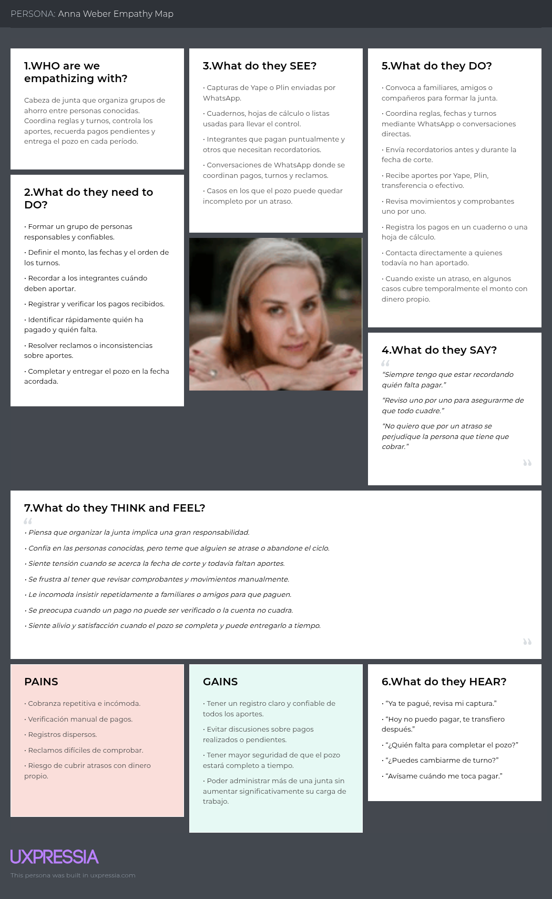

#### Empathy map 2: Sofia Gonzales - Participante de Junta

El empathy map de Sofia Gonzales, como participante en una junta, está basada en la confianza donde busca cumplir puntualmente con sus aportes y recibir el pozo en su turno. Asimismo enfrenta la incomodidad de buscar comprobantes antiguos y la incertidumbre ante posibles retrasos del grupo. Esto demuestra la necesidad de evidenciar de forma organizada los pagos, el estado del pozo y así tener la tranquilidad frente al cumplimiento general.

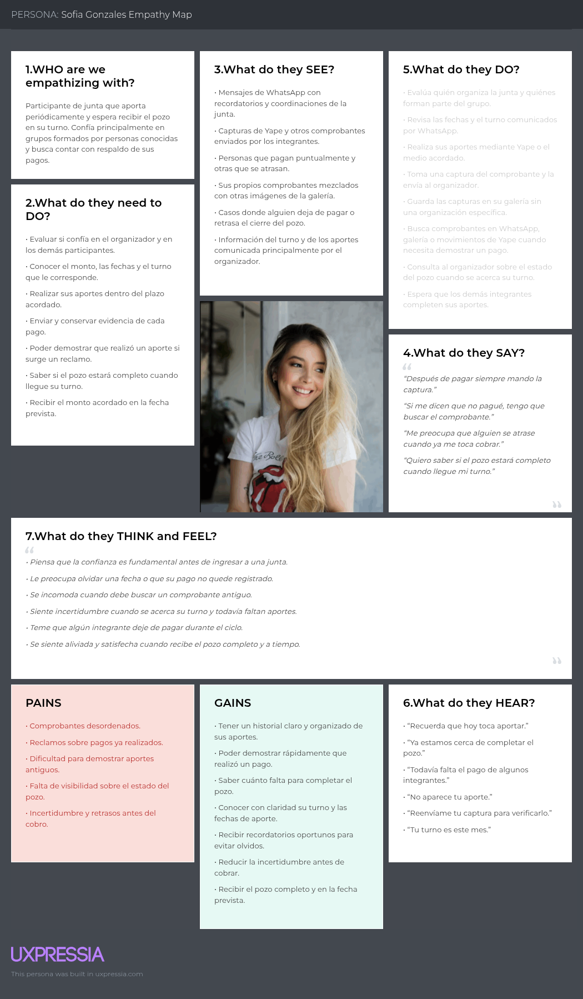

### 2.3.5. Big Picture EventStorming

El Big Picture EventStorming se utilizó para representar de manera colaborativa el funcionamiento general de una junta de ahorro, identificando los eventos relevantes que ocurren desde la conformación del grupo hasta la finalización del ciclo. El objetivo fue construir una visión compartida del dominio a partir de los hallazgos de la sección Análisis de entrevistas, sin incorporar todavía funcionalidades específicas de Pozzo.

**Leyenda**
- **Domain Event**: Hecho relevante del dominio que ya ocurrió.
- **Hotspot**: Problema, duda, riesgo o punto que requiere mayor análisis.
- **Actor**: Persona o rol que participa en una acción del proceso.
- **Command**: Acción o intención que provoca un cambio en el dominio.
- **Policy**: Regla que determina qué acción realizar cuando ocurre determinado evento.
- **External System**: Sistema o herramienta externa que interactúa con el proceso.
- **Comment**: Nota, pregunta o aclaración añadida durante el análisis

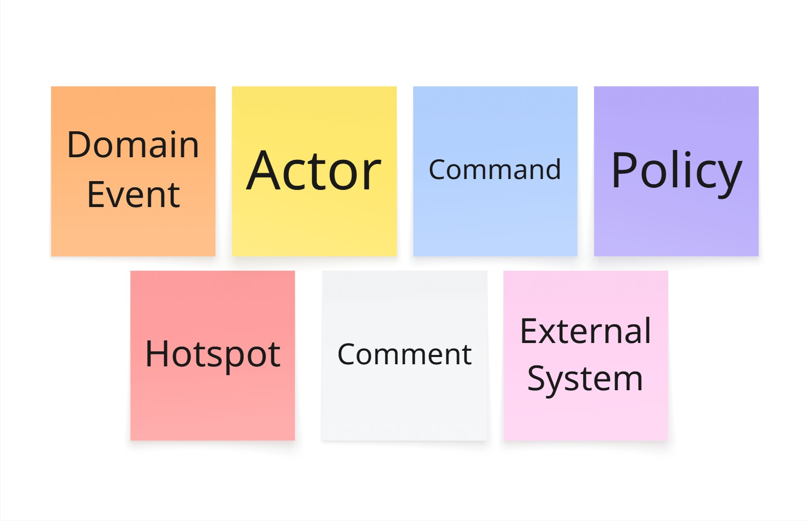

#### Identificación de eventos
El equipo inició la sesión identificando los principales eventos que ocurren durante una junta de ahorro. Cada evento se formuló como un hecho ocurrido dentro del dominio, sin considerar todavía su orden ni posibles soluciones tecnológicas.

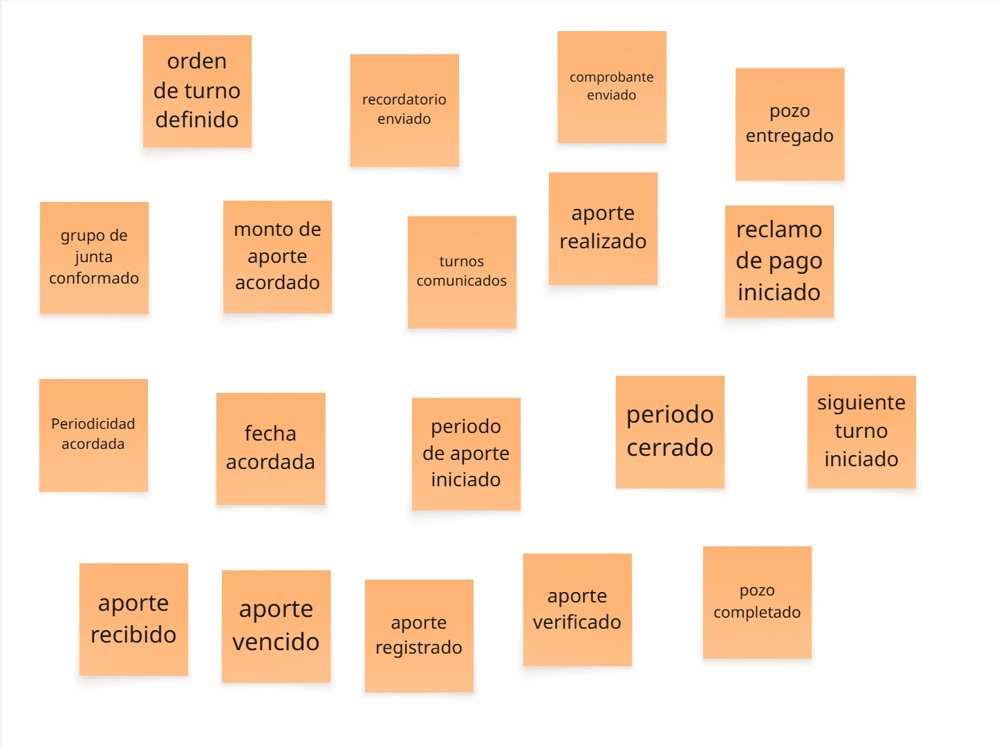

#### Ordenamiento temporal
Los eventos identificados se organizaron cronológicamente para reconstruir el recorrido completo de una junta, desde su conformación hasta la finalización del ciclo.

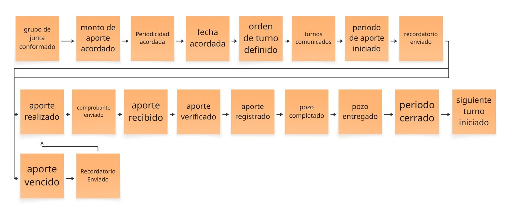

#### Actores, sistemas externos y comandos
Posteriormente se incorporaron los roles que participan en cada actividad y las herramientas utilizadas actualmente, entre ellas WhatsApp, Yape, Plin, aplicaciones bancarias y hojas de cálculo. Ademas se utilizan verbos en infinitivo para representar las acciones que se están haciendo.

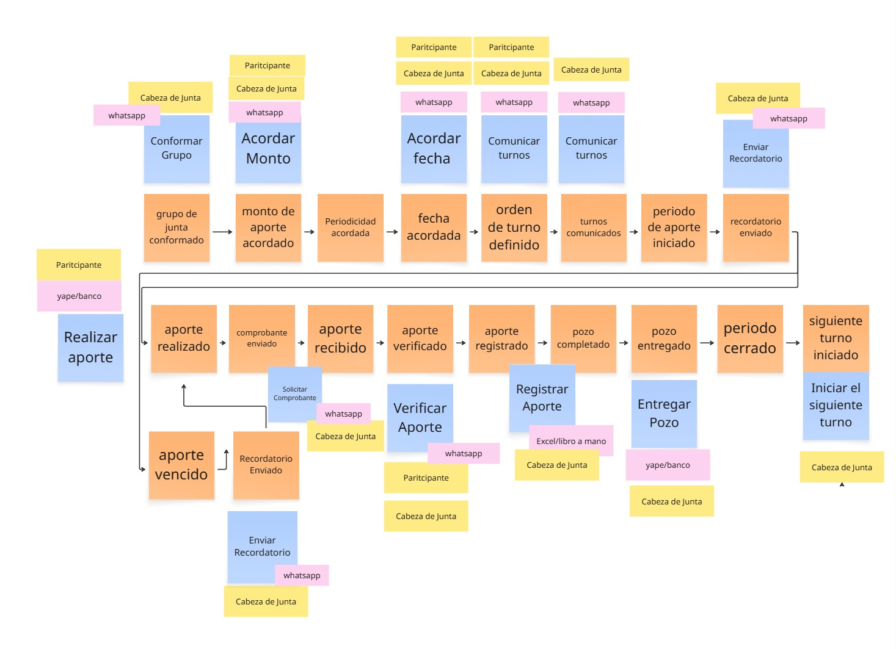

#### Identificación de problemas y validación

Finalmente, mediante storytelling se revisó el recorrido completo y se identificaron los principales puntos de fricción, como la cobranza repetitiva, la verificación manual y los aportes pendientes.

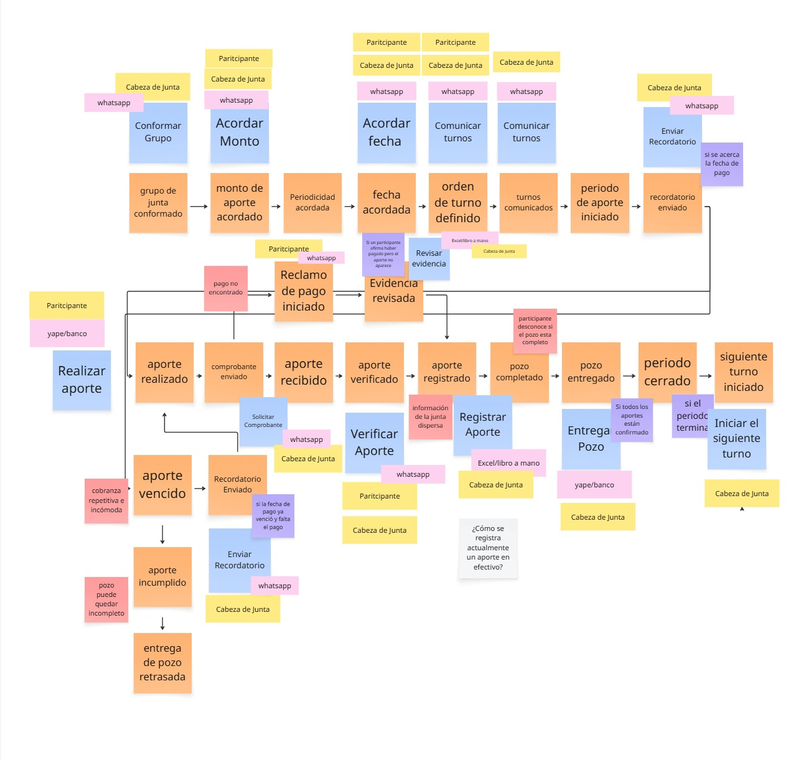

### 2.3.6. Ubiquitous Language

El siguiente glosario reúne los términos y conceptos del dominio del ahorro rotativo que el equipo utiliza de forma uniforme en todos los artefactos, en el código y en la comunicación con los interesados. Se incluyen únicamente términos del negocio, no términos técnicos de ingeniería de software. Los términos se registran en inglés, con su equivalente de uso corriente en el Perú entre paréntesis.

<table>
  <thead>
    <tr>
      <th>Término</th>
      <th>Definición</th>
    </tr>
  </thead>
  <tbody>
    <tr>
      <td><b>Savings Group</b> (Junta, pandero)</td>
      <td>Asociación rotativa de ahorro y crédito conformada por personas conocidas entre sí, que aportan un monto fijo con periodicidad acordada para que el fondo acumulado se entregue íntegro a un integrante distinto en cada turno.</td>
    </tr>
    <tr>
      <td><b>Cycle</b> (Ciclo)</td>
      <td>Duración total de una junta, equivalente al número de períodos necesarios para que todos los integrantes hayan cobrado una vez.</td>
    </tr>
    <tr>
      <td><b>Contribution Period</b> (Período de aporte)</td>
      <td>Intervalo de tiempo acordado entre un aporte y el siguiente. Puede ser semanal, quincenal o mensual.</td>
    </tr>
    <tr>
      <td><b>Contribution</b> (Aporte)</td>
      <td>Monto fijo que cada integrante entrega en cada período de aporte.</td>
    </tr>
    <tr>
      <td><b>Pot</b> (Pozo)</td>
      <td>Suma de todos los aportes de un período, que se entrega completa al integrante cuyo turno corresponde.</td>
    </tr>
    <tr>
      <td><b>Turn</b> (Turno)</td>
      <td>Posición dentro del ciclo que determina en qué período le corresponde cobrar el pozo a cada integrante.</td>
    </tr>
    <tr>
      <td><b>Turn Assignment</b> (Asignación de turnos)</td>
      <td>Mecanismo mediante el cual el grupo determina el orden de cobro al constituir la junta.</td>
    </tr>
    <tr>
      <td><b>Draw</b> (Sorteo)</td>
      <td>Mecanismo de asignación de turnos en el que el orden se determina al azar entre los integrantes.</td>
    </tr>
    <tr>
      <td><b>Agreed Order</b> (Orden acordado)</td>
      <td>Mecanismo de asignación de turnos en el que el orden se define por consenso, generalmente según la urgencia de cada integrante.</td>
    </tr>
    <tr>
      <td><b>Bidding</b> (Subasta)</td>
      <td>Mecanismo de asignación de turnos en el que un integrante cede parte del pozo a cambio de cobrar en un período anterior al que le correspondería.</td>
    </tr>
    <tr>
      <td><b>Organizer</b> (Cabeza de junta)</td>
      <td>Integrante que convoca al grupo, define las reglas de la junta, registra los aportes y entrega el pozo en cada turno.</td>
    </tr>
    <tr>
      <td><b>Member</b> (Participante)</td>
      <td>Integrante que aporta en cada período y recibe el pozo cuando llega su turno.</td>
    </tr>
    <tr>
      <td><b>Cut-off Date</b> (Fecha de corte)</td>
      <td>Fecha límite acordada para que todos los aportes de un período estén realizados.</td>
    </tr>
    <tr>
      <td><b>Payout</b> (Cobro, adjudicación)</td>
      <td>Entrega del pozo completo al integrante cuyo turno corresponde en el período vigente.</td>
    </tr>
    <tr>
      <td><b>Payment Proof</b> (Comprobante, voucher)</td>
      <td>Constancia de la transferencia realizada por un integrante, que acredita el monto, la fecha y el destinatario de su aporte.</td>
    </tr>
    <tr>
      <td><b>Delinquency</b> (Morosidad)</td>
      <td>Situación en la que un integrante no realiza su aporte dentro de la fecha de corte.</td>
    </tr>
    <tr>
      <td><b>Coverage</b> (Cobertura)</td>
      <td>Práctica por la cual el organizador u otro integrante asume con dinero propio el aporte de un moroso para que el pozo se complete y la cadena no se rompa.</td>
    </tr>
    <tr>
      <td><b>Dropout</b> (Deserción)</td>
      <td>Abandono definitivo de un integrante antes de finalizar el ciclo, habitualmente después de haber cobrado su turno.</td>
    </tr>
    <tr>
      <td><b>Compliance History</b> (Historial de cumplimiento)</td>
      <td>Registro del comportamiento de pago de un integrante a lo largo de los ciclos en los que ha participado.</td>
    </tr>
    <tr>
      <td><b>Reminder</b> (Recordatorio)</td>
      <td>Aviso dirigido a un integrante para que realice su aporte antes de la fecha de corte.</td>
    </tr>
  </tbody>
</table>

## 2.4. Requirements specification

En esta sección se especifican los requisitos de los productos digitales de Pozzo a partir de la información obtenida en la investigación: las entrevistas a cabezas de junta y participantes y su análisis por segmento (sección Entrevistas), los User Personas de Anna Weber y Sofia Gonzales, el User Task Matrix, los User Journey Maps y el Big Picture EventStorming (sección Needfinding), y las feature assumptions e hipótesis del Lean UX Process (capítulo I, Solution Profile). Para reducir la ambigüedad antes de redactar, el equipo construyó un prototipo navegable de la aplicación móvil con datos de ejemplo, recorrió con él los flujos de ambos roles y ajustó pantallas y reglas hasta obtener una versión acordada; las historias que siguen describen ese comportamiento.

La especificación cubre los tres productos del alcance: la aplicación móvil, los servicios RESTful de desarrollo propio y el sitio web estático del landing page. Se organiza en tres partes: las User Stories, agrupadas en Epics e incluyendo Technical Stories y Spike Stories; el Impact Map, que vincula los objetivos de negocio con las historias; y el Product Backlog, con la estimación y priorización de cada historia.

### 2.4.1. User Stories

Las historias se redactan desde la perspectiva de los dos actores del dominio identificados en la sección Segmentos objetivo del capítulo I, la **cabeza de junta** (Organizer) y el **participante** (Member), y se usa **integrante** cuando la historia aplica a ambos por igual. Para el landing page el actor es el **visitante**, y para las Technical Stories y Spike Stories el rol **Developer**. Los términos siguen el Ubiquitous Language: junta, ciclo, período de aporte, turno, pozo, fecha de corte, comprobante, cobertura, deserción e historial de cumplimiento.

Los criterios de aceptación siguen la estructura Gherkin (Dado, Cuando, Entonces), se redactan en tiempo presente y tercera persona, no hacen referencia a detalles de interfaz de usuario y son comprobables. Cuando un criterio es una regla de negocio que no depende de una condición, se enuncia como tal. La prioridad refleja el valor para el negocio según las hipótesis del Lean UX Process: Alta para lo que sostiene la validación automática, la transparencia del pozo y la adopción; Media para lo que completa el ciclo; Baja para lo que amplía la propuesta.

#### Epics

<table>
  <thead>
    <tr>
      <th>Epic ID</th>
      <th>Nombre</th>
      <th>Descripción</th>
    </tr>
  </thead>
  <tbody>
    <tr>
      <td>EP01</td>
      <td>Acceso y cuenta</td>
      <td>Ingreso a Pozzo con el número de celular verificado por SMS, sin contraseña, y administración del perfil.</td>
    </tr>
    <tr>
      <td>EP02</td>
      <td>Configuración de la junta</td>
      <td>Creación de la junta con sus reglas (aporte, periodicidad, integrantes, fecha de corte, destino de los aportes) y su inicio.</td>
    </tr>
    <tr>
      <td>EP03</td>
      <td>Incorporación de integrantes</td>
      <td>Invitación por código o enlace, ingreso del participante, integrantes sin la aplicación y administración de la lista antes de iniciar.</td>
    </tr>
    <tr>
      <td>EP04</td>
      <td>Asignación de turnos</td>
      <td>Reparto del orden de cobro por sorteo, orden acordado o subasta, y consulta del calendario de turnos.</td>
    </tr>
    <tr>
      <td>EP05</td>
      <td>Registro y validación de aportes</td>
      <td>Registro del aporte a partir del comprobante, lectura automática de sus datos, validación contra lo esperado, revisión de inconsistencias y aportes en efectivo.</td>
    </tr>
    <tr>
      <td>EP06</td>
      <td>Transparencia del pozo</td>
      <td>Estado del período vigente visible para todo el grupo: quién aportó, quién debe y cuánto falta.</td>
    </tr>
    <tr>
      <td>EP07</td>
      <td>Recordatorios y avisos</td>
      <td>Recordatorios automáticos escalonados a quien no ha aportado y avisos de los hechos relevantes de la junta.</td>
    </tr>
    <tr>
      <td>EP08</td>
      <td>Entrega del pozo y cierre del ciclo</td>
      <td>Entrega del pozo al integrante del turno, apertura del siguiente período, coberturas, deserciones y cierre de la junta.</td>
    </tr>
    <tr>
      <td>EP09</td>
      <td>Historial de cumplimiento</td>
      <td>Registro del comportamiento de pago de cada integrante a lo largo de sus juntas, consultable y compartible.</td>
    </tr>
    <tr>
      <td>EP10</td>
      <td>Landing page</td>
      <td>Sitio web estático que presenta el problema, la propuesta de valor y la vía de acceso a la aplicación.</td>
    </tr>
    <tr>
      <td>EP11</td>
      <td>Servicios RESTful</td>
      <td>Technical Stories de los servicios web que sostienen la aplicación móvil.</td>
    </tr>
    <tr>
      <td>EP12</td>
      <td>Investigación técnica</td>
      <td>Spike Stories para reducir la incertidumbre técnica antes de implementar.</td>
    </tr>
  </tbody>
</table>

#### Historias de usuario

##### EP01 Acceso y cuenta

<table>
  <thead>
    <tr>
      <th>Story ID</th>
      <th>User</th>
      <th>Priority</th>
      <th>Epic</th>
    </tr>
  </thead>
  <tbody>
    <tr>
      <td>US01</td>
      <td>Integrante</td>
      <td>Alta</td>
      <td>EP01</td>
    </tr>
    <tr>
      <td><b>Title</b></td>
      <td colspan="3">Ingresar con el número de celular</td>
    </tr>
    <tr>
      <td><b>Description</b></td>
      <td colspan="3">Como integrante de una junta, deseo ingresar a Pozzo con mi número de celular, para acceder sin crear ni recordar una contraseña.</td>
    </tr>
    <tr>
      <td><b>Acceptance Criteria</b></td>
      <td colspan="3"><b>Escenario 1: Solicitud del código</b> Dado que el integrante no tiene una sesión iniciada, Cuando ingresa un número de celular peruano de nueve dígitos y solicita el código, Entonces el sistema envía un código de verificación de seis dígitos por SMS a ese número y queda a la espera de su confirmación.  <b>Escenario 2: Número inválido</b> Dado que el integrante no tiene una sesión iniciada, Cuando ingresa un número que no tiene nueve dígitos o no comienza en 9, Entonces el sistema no envía ningún código e indica que el número no es válido.  <b>Escenario 3: Reenvío</b> Dado que el integrante solicitó un código hace menos de 30 segundos, Cuando solicita un reenvío, Entonces el sistema no envía un nuevo código hasta que transcurra el tiempo de espera.</td>
    </tr>
  </tbody>
</table>

<table>
  <thead>
    <tr>
      <th>Story ID</th>
      <th>User</th>
      <th>Priority</th>
      <th>Epic</th>
    </tr>
  </thead>
  <tbody>
    <tr>
      <td>US02</td>
      <td>Integrante</td>
      <td>Alta</td>
      <td>EP01</td>
    </tr>
    <tr>
      <td><b>Title</b></td>
      <td colspan="3">Verificar el código SMS</td>
    </tr>
    <tr>
      <td><b>Description</b></td>
      <td colspan="3">Como integrante, deseo confirmar el código que recibí por SMS, para demostrar que el número es mío y entrar a mis juntas.</td>
    </tr>
    <tr>
      <td><b>Acceptance Criteria</b></td>
      <td colspan="3"><b>Escenario 1: Código correcto de un número registrado</b> Dado que el número ya tiene una cuenta en Pozzo, Cuando el integrante ingresa el código correcto dentro de los 10 minutos de vigencia, Entonces el sistema inicia la sesión y muestra sus juntas.  <b>Escenario 2: Código correcto de un número nuevo</b> Dado que el número no tiene una cuenta en Pozzo, Cuando el integrante ingresa el código correcto, Entonces el sistema le solicita completar su registro.  <b>Escenario 3: Código incorrecto o vencido</b> Dado que el integrante recibió un código, Cuando ingresa un código distinto o uno emitido hace más de 10 minutos, Entonces el sistema rechaza el ingreso, informa el motivo y permite solicitar un nuevo código.</td>
    </tr>
  </tbody>
</table>

<table>
  <thead>
    <tr>
      <th>Story ID</th>
      <th>User</th>
      <th>Priority</th>
      <th>Epic</th>
    </tr>
  </thead>
  <tbody>
    <tr>
      <td>US03</td>
      <td>Integrante</td>
      <td>Alta</td>
      <td>EP01</td>
    </tr>
    <tr>
      <td><b>Title</b></td>
      <td colspan="3">Completar el registro</td>
    </tr>
    <tr>
      <td><b>Description</b></td>
      <td colspan="3">Como integrante nuevo, deseo registrarme solo con mi nombre y aceptar los términos, para empezar a usar Pozzo sin trámites.</td>
    </tr>
    <tr>
      <td><b>Acceptance Criteria</b></td>
      <td colspan="3"><b>Escenario 1: Registro completo</b> Dado que el integrante verificó un número nuevo, Cuando ingresa su nombre y apellido y acepta los Términos y Condiciones y la Política de Privacidad, Entonces el sistema crea la cuenta asociada al número verificado e inicia la sesión.  <b>Escenario 2: Términos no aceptados</b> Dado que el integrante verificó un número nuevo, Cuando intenta completar el registro sin aceptar los términos, Entonces el sistema no crea la cuenta e indica que la aceptación es obligatoria.  <b>Escenario 3: Consulta de los términos</b> Dado que el integrante está completando su registro, Cuando solicita ver los Términos y Condiciones o la Política de Privacidad, Entonces el sistema muestra el texto completo, que indica de forma explícita que Pozzo no recibe, retiene ni transfiere dinero.</td>
    </tr>
  </tbody>
</table>

<table>
  <thead>
    <tr>
      <th>Story ID</th>
      <th>User</th>
      <th>Priority</th>
      <th>Epic</th>
    </tr>
  </thead>
  <tbody>
    <tr>
      <td>US04</td>
      <td>Integrante</td>
      <td>Media</td>
      <td>EP01</td>
    </tr>
    <tr>
      <td><b>Title</b></td>
      <td colspan="3">Mantener la sesión en el dispositivo</td>
    </tr>
    <tr>
      <td><b>Description</b></td>
      <td colspan="3">Como integrante, deseo que mi sesión permanezca iniciada en mi teléfono, para no verificar mi número cada vez que abro Pozzo.</td>
    </tr>
    <tr>
      <td><b>Acceptance Criteria</b></td>
      <td colspan="3"><b>Escenario 1: Sesión persistente</b> Dado que el integrante inició sesión en un dispositivo, Cuando vuelve a abrir la aplicación en ese mismo dispositivo, Entonces el sistema lo reconoce sin solicitar un nuevo código.  <b>Escenario 2: Cierre de sesión</b> Dado que el integrante tiene una sesión iniciada, Cuando cierra la sesión, Entonces el sistema elimina las credenciales guardadas en el dispositivo y solicita verificar el número en el siguiente ingreso.  <b>Escenario 3: Dispositivo nuevo</b> Dado que el integrante inicia sesión en un segundo dispositivo, Cuando verifica su número, Entonces el sistema le muestra las mismas juntas e historial que en el primer dispositivo.</td>
    </tr>
  </tbody>
</table>

<table>
  <thead>
    <tr>
      <th>Story ID</th>
      <th>User</th>
      <th>Priority</th>
      <th>Epic</th>
    </tr>
  </thead>
  <tbody>
    <tr>
      <td>US05</td>
      <td>Integrante</td>
      <td>Media</td>
      <td>EP01</td>
    </tr>
    <tr>
      <td><b>Title</b></td>
      <td colspan="3">Administrar mi perfil</td>
    </tr>
    <tr>
      <td><b>Description</b></td>
      <td colspan="3">Como integrante, deseo mantener mi nombre, mi número de Yape o Plin y un correo de respaldo, para que mi grupo sepa a quién transferir y yo pueda recuperar mi cuenta.</td>
    </tr>
    <tr>
      <td><b>Acceptance Criteria</b></td>
      <td colspan="3"><b>Escenario 1: Número para recibir aportes</b> Dado que el integrante tiene una cuenta, Cuando registra o modifica su número de Yape o Plin, Entonces el sistema lo guarda y lo muestra a los integrantes de sus juntas cuando les corresponde transferirle.  <b>Escenario 2: Correo de respaldo</b> Dado que el integrante registra un correo, Cuando pierde acceso a su número de celular y solicita recuperar la cuenta, Entonces el sistema le permite verificar su identidad por ese correo y asociar un número nuevo.  <b>Escenario 3: Cambio de número</b> Dado que el integrante tiene una sesión iniciada, Cuando solicita cambiar su número de celular e ingresa el código SMS enviado al número nuevo, Entonces el sistema asocia la cuenta al número nuevo y conserva sus juntas e historial.</td>
    </tr>
  </tbody>
</table>

<table>
  <thead>
    <tr>
      <th>Story ID</th>
      <th>User</th>
      <th>Priority</th>
      <th>Epic</th>
    </tr>
  </thead>
  <tbody>
    <tr>
      <td>US06</td>
      <td>Integrante</td>
      <td>Baja</td>
      <td>EP01</td>
    </tr>
    <tr>
      <td><b>Title</b></td>
      <td colspan="3">Elegir el tema visual</td>
    </tr>
    <tr>
      <td><b>Description</b></td>
      <td colspan="3">Como integrante, deseo elegir entre el tema del sistema, claro u oscuro, para usar Pozzo con la apariencia que me resulte cómoda.</td>
    </tr>
    <tr>
      <td><b>Acceptance Criteria</b></td>
      <td colspan="3"><b>Escenario 1: Tema del sistema</b> Dado que el integrante no ha elegido un tema, Cuando el sistema operativo cambia entre claro y oscuro, Entonces la aplicación adopta la misma apariencia.  <b>Escenario 2: Preferencia manual</b> Dado que el integrante elige claro u oscuro, Cuando vuelve a abrir la aplicación, Entonces el sistema mantiene la preferencia elegida con independencia del ajuste del sistema operativo.</td>
    </tr>
  </tbody>
</table>

##### EP02 Configuración de la junta

<table>
  <thead>
    <tr>
      <th>Story ID</th>
      <th>User</th>
      <th>Priority</th>
      <th>Epic</th>
    </tr>
  </thead>
  <tbody>
    <tr>
      <td>US07</td>
      <td>Cabeza de junta</td>
      <td>Alta</td>
      <td>EP02</td>
    </tr>
    <tr>
      <td><b>Title</b></td>
      <td colspan="3">Crear una junta</td>
    </tr>
    <tr>
      <td><b>Description</b></td>
      <td colspan="3">Como cabeza de junta, deseo crear una junta definiendo el aporte, la periodicidad, el número de integrantes, el día de corte y la fecha del primer aporte, para reproducir en Pozzo las reglas que mi grupo ya acordó.</td>
    </tr>
    <tr>
      <td><b>Acceptance Criteria</b></td>
      <td colspan="3"><b>Escenario 1: Creación con reglas completas</b> Dado que la cabeza de junta tiene una sesión iniciada, Cuando ingresa un nombre, un monto de aporte mayor a cero, una periodicidad semanal, quincenal o mensual, un número de integrantes entre 2 y 50, un día de corte y una fecha de inicio, Entonces el sistema crea la junta en estado "por iniciar", la asigna a la cabeza como organizadora y primera integrante, y calcula el pozo por turno como el aporte multiplicado por el número de integrantes.  <b>Escenario 2: Datos incompletos</b> Dado que la cabeza de junta está creando una junta, Cuando omite el monto, la periodicidad o el número de integrantes, Entonces el sistema no crea la junta e indica qué dato falta.  <b>Regla de negocio</b> El número de turnos del ciclo es igual al número de integrantes: cada integrante cobra el pozo exactamente una vez por ciclo.</td>
    </tr>
  </tbody>
</table>

<table>
  <thead>
    <tr>
      <th>Story ID</th>
      <th>User</th>
      <th>Priority</th>
      <th>Epic</th>
    </tr>
  </thead>
  <tbody>
    <tr>
      <td>US08</td>
      <td>Cabeza de junta</td>
      <td>Alta</td>
      <td>EP02</td>
    </tr>
    <tr>
      <td><b>Title</b></td>
      <td colspan="3">Definir el destino de los aportes</td>
    </tr>
    <tr>
      <td><b>Description</b></td>
      <td colspan="3">Como cabeza de junta, deseo indicar el número de Yape o Plin al que deben llegar los aportes, para que Pozzo valide los comprobantes contra ese destinatario y los participantes sepan a quién transferir.</td>
    </tr>
    <tr>
      <td><b>Acceptance Criteria</b></td>
      <td colspan="3"><b>Escenario 1: Destino por defecto</b> Dado que la cabeza de junta tiene un número de Yape o Plin en su perfil, Cuando crea una junta, Entonces el sistema propone ese número como destino de los aportes y permite cambiarlo.  <b>Escenario 2: Destino visible para el participante</b> Dado que la junta tiene un destino definido, Cuando un participante consulta cómo aportar, Entonces el sistema le muestra el nombre y el número de destino registrados.  <b>Regla de negocio</b> Pozzo no recibe, retiene ni transfiere dinero; el destino registrado es solo una referencia para la validación y para orientar al participante.</td>
    </tr>
  </tbody>
</table>

<table>
  <thead>
    <tr>
      <th>Story ID</th>
      <th>User</th>
      <th>Priority</th>
      <th>Epic</th>
    </tr>
  </thead>
  <tbody>
    <tr>
      <td>US09</td>
      <td>Cabeza de junta</td>
      <td>Media</td>
      <td>EP02</td>
    </tr>
    <tr>
      <td><b>Title</b></td>
      <td colspan="3">Consultar y ajustar las reglas de la junta</td>
    </tr>
    <tr>
      <td><b>Description</b></td>
      <td colspan="3">Como cabeza de junta, deseo revisar y corregir las reglas de la junta antes de iniciarla, para que queden exactamente como las acordó el grupo.</td>
    </tr>
    <tr>
      <td><b>Acceptance Criteria</b></td>
      <td colspan="3"><b>Escenario 1: Ajuste antes de iniciar</b> Dado que la junta está en estado "por iniciar", Cuando la cabeza modifica el aporte, la periodicidad, el número de integrantes o el día de corte, Entonces el sistema guarda los cambios y recalcula el pozo por turno.  <b>Escenario 2: Reglas bloqueadas</b> Dado que la junta ya fue iniciada, Cuando la cabeza intenta modificar el aporte, la periodicidad o el número de integrantes, Entonces el sistema no permite el cambio e indica que las reglas quedaron fijas al iniciar el ciclo.  <b>Escenario 3: Consulta por un participante</b> Dado que un participante pertenece a la junta, Cuando consulta la configuración, Entonces el sistema le muestra todas las reglas en modo de solo lectura.</td>
    </tr>
  </tbody>
</table>

<table>
  <thead>
    <tr>
      <th>Story ID</th>
      <th>User</th>
      <th>Priority</th>
      <th>Epic</th>
    </tr>
  </thead>
  <tbody>
    <tr>
      <td>US10</td>
      <td>Cabeza de junta</td>
      <td>Alta</td>
      <td>EP02</td>
    </tr>
    <tr>
      <td><b>Title</b></td>
      <td colspan="3">Iniciar la junta</td>
    </tr>
    <tr>
      <td><b>Description</b></td>
      <td colspan="3">Como cabeza de junta, deseo iniciar la junta cuando el grupo está completo y los turnos definidos, para abrir el primer período de aporte.</td>
    </tr>
    <tr>
      <td><b>Acceptance Criteria</b></td>
      <td colspan="3"><b>Escenario 1: Inicio con grupo completo</b> Dado que la junta tiene tantos integrantes como turnos y el método de asignación de turnos está confirmado, Cuando la cabeza inicia la junta, Entonces el sistema crea los períodos del ciclo con sus fechas de corte, abre el primer período, fija las reglas y avisa a todos los integrantes.  <b>Escenario 2: Grupo incompleto</b> Dado que la junta tiene menos integrantes que turnos, Cuando la cabeza intenta iniciarla, Entonces el sistema no la inicia e indica cuántos integrantes faltan.  <b>Escenario 3: Turnos sin definir</b> Dado que la junta tiene el grupo completo pero no se ha confirmado un método de asignación de turnos, Cuando la cabeza intenta iniciarla, Entonces el sistema no la inicia y solicita definir los turnos.</td>
    </tr>
  </tbody>
</table>

##### EP03 Incorporación de integrantes

<table>
  <thead>
    <tr>
      <th>Story ID</th>
      <th>User</th>
      <th>Priority</th>
      <th>Epic</th>
    </tr>
  </thead>
  <tbody>
    <tr>
      <td>US11</td>
      <td>Cabeza de junta</td>
      <td>Alta</td>
      <td>EP03</td>
    </tr>
    <tr>
      <td><b>Title</b></td>
      <td colspan="3">Invitar integrantes con código y enlace</td>
    </tr>
    <tr>
      <td><b>Description</b></td>
      <td colspan="3">Como cabeza de junta, deseo obtener un código y un enlace de invitación y compartirlos por mensajería, para que mi grupo entre a la junta sin que yo registre a cada uno.</td>
    </tr>
    <tr>
      <td><b>Acceptance Criteria</b></td>
      <td colspan="3"><b>Escenario 1: Código generado</b> Dado que la cabeza creó una junta, Cuando la creación se completa, Entonces el sistema genera un código único de invitación y un enlace equivalente asociados a esa junta.  <b>Escenario 2: Compartir</b> Dado que la junta tiene un código, Cuando la cabeza elige compartirlo, Entonces el sistema entrega a la aplicación de mensajería elegida un mensaje con el nombre de la junta, el aporte, la periodicidad, el número de integrantes, el código y el enlace.  <b>Escenario 3: Invitación vencida</b> Dado que la junta ya fue iniciada, Cuando alguien intenta unirse con el código, Entonces el sistema rechaza el ingreso e indica que la junta ya no acepta integrantes.</td>
    </tr>
  </tbody>
</table>

<table>
  <thead>
    <tr>
      <th>Story ID</th>
      <th>User</th>
      <th>Priority</th>
      <th>Epic</th>
    </tr>
  </thead>
  <tbody>
    <tr>
      <td>US12</td>
      <td>Participante</td>
      <td>Alta</td>
      <td>EP03</td>
    </tr>
    <tr>
      <td><b>Title</b></td>
      <td colspan="3">Unirme a una junta con código o enlace</td>
    </tr>
    <tr>
      <td><b>Description</b></td>
      <td colspan="3">Como participante, deseo unirme a la junta con el código o el enlace que me compartió la cabeza, para quedar registrado sin configurar nada.</td>
    </tr>
    <tr>
      <td><b>Acceptance Criteria</b></td>
      <td colspan="3"><b>Escenario 1: Ingreso por código</b> Dado que el participante tiene una sesión iniciada, Cuando ingresa un código vigente, Entonces el sistema le muestra los datos de la junta para confirmar.  <b>Escenario 2: Ingreso por enlace</b> Dado que el participante abre el enlace de invitación en su teléfono, Cuando tiene Pozzo instalado, Entonces la aplicación se abre directamente en la confirmación de esa junta; y cuando no lo tiene, el enlace lo dirige a la descarga y conserva la invitación para después de instalar.  <b>Escenario 3: Código inexistente</b> Dado que el participante ingresa un código, Cuando el código no corresponde a ninguna junta, Entonces el sistema indica que no encontró la junta y permite intentar de nuevo.</td>
    </tr>
  </tbody>
</table>

<table>
  <thead>
    <tr>
      <th>Story ID</th>
      <th>User</th>
      <th>Priority</th>
      <th>Epic</th>
    </tr>
  </thead>
  <tbody>
    <tr>
      <td>US13</td>
      <td>Participante</td>
      <td>Media</td>
      <td>EP03</td>
    </tr>
    <tr>
      <td><b>Title</b></td>
      <td colspan="3">Revisar la junta antes de unirme</td>
    </tr>
    <tr>
      <td><b>Description</b></td>
      <td colspan="3">Como participante, deseo ver quién organiza, cuánto se aporta, con qué frecuencia y cuántos integrantes son, para decidir si entro.</td>
    </tr>
    <tr>
      <td><b>Acceptance Criteria</b></td>
      <td colspan="3"><b>Escenario 1: Confirmación informada</b> Dado que el participante ingresó un código válido, Cuando revisa la junta, Entonces el sistema le muestra el nombre de la cabeza, el aporte, la periodicidad, el número de integrantes, cuántos ya se unieron, el día de corte y el método de turnos, e indica que su historial de cumplimiento queda visible para la cabeza.  <b>Escenario 2: Unión confirmada</b> Dado que el participante revisó la junta, Cuando confirma que desea unirse, Entonces el sistema lo agrega como integrante y avisa a la cabeza.  <b>Escenario 3: Junta llena</b> Dado que la junta ya tiene tantos integrantes como turnos, Cuando un participante intenta unirse, Entonces el sistema no lo agrega e indica que la junta está completa.</td>
    </tr>
  </tbody>
</table>

<table>
  <thead>
    <tr>
      <th>Story ID</th>
      <th>User</th>
      <th>Priority</th>
      <th>Epic</th>
    </tr>
  </thead>
  <tbody>
    <tr>
      <td>US14</td>
      <td>Cabeza de junta</td>
      <td>Media</td>
      <td>EP03</td>
    </tr>
    <tr>
      <td><b>Title</b></td>
      <td colspan="3">Agregar un integrante sin la aplicación</td>
    </tr>
    <tr>
      <td><b>Description</b></td>
      <td colspan="3">Como cabeza de junta, deseo registrar a un integrante que no instalará Pozzo o que aporta en efectivo, para que la junta refleje a todo el grupo aunque no todos usen la aplicación.</td>
    </tr>
    <tr>
      <td><b>Acceptance Criteria</b></td>
      <td colspan="3"><b>Escenario 1: Registro con nombre</b> Dado que la junta está por iniciar, Cuando la cabeza ingresa el nombre de una persona y, opcionalmente, su celular, Entonces el sistema la agrega como integrante marcada como "sin aplicación" y sus aportes solo pueden ser registrados por la cabeza.  <b>Escenario 2: Reclamo de cuenta</b> Dado que un integrante sin aplicación fue registrado con su número de celular, Cuando esa persona se registra en Pozzo con el mismo número, Entonces el sistema vincula la cuenta nueva con el integrante existente y conserva sus aportes e historial.  <b>Regla de negocio</b> Un integrante sin aplicación ocupa un turno como cualquier otro y aparece en el calendario y en el estado del pozo.</td>
    </tr>
  </tbody>
</table>

<table>
  <thead>
    <tr>
      <th>Story ID</th>
      <th>User</th>
      <th>Priority</th>
      <th>Epic</th>
    </tr>
  </thead>
  <tbody>
    <tr>
      <td>US15</td>
      <td>Cabeza de junta</td>
      <td>Media</td>
      <td>EP03</td>
    </tr>
    <tr>
      <td><b>Title</b></td>
      <td colspan="3">Retirar un integrante antes de iniciar</td>
    </tr>
    <tr>
      <td><b>Description</b></td>
      <td colspan="3">Como cabeza de junta, deseo retirar a alguien que entró por error o que se arrepintió, para que el grupo quede correcto antes de asignar los turnos.</td>
    </tr>
    <tr>
      <td><b>Acceptance Criteria</b></td>
      <td colspan="3"><b>Escenario 1: Retiro con posibilidad de deshacer</b> Dado que la junta está por iniciar, Cuando la cabeza retira a un integrante distinto de sí misma, Entonces el sistema lo quita de la lista y ofrece deshacer la acción durante cinco segundos.  <b>Escenario 2: Retiro tras iniciar</b> Dado que la junta ya fue iniciada, Cuando la cabeza intenta retirar a un integrante, Entonces el sistema no lo permite e indica que corresponde registrar una deserción.  <b>Regla de negocio</b> La cabeza de junta no puede retirarse a sí misma de su propia junta.</td>
    </tr>
  </tbody>
</table>

<table>
  <thead>
    <tr>
      <th>Story ID</th>
      <th>User</th>
      <th>Priority</th>
      <th>Epic</th>
    </tr>
  </thead>
  <tbody>
    <tr>
      <td>US16</td>
      <td>Integrante</td>
      <td>Media</td>
      <td>EP03</td>
    </tr>
    <tr>
      <td><b>Title</b></td>
      <td colspan="3">Ver la lista de integrantes</td>
    </tr>
    <tr>
      <td><b>Description</b></td>
      <td colspan="3">Como integrante, deseo ver quiénes están en la junta, quién es la cabeza y quién usa Pozzo, para saber con quién comparto el ciclo.</td>
    </tr>
    <tr>
      <td><b>Acceptance Criteria</b></td>
      <td colspan="3"><b>Escenario 1: Lista completa</b> Dado que el integrante pertenece a la junta, Cuando consulta los integrantes, Entonces el sistema muestra a cada uno con su nombre, si es la cabeza, si usa la aplicación y, una vez asignados, su turno.  <b>Escenario 2: Avance de la convocatoria</b> Dado que la junta está por iniciar, Cuando el integrante consulta la lista, Entonces el sistema indica cuántos integrantes hay y cuántos faltan para completar el grupo.</td>
    </tr>
  </tbody>
</table>

##### EP04 Asignación de turnos

<table>
  <thead>
    <tr>
      <th>Story ID</th>
      <th>User</th>
      <th>Priority</th>
      <th>Epic</th>
    </tr>
  </thead>
  <tbody>
    <tr>
      <td>US17</td>
      <td>Cabeza de junta</td>
      <td>Alta</td>
      <td>EP04</td>
    </tr>
    <tr>
      <td><b>Title</b></td>
      <td colspan="3">Asignar turnos por sorteo</td>
    </tr>
    <tr>
      <td><b>Description</b></td>
      <td colspan="3">Como cabeza de junta, deseo sortear el orden de cobro entre todos los integrantes, para que el reparto sea al azar y nadie cuestione el resultado.</td>
    </tr>
    <tr>
      <td><b>Acceptance Criteria</b></td>
      <td colspan="3"><b>Escenario 1: Sorteo</b> Dado que la junta tiene el grupo completo y está por iniciar, Cuando la cabeza elige el sorteo, Entonces el sistema asigna a cada integrante un turno distinto entre 1 y el número de integrantes, de forma aleatoria.  <b>Escenario 2: Repetir el sorteo</b> Dado que ya se realizó un sorteo y la junta no se ha iniciado, Cuando la cabeza vuelve a sortear, Entonces el sistema genera un nuevo orden y descarta el anterior.  <b>Escenario 3: Confirmación</b> Dado que hay un orden sorteado, Cuando la cabeza lo confirma e inicia la junta, Entonces el sistema fija los turnos y comunica a cada integrante el suyo.</td>
    </tr>
  </tbody>
</table>

<table>
  <thead>
    <tr>
      <th>Story ID</th>
      <th>User</th>
      <th>Priority</th>
      <th>Epic</th>
    </tr>
  </thead>
  <tbody>
    <tr>
      <td>US18</td>
      <td>Cabeza de junta</td>
      <td>Alta</td>
      <td>EP04</td>
    </tr>
    <tr>
      <td><b>Title</b></td>
      <td colspan="3">Asignar turnos por orden acordado</td>
    </tr>
    <tr>
      <td><b>Description</b></td>
      <td colspan="3">Como cabeza de junta, deseo ordenar los turnos según lo conversado con el grupo, para respetar la urgencia de cada integrante.</td>
    </tr>
    <tr>
      <td><b>Acceptance Criteria</b></td>
      <td colspan="3"><b>Escenario 1: Orden manual</b> Dado que la junta tiene el grupo completo y está por iniciar, Cuando la cabeza elige el orden acordado y reordena a los integrantes, Entonces el sistema asigna los turnos según esa posición.  <b>Escenario 2: Sin duplicados</b> Dado que la cabeza está ordenando los turnos, Cuando mueve a un integrante de posición, Entonces el sistema reacomoda al resto de modo que ningún turno quede repetido ni vacío.  <b>Escenario 3: Intercambio posterior</b> Dado que la junta ya fue iniciada, Cuando la cabeza intercambia dos turnos cuyos períodos aún no han empezado, Entonces el sistema actualiza el calendario y avisa a los dos integrantes afectados.</td>
    </tr>
  </tbody>
</table>

<table>
  <thead>
    <tr>
      <th>Story ID</th>
      <th>User</th>
      <th>Priority</th>
      <th>Epic</th>
    </tr>
  </thead>
  <tbody>
    <tr>
      <td>US19</td>
      <td>Cabeza de junta</td>
      <td>Media</td>
      <td>EP04</td>
    </tr>
    <tr>
      <td><b>Title</b></td>
      <td colspan="3">Configurar la junta por subasta</td>
    </tr>
    <tr>
      <td><b>Description</b></td>
      <td colspan="3">Como cabeza de junta, deseo definir que cada turno se asigne por subasta, indicando cuándo cierra, la oferta mínima y qué pasa si nadie oferta, para reproducir el reparto que mi grupo practica.</td>
    </tr>
    <tr>
      <td><b>Acceptance Criteria</b></td>
      <td colspan="3"><b>Escenario 1: Reglas de la subasta</b> Dado que la junta está por iniciar, Cuando la cabeza elige la subasta, define con cuántos días de anticipación al corte cierra cada subasta, la oferta mínima y el mecanismo de respaldo (sorteo o elección de la cabeza), Entonces el sistema guarda esas reglas y no asigna turnos por adelantado.  <b>Escenario 2: Apertura de la primera subasta</b> Dado que la junta se configuró por subasta, Cuando la cabeza la inicia, Entonces el sistema abre la subasta del primer período con su fecha de cierre y avisa a los integrantes.  <b>Regla de negocio</b> Solo participan en la subasta los integrantes que aún no han cobrado un turno en el ciclo.</td>
    </tr>
  </tbody>
</table>

<table>
  <thead>
    <tr>
      <th>Story ID</th>
      <th>User</th>
      <th>Priority</th>
      <th>Epic</th>
    </tr>
  </thead>
  <tbody>
    <tr>
      <td>US20</td>
      <td>Participante</td>
      <td>Media</td>
      <td>EP04</td>
    </tr>
    <tr>
      <td><b>Title</b></td>
      <td colspan="3">Ofertar en la subasta del turno</td>
    </tr>
    <tr>
      <td><b>Description</b></td>
      <td colspan="3">Como participante que aún no ha cobrado, deseo ofrecer un descuento sobre el pozo para cobrar este turno, para acceder al dinero cuando lo necesito.</td>
    </tr>
    <tr>
      <td><b>Acceptance Criteria</b></td>
      <td colspan="3"><b>Escenario 1: Oferta válida</b> Dado que la subasta del período está abierta y el participante no ha cobrado en el ciclo, Cuando registra una oferta igual o mayor a la oferta mínima, Entonces el sistema la guarda, muestra cuánto recibiría (pozo menos su oferta) y le indica si su oferta es la mayor hasta el momento.  <b>Escenario 2: Mejorar la oferta</b> Dado que el participante ya tiene una oferta registrada, Cuando registra una mayor, Entonces el sistema reemplaza la anterior y conserva solo la más reciente.  <b>Escenario 3: Oferta inferior al mínimo o participante que ya cobró</b> Dado que la subasta está abierta, Cuando un participante ofrece menos que el mínimo, o cuando quien ya cobró intenta ofertar, Entonces el sistema rechaza la oferta e indica el motivo.  <b>Escenario 4: Transparencia de ofertas</b> Dado que hay ofertas registradas, Cuando cualquier integrante consulta la subasta, Entonces el sistema muestra todas las ofertas ordenadas de mayor a menor con el nombre de quien las hizo.</td>
    </tr>
  </tbody>
</table>

<table>
  <thead>
    <tr>
      <th>Story ID</th>
      <th>User</th>
      <th>Priority</th>
      <th>Epic</th>
    </tr>
  </thead>
  <tbody>
    <tr>
      <td>US21</td>
      <td>Cabeza de junta</td>
      <td>Media</td>
      <td>EP04</td>
    </tr>
    <tr>
      <td><b>Title</b></td>
      <td colspan="3">Cerrar la subasta y asignar el turno</td>
    </tr>
    <tr>
      <td><b>Description</b></td>
      <td colspan="3">Como cabeza de junta, deseo cerrar la subasta del período y asignar el turno a la mejor oferta, para que el grupo sepa quién cobra y cuánto.</td>
    </tr>
    <tr>
      <td><b>Acceptance Criteria</b></td>
      <td colspan="3"><b>Escenario 1: Cierre con ofertas</b> Dado que la subasta tiene al menos una oferta, Cuando la cabeza la cierra o llega la fecha de cierre, Entonces el sistema asigna el turno al integrante con la mayor oferta, registra que recibe el pozo menos su oferta y avisa a todos los integrantes.  <b>Escenario 2: Reparto del descuento</b> Dado que se cerró una subasta con un descuento, Cuando el sistema asigna el turno, Entonces reparte el descuento en partes iguales entre los integrantes que aún no han cobrado y reduce en esa parte el aporte de cada uno en el siguiente período.  <b>Escenario 3: Sin ofertas</b> Dado que la subasta no tiene ofertas al cierre, Cuando se aplica el mecanismo de respaldo, Entonces el sistema asigna el turno por sorteo entre quienes no han cobrado, o permite que la cabeza lo elija, sin descuento.  <b>Regla de negocio</b> En caso de empate en la mayor oferta, gana la que se registró primero. El último integrante en cobrar recibe el pozo completo.</td>
    </tr>
  </tbody>
</table>

<table>
  <thead>
    <tr>
      <th>Story ID</th>
      <th>User</th>
      <th>Priority</th>
      <th>Epic</th>
    </tr>
  </thead>
  <tbody>
    <tr>
      <td>US22</td>
      <td>Integrante</td>
      <td>Alta</td>
      <td>EP04</td>
    </tr>
    <tr>
      <td><b>Title</b></td>
      <td colspan="3">Consultar el calendario de turnos</td>
    </tr>
    <tr>
      <td><b>Description</b></td>
      <td colspan="3">Como integrante, deseo ver el calendario completo del ciclo con quién cobra en cada período y cuándo, para saber cuándo me toca y planificar mi dinero.</td>
    </tr>
    <tr>
      <td><b>Acceptance Criteria</b></td>
      <td colspan="3"><b>Escenario 1: Calendario asignado</b> Dado que la junta fue iniciada con sorteo u orden acordado, Cuando el integrante consulta el calendario, Entonces el sistema muestra cada período con su número, mes, fecha de corte, quién cobra y su estado (cerrado, en curso o próximo), y destaca el turno del propio integrante.  <b>Escenario 2: Calendario por subasta</b> Dado que la junta se asigna por subasta, Cuando el integrante consulta el calendario, Entonces los períodos ya cerrados muestran quién cobró y por cuánto, el período vigente indica que la subasta está abierta y los futuros aparecen como pendientes de subastar.  <b>Escenario 3: Fecha estimada de cobro</b> Dado que el integrante tiene un turno asignado, Cuando consulta su junta, Entonces el sistema le indica el número de su turno, el mes en que cobra y el monto del pozo.</td>
    </tr>
  </tbody>
</table>

##### EP05 Registro y validación de aportes

<table>
  <thead>
    <tr>
      <th>Story ID</th>
      <th>User</th>
      <th>Priority</th>
      <th>Epic</th>
    </tr>
  </thead>
  <tbody>
    <tr>
      <td>US23</td>
      <td>Participante</td>
      <td>Alta</td>
      <td>EP05</td>
    </tr>
    <tr>
      <td><b>Title</b></td>
      <td colspan="3">Registrar mi aporte con el comprobante</td>
    </tr>
    <tr>
      <td><b>Description</b></td>
      <td colspan="3">Como participante, deseo registrar mi aporte tomando una foto del comprobante o eligiéndolo de mi galería, para que quede constancia sin reenviar capturas por el chat.</td>
    </tr>
    <tr>
      <td><b>Acceptance Criteria</b></td>
      <td colspan="3"><b>Escenario 1: Comprobante desde la cámara</b> Dado que el participante tiene un aporte pendiente en el período vigente, Cuando elige tomar una foto y concede el permiso de cámara, Entonces el sistema captura la imagen y la envía a la lectura automática de datos.  <b>Escenario 2: Comprobante desde la galería</b> Dado que el participante tiene un aporte pendiente, Cuando elige una imagen de su galería, Entonces el sistema la toma sin solicitar permisos adicionales y la envía a la lectura automática.  <b>Escenario 3: Permiso denegado</b> Dado que el participante deniega el permiso de cámara, Cuando intenta registrar su aporte, Entonces el sistema le ofrece elegir la imagen desde la galería y explica para qué necesita la cámara.  <b>Escenario 4: Sin aporte pendiente</b> Dado que el aporte del participante en el período vigente ya está validado, Cuando intenta registrar otro, Entonces el sistema le informa que su aporte ya está registrado.</td>
    </tr>
  </tbody>
</table>

<table>
  <thead>
    <tr>
      <th>Story ID</th>
      <th>User</th>
      <th>Priority</th>
      <th>Epic</th>
    </tr>
  </thead>
  <tbody>
    <tr>
      <td>US24</td>
      <td>Participante</td>
      <td>Alta</td>
      <td>EP05</td>
    </tr>
    <tr>
      <td><b>Title</b></td>
      <td colspan="3">Revisar los datos leídos del comprobante</td>
    </tr>
    <tr>
      <td><b>Description</b></td>
      <td colspan="3">Como participante, deseo ver el monto, la fecha, el destinatario y el número de operación que Pozzo leyó de mi comprobante y corregirlos si hace falta, para que un error de lectura no se convierta en un aporte rechazado.</td>
    </tr>
    <tr>
      <td><b>Acceptance Criteria</b></td>
      <td colspan="3"><b>Escenario 1: Lectura correcta</b> Dado que el participante envió un comprobante legible, Cuando el sistema termina la lectura, Entonces muestra el monto, la fecha, el destinatario y el número de operación leídos, e indica para cada uno si coincide con lo esperado.  <b>Escenario 2: Corrección manual</b> Dado que un dato leído es incorrecto, Cuando el participante lo corrige y confirma, Entonces el sistema valida el aporte con los datos corregidos y conserva la imagen original como evidencia.  <b>Escenario 3: Comprobante ilegible</b> Dado que el sistema no logra leer los datos de la imagen, Cuando termina el intento, Entonces indica que no pudo leer el comprobante, permite ingresar los datos a mano o tomar otra foto, y el aporte queda pendiente de revisión de la cabeza si se ingresa a mano.</td>
    </tr>
  </tbody>
</table>

<table>
  <thead>
    <tr>
      <th>Story ID</th>
      <th>User</th>
      <th>Priority</th>
      <th>Epic</th>
    </tr>
  </thead>
  <tbody>
    <tr>
      <td>US25</td>
      <td>Participante</td>
      <td>Alta</td>
      <td>EP05</td>
    </tr>
    <tr>
      <td><b>Title</b></td>
      <td colspan="3">Validación automática del aporte</td>
    </tr>
    <tr>
      <td><b>Description</b></td>
      <td colspan="3">Como participante, deseo que mi aporte quede validado al instante cuando el comprobante coincide con lo esperado, para no depender de que la cabeza lo revise a mano.</td>
    </tr>
    <tr>
      <td><b>Acceptance Criteria</b></td>
      <td colspan="3"><b>Escenario 1: Coincidencia total</b> Dado que el participante confirmó los datos de su comprobante, Cuando el monto es igual al aporte esperado para ese integrante, el destinatario es el registrado en la junta, la fecha está dentro del período vigente y el número de operación no fue usado antes, Entonces el sistema marca el aporte como validado, lo suma al pozo del período, guarda el comprobante y avisa a la cabeza y al participante.  <b>Escenario 2: Inconsistencia</b> Dado que el participante confirmó los datos, Cuando alguno no coincide con lo esperado, Entonces el sistema marca el aporte como pendiente de revisión, indica cuál dato no coincide y avisa a la cabeza.  <b>Escenario 3: Número de operación repetido</b> Dado que ya existe un aporte con el mismo número de operación en la junta, Cuando el participante intenta registrar el comprobante, Entonces el sistema rechaza el registro e indica que el comprobante ya fue usado.  <b>Regla de negocio</b> El aporte esperado de un integrante en un período es el aporte de la junta menos el descuento que le corresponda por una subasta anterior; para juntas sin subasta es siempre el aporte de la junta.</td>
    </tr>
  </tbody>
</table>

<table>
  <thead>
    <tr>
      <th>Story ID</th>
      <th>User</th>
      <th>Priority</th>
      <th>Epic</th>
    </tr>
  </thead>
  <tbody>
    <tr>
      <td>US26</td>
      <td>Cabeza de junta</td>
      <td>Alta</td>
      <td>EP05</td>
    </tr>
    <tr>
      <td><b>Title</b></td>
      <td colspan="3">Revisar un aporte con inconsistencia</td>
    </tr>
    <tr>
      <td><b>Description</b></td>
      <td colspan="3">Como cabeza de junta, deseo ver el comprobante y los datos leídos de un aporte que no coincidió, para aprobarlo o rechazarlo con conocimiento en lugar de revisar todos uno por uno.</td>
    </tr>
    <tr>
      <td><b>Acceptance Criteria</b></td>
      <td colspan="3"><b>Escenario 1: Aprobación</b> Dado que un aporte está pendiente de revisión, Cuando la cabeza revisa el comprobante, los datos leídos y el dato que no coincide, y lo aprueba, Entonces el sistema marca el aporte como validado, lo suma al pozo y avisa al participante.  <b>Escenario 2: Rechazo</b> Dado que un aporte está pendiente de revisión, Cuando la cabeza lo rechaza y confirma la acción, Entonces el sistema devuelve el aporte a pendiente, descarta el comprobante como validación y avisa al participante para que registre uno nuevo.  <b>Escenario 3: Pendientes visibles</b> Dado que hay aportes pendientes de revisión en el período vigente, Cuando la cabeza consulta la junta, Entonces el sistema le indica cuántos hay y le permite ir directamente a revisarlos.</td>
    </tr>
  </tbody>
</table>

<table>
  <thead>
    <tr>
      <th>Story ID</th>
      <th>User</th>
      <th>Priority</th>
      <th>Epic</th>
    </tr>
  </thead>
  <tbody>
    <tr>
      <td>US27</td>
      <td>Cabeza de junta</td>
      <td>Alta</td>
      <td>EP05</td>
    </tr>
    <tr>
      <td><b>Title</b></td>
      <td colspan="3">Registrar un aporte en efectivo</td>
    </tr>
    <tr>
      <td><b>Description</b></td>
      <td colspan="3">Como cabeza de junta, deseo registrar el aporte de quien me entregó el dinero en efectivo, para que el pozo refleje todos los aportes y no solo los que llegaron por billetera.</td>
    </tr>
    <tr>
      <td><b>Acceptance Criteria</b></td>
      <td colspan="3"><b>Escenario 1: Registro en efectivo</b> Dado que un integrante tiene su aporte pendiente en el período vigente, Cuando la cabeza registra que recibió el aporte en efectivo, con el monto y la fecha, Entonces el sistema marca el aporte como registrado en efectivo, lo suma al pozo y avisa al integrante si usa la aplicación.  <b>Escenario 2: Monto distinto</b> Dado que la cabeza registra un aporte en efectivo, Cuando el monto es distinto del aporte esperado, Entonces el sistema solicita confirmar la diferencia antes de registrarlo.  <b>Regla de negocio</b> Un aporte en efectivo se distingue de uno validado por comprobante en el estado del pozo y en el historial de cumplimiento.</td>
    </tr>
  </tbody>
</table>

<table>
  <thead>
    <tr>
      <th>Story ID</th>
      <th>User</th>
      <th>Priority</th>
      <th>Epic</th>
    </tr>
  </thead>
  <tbody>
    <tr>
      <td>US28</td>
      <td>Participante</td>
      <td>Alta</td>
      <td>EP05</td>
    </tr>
    <tr>
      <td><b>Title</b></td>
      <td colspan="3">Consultar mis aportes y sus comprobantes</td>
    </tr>
    <tr>
      <td><b>Description</b></td>
      <td colspan="3">Como participante, deseo ver todos mis aportes de la junta con su estado y su comprobante, para demostrar que pagué cuando alguien lo cuestiona.</td>
    </tr>
    <tr>
      <td><b>Acceptance Criteria</b></td>
      <td colspan="3"><b>Escenario 1: Lista de aportes</b> Dado que el participante pertenece a una junta iniciada, Cuando consulta sus aportes, Entonces el sistema muestra un registro por período con su estado (validado, en efectivo, en revisión, pendiente o atrasado), la fecha y el número de operación cuando existe.  <b>Escenario 2: Detalle del comprobante</b> Dado que un aporte fue validado con comprobante, Cuando el participante lo abre, Entonces el sistema muestra la imagen del comprobante y los datos verificados con el resultado de cada verificación.  <b>Escenario 3: Compartir el comprobante</b> Dado que el participante está viendo un aporte validado, Cuando elige compartirlo, Entonces el sistema entrega a la aplicación elegida un resumen del aporte con un enlace verificable al registro.</td>
    </tr>
  </tbody>
</table>

##### EP06 Transparencia del pozo

<table>
  <thead>
    <tr>
      <th>Story ID</th>
      <th>User</th>
      <th>Priority</th>
      <th>Epic</th>
    </tr>
  </thead>
  <tbody>
    <tr>
      <td>US29</td>
      <td>Integrante</td>
      <td>Alta</td>
      <td>EP06</td>
    </tr>
    <tr>
      <td><b>Title</b></td>
      <td colspan="3">Ver el estado del pozo del período vigente</td>
    </tr>
    <tr>
      <td><b>Description</b></td>
      <td colspan="3">Como integrante, deseo ver cuánto se ha reunido, cuánto falta, quién ya aportó y quién debe, para tener la misma información que la cabeza sin preguntar en el chat.</td>
    </tr>
    <tr>
      <td><b>Acceptance Criteria</b></td>
      <td colspan="3"><b>Escenario 1: Estado del pozo</b> Dado que la junta está iniciada, Cuando el integrante consulta la junta, Entonces el sistema muestra el monto reunido, el monto total del pozo, el número del turno, el mes, la fecha de corte, quién cobra y la lista de integrantes con el estado de su aporte.  <b>Escenario 2: Actualización inmediata</b> Dado que un aporte cambia de estado, Cuando cualquier integrante consulta la junta, Entonces el sistema refleja el nuevo estado sin que el integrante deba hacer nada adicional.  <b>Escenario 3: Misma información para todos</b> Dado que dos integrantes consultan la junta en el mismo momento, Cuando comparan lo que ven, Entonces ambos observan los mismos estados y montos.  <b>Regla de negocio</b> El monto reunido suma solo los aportes validados y los registrados en efectivo; los aportes en revisión o pendientes no cuentan.</td>
    </tr>
  </tbody>
</table>

<table>
  <thead>
    <tr>
      <th>Story ID</th>
      <th>User</th>
      <th>Priority</th>
      <th>Epic</th>
    </tr>
  </thead>
  <tbody>
    <tr>
      <td>US30</td>
      <td>Participante</td>
      <td>Media</td>
      <td>EP06</td>
    </tr>
    <tr>
      <td><b>Title</b></td>
      <td colspan="3">Saber si mi pozo estará completo</td>
    </tr>
    <tr>
      <td><b>Description</b></td>
      <td colspan="3">Como participante al que le toca cobrar, deseo ver cuánto falta para completar mi pozo y quiénes no han aportado, para anticipar si cobraré a tiempo.</td>
    </tr>
    <tr>
      <td><b>Acceptance Criteria</b></td>
      <td colspan="3"><b>Escenario 1: Indicador para quien cobra</b> Dado que el participante es quien cobra en el período vigente, Cuando consulta la junta, Entonces el sistema le indica de forma destacada que es su turno de cobro, el monto que recibe y cuánto falta por reunir.  <b>Escenario 2: Pozo completo</b> Dado que todos los aportes del período están validados o en efectivo, Cuando quien cobra consulta la junta, Entonces el sistema le informa que el pozo está completo y a la espera de la entrega por parte de la cabeza.</td>
    </tr>
  </tbody>
</table>

<table>
  <thead>
    <tr>
      <th>Story ID</th>
      <th>User</th>
      <th>Priority</th>
      <th>Epic</th>
    </tr>
  </thead>
  <tbody>
    <tr>
      <td>US31</td>
      <td>Integrante</td>
      <td>Media</td>
      <td>EP06</td>
    </tr>
    <tr>
      <td><b>Title</b></td>
      <td colspan="3">Consultar la junta sin conexión</td>
    </tr>
    <tr>
      <td><b>Description</b></td>
      <td colspan="3">Como integrante, deseo ver el último estado de mi junta, mi calendario y mis comprobantes aunque no tenga señal, para no depender de la conexión al momento de defender un aporte.</td>
    </tr>
    <tr>
      <td><b>Acceptance Criteria</b></td>
      <td colspan="3"><b>Escenario 1: Datos guardados en el dispositivo</b> Dado que el integrante consultó su junta con conexión, Cuando la abre sin conexión, Entonces el sistema muestra el último estado guardado, el calendario y sus propios comprobantes, e indica la fecha y hora de la última actualización.  <b>Escenario 2: Acciones que requieren conexión</b> Dado que el integrante está sin conexión, Cuando intenta registrar un aporte u ofertar, Entonces el sistema le informa que necesita conexión para completar la acción y conserva lo ingresado para reintentarlo.</td>
    </tr>
  </tbody>
</table>

<table>
  <thead>
    <tr>
      <th>Story ID</th>
      <th>User</th>
      <th>Priority</th>
      <th>Epic</th>
    </tr>
  </thead>
  <tbody>
    <tr>
      <td>US32</td>
      <td>Integrante</td>
      <td>Baja</td>
      <td>EP06</td>
    </tr>
    <tr>
      <td><b>Title</b></td>
      <td colspan="3">Consultar períodos anteriores</td>
    </tr>
    <tr>
      <td><b>Description</b></td>
      <td colspan="3">Como integrante, deseo revisar los períodos ya cerrados de la junta, para reconstruir qué pasó en un turno pasado.</td>
    </tr>
    <tr>
      <td><b>Acceptance Criteria</b></td>
      <td colspan="3"><b>Escenario 1: Historial del ciclo</b> Dado que la junta tiene períodos cerrados, Cuando el integrante consulta uno de ellos, Entonces el sistema muestra quién cobró, el monto entregado, la fecha de entrega y el estado final del aporte de cada integrante en ese período.</td>
    </tr>
  </tbody>
</table>

##### EP07 Recordatorios y avisos

<table>
  <thead>
    <tr>
      <th>Story ID</th>
      <th>User</th>
      <th>Priority</th>
      <th>Epic</th>
    </tr>
  </thead>
  <tbody>
    <tr>
      <td>US33</td>
      <td>Participante</td>
      <td>Alta</td>
      <td>EP07</td>
    </tr>
    <tr>
      <td><b>Title</b></td>
      <td colspan="3">Recibir recordatorios escalonados de mi aporte</td>
    </tr>
    <tr>
      <td><b>Description</b></td>
      <td colspan="3">Como participante, deseo recibir recordatorios automáticos que aumenten su frecuencia conforme se acerca la fecha de corte, para no atrasarme sin que la cabeza tenga que escribirme.</td>
    </tr>
    <tr>
      <td><b>Acceptance Criteria</b></td>
      <td colspan="3"><b>Escenario 1: Cadencia antes del corte</b> Dado que el participante tiene su aporte pendiente, Cuando faltan tres días, un día y llega el día de corte, Entonces el sistema le envía una notificación en cada uno de esos momentos con el monto, la junta y la fecha límite.  <b>Escenario 2: Atraso</b> Dado que pasó la fecha de corte y el aporte sigue pendiente, Cuando transcurre cada día adicional, Entonces el sistema envía un recordatorio diario y marca el aporte como atrasado, visible para la cabeza y el grupo.  <b>Escenario 3: Detención al aportar</b> Dado que el participante recibía recordatorios, Cuando su aporte queda validado o registrado en efectivo, Entonces el sistema deja de enviarle recordatorios de ese período.  <b>Regla de negocio</b> Los recordatorios los envía el sistema en nombre de la junta, no de la cabeza, y su texto es idéntico para todos los integrantes.</td>
    </tr>
  </tbody>
</table>

<table>
  <thead>
    <tr>
      <th>Story ID</th>
      <th>User</th>
      <th>Priority</th>
      <th>Epic</th>
    </tr>
  </thead>
  <tbody>
    <tr>
      <td>US34</td>
      <td>Cabeza de junta</td>
      <td>Media</td>
      <td>EP07</td>
    </tr>
    <tr>
      <td><b>Title</b></td>
      <td colspan="3">Configurar los recordatorios de la junta</td>
    </tr>
    <tr>
      <td><b>Description</b></td>
      <td colspan="3">Como cabeza de junta, deseo activar o desactivar los recordatorios automáticos y ver su cadencia, para ajustarlos a la costumbre del grupo.</td>
    </tr>
    <tr>
      <td><b>Acceptance Criteria</b></td>
      <td colspan="3"><b>Escenario 1: Consulta de la cadencia</b> Dado que la junta está iniciada, Cuando la cabeza consulta la configuración, Entonces el sistema muestra si los recordatorios están activos y los momentos en que se envían.  <b>Escenario 2: Desactivación</b> Dado que los recordatorios están activos, Cuando la cabeza los desactiva, Entonces el sistema deja de enviarlos a todos los integrantes de esa junta a partir de ese momento y lo indica en el estado de la junta.</td>
    </tr>
  </tbody>
</table>

<table>
  <thead>
    <tr>
      <th>Story ID</th>
      <th>User</th>
      <th>Priority</th>
      <th>Epic</th>
    </tr>
  </thead>
  <tbody>
    <tr>
      <td>US35</td>
      <td>Integrante</td>
      <td>Media</td>
      <td>EP07</td>
    </tr>
    <tr>
      <td><b>Title</b></td>
      <td colspan="3">Recibir avisos de los hechos de la junta</td>
    </tr>
    <tr>
      <td><b>Description</b></td>
      <td colspan="3">Como integrante, deseo recibir un aviso cuando ocurre algo relevante en mi junta, para enterarme sin revisar la aplicación.</td>
    </tr>
    <tr>
      <td><b>Acceptance Criteria</b></td>
      <td colspan="3"><b>Escenario 1: Avisos a la cabeza</b> Dado que la cabeza tiene la aplicación, Cuando un aporte queda validado, queda pendiente de revisión o el pozo se completa, Entonces el sistema le envía una notificación con el integrante y el monto involucrados.  <b>Escenario 2: Avisos al participante</b> Dado que el participante tiene la aplicación, Cuando se confirman los turnos, su aporte es aprobado o rechazado, se cierra una subasta o se entrega el pozo, Entonces el sistema le envía una notificación que describe el hecho.  <b>Escenario 3: Centro de avisos</b> Dado que el integrante recibió avisos, Cuando los consulta dentro de la aplicación, Entonces el sistema los muestra ordenados del más reciente al más antiguo, con la junta y la fecha de cada uno.  <b>Regla de negocio</b> Los recordatorios de aporte y los avisos de la junta se envían por canales de notificación separados, para que el integrante pueda silenciar unos sin perder los otros.</td>
    </tr>
  </tbody>
</table>

##### EP08 Entrega del pozo y cierre del ciclo

<table>
  <thead>
    <tr>
      <th>Story ID</th>
      <th>User</th>
      <th>Priority</th>
      <th>Epic</th>
    </tr>
  </thead>
  <tbody>
    <tr>
      <td>US36</td>
      <td>Cabeza de junta</td>
      <td>Alta</td>
      <td>EP08</td>
    </tr>
    <tr>
      <td><b>Title</b></td>
      <td colspan="3">Entregar el pozo y abrir el siguiente turno</td>
    </tr>
    <tr>
      <td><b>Description</b></td>
      <td colspan="3">Como cabeza de junta, deseo registrar que entregué el pozo al integrante del turno, para cerrar el período y que el siguiente empiece con todos avisados.</td>
    </tr>
    <tr>
      <td><b>Acceptance Criteria</b></td>
      <td colspan="3"><b>Escenario 1: Entrega con pozo completo</b> Dado que todos los aportes del período están validados o en efectivo y el turno tiene un integrante asignado, Cuando la cabeza marca el pozo como entregado, con la opción de adjuntar el comprobante de la transferencia, Entonces el sistema cierra el período, registra la fecha y el monto entregado, abre el siguiente período con todos los aportes en pendiente y avisa a todos los integrantes.  <b>Escenario 2: Pozo incompleto</b> Dado que hay aportes pendientes o en revisión, Cuando la cabeza intenta marcar el pozo como entregado, Entonces el sistema no cierra el período e indica qué aportes faltan.  <b>Escenario 3: Monto con descuento de subasta</b> Dado que el turno se asignó por subasta con un descuento, Cuando la cabeza registra la entrega, Entonces el sistema muestra como monto a entregar el pozo menos el descuento ofrecido por quien cobra.</td>
    </tr>
  </tbody>
</table>

<table>
  <thead>
    <tr>
      <th>Story ID</th>
      <th>User</th>
      <th>Priority</th>
      <th>Epic</th>
    </tr>
  </thead>
  <tbody>
    <tr>
      <td>US37</td>
      <td>Cabeza de junta</td>
      <td>Media</td>
      <td>EP08</td>
    </tr>
    <tr>
      <td><b>Title</b></td>
      <td colspan="3">Registrar la cobertura de un aporte</td>
    </tr>
    <tr>
      <td><b>Description</b></td>
      <td colspan="3">Como cabeza de junta, deseo registrar que yo u otro integrante cubrió el aporte de alguien que no pagó, para que el pozo se complete y quede constancia de quién puso el dinero y quién lo debe.</td>
    </tr>
    <tr>
      <td><b>Acceptance Criteria</b></td>
      <td colspan="3"><b>Escenario 1: Cobertura registrada</b> Dado que un aporte está atrasado, Cuando la cabeza registra quién lo cubre y por cuánto, Entonces el sistema suma el monto al pozo, marca el aporte como cubierto, registra la deuda del integrante moroso con quien lo cubrió y avisa a ambos.  <b>Escenario 2: Efecto en el historial</b> Dado que un aporte fue cubierto, Cuando se consulta el historial de cumplimiento del integrante moroso, Entonces el sistema muestra ese aporte como cubierto por un tercero y no como puntual.</td>
    </tr>
  </tbody>
</table>

<table>
  <thead>
    <tr>
      <th>Story ID</th>
      <th>User</th>
      <th>Priority</th>
      <th>Epic</th>
    </tr>
  </thead>
  <tbody>
    <tr>
      <td>US38</td>
      <td>Cabeza de junta</td>
      <td>Baja</td>
      <td>EP08</td>
    </tr>
    <tr>
      <td><b>Title</b></td>
      <td colspan="3">Registrar una deserción y su reemplazo</td>
    </tr>
    <tr>
      <td><b>Description</b></td>
      <td colspan="3">Como cabeza de junta, deseo registrar que un integrante abandonó la junta a mitad del ciclo y, si el grupo lo acuerda, quién ocupa su lugar, para que el ciclo pueda continuar.</td>
    </tr>
    <tr>
      <td><b>Acceptance Criteria</b></td>
      <td colspan="3"><b>Escenario 1: Deserción</b> Dado que la junta está iniciada, Cuando la cabeza registra la deserción de un integrante, Entonces el sistema lo marca como desertor, conserva sus aportes y cobros previos, lo registra en su historial de cumplimiento y avisa al grupo.  <b>Escenario 2: Reemplazo</b> Dado que un integrante desertó, Cuando la cabeza asigna un reemplazo con código de invitación o como integrante sin aplicación, Entonces el sistema le asigna el turno del desertor y los aportes pendientes desde ese período.</td>
    </tr>
  </tbody>
</table>

<table>
  <thead>
    <tr>
      <th>Story ID</th>
      <th>User</th>
      <th>Priority</th>
      <th>Epic</th>
    </tr>
  </thead>
  <tbody>
    <tr>
      <td>US39</td>
      <td>Cabeza de junta</td>
      <td>Alta</td>
      <td>EP08</td>
    </tr>
    <tr>
      <td><b>Title</b></td>
      <td colspan="3">Cerrar la junta al completar el ciclo</td>
    </tr>
    <tr>
      <td><b>Description</b></td>
      <td colspan="3">Como cabeza de junta, deseo que la junta se cierre cuando se entrega el último pozo, para tener el resumen del ciclo y poder abrir uno nuevo con el mismo grupo.</td>
    </tr>
    <tr>
      <td><b>Acceptance Criteria</b></td>
      <td colspan="3"><b>Escenario 1: Cierre del ciclo</b> Dado que se entregó el pozo del último turno, Cuando el sistema registra la entrega, Entonces marca la junta como completada, actualiza el historial de cumplimiento de todos los integrantes y muestra un resumen con los turnos, los pozos completos y los atrasos del ciclo.  <b>Escenario 2: Nuevo ciclo con el mismo grupo</b> Dado que la junta está completada, Cuando la cabeza elige abrir un nuevo ciclo, Entonces el sistema crea una junta nueva con las mismas reglas e integrantes, en estado por iniciar, y permite ajustarla antes de asignar los turnos.  <b>Regla de negocio</b> Una junta completada no admite cambios; sus registros permanecen consultables para todos sus integrantes.</td>
    </tr>
  </tbody>
</table>

##### EP09 Historial de cumplimiento

<table>
  <thead>
    <tr>
      <th>Story ID</th>
      <th>User</th>
      <th>Priority</th>
      <th>Epic</th>
    </tr>
  </thead>
  <tbody>
    <tr>
      <td>US40</td>
      <td>Participante</td>
      <td>Alta</td>
      <td>EP09</td>
    </tr>
    <tr>
      <td><b>Title</b></td>
      <td colspan="3">Consultar mi historial de cumplimiento</td>
    </tr>
    <tr>
      <td><b>Description</b></td>
      <td colspan="3">Como participante, deseo ver mi historial de aportes puntuales, atrasados y cubiertos a lo largo de mis juntas, para saber cómo me ven y acreditar mi cumplimiento.</td>
    </tr>
    <tr>
      <td><b>Acceptance Criteria</b></td>
      <td colspan="3"><b>Escenario 1: Resumen</b> Dado que el participante ha aportado en al menos una junta, Cuando consulta su historial, Entonces el sistema muestra el número de juntas completadas, el porcentaje de aportes puntuales y los totales de aportes a tiempo, atrasados y cubiertos.  <b>Escenario 2: Detalle por junta</b> Dado que el participante consulta su historial, Cuando lo revisa por junta, Entonces el sistema muestra cada junta con su período, sus aportes puntuales y atrasados y si el ciclo se completó, está en curso o el participante desertó.  <b>Regla de negocio</b> Un aporte cuenta como puntual si queda validado o en efectivo hasta la fecha de corte del período; después de esa fecha cuenta como atrasado aunque se complete.</td>
    </tr>
  </tbody>
</table>

<table>
  <thead>
    <tr>
      <th>Story ID</th>
      <th>User</th>
      <th>Priority</th>
      <th>Epic</th>
    </tr>
  </thead>
  <tbody>
    <tr>
      <td>US41</td>
      <td>Participante</td>
      <td>Baja</td>
      <td>EP09</td>
    </tr>
    <tr>
      <td><b>Title</b></td>
      <td colspan="3">Compartir mi historial</td>
    </tr>
    <tr>
      <td><b>Description</b></td>
      <td colspan="3">Como participante, deseo compartir un resumen verificable de mi historial, para que me acepten en una junta nueva sin depender de la palabra de un tercero.</td>
    </tr>
    <tr>
      <td><b>Acceptance Criteria</b></td>
      <td colspan="3"><b>Escenario 1: Compartir</b> Dado que el participante tiene historial, Cuando elige compartirlo, Entonces el sistema entrega a la aplicación elegida un resumen con su nombre, juntas completadas y porcentaje de puntualidad, junto con un enlace verificable.  <b>Escenario 2: Verificación por un tercero</b> Dado que alguien abre el enlace compartido, Cuando lo consulta, Entonces el sistema muestra el resumen del historial sin exponer los montos ni las juntas concretas del participante.</td>
    </tr>
  </tbody>
</table>

<table>
  <thead>
    <tr>
      <th>Story ID</th>
      <th>User</th>
      <th>Priority</th>
      <th>Epic</th>
    </tr>
  </thead>
  <tbody>
    <tr>
      <td>US42</td>
      <td>Cabeza de junta</td>
      <td>Media</td>
      <td>EP09</td>
    </tr>
    <tr>
      <td><b>Title</b></td>
      <td colspan="3">Ver el historial de quien se une a mi junta</td>
    </tr>
    <tr>
      <td><b>Description</b></td>
      <td colspan="3">Como cabeza de junta, deseo ver el historial de cumplimiento de quien entra a mi junta, para decidir con información si lo acepto, sobre todo en juntas de mayor monto.</td>
    </tr>
    <tr>
      <td><b>Acceptance Criteria</b></td>
      <td colspan="3"><b>Escenario 1: Historial visible al unirse</b> Dado que un participante se unió a la junta con código, Cuando la cabeza consulta la lista de integrantes, Entonces el sistema le muestra el resumen del historial de ese participante en Pozzo.  <b>Escenario 2: Participante sin historial</b> Dado que el participante nunca ha completado un período en Pozzo, Cuando la cabeza consulta su historial, Entonces el sistema indica que aún no tiene registros, sin calificarlo de forma negativa.</td>
    </tr>
  </tbody>
</table>

##### EP10 Landing page

<table>
  <thead>
    <tr>
      <th>Story ID</th>
      <th>User</th>
      <th>Priority</th>
      <th>Epic</th>
    </tr>
  </thead>
  <tbody>
    <tr>
      <td>US43</td>
      <td>Visitante</td>
      <td>Alta</td>
      <td>EP10</td>
    </tr>
    <tr>
      <td><b>Title</b></td>
      <td colspan="3">Entender qué resuelve Pozzo</td>
    </tr>
    <tr>
      <td><b>Description</b></td>
      <td colspan="3">Como visitante del landing page, deseo entender en pocos segundos qué problema resuelve Pozzo y cómo, para decidir si me interesa para mi junta.</td>
    </tr>
    <tr>
      <td><b>Acceptance Criteria</b></td>
      <td colspan="3"><b>Escenario 1: Propuesta de valor</b> Dado que el visitante llega al landing page, Cuando lee la primera sección, Entonces encuentra el nombre del producto, una frase que describe el problema de administrar la junta a mano y una que describe la solución, junto con la aclaración de que Pozzo no maneja el dinero.  <b>Escenario 2: Funcionalidades</b> Dado que el visitante avanza, Cuando llega a la sección de funcionalidades, Entonces encuentra descritas la validación de comprobantes, el estado del pozo en tiempo real, los recordatorios automáticos, los turnos por sorteo, orden acordado o subasta y el historial de cumplimiento, cada una con una imagen de la aplicación.</td>
    </tr>
  </tbody>
</table>

<table>
  <thead>
    <tr>
      <th>Story ID</th>
      <th>User</th>
      <th>Priority</th>
      <th>Epic</th>
    </tr>
  </thead>
  <tbody>
    <tr>
      <td>US44</td>
      <td>Visitante</td>
      <td>Alta</td>
      <td>EP10</td>
    </tr>
    <tr>
      <td><b>Title</b></td>
      <td colspan="3">Acceder a la aplicación desde el landing page</td>
    </tr>
    <tr>
      <td><b>Description</b></td>
      <td colspan="3">Como visitante, deseo encontrar cómo obtener la aplicación o dejar mi contacto, para empezar a usar Pozzo con mi grupo.</td>
    </tr>
    <tr>
      <td><b>Acceptance Criteria</b></td>
      <td colspan="3"><b>Escenario 1: Llamada a la acción</b> Dado que el visitante está en cualquier sección, Cuando busca cómo empezar, Entonces encuentra una llamada a la acción visible que lo lleva a la descarga de la aplicación o al registro de interés.  <b>Escenario 2: Registro de interés</b> Dado que la aplicación aún no está publicada, Cuando el visitante deja su nombre y correo o celular, Entonces el sistema confirma el registro y le informa que recibe un aviso cuando la aplicación esté disponible.</td>
    </tr>
  </tbody>
</table>

<table>
  <thead>
    <tr>
      <th>Story ID</th>
      <th>User</th>
      <th>Priority</th>
      <th>Epic</th>
    </tr>
  </thead>
  <tbody>
    <tr>
      <td>US45</td>
      <td>Visitante</td>
      <td>Media</td>
      <td>EP10</td>
    </tr>
    <tr>
      <td><b>Title</b></td>
      <td colspan="3">Conocer al equipo y contactarlo</td>
    </tr>
    <tr>
      <td><b>Description</b></td>
      <td colspan="3">Como visitante, deseo saber quiénes están detrás de Pozzo y cómo contactarlos, para confiar en el producto antes de proponerlo a mi grupo.</td>
    </tr>
    <tr>
      <td><b>Acceptance Criteria</b></td>
      <td colspan="3"><b>Escenario 1: Equipo</b> Dado que el visitante llega a la sección del equipo, Cuando la lee, Entonces encuentra el nombre de la startup, su misión y a cada integrante con su nombre y rol.  <b>Escenario 2: Contacto</b> Dado que el visitante desea comunicarse, Cuando llega a la sección de contacto, Entonces encuentra un correo de contacto y los enlaces a las redes de la startup.</td>
    </tr>
  </tbody>
</table>

<table>
  <thead>
    <tr>
      <th>Story ID</th>
      <th>User</th>
      <th>Priority</th>
      <th>Epic</th>
    </tr>
  </thead>
  <tbody>
    <tr>
      <td>US46</td>
      <td>Visitante</td>
      <td>Media</td>
      <td>EP10</td>
    </tr>
    <tr>
      <td><b>Title</b></td>
      <td colspan="3">Navegar el landing page desde el celular</td>
    </tr>
    <tr>
      <td><b>Description</b></td>
      <td colspan="3">Como visitante que abre el enlace desde WhatsApp en su celular, deseo que el landing page se lea y navegue bien en pantalla pequeña, para no abandonarlo antes de entender la propuesta.</td>
    </tr>
    <tr>
      <td><b>Acceptance Criteria</b></td>
      <td colspan="3"><b>Escenario 1: Diseño adaptable</b> Dado que el visitante abre el landing page en una ventana de 360 píxeles de ancho o más, Cuando lo recorre, Entonces todo el contenido se lee sin desplazamiento horizontal y las llamadas a la acción se alcanzan con una mano.  <b>Escenario 2: Navegación entre secciones</b> Dado que el visitante está en el landing page, Cuando elige una sección, Entonces el sistema lo lleva a esa sección y la navegación permanece disponible desde cualquier punto de la página.</td>
    </tr>
  </tbody>
</table>

#### Technical Stories

Las Technical Stories describen los servicios RESTful de desarrollo propio que sostienen la aplicación móvil. Se redactan desde el rol Developer y sus criterios de aceptación son escenarios de solicitud y respuesta.

<table>
  <thead>
    <tr>
      <th>Story ID</th>
      <th>User</th>
      <th>Priority</th>
      <th>Epic</th>
    </tr>
  </thead>
  <tbody>
    <tr>
      <td>TS01</td>
      <td>Developer</td>
      <td>Alta</td>
      <td>EP11</td>
    </tr>
    <tr>
      <td><b>Title</b></td>
      <td colspan="3">Servicio de autenticación por SMS</td>
    </tr>
    <tr>
      <td><b>Description</b></td>
      <td colspan="3">Como desarrollador, deseo contar con endpoints para solicitar y verificar códigos SMS y emitir tokens de sesión, para que la aplicación móvil autentique a los integrantes sin contraseña.</td>
    </tr>
    <tr>
      <td><b>Acceptance Criteria</b></td>
      <td colspan="3"><b>Escenario 1: Solicitud de código</b> Dado un número de celular válido, Cuando el cliente envía POST /api/v1/auth/otp con el número, Entonces el servicio responde 202 Accepted, envía el código por el proveedor de SMS y guarda su vencimiento a 10 minutos.  <b>Escenario 2: Verificación correcta</b> Dado un código vigente, Cuando el cliente envía POST /api/v1/auth/otp/verify con el número y el código, Entonces el servicio responde 200 OK con un token de acceso, un token de renovación y un indicador de si la cuenta es nueva.  <b>Escenario 3: Código incorrecto o vencido</b> Dado un código incorrecto o vencido, Cuando el cliente lo envía a verificar, Entonces el servicio responde 401 Unauthorized con un mensaje que distingue ambos casos, y tras cinco intentos fallidos bloquea el número durante 15 minutos con 429 Too Many Requests.</td>
    </tr>
  </tbody>
</table>

<table>
  <thead>
    <tr>
      <th>Story ID</th>
      <th>User</th>
      <th>Priority</th>
      <th>Epic</th>
    </tr>
  </thead>
  <tbody>
    <tr>
      <td>TS02</td>
      <td>Developer</td>
      <td>Alta</td>
      <td>EP11</td>
    </tr>
    <tr>
      <td><b>Title</b></td>
      <td colspan="3">Servicio de juntas</td>
    </tr>
    <tr>
      <td><b>Description</b></td>
      <td colspan="3">Como desarrollador, deseo contar con endpoints para crear, consultar, actualizar e iniciar juntas, para que la aplicación móvil administre el ciclo de vida de cada junta.</td>
    </tr>
    <tr>
      <td><b>Acceptance Criteria</b></td>
      <td colspan="3"><b>Escenario 1: Creación</b> Dado un usuario autenticado, Cuando envía POST /api/v1/savings-groups con nombre, aporte, periodicidad, número de integrantes, día de corte, fecha de inicio y destino de los aportes, Entonces el servicio responde 201 Created con la junta en estado DRAFT, su código de invitación y al usuario como organizador.  <b>Escenario 2: Consulta de las juntas del usuario</b> Dado un usuario autenticado, Cuando envía GET /api/v1/savings-groups, Entonces el servicio responde 200 OK con las juntas en las que participa, su rol en cada una, el período vigente y el estado de su aporte.  <b>Escenario 3: Inicio</b> Dado una junta en estado DRAFT con el grupo completo y turnos confirmados, Cuando el organizador envía POST /api/v1/savings-groups/{id}/start, Entonces el servicio responde 200 OK con la junta en estado ACTIVE y sus períodos generados; y cuando falta algún requisito responde 409 Conflict indicando cuál.  <b>Escenario 4: Actualización bloqueada</b> Dado una junta ACTIVE, Cuando el organizador envía PUT /api/v1/savings-groups/{id} modificando aporte, periodicidad o número de integrantes, Entonces el servicio responde 409 Conflict.</td>
    </tr>
  </tbody>
</table>

<table>
  <thead>
    <tr>
      <th>Story ID</th>
      <th>User</th>
      <th>Priority</th>
      <th>Epic</th>
    </tr>
  </thead>
  <tbody>
    <tr>
      <td>TS03</td>
      <td>Developer</td>
      <td>Alta</td>
      <td>EP11</td>
    </tr>
    <tr>
      <td><b>Title</b></td>
      <td colspan="3">Servicio de integrantes e invitaciones</td>
    </tr>
    <tr>
      <td><b>Description</b></td>
      <td colspan="3">Como desarrollador, deseo contar con endpoints para resolver un código de invitación, unir a un usuario a una junta y administrar sus integrantes, para que la incorporación funcione por código, enlace y registro manual.</td>
    </tr>
    <tr>
      <td><b>Acceptance Criteria</b></td>
      <td colspan="3"><b>Escenario 1: Resolver invitación</b> Dado un código de invitación, Cuando el cliente envía GET /api/v1/invitations/{code}, Entonces el servicio responde 200 OK con el resumen de la junta si está en DRAFT, o 410 Gone si ya fue iniciada o no existe.  <b>Escenario 2: Unirse</b> Dado un usuario autenticado y una junta en DRAFT con cupo, Cuando envía POST /api/v1/savings-groups/{id}/members, Entonces el servicio responde 201 Created con el integrante; y cuando la junta está llena responde 409 Conflict.  <b>Escenario 3: Integrante sin aplicación</b> Dado el organizador de una junta en DRAFT, Cuando envía POST /api/v1/savings-groups/{id}/members con nombre y celular opcional y sin usuario asociado, Entonces el servicio responde 201 Created con el integrante marcado como OFFLINE.  <b>Escenario 4: Retiro</b> Dado el organizador de una junta en DRAFT, Cuando envía DELETE /api/v1/savings-groups/{id}/members/{memberId} para un integrante distinto de sí mismo, Entonces el servicio responde 204 No Content; y cuando la junta está ACTIVE responde 409 Conflict.</td>
    </tr>
  </tbody>
</table>

<table>
  <thead>
    <tr>
      <th>Story ID</th>
      <th>User</th>
      <th>Priority</th>
      <th>Epic</th>
    </tr>
  </thead>
  <tbody>
    <tr>
      <td>TS04</td>
      <td>Developer</td>
      <td>Media</td>
      <td>EP11</td>
    </tr>
    <tr>
      <td><b>Title</b></td>
      <td colspan="3">Servicio de turnos y subastas</td>
    </tr>
    <tr>
      <td><b>Description</b></td>
      <td colspan="3">Como desarrollador, deseo contar con endpoints para asignar turnos por sorteo u orden acordado, y para registrar y cerrar subastas, para que la aplicación móvil soporte los tres métodos de reparto.</td>
    </tr>
    <tr>
      <td><b>Acceptance Criteria</b></td>
      <td colspan="3"><b>Escenario 1: Asignación por sorteo u orden</b> Dado el organizador de una junta en DRAFT, Cuando envía PUT /api/v1/savings-groups/{id}/turns con el método DRAW, o con el método AGREED y la lista ordenada de integrantes, Entonces el servicio responde 200 OK con el turno de cada integrante, sin repeticiones.  <b>Escenario 2: Oferta en subasta</b> Dado un integrante que no ha cobrado y una subasta OPEN, Cuando envía POST /api/v1/savings-groups/{id}/periods/{n}/bids con un monto igual o mayor al mínimo, Entonces el servicio responde 201 Created reemplazando cualquier oferta previa del mismo integrante; y responde 422 Unprocessable Entity si el monto es menor al mínimo o 403 Forbidden si el integrante ya cobró.  <b>Escenario 3: Cierre</b> Dado el organizador y una subasta OPEN con ofertas, Cuando envía POST /api/v1/savings-groups/{id}/periods/{n}/close-auction, Entonces el servicio responde 200 OK con el ganador, el monto a recibir y el crédito aplicado a cada integrante que aún no cobra; y sin ofertas aplica el mecanismo de respaldo configurado.</td>
    </tr>
  </tbody>
</table>

<table>
  <thead>
    <tr>
      <th>Story ID</th>
      <th>User</th>
      <th>Priority</th>
      <th>Epic</th>
    </tr>
  </thead>
  <tbody>
    <tr>
      <td>TS05</td>
      <td>Developer</td>
      <td>Alta</td>
      <td>EP11</td>
    </tr>
    <tr>
      <td><b>Title</b></td>
      <td colspan="3">Servicio de aportes y comprobantes</td>
    </tr>
    <tr>
      <td><b>Description</b></td>
      <td colspan="3">Como desarrollador, deseo contar con endpoints para registrar un aporte con su comprobante, validarlo contra lo esperado, revisarlo y registrar aportes en efectivo, para que el estado del pozo se calcule en el servidor.</td>
    </tr>
    <tr>
      <td><b>Acceptance Criteria</b></td>
      <td colspan="3"><b>Escenario 1: Registro con comprobante</b> Dado un integrante con aporte pendiente, Cuando envía POST /api/v1/savings-groups/{id}/periods/{n}/contributions con la imagen del comprobante y los datos confirmados (monto, fecha, destinatario, número de operación), Entonces el servicio guarda la imagen, compara los datos con los esperados y responde 201 Created con el estado VALIDATED o IN_REVIEW y la lista de verificaciones con su resultado.  <b>Escenario 2: Comprobante duplicado</b> Dado un número de operación ya registrado en la junta, Cuando un integrante lo envía, Entonces el servicio responde 409 Conflict.  <b>Escenario 3: Revisión</b> Dado el organizador y un aporte IN_REVIEW, Cuando envía POST /api/v1/contributions/{id}/approve o /reject, Entonces el servicio responde 200 OK con el aporte en VALIDATED o PENDING respectivamente.  <b>Escenario 4: Efectivo</b> Dado el organizador, Cuando envía POST /api/v1/savings-groups/{id}/periods/{n}/contributions con el integrante, el monto y la fecha y sin comprobante, Entonces el servicio responde 201 Created con el estado CASH.  <b>Escenario 5: Estado del período</b> Dado cualquier integrante, Cuando envía GET /api/v1/savings-groups/{id}/periods/{n}, Entonces el servicio responde 200 OK con el monto reunido, el total, quién cobra y el estado del aporte de cada integrante.</td>
    </tr>
  </tbody>
</table>

<table>
  <thead>
    <tr>
      <th>Story ID</th>
      <th>User</th>
      <th>Priority</th>
      <th>Epic</th>
    </tr>
  </thead>
  <tbody>
    <tr>
      <td>TS06</td>
      <td>Developer</td>
      <td>Alta</td>
      <td>EP11</td>
    </tr>
    <tr>
      <td><b>Title</b></td>
      <td colspan="3">Servicio de entrega del pozo y cierre</td>
    </tr>
    <tr>
      <td><b>Description</b></td>
      <td colspan="3">Como desarrollador, deseo contar con endpoints para registrar la entrega del pozo, coberturas, deserciones y el cierre del ciclo, para que el avance de la junta quede registrado de forma consistente.</td>
    </tr>
    <tr>
      <td><b>Acceptance Criteria</b></td>
      <td colspan="3"><b>Escenario 1: Entrega</b> Dado el organizador y un período con todos los aportes VALIDATED o CASH y receptor asignado, Cuando envía POST /api/v1/savings-groups/{id}/periods/{n}/payout con el comprobante opcional, Entonces el servicio responde 200 OK, marca el período CLOSED, abre el siguiente y, si era el último, marca la junta COMPLETED.  <b>Escenario 2: Entrega prematura</b> Dado un período con aportes pendientes, Cuando el organizador intenta la entrega, Entonces el servicio responde 409 Conflict con la lista de aportes que faltan.  <b>Escenario 3: Cobertura y deserción</b> Dado el organizador, Cuando envía POST /api/v1/contributions/{id}/coverage con quién cubre y el monto, o POST /api/v1/savings-groups/{id}/members/{memberId}/dropout, Entonces el servicio responde 200 OK y refleja el cambio en el período y en el historial de cumplimiento.</td>
    </tr>
  </tbody>
</table>

<table>
  <thead>
    <tr>
      <th>Story ID</th>
      <th>User</th>
      <th>Priority</th>
      <th>Epic</th>
    </tr>
  </thead>
  <tbody>
    <tr>
      <td>TS07</td>
      <td>Developer</td>
      <td>Media</td>
      <td>EP11</td>
    </tr>
    <tr>
      <td><b>Title</b></td>
      <td colspan="3">Servicio de recordatorios y notificaciones</td>
    </tr>
    <tr>
      <td><b>Description</b></td>
      <td colspan="3">Como desarrollador, deseo contar con el registro de dispositivos y un programador de recordatorios en el servidor, para que las notificaciones se envíen aunque la aplicación esté cerrada.</td>
    </tr>
    <tr>
      <td><b>Acceptance Criteria</b></td>
      <td colspan="3"><b>Escenario 1: Registro de dispositivo</b> Dado un usuario autenticado, Cuando envía POST /api/v1/devices con el token de notificaciones de su dispositivo, Entonces el servicio responde 201 Created y asocia el token al usuario.  <b>Escenario 2: Programación</b> Dado un período abierto, Cuando el programador se ejecuta, Entonces envía a cada integrante con aporte pendiente el recordatorio que corresponda a tres días antes, un día antes, el día de corte o cada día de atraso, y no envía nada a quien ya aportó ni a juntas con recordatorios desactivados.  <b>Escenario 3: Avisos por evento</b> Dado que ocurre un aporte validado, un aporte en revisión, un pozo completo, un cierre de subasta o una entrega, Cuando el servicio registra el evento, Entonces envía la notificación a los destinatarios definidos para ese evento por el canal correspondiente y la guarda en su lista de avisos.</td>
    </tr>
  </tbody>
</table>

<table>
  <thead>
    <tr>
      <th>Story ID</th>
      <th>User</th>
      <th>Priority</th>
      <th>Epic</th>
    </tr>
  </thead>
  <tbody>
    <tr>
      <td>TS08</td>
      <td>Developer</td>
      <td>Media</td>
      <td>EP11</td>
    </tr>
    <tr>
      <td><b>Title</b></td>
      <td colspan="3">Servicio de historial de cumplimiento</td>
    </tr>
    <tr>
      <td><b>Description</b></td>
      <td colspan="3">Como desarrollador, deseo contar con un endpoint que calcule el historial de cumplimiento de un integrante a partir de sus aportes, para que la aplicación lo muestre y lo comparta de forma verificable.</td>
    </tr>
    <tr>
      <td><b>Acceptance Criteria</b></td>
      <td colspan="3"><b>Escenario 1: Historial propio</b> Dado un usuario autenticado, Cuando envía GET /api/v1/members/me/compliance-history, Entonces el servicio responde 200 OK con juntas completadas, aportes puntuales, atrasados y cubiertos, y el detalle por junta.  <b>Escenario 2: Historial de otro integrante</b> Dado el organizador de una junta, Cuando envía GET /api/v1/members/{id}/compliance-history para un integrante de su junta, Entonces el servicio responde 200 OK con el resumen; y para un usuario ajeno a sus juntas responde 403 Forbidden.  <b>Escenario 3: Enlace público</b> Dado un enlace de historial compartido, Cuando cualquiera envía GET /api/v1/compliance-history/shared/{token}, Entonces el servicio responde 200 OK con el resumen sin montos ni nombres de juntas.</td>
    </tr>
  </tbody>
</table>

#### Spike Stories

Las Spike Stories cubren la investigación necesaria antes de implementar las historias con mayor incertidumbre técnica. La primera corresponde al feature de aprendizaje autónomo del proyecto: la lectura automática de comprobantes, que ninguna herramienta del curso resuelve y que sostiene la hipótesis principal de Pozzo.

**Contexto común.** La solución de Pozzo se compone de una aplicación móvil nativa para Android, una versión multiplataforma, un backend de servicios RESTful de desarrollo propio con enfoque Domain-Driven Design y un landing page estático. Ninguno de los tres spikes tiene precedente en el curso: la lectura de texto en imágenes, el envío de notificaciones con la aplicación cerrada y la apertura de la aplicación desde un enlace externo dependen de bibliotecas y servicios de terceros cuya selección debe justificarse y documentarse.

**Definition of Done común a los tres spikes.** El prototipo queda registrado en una rama del repositorio; el informe de hallazgos se comparte y revisa en una reunión del equipo o sesión de refinamiento del backlog; los hallazgos se usan para crear o refinar las historias de implementación; y el spike está limitado a entre 8 y 16 horas y se completa dentro del sprint en que se planifica.

<table>
  <thead>
    <tr>
      <th>Story ID</th>
      <th>User</th>
      <th>Priority</th>
      <th>Epic</th>
    </tr>
  </thead>
  <tbody>
    <tr>
      <td>SP01</td>
      <td>Developer</td>
      <td>Alta</td>
      <td>EP12</td>
    </tr>
    <tr>
      <td><b>Title</b></td>
      <td colspan="3">Investigar la lectura automática de comprobantes de Yape y Plin</td>
    </tr>
    <tr>
      <td><b>Description</b></td>
      <td colspan="3">Como equipo de desarrollo, deseo investigar, comparar y prototipar una biblioteca o servicio de reconocimiento de texto para extraer monto, fecha, destinatario y número de operación de las capturas de Yape y Plin, para decidir con evidencia cómo implementar la validación automática de aportes.</td>
    </tr>
    <tr>
      <td><b>Acceptance Criteria</b></td>
      <td colspan="3"><b>Escenario 1: Alternativas evaluadas</b> Dado que el equipo necesita leer texto en imágenes desde la aplicación móvil, Cuando el desarrollador revisa la documentación de al menos tres alternativas (por ejemplo ML Kit Text Recognition en el dispositivo, Tesseract y un servicio de reconocimiento en la nube), Entonces documenta para cada una el modo de ejecución (en el dispositivo o en la nube), el costo, los permisos requeridos, el tamaño que agrega a la aplicación y la compatibilidad con Android e iOS.  <b>Escenario 2: Prueba con comprobantes reales</b> Dado un conjunto de al menos 30 capturas reales de Yape y Plin con distintas resoluciones y recortes, Cuando el desarrollador ejecuta cada alternativa sobre el conjunto, Entonces registra el porcentaje de acierto por campo (monto, fecha, destinatario, número de operación) y el tiempo de lectura promedio.  <b>Escenario 3: Reglas de extracción</b> Dado el texto reconocido de un comprobante, Cuando el desarrollador define las expresiones y reglas para ubicar cada campo según el diseño de Yape y de Plin, Entonces documenta las reglas y los casos en que fallan (capturas borrosas, comprobantes recortados, formatos de fecha).  <b>Escenario 4: Prototipo</b> Dado la alternativa con mejor relación entre acierto, costo y privacidad, Cuando el desarrollador construye un prototipo mínimo en la aplicación móvil que toma una captura y muestra los cuatro campos leídos, Entonces el prototipo queda registrado en una rama del repositorio y referenciado en el informe.  <b>Escenario 5: Hallazgos y estimación</b> Dado que el spike está completo, Cuando el desarrollador compila los hallazgos, Entonces el informe incluye la alternativa recomendada, sus limitaciones, el tratamiento de la imagen del comprobante como dato personal y una estimación en puntos de historia para las historias de registro y validación de aportes, y se revisa con el equipo en la sesión de refinamiento.</td>
    </tr>
  </tbody>
</table>

<table>
  <thead>
    <tr>
      <th>Story ID</th>
      <th>User</th>
      <th>Priority</th>
      <th>Epic</th>
    </tr>
  </thead>
  <tbody>
    <tr>
      <td>SP02</td>
      <td>Developer</td>
      <td>Media</td>
      <td>EP12</td>
    </tr>
    <tr>
      <td><b>Title</b></td>
      <td colspan="3">Investigar las notificaciones push y la programación de recordatorios</td>
    </tr>
    <tr>
      <td><b>Description</b></td>
      <td colspan="3">Como equipo de desarrollo, deseo investigar cómo enviar notificaciones push desde nuestros servicios RESTful y cómo programar los recordatorios escalonados, para implementar los recordatorios automáticos de forma confiable.</td>
    </tr>
    <tr>
      <td><b>Acceptance Criteria</b></td>
      <td colspan="3"><b>Escenario 1: Proveedor de notificaciones</b> Dado que la aplicación debe recibir notificaciones con la aplicación cerrada, Cuando el desarrollador evalúa Firebase Cloud Messaging y sus requisitos en Android e iOS, Entonces documenta el registro de tokens, los canales de notificación, los permisos en Android 13 o superior y los límites del plan gratuito.  <b>Escenario 2: Programación en el servidor</b> Dado que los recordatorios dependen de la fecha de corte de cada junta, Cuando el desarrollador compara un programador de tareas en el backend con una cola de mensajes con retardo, Entonces documenta la alternativa elegida, cómo evita envíos duplicados y cómo se detiene el recordatorio al validar el aporte.  <b>Escenario 3: Prototipo</b> Dado la alternativa elegida, Cuando el desarrollador envía desde el backend una notificación a un dispositivo físico con la aplicación cerrada y otra programada para un minuto después, Entonces ambas llegan y el prototipo queda registrado en una rama del repositorio.  <b>Escenario 4: Hallazgos</b> Dado que el spike está completo, Cuando el desarrollador documenta los hallazgos, Entonces el informe incluye la arquitectura recomendada, los riesgos (entrega no garantizada, ahorro de batería del sistema) y una estimación para las historias de recordatorios y avisos.</td>
    </tr>
  </tbody>
</table>

<table>
  <thead>
    <tr>
      <th>Story ID</th>
      <th>User</th>
      <th>Priority</th>
      <th>Epic</th>
    </tr>
  </thead>
  <tbody>
    <tr>
      <td>SP03</td>
      <td>Developer</td>
      <td>Media</td>
      <td>EP12</td>
    </tr>
    <tr>
      <td><b>Title</b></td>
      <td colspan="3">Investigar los enlaces de invitación que abren la aplicación</td>
    </tr>
    <tr>
      <td><b>Description</b></td>
      <td colspan="3">Como equipo de desarrollo, deseo investigar cómo un enlace compartido por WhatsApp abre Pozzo directamente en la junta invitada, o lleva a la descarga si no está instalada, para que la incorporación por enlace funcione como se prometió.</td>
    </tr>
    <tr>
      <td><b>Acceptance Criteria</b></td>
      <td colspan="3"><b>Escenario 1: Mecanismos evaluados</b> Dado que el enlace debe funcionar con y sin la aplicación instalada, Cuando el desarrollador evalúa Android App Links y iOS Universal Links, junto con la verificación de dominio requerida, Entonces documenta los archivos que debe publicar el landing page, la configuración en cada plataforma y el comportamiento cuando la aplicación no está instalada.  <b>Escenario 2: Invitación diferida</b> Dado que el visitante instala la aplicación después de abrir el enlace, Cuando el desarrollador evalúa cómo conservar el código de invitación hasta el primer inicio, Entonces documenta la alternativa elegida y sus limitaciones.  <b>Escenario 3: Prototipo y hallazgos</b> Dado la alternativa elegida, Cuando el desarrollador prueba en un dispositivo físico un enlace que abre la aplicación en la confirmación de una junta, Entonces el prototipo queda en una rama del repositorio y el informe incluye la recomendación y una estimación para la historia de unión por enlace.</td>
    </tr>
  </tbody>
</table>

### 2.4.2. Impact Mapping

El Impact Map vincula los objetivos de negocio de Pozzo con las personas que pueden hacerlos posibles, el cambio de comportamiento que se espera de ellas, lo que el producto entrega para provocar ese cambio y las historias que lo implementan. El equipo lo elaboró en UXPressia a partir de las fichas de User Persona de Anna Weber y Sofia Gonzales, respondiendo en cada nivel las preguntas del método: quiénes ayudan a lograr la meta, qué tendrían que hacer, qué puede hacer el negocio digital para provocarlo y con qué historias. Se elaboró un mapa por cada objetivo de negocio.

Los objetivos de negocio se derivan de los resultados que el equipo definió en los Business Outcome Assumptions y en el Problem Statement del Lean UX Process (capítulo I, Solution Profile), formulados con los criterios SMART (específicos, medibles, alcanzables, relevantes y con plazo). El horizonte de medición son las juntas piloto que el equipo acompañará después del lanzamiento. Se seleccionaron los tres outcomes del primer ciclo de uso; el outcome de crecimiento por referidos (una de cada tres juntas nuevas formada por integrantes que ya usaron Pozzo) se medirá recién entre los meses 7 y 12, por lo que queda fuera de estos mapas y se retoma al planificar el segundo semestre.

<table>
  <thead>
    <tr>
      <th>Business Goal</th>
      <th>Enunciado</th>
    </tr>
  </thead>
  <tbody>
    <tr>
      <td>BG01</td>
      <td>Lograr que 10 juntas piloto completen un ciclo entero en Pozzo, sin volver al cuaderno ni al grupo de mensajería para llevar la cuenta, en los 6 meses siguientes al lanzamiento.</td>
    </tr>
    <tr>
      <td>BG02</td>
      <td>Alcanzar que al menos el 80 % de los aportes de cada ciclo se validen sin revisión manual de la cabeza de junta, y que el 100 % de las discrepancias sobre aportes se resuelvan dentro de la aplicación con comprobante localizable, en las juntas piloto, dentro de los 3 primeros meses.</td>
    </tr>
    <tr>
      <td>BG03</td>
      <td>Reducir a cero los recordatorios de cobranza enviados a mano por la cabeza de junta durante un ciclo, en las juntas piloto, dentro de los 3 primeros meses.</td>
    </tr>
  </tbody>
</table>

Los actores son los dos User Personas del proyecto: **Anna Weber**, cabeza de junta y tomadora de la decisión de adoptar Pozzo, y **Sofia Gonzales**, participante que aporta cada período y espera su turno. Los deliverables corresponden a las Epics de la especificación, y cada historia aparece con su código y su enunciado. Las Technical Stories y las Spike Stories no aparecen en los mapas porque no modifican el comportamiento de un actor; entran al Product Backlog por la dependencia técnica de las historias que habilitan.

#### Business Goal 01: ciclo completo en Pozzo

Este mapa responde a la pregunta de qué tiene que pasar para que una junta que hoy se administra con cuaderno y mensajería complete un ciclo entero dentro de Pozzo. De Anna Weber se esperan tres cambios: que configure su junta con las mismas reglas que su grupo ya acordó y la inicie sin ayuda (deliverables de configuración de la junta y asignación de turnos, con las historias de crear e iniciar la junta y de repartir turnos por sorteo, orden acordado o subasta); que incorpore al grupo entero, incluidos quienes no instalan la aplicación (incorporación de integrantes, con la invitación por código y enlace, el registro de integrantes sin aplicación y la lista de integrantes); y que registre la entrega de cada pozo y avance de turno dentro de la aplicación hasta cerrar el ciclo (entrega del pozo y cierre). De Sofia Gonzales se esperan dos: que se una a la junta el mismo día que recibe la invitación, sin configurar nada (incorporación de integrantes y acceso y cuenta), y que consulte el estado del pozo y su turno en Pozzo en lugar de preguntar en el grupo de mensajería (transparencia del pozo y calendario de turnos).

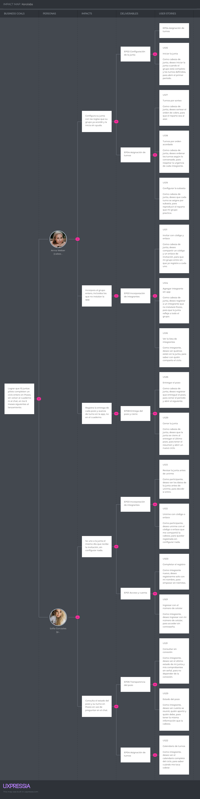{width=100%}

#### Business Goal 02: aportes validados y discrepancias resueltas en la aplicación

El segundo mapa sostiene la hipótesis central de Pozzo: que la validación automática del comprobante reemplace la revisión manual de la cabeza y que toda discrepancia se resuelva con evidencia dentro de la aplicación. Sofia Gonzales debe registrar su aporte con el comprobante apenas transfiere, en lugar de enviar la captura al chat (registro y validación de aportes, con las historias de registrar el aporte y revisar los datos leídos); transferir el monto exacto al destinatario correcto, de modo que el comprobante coincida con lo esperado (validación automática, destino de los aportes y número de Yape o Plin en el perfil); y mostrar su comprobante desde Pozzo cuando alguien cuestione su pago (mis aportes con comprobante y consulta sin conexión). Anna Weber debe revisar únicamente los aportes con alguna inconsistencia y confiar en la validación del resto (revisión de aportes con inconsistencia); registrar en la aplicación los aportes en efectivo y las coberturas para que el registro cuadre con el dinero (aporte en efectivo y cobertura); y consultar el registro de aportes en lugar de reconstruir la cuenta de memoria o pedir capturas (estado del pozo y períodos anteriores).

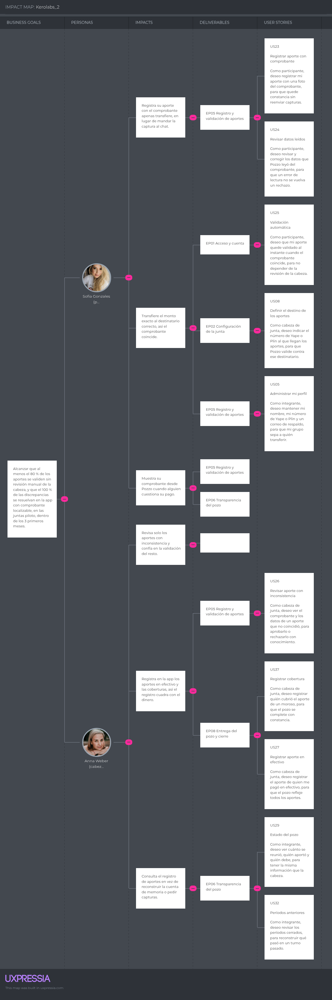{width=100%}

#### Business Goal 03: cero recordatorios manuales

El tercer mapa es el más acotado y apunta al desgaste que las cabezas describieron en las entrevistas: escribirle a dos o tres personas hasta cinco veces por ciclo. De Sofia Gonzales se espera que aporte antes de la fecha de corte al recibir los recordatorios automáticos, sin que la cabeza le escriba (recordatorios y avisos, con los recordatorios escalonados y los avisos de la junta), y que aporte a tiempo porque el grupo entero ve quién debe (transparencia del pozo, con el estado del pozo y el indicador de cuánto falta para quien cobra). De Anna Weber se espera un solo cambio, pero decisivo para el objetivo: que deje que el sistema recuerde los aportes en nombre de la junta y no escriba a nadie por su cuenta (configuración de los recordatorios de la junta).

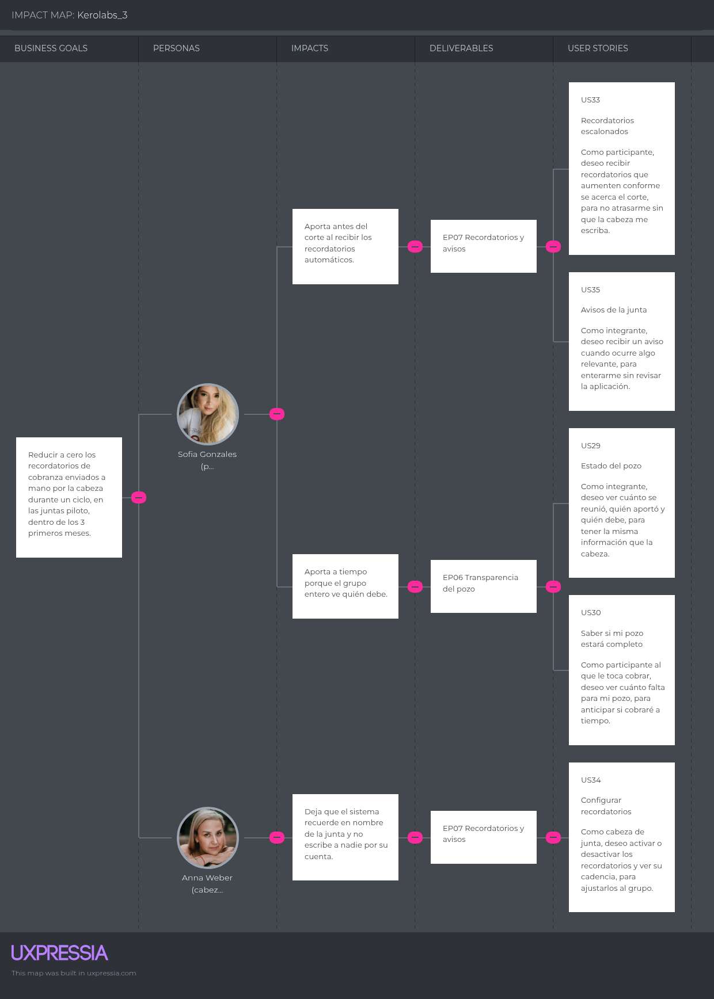{width=100%}

### 2.4.3. Product Backlog

El Product Backlog reúne las 46 User Stories, las 8 Technical Stories y las 3 Spike Stories de la especificación, estimadas en Story Points con la escala 1, 2, 3, 5 y 8 y ordenadas por el valor que aportan al negocio. La estimación la hizo el equipo por consenso, comparando cada historia con una de referencia (crear una junta, US07, en 3 puntos) y considerando la incertidumbre técnica: las historias que dependen de la lectura de comprobantes, de las notificaciones o de los enlaces de invitación cargan puntos adicionales hasta que sus spikes las reduzcan.

El orden sigue el Impact Map: primero lo que permite que una junta exista y complete un ciclo (landing page, creación e invitación, turnos, estado del pozo), luego lo que sostiene la validación automática de aportes, después los recordatorios y el historial, y al final la subasta y las historias que amplían la propuesta. Las historias del landing page van en el primer sprint, como exige el enunciado. La autenticación por SMS no encabeza el backlog: se ubica en el segundo sprint, cuando el flujo principal ya existe y hace falta distinguir a los usuarios.

Los sprints corresponden a las entregas del curso: el Sprint 1 a TB1, el Sprint 2 a AV2 y los Sprints 3 y 4 a TB2.

<table>
  <thead>
    <tr>
      <th align="center"># Orden</th>
      <th>User Story Id</th>
      <th>Título</th>
      <th align="center">Story Points (1 / 2 / 3 / 5 / 8)</th>
      <th align="center">Sprint</th>
    </tr>
  </thead>
  <tbody>
    <tr>
      <td align="center">1</td>
      <td>US43</td>
      <td>Entender qué resuelve Pozzo</td>
      <td align="center">2</td>
      <td align="center">1</td>
    </tr>
    <tr>
      <td align="center">2</td>
      <td>US44</td>
      <td>Acceder a la aplicación desde el landing page</td>
      <td align="center">1</td>
      <td align="center">1</td>
    </tr>
    <tr>
      <td align="center">3</td>
      <td>US46</td>
      <td>Navegar el landing page desde el celular</td>
      <td align="center">2</td>
      <td align="center">1</td>
    </tr>
    <tr>
      <td align="center">4</td>
      <td>US45</td>
      <td>Conocer al equipo y contactarlo</td>
      <td align="center">1</td>
      <td align="center">1</td>
    </tr>
    <tr>
      <td align="center">5</td>
      <td>US07</td>
      <td>Crear una junta</td>
      <td align="center">3</td>
      <td align="center">1</td>
    </tr>
    <tr>
      <td align="center">6</td>
      <td>US08</td>
      <td>Definir el destino de los aportes</td>
      <td align="center">2</td>
      <td align="center">1</td>
    </tr>
    <tr>
      <td align="center">7</td>
      <td>TS02</td>
      <td>Servicio de juntas</td>
      <td align="center">5</td>
      <td align="center">1</td>
    </tr>
    <tr>
      <td align="center">8</td>
      <td>US11</td>
      <td>Invitar integrantes con código y enlace</td>
      <td align="center">3</td>
      <td align="center">1</td>
    </tr>
    <tr>
      <td align="center">9</td>
      <td>US12</td>
      <td>Unirme a una junta con código o enlace</td>
      <td align="center">3</td>
      <td align="center">1</td>
    </tr>
    <tr>
      <td align="center">10</td>
      <td>US13</td>
      <td>Revisar la junta antes de unirme</td>
      <td align="center">2</td>
      <td align="center">1</td>
    </tr>
    <tr>
      <td align="center">11</td>
      <td>TS03</td>
      <td>Servicio de integrantes e invitaciones</td>
      <td align="center">5</td>
      <td align="center">1</td>
    </tr>
    <tr>
      <td align="center">12</td>
      <td>US16</td>
      <td>Ver la lista de integrantes</td>
      <td align="center">2</td>
      <td align="center">1</td>
    </tr>
    <tr>
      <td align="center">13</td>
      <td>US17</td>
      <td>Asignar turnos por sorteo</td>
      <td align="center">2</td>
      <td align="center">1</td>
    </tr>
    <tr>
      <td align="center">14</td>
      <td>US18</td>
      <td>Asignar turnos por orden acordado</td>
      <td align="center">3</td>
      <td align="center">1</td>
    </tr>
    <tr>
      <td align="center">15</td>
      <td>US10</td>
      <td>Iniciar la junta</td>
      <td align="center">3</td>
      <td align="center">1</td>
    </tr>
    <tr>
      <td align="center">16</td>
      <td>US22</td>
      <td>Consultar el calendario de turnos</td>
      <td align="center">3</td>
      <td align="center">1</td>
    </tr>
    <tr>
      <td align="center">17</td>
      <td>US29</td>
      <td>Ver el estado del pozo del período vigente</td>
      <td align="center">5</td>
      <td align="center">1</td>
    </tr>
    <tr>
      <td align="center">18</td>
      <td>SP01</td>
      <td>Investigar la lectura automática de comprobantes de Yape y Plin</td>
      <td align="center">8</td>
      <td align="center">1</td>
    </tr>
    <tr>
      <td align="center">19</td>
      <td>US01</td>
      <td>Ingresar con el número de celular</td>
      <td align="center">2</td>
      <td align="center">2</td>
    </tr>
    <tr>
      <td align="center">20</td>
      <td>US02</td>
      <td>Verificar el código SMS</td>
      <td align="center">2</td>
      <td align="center">2</td>
    </tr>
    <tr>
      <td align="center">21</td>
      <td>US03</td>
      <td>Completar el registro</td>
      <td align="center">2</td>
      <td align="center">2</td>
    </tr>
    <tr>
      <td align="center">22</td>
      <td>TS01</td>
      <td>Servicio de autenticación por SMS</td>
      <td align="center">5</td>
      <td align="center">2</td>
    </tr>
    <tr>
      <td align="center">23</td>
      <td>US04</td>
      <td>Mantener la sesión en el dispositivo</td>
      <td align="center">2</td>
      <td align="center">2</td>
    </tr>
    <tr>
      <td align="center">24</td>
      <td>US23</td>
      <td>Registrar mi aporte con el comprobante</td>
      <td align="center">5</td>
      <td align="center">2</td>
    </tr>
    <tr>
      <td align="center">25</td>
      <td>US24</td>
      <td>Revisar los datos leídos del comprobante</td>
      <td align="center">5</td>
      <td align="center">2</td>
    </tr>
    <tr>
      <td align="center">26</td>
      <td>US25</td>
      <td>Validación automática del aporte</td>
      <td align="center">8</td>
      <td align="center">2</td>
    </tr>
    <tr>
      <td align="center">27</td>
      <td>TS05</td>
      <td>Servicio de aportes y comprobantes</td>
      <td align="center">8</td>
      <td align="center">2</td>
    </tr>
    <tr>
      <td align="center">28</td>
      <td>US26</td>
      <td>Revisar un aporte con inconsistencia</td>
      <td align="center">3</td>
      <td align="center">2</td>
    </tr>
    <tr>
      <td align="center">29</td>
      <td>US27</td>
      <td>Registrar un aporte en efectivo</td>
      <td align="center">2</td>
      <td align="center">2</td>
    </tr>
    <tr>
      <td align="center">30</td>
      <td>US28</td>
      <td>Consultar mis aportes y sus comprobantes</td>
      <td align="center">3</td>
      <td align="center">2</td>
    </tr>
    <tr>
      <td align="center">31</td>
      <td>US30</td>
      <td>Saber si mi pozo estará completo</td>
      <td align="center">2</td>
      <td align="center">2</td>
    </tr>
    <tr>
      <td align="center">32</td>
      <td>US36</td>
      <td>Entregar el pozo y abrir el siguiente turno</td>
      <td align="center">5</td>
      <td align="center">2</td>
    </tr>
    <tr>
      <td align="center">33</td>
      <td>US39</td>
      <td>Cerrar la junta al completar el ciclo</td>
      <td align="center">3</td>
      <td align="center">2</td>
    </tr>
    <tr>
      <td align="center">34</td>
      <td>TS06</td>
      <td>Servicio de entrega del pozo y cierre</td>
      <td align="center">5</td>
      <td align="center">2</td>
    </tr>
    <tr>
      <td align="center">35</td>
      <td>SP02</td>
      <td>Investigar las notificaciones push y la programación de recordatorios</td>
      <td align="center">5</td>
      <td align="center">2</td>
    </tr>
    <tr>
      <td align="center">36</td>
      <td>US33</td>
      <td>Recibir recordatorios escalonados de mi aporte</td>
      <td align="center">5</td>
      <td align="center">3</td>
    </tr>
    <tr>
      <td align="center">37</td>
      <td>US35</td>
      <td>Recibir avisos de los hechos de la junta</td>
      <td align="center">3</td>
      <td align="center">3</td>
    </tr>
    <tr>
      <td align="center">38</td>
      <td>US34</td>
      <td>Configurar los recordatorios de la junta</td>
      <td align="center">2</td>
      <td align="center">3</td>
    </tr>
    <tr>
      <td align="center">39</td>
      <td>TS07</td>
      <td>Servicio de recordatorios y notificaciones</td>
      <td align="center">8</td>
      <td align="center">3</td>
    </tr>
    <tr>
      <td align="center">40</td>
      <td>US14</td>
      <td>Agregar un integrante sin la aplicación</td>
      <td align="center">3</td>
      <td align="center">3</td>
    </tr>
    <tr>
      <td align="center">41</td>
      <td>US15</td>
      <td>Retirar un integrante antes de iniciar</td>
      <td align="center">1</td>
      <td align="center">3</td>
    </tr>
    <tr>
      <td align="center">42</td>
      <td>US09</td>
      <td>Consultar y ajustar las reglas de la junta</td>
      <td align="center">2</td>
      <td align="center">3</td>
    </tr>
    <tr>
      <td align="center">43</td>
      <td>US05</td>
      <td>Administrar mi perfil</td>
      <td align="center">3</td>
      <td align="center">3</td>
    </tr>
    <tr>
      <td align="center">44</td>
      <td>US31</td>
      <td>Consultar la junta sin conexión</td>
      <td align="center">5</td>
      <td align="center">3</td>
    </tr>
    <tr>
      <td align="center">45</td>
      <td>US32</td>
      <td>Consultar períodos anteriores</td>
      <td align="center">2</td>
      <td align="center">3</td>
    </tr>
    <tr>
      <td align="center">46</td>
      <td>US40</td>
      <td>Consultar mi historial de cumplimiento</td>
      <td align="center">3</td>
      <td align="center">3</td>
    </tr>
    <tr>
      <td align="center">47</td>
      <td>US42</td>
      <td>Ver el historial de quien se une a mi junta</td>
      <td align="center">2</td>
      <td align="center">3</td>
    </tr>
    <tr>
      <td align="center">48</td>
      <td>TS08</td>
      <td>Servicio de historial de cumplimiento</td>
      <td align="center">3</td>
      <td align="center">3</td>
    </tr>
    <tr>
      <td align="center">49</td>
      <td>SP03</td>
      <td>Investigar los enlaces de invitación que abren la aplicación</td>
      <td align="center">5</td>
      <td align="center">3</td>
    </tr>
    <tr>
      <td align="center">50</td>
      <td>US19</td>
      <td>Configurar la junta por subasta</td>
      <td align="center">3</td>
      <td align="center">4</td>
    </tr>
    <tr>
      <td align="center">51</td>
      <td>US20</td>
      <td>Ofertar en la subasta del turno</td>
      <td align="center">5</td>
      <td align="center">4</td>
    </tr>
    <tr>
      <td align="center">52</td>
      <td>US21</td>
      <td>Cerrar la subasta y asignar el turno</td>
      <td align="center">5</td>
      <td align="center">4</td>
    </tr>
    <tr>
      <td align="center">53</td>
      <td>TS04</td>
      <td>Servicio de turnos y subastas</td>
      <td align="center">8</td>
      <td align="center">4</td>
    </tr>
    <tr>
      <td align="center">54</td>
      <td>US37</td>
      <td>Registrar la cobertura de un aporte</td>
      <td align="center">3</td>
      <td align="center">4</td>
    </tr>
    <tr>
      <td align="center">55</td>
      <td>US38</td>
      <td>Registrar una deserción y su reemplazo</td>
      <td align="center">3</td>
      <td align="center">4</td>
    </tr>
    <tr>
      <td align="center">56</td>
      <td>US41</td>
      <td>Compartir mi historial</td>
      <td align="center">2</td>
      <td align="center">4</td>
    </tr>
    <tr>
      <td align="center">57</td>
      <td>US06</td>
      <td>Elegir el tema visual</td>
      <td align="center">1</td>
      <td align="center">4</td>
    </tr>
  </tbody>
</table>

El total es de 199 Story Points: 55 en el Sprint 1, 67 en el Sprint 2, 47 en el Sprint 3 y 30 en el Sprint 4. Los dos primeros sprints concentran la carga porque en ellos se construye el ciclo completo de la junta y la validación de aportes, que son las dos hipótesis con mayor valor; el cuarto sprint queda deliberadamente liviano para absorber lo que se desplace de los anteriores y para las validaciones con usuarios.

El backlog se administra en Trello, en un tablero público con una lista por sprint: <https://trello.com/b/fRocSVZA/pozzo-product-backlog>. Cada historia es una tarjeta con su código, título y Story Points, en el mismo orden de esta tabla, y su descripción reproduce la historia y los criterios de aceptación para que el equipo trabaje desde el tablero sin volver al informe. La captura del tablero se incluye en el Anexo A, Product Backlog en Trello.

## 2.5. Strategic-Level Domain-Driven Design

En esta sección se explica el proceso que siguió el equipo para tomar las decisiones de nivel estratégico de Domain-Driven Design [@evans2003ddd]: descomponer el dominio de las juntas de ahorro en subconjuntos con límites naturales, los Bounded Contexts, y definir cómo se relacionan entre sí antes de diseñar una sola clase o tabla. El enfoque aplica a todos los productos de la solución. En Pozzo esos productos son la aplicación móvil, los servicios RESTful de desarrollo propio que la sostienen y el landing page estático; el diseño estratégico se concentra en los dos primeros, que son los que implementan el dominio, mientras que el landing page solo aparece como un producto más en la arquitectura de software.

El punto de partida fue el Big Picture EventStorming del Needfinding, que describe cómo funciona hoy una junta sin Pozzo, y el Ubiquitous Language consolidado a partir de él. Sobre esa base, y con las User Stories ya especificadas, el equipo repitió el EventStorming con un objetivo distinto: ya no explorar el negocio, sino modelar la solución con el mayor detalle posible, incorporando los comandos, políticas, agregados y vistas de lectura que la aplicación necesita para que una junta complete su ciclo, desde su creación y la incorporación de los integrantes hasta el registro y validación de aportes, la entrega del pozo y el cierre [@brandolini2021eventstorming]. La sesión se limitó a dos horas y se realizó en Miro; el tablero completo, con todos los artefactos de esta sección, se enlaza en el Anexo B, Tablero de Miro del diseño estratégico.

A partir de ese EventStorm de nivel de diseño, el equipo identificó los Bounded Contexts candidatos en una sesión de Candidate Context Discovery. Se combinaron dos técnicas: start-with-value, para aislar primero la parte del dominio que sostiene la hipótesis principal de Pozzo, la validación de aportes contra comprobantes, y look-for-pivotal-events, para reconocer los eventos que marcan un cambio de estado en la junta (junta iniciada, aporte validado, pozo entregado, ciclo cerrado) y usarlos como fronteras entre contextos. Con los contextos candidatos definidos, se modeló con Domain Storytelling cómo colaboran para resolver los casos de uso de la cabeza de junta y del participante [@hofer2021domainstorytelling], y se elaboró un Bounded Context Canvas por cada contexto, en orden de importancia, siguiendo el proceso iterativo de definición del contexto, destilación de reglas de negocio y captura del Ubiquitous Language, análisis de capabilities, captura de dependencias y crítica del diseño.

Tres criterios guiaron esas decisiones a lo largo de todo el proceso. Primero, el contexto core, el que concentra la validación de aportes y la transparencia del pozo, debía quedar aislado de los subdominios de apoyo y genéricos, como el acceso con número de celular o el envío de recordatorios, para que la lógica que diferencia a Pozzo de sus competidores no dependa de decisiones tomadas en otros contextos. Segundo, cada contexto debía tener su propio modelo y su propio lenguaje: el mismo término, integrante o aporte, puede significar cosas distintas en el contexto que administra la junta y en el que registra los pagos, y esa diferencia se hace explícita en lugar de resolverse con un modelo único. Tercero, las relaciones entre contextos debían expresarse con los patrones de Context Mapping de Domain-Driven Design (Customer/Supplier, Conformist, Anti-corruption Layer, Shared Kernel), discutiendo alternativas antes de fijar el mapa definitivo.

La sección cierra con la arquitectura de software de la solución, representada con el C4 Model en Structurizr [@brown2018c4], en sus niveles de contexto, contenedores y despliegue. Cada Bounded Context se refleja en esos diagramas, y el diseño táctico de cada uno se desarrolla en la sección Tactical-Level Domain-Driven Design.

### 2.5.1. EventStorming

La sesión de EventStorming de nivel de diseño se realizó en Miro con los cinco integrantes del equipo y duró dos horas. A diferencia del Big Picture, que describía cómo funciona hoy una junta sin Pozzo, esta sesión modeló cómo va a funcionar con Pozzo: qué comandos ejecuta cada actor desde la aplicación, qué agregado los recibe, qué eventos producen, qué políticas reaccionan a esos eventos, qué vistas consulta el usuario para decidir y con qué sistemas externos se conversa. Las User Stories sirvieron de guion: cada historia se tradujo en al menos un comando y en los eventos que su criterio de aceptación describe en la cláusula "Entonces".

Se usó la notación habitual de Brandolini con un color por concepto: actor, comando, agregado, evento de dominio, política, vista (read model), sistema externo y hotspot. Los eventos se escribieron en pasado, los comandos en infinitivo y las políticas con la forma "cuando ocurre X, entonces Y". Los eventos pivotales, los que cambian el estado de la junta, se marcaron en negrita.

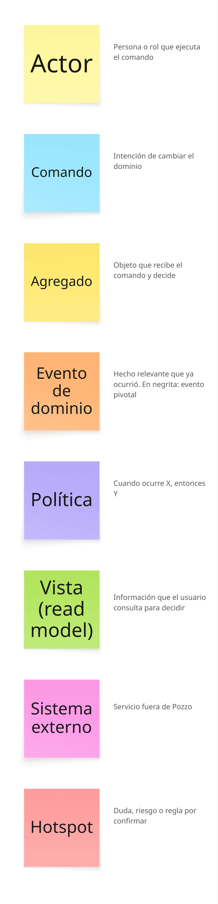

Para que el resultado se pueda leer, el tablero se organizó en columnas y carriles. Cada columna es un paso del proceso y cada carril un tipo de nota, de modo que una columna se lee de arriba abajo como una frase: tal actor ejecuta tal comando sobre tal agregado y se produce tal evento, que dispara tal política. La sesión recorrió el ciclo de una junta en cuatro tramos.

#### Acceso a Pozzo

El primer tramo cubre la entrada de un integrante a la aplicación. Se identificó un único agregado, Cuenta, que recibe los comandos de solicitar y verificar el código SMS, completar el registro y administrar el perfil, y un agregado Sesión para el token que la aplicación guarda en el dispositivo. Dos políticas conectan este tramo con el resto: si el celular es nuevo se pide el registro, y al iniciar sesión se registra el dispositivo para recibir avisos. Los hotspots recogieron el vencimiento del código, los reintentos y la sesión en dos dispositivos a la vez.

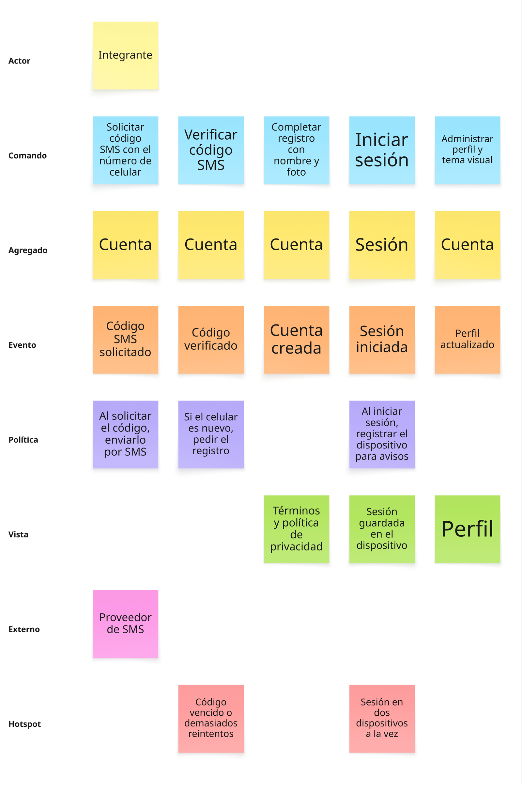

#### Configuración de la junta, integrantes y turnos

El segundo tramo va desde que la cabeza crea la junta hasta que la inicia. El agregado Junta concentra las reglas (aporte, periodicidad, cupos, fecha de corte y destino de los aportes), la lista de integrantes y los turnos; Invitación y Subasta aparecen como agregados propios porque tienen ciclo de vida independiente. El evento pivotal es Junta iniciada: a partir de él las reglas quedan bloqueadas, el código de invitación caduca y una política abre el primer período de aporte. Los hotspots de este tramo son decisiones que el prototipo dejó abiertas: si el destino de los aportes es la cuenta de la cabeza o la del integrante del turno, cómo se verifica ante el grupo que el sorteo fue justo y qué pasa con un empate en la subasta.

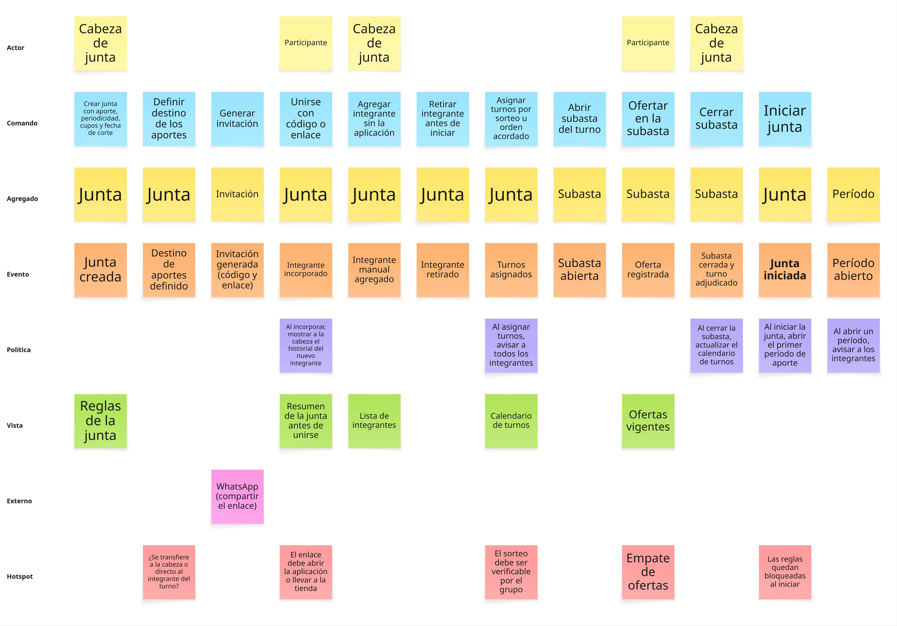

#### Registro y validación de aportes

El tercer tramo es el núcleo de Pozzo. Al abrir un período, una política calcula el aporte esperado de cada integrante; antes de la fecha de corte, otra envía recordatorios escalonados a quien no ha aportado. El participante registra su aporte con la captura del comprobante, ML Kit lee en el dispositivo el monto, la fecha, el destinatario y el número de operación, y el participante confirma esos datos. El agregado Aporte los valida contra lo esperado y produce el evento pivotal Aporte validado o, si algo no cuadra, Inconsistencia detectada, que pide a la cabeza aprobar o rechazar. Los aportes en efectivo los registra solo la cabeza, porque no tienen comprobante. Cuando todos los aportes del período están validados, el pozo está completo. Los hotspots más discutidos fueron la captura borrosa o recortada, el comprobante reutilizado en dos aportes y el hecho de que la entrega del push no está garantizada.

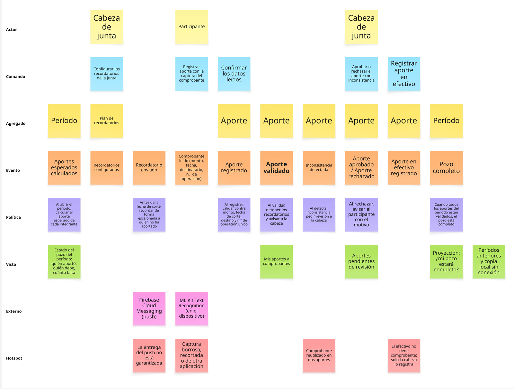

#### Entrega del pozo, cierre del ciclo e historial

El último tramo cubre las excepciones y el cierre. La cobertura de un aporte completa el pozo pero no borra la morosidad, y deja registrada la deuda del moroso con quien cubrió; la deserción incorpora un reemplazo que hereda el turno pendiente. Pozo entregado es el tercer evento pivotal: la transferencia ocurre fuera de Pozzo, por Yape, Plin o el banco, y la aplicación registra el hecho, avisa al grupo y abre el siguiente período. Tras el último turno, Ciclo cerrado cierra la junta. Una política transversal actualiza el historial de cumplimiento de cada integrante con cada aporte validado, cubierto, deserción o cierre, y el integrante puede compartirlo con la hoja de compartir del sistema. Este tramo también recoge el agregado Dispositivo y la política que envía un aviso en cada hecho relevante de la junta.

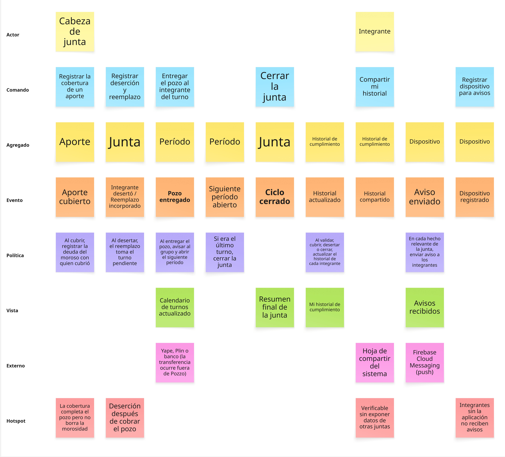

#### 2.5.1.1. Candidate Context Discovery

Con el EventStorm completo, el equipo dedicó una segunda sesión de dos horas a identificar los Bounded Contexts candidatos. Se trabajó solo con los eventos de dominio, que se copiaron a una zona aparte del tablero para poder reordenarlos sin perder la línea de tiempo original, y se aplicaron tres técnicas en secuencia.

**Paso 1: look-for-pivotal-events.** Se marcaron los cuatro eventos que cambian el estado de la junta y que ya se habían resaltado durante el EventStorming: Junta iniciada, Aporte validado, Pozo entregado y Ciclo cerrado. Cada uno separa fases con reglas distintas. Antes de Junta iniciada todo puede cambiar; después, las reglas se congelan. Aporte validado convierte una intención de pago en un hecho que cuenta para el pozo y para el historial. Pozo entregado marca el momento en que el dinero sale del proceso y arranca el siguiente turno. Ciclo cerrado deja a la junta como un registro cerrado del que solo queda el historial.

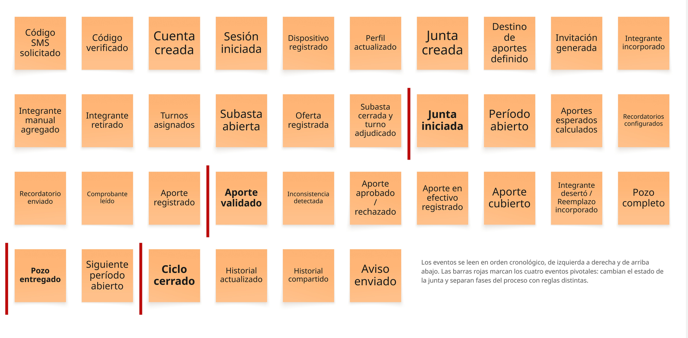

**Paso 2: start-with-simple.** Con los pivotales como cortes, la línea de tiempo se dividió en cinco segmentos secuenciales: antes de iniciar la junta; período abierto y registro; validación y completitud del pozo; entrega y siguiente turno; cierre e historial. Este paso hizo visible que el segundo, el tercero y el cuarto segmento se repiten por cada turno de la junta, mientras que el primero y el último ocurren una sola vez por ciclo, y que los eventos de acceso (código SMS, cuenta, sesión) y los de avisos (recordatorios, avisos) no pertenecen a ningún segmento en particular: aparecen en todos.

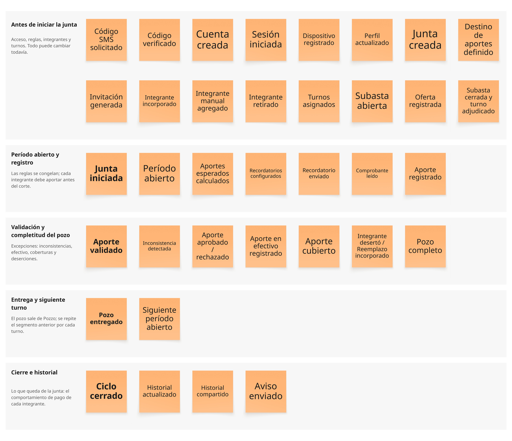

**Paso 3: start-with-value.** Por último se preguntó qué parte del dominio sostiene la hipótesis principal de Pozzo. La respuesta fue la validación de aportes y la transparencia del pozo: es lo que ningún competidor hace y lo que las entrevistas señalaron como el mayor punto de fricción. Los eventos de los segmentos que se repiten por turno, desde Período abierto hasta Ciclo cerrado, se agruparon como el contexto core, Contributions. El resto se regrupó por afinidad: lo que ocurre antes de iniciar la junta, incluidos los turnos y las deserciones, formó Savings Groups; los eventos transversales de acceso formaron Identity & Access; los de recordatorios y avisos, Notifications; y los dos eventos del historial, Compliance History.

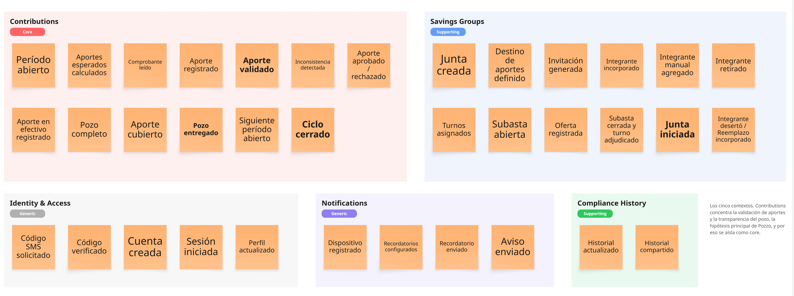

El resultado son cinco Bounded Contexts, uno por integrante del equipo, clasificados según el valor que aportan al negocio.

<table>
  <thead>
    <tr>
      <th>Bounded Context</th>
      <th>Tipo de subdominio</th>
      <th>Epics que cubre</th>
      <th>Eventos pivotales</th>
    </tr>
  </thead>
  <tbody>
    <tr>
      <td><b>Contributions</b></td>
      <td>Core</td>
      <td>EP05 Registro y validación de aportes, EP06 Transparencia del pozo, EP08 Entrega del pozo y cierre del ciclo</td>
      <td>Aporte validado, Pozo entregado, Ciclo cerrado</td>
    </tr>
    <tr>
      <td><b>Savings Groups</b></td>
      <td>Supporting</td>
      <td>EP02 Configuración de la junta, EP03 Incorporación de integrantes, EP04 Asignación de turnos</td>
      <td>Junta iniciada</td>
    </tr>
    <tr>
      <td><b>Compliance History</b></td>
      <td>Supporting</td>
      <td>EP09 Historial de cumplimiento</td>
      <td>Ninguno; reacciona a los del core</td>
    </tr>
    <tr>
      <td><b>Notifications</b></td>
      <td>Generic</td>
      <td>EP07 Recordatorios y avisos</td>
      <td>Ninguno; reacciona a los demás</td>
    </tr>
    <tr>
      <td><b>Identity &amp; Access</b></td>
      <td>Generic</td>
      <td>EP01 Acceso y cuenta</td>
      <td>Ninguno</td>
    </tr>
  </tbody>
</table>

Durante el paso 3 se discutió si los turnos y la subasta merecían un contexto propio y si el historial debía quedarse dentro de Contributions. Ambas alternativas se descartaron y las razones se recogen en el Context Mapping.

#### 2.5.1.2. Domain Message Flows Modeling

Para comprobar que los cinco contextos podían resolver los casos de uso sin depender unos de otros más de lo necesario, el equipo modeló con Domain Storytelling las tres historias que concentran el valor de Pozzo. En cada diagrama los actores son círculos, los objetos de trabajo son rectángulos coloreados según el contexto al que pertenecen, las zonas de fondo delimitan los Bounded Contexts y cada flecha lleva el número del paso, de modo que la historia se lee siguiendo la numeración.

**Historia 1: la cabeza crea la junta e incorpora a los integrantes.** La cabeza crea la junta con sus reglas y genera una invitación en Savings Groups, la comparte por WhatsApp y el participante que recibe el enlace verifica su celular en Identity & Access antes de unirse. Al incorporarlo, Savings Groups consulta a Compliance History el historial del nuevo integrante y se lo muestra a la cabeza. Con los turnos asignados, la cabeza inicia la junta y Notifications avisa a todos. La historia muestra que Savings Groups es el contexto que orquesta esta fase y que solo necesita de los demás una consulta (el historial) y una identidad.

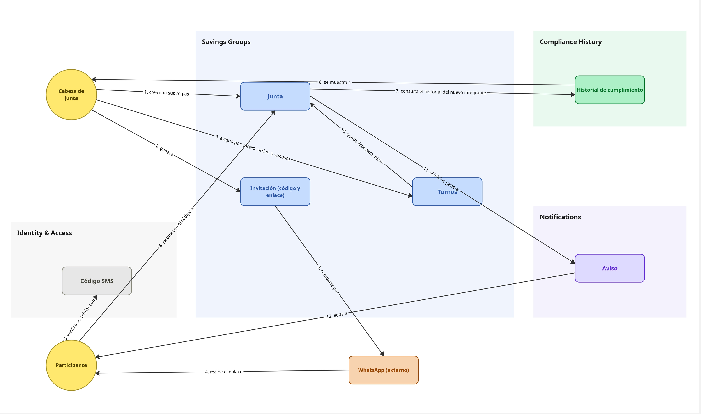

**Historia 2: el participante registra su aporte y Pozzo lo valida.** Antes de la fecha de corte, el período vigente pide a Notifications un recordatorio para el participante. Este transfiere en Yape o Plin, captura el comprobante y ML Kit lo lee en el dispositivo; el participante confirma los datos y registra el aporte en Contributions, que lo valida contra el aporte esperado y actualiza el estado del pozo. La cabeza consulta ese estado y solo interviene si hay una inconsistencia. El aporte validado se registra en Compliance History. La historia confirma que el core no depende de Savings Groups en tiempo de ejecución: las reglas se copiaron al período cuando se abrió.

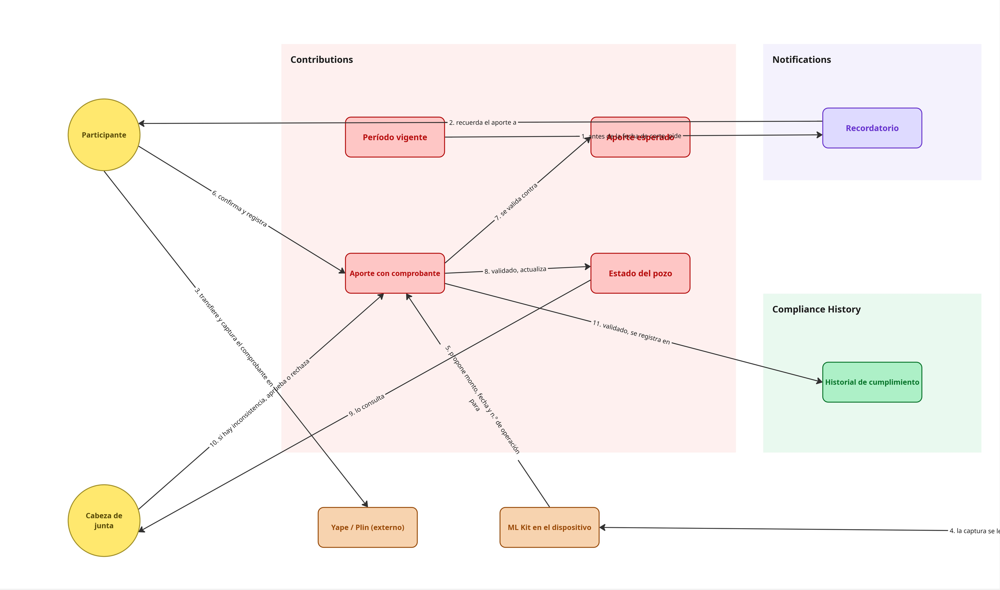

**Historia 3: la cabeza entrega el pozo y cierra el ciclo.** Cuando el estado del pozo muestra el pozo completo, la cabeza transfiere fuera de Pozzo al participante del turno y registra la entrega en Contributions, que consulta el calendario de turnos en Savings Groups para abrir el siguiente período y pide a Notifications que avise al grupo. Tras el último turno la cabeza cierra la junta y Compliance History consolida el historial de todos. Esta historia expuso la única dependencia del core hacia Savings Groups, la consulta del siguiente turno, que se resolvió en el Context Map con una relación Customer/Supplier.

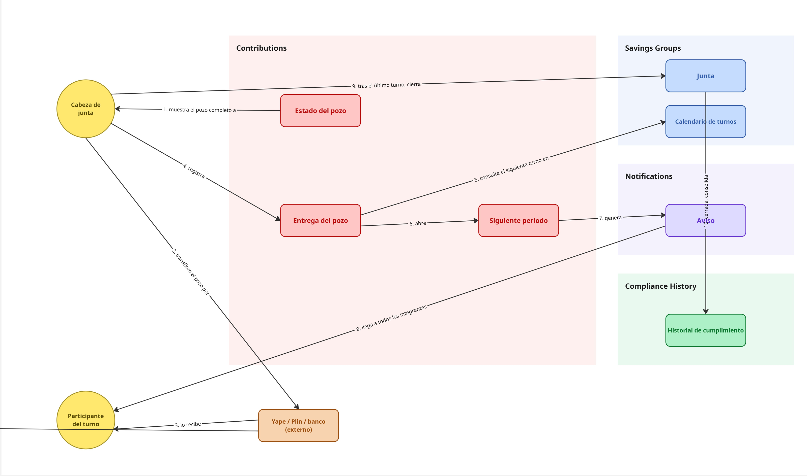

#### 2.5.1.3. Bounded Context Canvases

Con los contextos validados por las historias, el equipo elaboró un Bounded Context Canvas por cada uno, en orden de importancia: Contributions, Savings Groups, Compliance History, Notifications e Identity & Access. Se siguió el proceso iterativo del canvas: primero la definición del contexto (nombre y propósito en una frase) y su clasificación estratégica en tres dimensiones, tipo de subdominio, modelo de negocio al que sirve y grado de evolución; luego la destilación de reglas de negocio y la captura del lenguaje ubicuo propio del contexto; después el análisis de capabilities, expresado como la comunicación entrante (comandos, consultas y eventos que recibe, y de quién) y la saliente (eventos que publica y quién los consume); y por último los supuestos, las métricas con las que se verificará que el contexto cumple su propósito y las preguntas abiertas. Cada canvas se sometió a una crítica de diseño en la que otro integrante buscó reglas que pertenecieran a otro contexto o dependencias que no aparecieran en las historias.

**Contributions.** Es el core y el único contexto con modelo de negocio de engagement directo: si la validación funciona, la junta completa su ciclo en Pozzo. Sus reglas más importantes son las de validación (monto acordado, fecha dentro del corte, destinatario correcto y número de operación único en la junta) y la de completitud del pozo. Publica nueve eventos que consumen Notifications y Compliance History, y solo hace consultas a Savings Groups. La métrica principal es el porcentaje de aportes validados sin revisión de la cabeza, con una meta del 80 %.

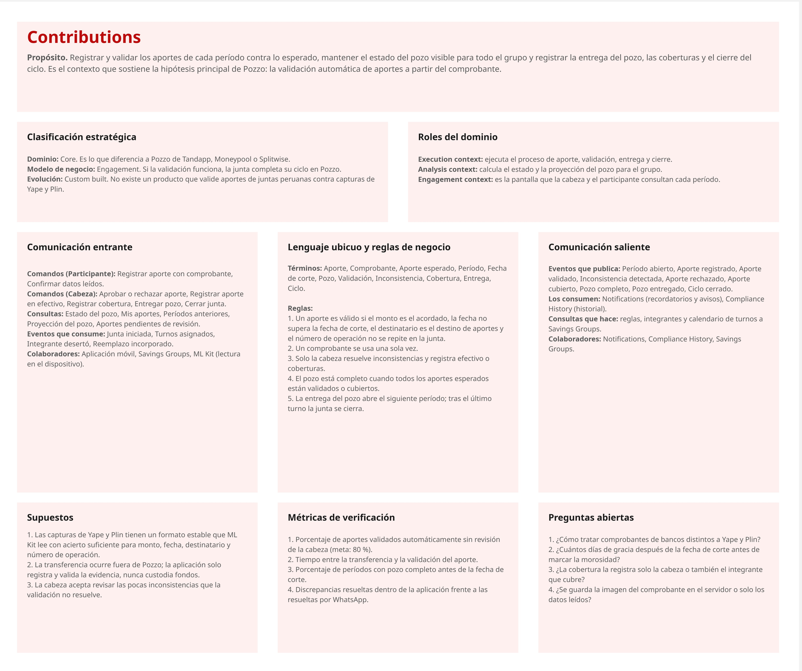

**Savings Groups.** Contexto de soporte con rol de especificación: fija las reglas que Contributions ejecuta. Sus reglas de negocio son las condiciones para iniciar la junta (cupos cubiertos y turnos asignados), el bloqueo de reglas al iniciar, el tratamiento del integrante sin la aplicación y la resolución de la subasta. Es el contexto con más comandos entrantes, todos de la cabeza salvo unirse y ofertar.

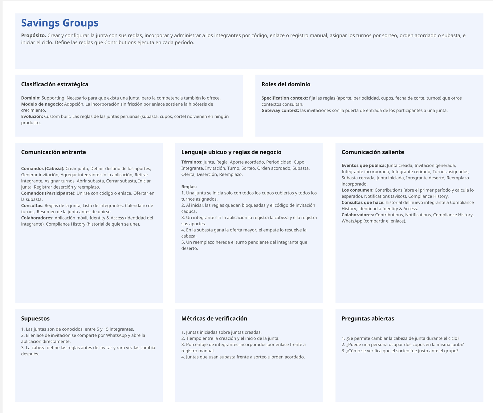

**Compliance History.** Contexto de análisis: un modelo de lectura derivado de los eventos del core y de Savings Groups. Sus reglas protegen la privacidad, porque el historial se muestra agregado, sin montos ni nombres de otras juntas, y la verificabilidad, porque compartirlo genera un enlace con vigencia limitada. La crítica de diseño confirmó que ninguna regla de este contexto modifica una junta, lo que justifica mantenerlo separado del core.

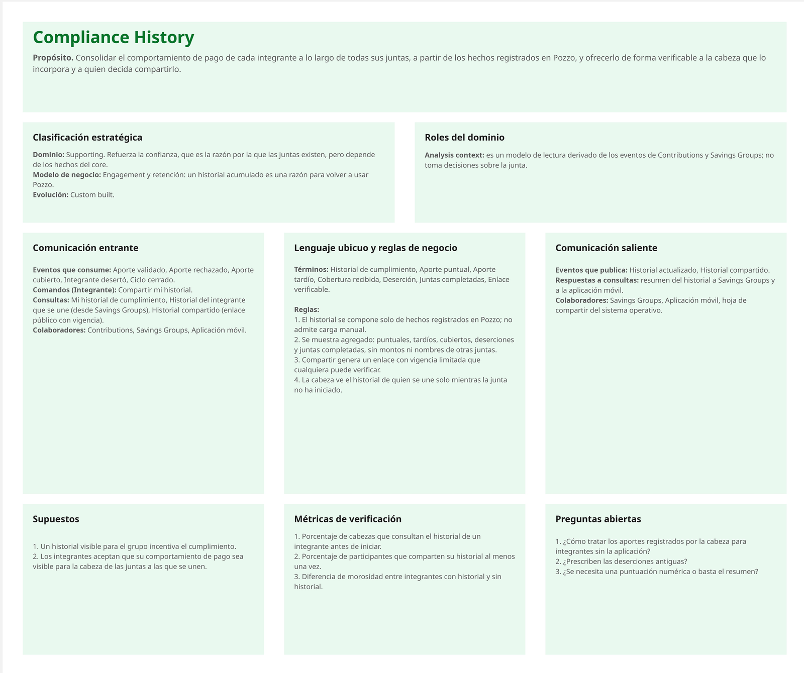

**Notifications.** Contexto genérico que reacciona a los eventos de los demás. Lo específico de Pozzo está en su política de escalonamiento (tres días, un día y el mismo día de la fecha de corte, solo a quien tiene aporte pendiente) y en la regla de detener los recordatorios al validar el aporte. Es el único contexto que conoce a Firebase Cloud Messaging. Una de sus preguntas abiertas, programador de tareas o cola con retardo, corresponde a una Spike Story ya planificada.

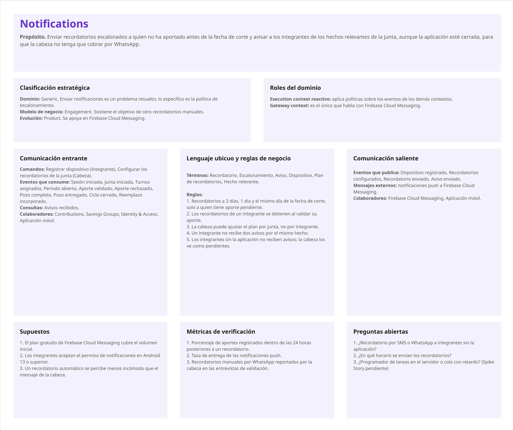

**Identity & Access.** Contexto genérico y commodity: la verificación por SMS se contrata a un proveedor. Sus reglas son las de cualquier acceso sin contraseña (un celular por cuenta, código de seis dígitos con vigencia y reintentos limitados, sesión persistente en el dispositivo). Provee la identidad que los demás contextos usan para referirse a un integrante y el token que autoriza cada solicitud a los servicios RESTful.

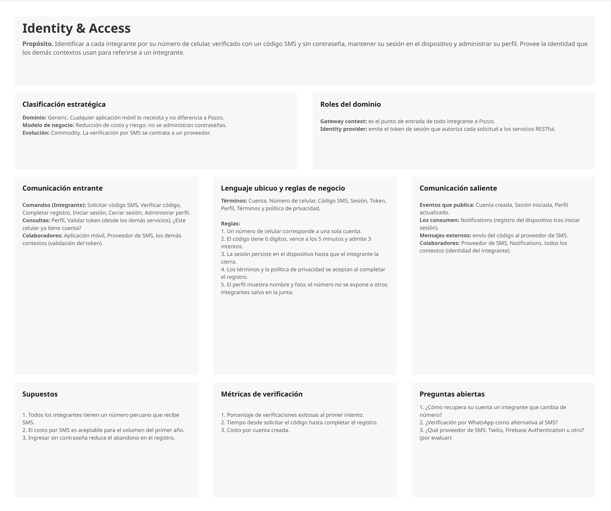

### 2.5.2. Context Mapping

El Context Map define cómo se relacionan los cinco Bounded Contexts y, en particular, quién se adapta a quién cuando dos contextos necesitan comunicarse. Antes de fijarlo, el equipo discutió cuatro alternativas de partición, siguiendo las preguntas que propone el proceso de Context Mapping: qué pasaría si se unen dos contextos, si se parte uno, si se mueve una capability a otro contexto o si se crea un shared service.

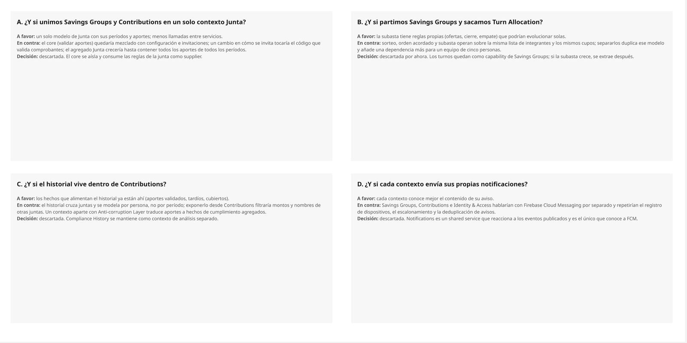

La primera alternativa, unir Savings Groups y Contributions en un solo contexto Junta, simplificaría las llamadas entre servicios pero mezclaría el core con la configuración y las invitaciones, y dejaría un agregado Junta que crecería con todos los aportes de todos los períodos; se descartó para mantener el core aislado. La segunda, extraer los turnos y la subasta a un contexto Turn Allocation, se descartó porque los tres métodos de reparto operan sobre la misma lista de integrantes y los mismos cupos, y separarlos duplicaría ese modelo para un equipo de cinco personas; si la subasta crece, se extraerá después. La tercera, dejar el historial dentro de Contributions, se descartó porque el historial cruza juntas y se modela por persona, no por período, y exponerlo desde el core filtraría montos y nombres de otras juntas. La cuarta, que cada contexto envíe sus propias notificaciones, se descartó porque tres contextos hablarían con Firebase Cloud Messaging y repetirían el registro de dispositivos, el escalonamiento y la deduplicación; Notifications quedó como un shared service que reacciona a los eventos publicados.

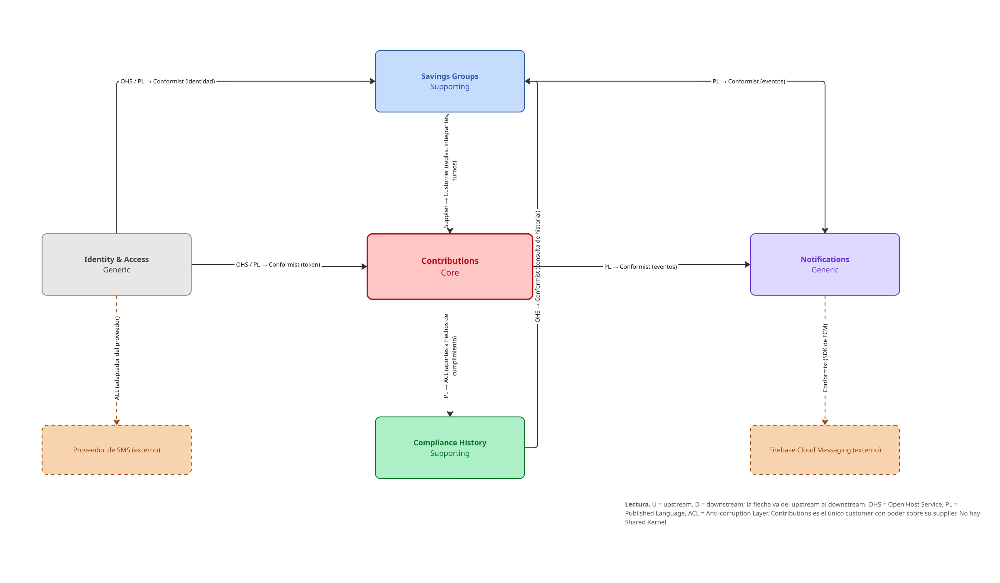

El mapa definitivo usa cuatro de los patrones de relación de Domain-Driven Design. En cada relación la flecha va del contexto upstream (U) al downstream (D).

<table>
  <thead>
    <tr>
      <th>Upstream</th>
      <th>Downstream</th>
      <th>Patrón</th>
      <th>Qué se intercambia</th>
    </tr>
  </thead>
  <tbody>
    <tr>
      <td>Savings Groups</td>
      <td>Contributions</td>
      <td>Customer/Supplier</td>
      <td>Reglas de la junta, integrantes y calendario de turnos. Contributions, como customer y core, define el contrato que Savings Groups debe cumplir.</td>
    </tr>
    <tr>
      <td>Contributions</td>
      <td>Notifications</td>
      <td>Published Language / Conformist</td>
      <td>Eventos Período abierto, Aporte validado, Aporte rechazado, Pozo completo, Pozo entregado y Ciclo cerrado. Notifications se conforma al esquema de los eventos.</td>
    </tr>
    <tr>
      <td>Contributions</td>
      <td>Compliance History</td>
      <td>Published Language / Anti-corruption Layer</td>
      <td>Los mismos eventos, traducidos por una capa anticorrupción a hechos de cumplimiento por persona (puntual, tardío, cubierto).</td>
    </tr>
    <tr>
      <td>Savings Groups</td>
      <td>Notifications</td>
      <td>Published Language / Conformist</td>
      <td>Eventos Junta iniciada, Turnos asignados y Reemplazo incorporado.</td>
    </tr>
    <tr>
      <td>Compliance History</td>
      <td>Savings Groups</td>
      <td>Open Host Service / Conformist</td>
      <td>Consulta del historial del integrante que se une, expuesta como servicio con un contrato público.</td>
    </tr>
    <tr>
      <td>Identity &amp; Access</td>
      <td>Savings Groups, Contributions</td>
      <td>Open Host Service / Published Language / Conformist</td>
      <td>Identidad del integrante y validación del token de sesión. Notifications no depende de este contexto: el registro del dispositivo lo pide la aplicación móvil después de iniciar sesión.</td>
    </tr>
    <tr>
      <td>Identity &amp; Access</td>
      <td>Proveedor de SMS</td>
      <td>Anti-corruption Layer</td>
      <td>Un adaptador aísla al contexto del proveedor elegido, que podrá cambiarse sin tocar las reglas de acceso.</td>
    </tr>
    <tr>
      <td>Notifications</td>
      <td>Firebase Cloud Messaging</td>
      <td>Conformist</td>
      <td>Notifications usa el SDK de FCM tal como viene; no tiene sentido traducir un servicio que no va a cambiar.</td>
    </tr>
  </tbody>
</table>

No se usa Shared Kernel: ningún contexto comparte código de dominio con otro. Cada uno tiene su propio modelo de integrante, por ejemplo, y los datos que necesita de otro contexto le llegan por eventos o por consultas con un contrato explícito. Esta decisión es la que permite que los cinco integrantes del equipo trabajen cada uno en un contexto sin bloquearse.

### 2.5.3. Software Architecture

La arquitectura de software de Pozzo se representa con el C4 Model [@brown2018c4], que describe un sistema en niveles de abstracción sucesivos: el contexto, que muestra al sistema como una caja rodeada de sus usuarios y de los sistemas externos con los que conversa; los contenedores, que descomponen el sistema en las unidades que se ejecutan o almacenan datos por separado y fijan la tecnología de cada una; los componentes, que abren cada contenedor en sus bloques internos; y el código. Esta sección presenta los tres primeros niveles para la solución completa: la aplicación móvil, los servicios RESTful de desarrollo propio y el landing page, más un diagrama de despliegue que ubica cada contenedor en la infraestructura donde corre. Los diagramas de componentes se presentan por Bounded Context en la sección Tactical-Level Domain-Driven Design. Todos se describen en el lenguaje de Structurizr, en el archivo `docs/architecture/workspace.dsl` del repositorio, y se renderizan con Structurizr, de modo que la arquitectura se versiona y se revisa junto con el texto del informe.

#### 2.5.3.1. Software Architecture Context Level Diagrams

El diagrama de contexto representa la visión de más alto nivel de Pozzo. Establece las fronteras del sistema y muestra las relaciones con los actores humanos (cabeza de junta, participante y visitante) y los ecosistemas externos que habilitan la operación del servicio.

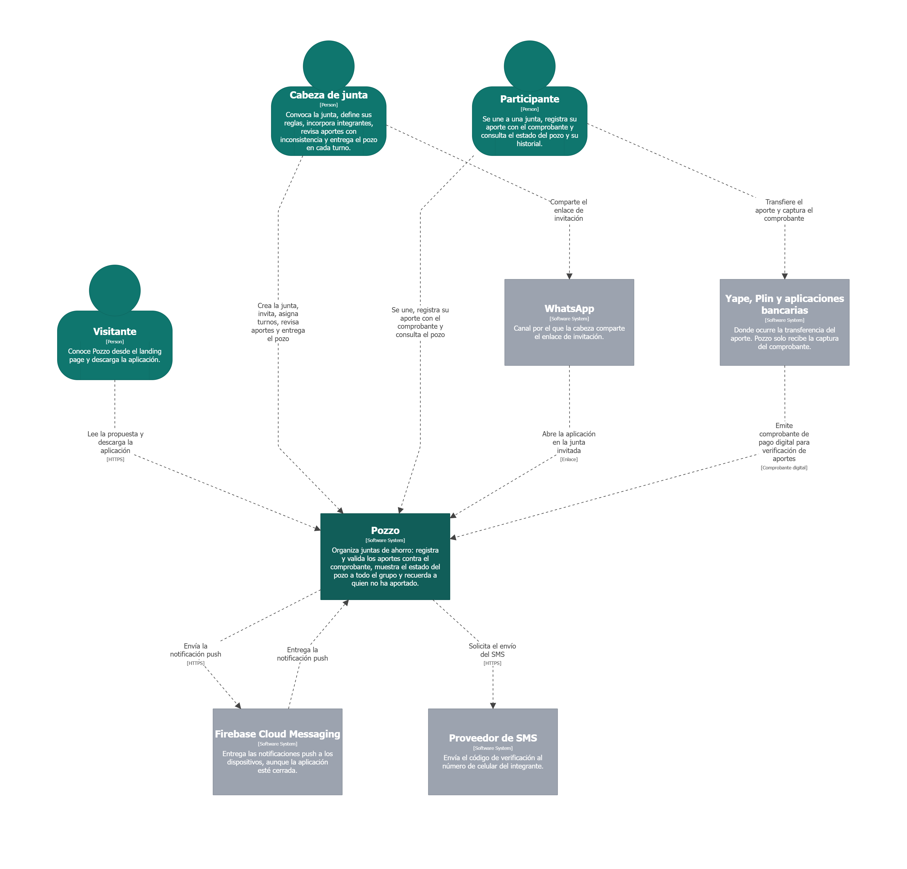

#### 2.5.3.2. Software Architecture Container Level Diagrams

El diagrama de contenedores descompone el sistema Pozzo en sus unidades de software ejecutables y de almacenamiento de datos, definiendo la tecnología empleada por cada contenedor y los límites de comunicación entre ellos.

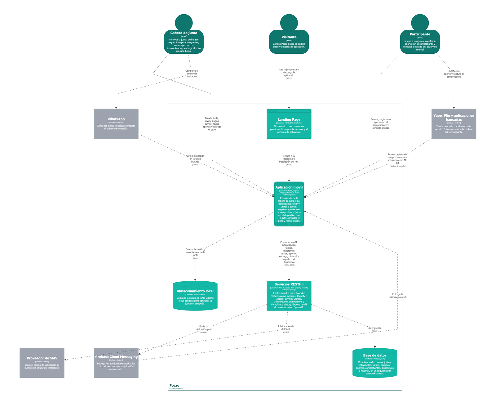

#### 2.5.3.3. Software Architecture Deployment Diagrams

El diagrama de despliegue mapea los contenedores de software sobre los nodos de infraestructura física y en la nube en el entorno de producción, detallando los entornos de ejecución, la distribución de componentes y los mecanismos de conectividad.

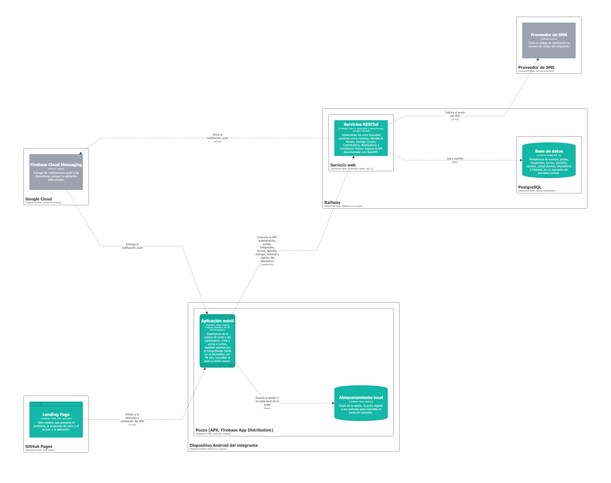

## 2.6. Tactical-Level Domain-Driven Design

En esta sección el equipo baja del mapa de contextos al diseño de las clases que implementan cada Bounded Context. Los cinco contextos se presentan en el mismo orden de importancia de los Bounded Context Canvases: Contributions, Savings Groups, Compliance History, Notifications e Identity and Access. Para cada uno se sigue la misma estructura de cuatro capas, la que adopta el monolito modular de los servicios RESTful: Domain Layer con el modelo y las reglas, Interface Layer con los controllers REST, Application Layer con los command services, query services y event handlers, e Infrastructure Layer con las implementaciones de repositorios y los adaptadores a servicios externos. Cada contexto vive en su propio paquete Java, `pe.kerolabs.pozzo.<contexto>`, con un subpaquete por capa, y en su propio esquema de PostgreSQL.

Las clases se derivan directamente de los artefactos anteriores: cada comando del EventStorming es un command en el Domain Layer y un método `handle` en un command service; cada agregado es un aggregate root; cada evento de dominio es una clase de evento que se publica al confirmar la transacción y que los event handlers del propio contexto o de otros consumen; cada vista es una query y un query service; y las reglas de negocio de los canvases son métodos de los agregados o de un domain service. Los diagramas de clases y de base de datos se elaboraron en PlantUML a partir de los archivos de `docs/architecture/uml/` y `docs/architecture/db/`, donde cada esquema tiene además su DDL de PostgreSQL, y los diagramas de componentes en Structurizr a partir de `docs/architecture/workspace.dsl`, de modo que los tres se versionan junto con el informe y se regeneran con un comando.

### 2.6.1. Bounded Context: Contributions

Contributions es el contexto core. Registra y valida los aportes de cada período contra lo esperado, mantiene el estado del pozo, registra su entrega y cierra el ciclo. Su modelo gira en torno a tres agregados. **Cycle** es la copia congelada de la junta que Contributions necesita para operar: las reglas (aporte, periodicidad, fecha de corte, destino), el orden de turnos y el turno en curso; se crea al recibir el evento Junta iniciada de Savings Groups y desde entonces no depende de ese contexto en tiempo de ejecución. **Period** representa un turno del ciclo: sabe cuánto espera de cada integrante, quién cobra y si el pozo está completo. **Contribution** es un aporte registrado por un integrante, con el comprobante leído en el dispositivo, el resultado de su validación y, cuando corresponde, la revisión de la cabeza. Se separaron Period y Contribution en dos agregados porque tienen ciclos de vida y ritmos de cambio distintos: un período cambia pocas veces (se abre, se completa, se entrega), mientras que los aportes se registran, validan y revisan de forma independiente y concurrente.

#### 2.6.1.1. Domain Layer

<table>
  <colgroup><col width="26%"><col width="16%"><col width="26%"><col width="32%"></colgroup>
  <thead>
    <tr>
      <th>Clase</th>
      <th>Tipo</th>
      <th>Propósito</th>
      <th>Atributos y métodos principales</th>
    </tr>
  </thead>
  <tbody>
    <tr>
      <td><b>Cycle</b></td>
      <td>Aggregate Root</td>
      <td>Copia de la junta iniciada con la que Contributions opera: reglas, turnos y turno en curso. Abre los períodos y decide cuándo el ciclo termina.</td>
      <td>id, groupId, rules, turns, currentTurn, status, startedAt, closedAt. start(groupId, rules, turns), openFirstPeriod(), openNextPeriod(), replaceMember(dropped, replacement), hasRemainingTurns(), close(), payoutMemberForTurn(turn).</td>
    </tr>
    <tr>
      <td><b>Period</b></td>
      <td>Aggregate Root</td>
      <td>Un turno del ciclo. Calcula lo esperado de cada integrante al abrirse, registra qué aportes ya están cubiertos y determina cuándo el pozo está completo y cuándo se entregó.</td>
      <td>id, cycleId, turnNumber, opensAt, cutoffDate, payoutMemberId, expected, status, deliveredAt. open(cycle, turn), expectedFor(memberId), settle(memberId, how), isPotComplete(), markPotComplete(), deliverPot(organizerId), pendingMembers().</td>
    </tr>
    <tr>
      <td><b>Contribution</b></td>
      <td>Aggregate Root</td>
      <td>Aporte de un integrante en un período, con su comprobante, el resultado de la validación, las inconsistencias detectadas y la revisión de la cabeza.</td>
      <td>id, cycleId, periodId, memberId, amount, method, receipt, status, inconsistencies, coveredBy, review, registeredAt. fromReceipt(...), inCash(...), asCoverage(...), validate(expected, rules, duplicate), approve(organizerId, note), reject(organizerId, note), isValid().</td>
    </tr>
    <tr>
      <td><b>ExpectedContribution</b></td>
      <td>Entity</td>
      <td>Lo que un integrante debe aportar en un período y si ya lo hizo; vive dentro de Period.</td>
      <td>memberId, amount, status, settledBy. settle(how, by), isPending().</td>
    </tr>
    <tr>
      <td><b>CycleRules</b></td>
      <td>Value Object</td>
      <td>Reglas de la junta copiadas al iniciar: monto, periodicidad, día de corte y cuenta de destino. Calcula la siguiente fecha de corte.</td>
      <td>contributionAmount, periodicity, cutoffDay, destinationAccount. nextCutoff(from).</td>
    </tr>
    <tr>
      <td><b>TurnSlot</b></td>
      <td>Value Object</td>
      <td>Posición de un integrante en el orden de cobro.</td>
      <td>turnNumber, memberId.</td>
    </tr>
    <tr>
      <td><b>PaymentReceipt</b></td>
      <td>Value Object</td>
      <td>Datos leídos del comprobante en el dispositivo: número de operación, quién paga, quién recibe, monto, fecha y aplicación de origen.</td>
      <td>operationNumber, payer, payee, amount, paidAt, source. matchesPayee(destinationAccount).</td>
    </tr>
    <tr>
      <td><b>Inconsistency</b></td>
      <td>Value Object</td>
      <td>Diferencia entre lo esperado y lo leído en un campo del comprobante.</td>
      <td>field, expected, found.</td>
    </tr>
    <tr>
      <td><b>Review</b></td>
      <td>Value Object</td>
      <td>Decisión de la cabeza sobre un aporte con inconsistencia.</td>
      <td>reviewerId, note, reviewedAt.</td>
    </tr>
    <tr>
      <td><b>Money</b></td>
      <td>Value Object</td>
      <td>Monto con moneda; evita comparar decimales sueltos.</td>
      <td>amount, currency. plus(other), equals(other).</td>
    </tr>
    <tr>
      <td><b>CycleId, PeriodId, ContributionId, MemberId, GroupId</b></td>
      <td>Value Object</td>
      <td>Identificadores tipados. MemberId y GroupId son referencias a otros contextos, nunca objetos de esos contextos.</td>
      <td>value.</td>
    </tr>
    <tr>
      <td><b>CycleStatus, PeriodStatus, ContributionStatus, ContributionMethod, ExpectedStatus, Periodicity, ReceiptSource</b></td>
      <td>Enumeración</td>
      <td>Estados y clasificaciones del modelo.</td>
      <td>ACTIVE / CLOSED; OPEN / POT_COMPLETE / DELIVERED; REGISTERED / VALIDATED / INCONSISTENT / APPROVED / REJECTED; TRANSFER / CASH / COVERAGE; PENDING / PAID / COVERED / LATE; WEEKLY / BIWEEKLY / MONTHLY; YAPE / PLIN / BANK.</td>
    </tr>
    <tr>
      <td><b>ContributionValidationService</b></td>
      <td>Domain Service</td>
      <td>Aplica las reglas de validación que cruzan agregados: compara el comprobante con lo esperado del período y con las reglas del ciclo, y consulta al repositorio si el número de operación ya se usó en la junta.</td>
      <td>validate(contribution, period, rules).</td>
    </tr>
    <tr>
      <td><b>CycleRepository, PeriodRepository, ContributionRepository</b></td>
      <td>Repository (interfaz)</td>
      <td>Abstracción de persistencia de cada agregado; la implementación vive en Infrastructure Layer.</td>
      <td>findById, findActiveByGroupId, findCurrentByCycleId, findAllByCycleId, findByPeriodId, findByMemberIdAndCycleId, existsByCycleIdAndOperationNumber, save.</td>
    </tr>
    <tr>
      <td><b>StartCycleCommand, RegisterContributionCommand, RegisterCashContributionCommand, RegisterCoverageCommand, ReviewContributionCommand, DeliverPotCommand, CloseCycleCommand</b></td>
      <td>Command (record)</td>
      <td>Intenciones de cambio, una por comando del EventStorming. Son inmutables y no contienen lógica.</td>
      <td>Los datos necesarios para ejecutar el comando: identificadores, monto, comprobante, decisión y nota.</td>
    </tr>
    <tr>
      <td><b>GetPeriodStatusQuery, GetPreviousPeriodsQuery, GetPotProjectionQuery, GetMemberContributionsQuery, GetPendingReviewsQuery</b></td>
      <td>Query (record)</td>
      <td>Consultas que alimentan las vistas del EventStorming: estado del pozo, períodos anteriores, proyección, mis aportes y pendientes de revisión.</td>
      <td>periodId, cycleId, memberId según la consulta.</td>
    </tr>
    <tr>
      <td><b>PeriodOpenedEvent, ContributionRegisteredEvent, ContributionValidatedEvent, InconsistencyDetectedEvent, ContributionRejectedEvent, ContributionCoveredEvent, PotCompletedEvent, PotDeliveredEvent, CycleClosedEvent</b></td>
      <td>Domain Event</td>
      <td>Hechos que el contexto publica. Notifications y Compliance History los consumen; los propios event handlers usan ContributionValidatedEvent y PotDeliveredEvent.</td>
      <td>Identificadores del ciclo, período, aporte e integrante involucrados y la fecha del hecho.</td>
    </tr>
  </tbody>
</table>

Las reglas de negocio del canvas quedan repartidas así: la validación del aporte (monto acordado, fecha dentro del corte, destinatario correcto, número de operación único) está en `Contribution.validate` con el apoyo de `ContributionValidationService` para la unicidad; la completitud del pozo en `Period.isPotComplete`; la apertura del siguiente período y el cierre tras el último turno en `Cycle.openNextPeriod` y `Cycle.close`; y la restricción de que solo la cabeza aprueba, registra efectivo y coberturas se verifica en los command services antes de invocar al agregado.

#### 2.6.1.2. Interface Layer

La capa de interfaz expone el contexto como recursos REST, documentados con OpenAPI, y traduce entre los recursos JSON y los comandos y consultas del dominio mediante clases assembler.

<table>
  <colgroup><col width="24%"><col width="34%"><col width="42%"></colgroup>
  <thead>
    <tr>
      <th>Clase</th>
      <th>Propósito</th>
      <th>Endpoints</th>
    </tr>
  </thead>
  <tbody>
    <tr>
      <td><b>ContributionsController</b></td>
      <td>Registro y revisión de aportes. Cubre las historias de registrar con comprobante, confirmar datos leídos, revisar inconsistencias, registrar efectivo y coberturas, y consultar mis aportes.</td>
      <td>POST /api/v1/periods/{periodId}/contributions (comprobante), POST /api/v1/periods/{periodId}/contributions/cash, POST /api/v1/periods/{periodId}/contributions/coverage, PATCH /api/v1/contributions/{id}/review, GET /api/v1/cycles/{cycleId}/members/{memberId}/contributions, GET /api/v1/periods/{periodId}/contributions/pending-review.</td>
    </tr>
    <tr>
      <td><b>PeriodsController</b></td>
      <td>Estado y ciclo de vida del pozo. Cubre las historias de ver el estado del pozo, saber si estará completo, consultar períodos anteriores, entregar el pozo y cerrar la junta.</td>
      <td>GET /api/v1/cycles/{cycleId}/periods/current, GET /api/v1/cycles/{cycleId}/periods, GET /api/v1/periods/{periodId}/projection, POST /api/v1/periods/{periodId}/payout, POST /api/v1/cycles/{cycleId}/close.</td>
    </tr>
    <tr>
      <td><b>RegisterContributionResource, ReviewContributionResource, ContributionResource, PeriodStatusResource, PotProjectionResource</b></td>
      <td>Recursos JSON de entrada y salida.</td>
      <td>No aplica.</td>
    </tr>
    <tr>
      <td><b>RegisterContributionCommandFromResourceAssembler, ContributionResourceFromEntityAssembler, PeriodStatusResourceFromEntityAssembler</b></td>
      <td>Transforman recursos en comandos y agregados en recursos, para que los controllers no conozcan el modelo de dominio.</td>
      <td>No aplica.</td>
    </tr>
  </tbody>
</table>

#### 2.6.1.3. Application Layer

La capa de aplicación orquesta los casos de uso: recibe un comando o una consulta, carga los agregados por sus repositorios, invoca sus métodos, guarda y publica los eventos. No contiene reglas de negocio.

<table>
  <colgroup><col width="26%"><col width="16%"><col width="58%"></colgroup>
  <thead>
    <tr>
      <th>Clase</th>
      <th>Tipo</th>
      <th>Responsabilidad</th>
    </tr>
  </thead>
  <tbody>
    <tr>
      <td><b>ContributionCommandServiceImpl</b></td>
      <td>Command Service</td>
      <td>handle(RegisterContributionCommand): crea el aporte desde el comprobante, obtiene el período y sus reglas, pide la validación al domain service, guarda y publica ContributionValidatedEvent o InconsistencyDetectedEvent. handle(RegisterCashContributionCommand) y handle(RegisterCoverageCommand): verifican que quien registra es la cabeza y liquidan lo esperado. handle(ReviewContributionCommand): aprueba o rechaza y publica el evento correspondiente.</td>
    </tr>
    <tr>
      <td><b>CycleCommandServiceImpl</b></td>
      <td>Command Service</td>
      <td>handle(StartCycleCommand): obtiene reglas, integrantes y turnos por la capa anticorrupción, crea el Cycle y abre el primer período. handle(DeliverPotCommand): marca el período como entregado, abre el siguiente o cierra el ciclo si era el último turno. handle(CloseCycleCommand): cierra el ciclo y publica CycleClosedEvent.</td>
    </tr>
    <tr>
      <td><b>PeriodQueryServiceImpl</b></td>
      <td>Query Service</td>
      <td>Resuelve GetPeriodStatusQuery, GetPreviousPeriodsQuery y GetPotProjectionQuery. La proyección estima si el pozo estará completo a partir de los aportes validados y de los pendientes con recordatorio enviado.</td>
    </tr>
    <tr>
      <td><b>ContributionQueryServiceImpl</b></td>
      <td>Query Service</td>
      <td>Resuelve GetMemberContributionsQuery y GetPendingReviewsQuery.</td>
    </tr>
    <tr>
      <td><b>GroupStartedEventHandler</b></td>
      <td>Event Handler</td>
      <td>Escucha Junta iniciada, de Savings Groups, y emite StartCycleCommand. Es el único punto de entrada del ciclo.</td>
    </tr>
    <tr>
      <td><b>MemberReplacedEventHandler</b></td>
      <td>Event Handler</td>
      <td>Escucha Reemplazo incorporado, de Savings Groups, y actualiza el orden de turnos del Cycle.</td>
    </tr>
    <tr>
      <td><b>ContributionValidatedEventHandler</b></td>
      <td>Event Handler</td>
      <td>Al validar o cubrir un aporte, liquida lo esperado en el Period y, si todos están cubiertos, publica PotCompletedEvent.</td>
    </tr>
    <tr>
      <td><b>PotDeliveredEventHandler</b></td>
      <td>Event Handler</td>
      <td>Al entregar el pozo, pide al CycleCommandService abrir el siguiente período o cerrar el ciclo.</td>
    </tr>
    <tr>
      <td><b>ExternalSavingsGroupsService</b></td>
      <td>Outbound Service (interfaz)</td>
      <td>Contrato de la capa anticorrupción hacia Savings Groups: fetchRules(groupId), fetchTurns(groupId), fetchMembers(groupId). Devuelve value objects de Contributions, nunca entidades del otro contexto.</td>
    </tr>
  </tbody>
</table>

#### 2.6.1.4. Infrastructure Layer

<table>
  <colgroup><col width="26%"><col width="16%"><col width="58%"></colgroup>
  <thead>
    <tr>
      <th>Clase</th>
      <th>Tipo</th>
      <th>Responsabilidad</th>
    </tr>
  </thead>
  <tbody>
    <tr>
      <td><b>CycleRepositoryImpl, PeriodRepositoryImpl, ContributionRepositoryImpl</b></td>
      <td>Repository (JPA)</td>
      <td>Implementan las interfaces del dominio con Spring Data JPA sobre el esquema `contributions`. Las consultas de existencia del número de operación y de período vigente se declaran como métodos derivados o consultas JPQL.</td>
    </tr>
    <tr>
      <td><b>ContributionValidationServiceImpl</b></td>
      <td>Domain Service (implementación)</td>
      <td>Implementa la validación usando ContributionRepository para detectar comprobantes reutilizados.</td>
    </tr>
    <tr>
      <td><b>ExternalSavingsGroupsServiceImpl</b></td>
      <td>Anti-corruption Layer</td>
      <td>Llama a los query services del módulo Savings Groups dentro del mismo proceso y traduce sus respuestas a CycleRules, TurnSlot y MemberId.</td>
    </tr>
    <tr>
      <td><b>DomainEventPublisher</b></td>
      <td>Adaptador de eventos</td>
      <td>Publica los eventos de dominio con el ApplicationEventPublisher de Spring después de confirmar la transacción, de modo que Notifications y Compliance History reaccionen solo a hechos persistidos.</td>
    </tr>
    <tr>
      <td><b>ContributionsJpaConfig</b></td>
      <td>Configuración</td>
      <td>Fija el esquema `contributions`, los convertidores de Money y de los identificadores tipados, y la auditoría de fechas.</td>
    </tr>
  </tbody>
</table>

#### 2.6.1.5. Bounded Context Software Architecture Component Level Diagrams

El diagrama de componentes descompone el contenedor de servicios RESTful en los componentes de Contributions y muestra cómo se comunican entre sí, con la aplicación móvil y con la base de datos.

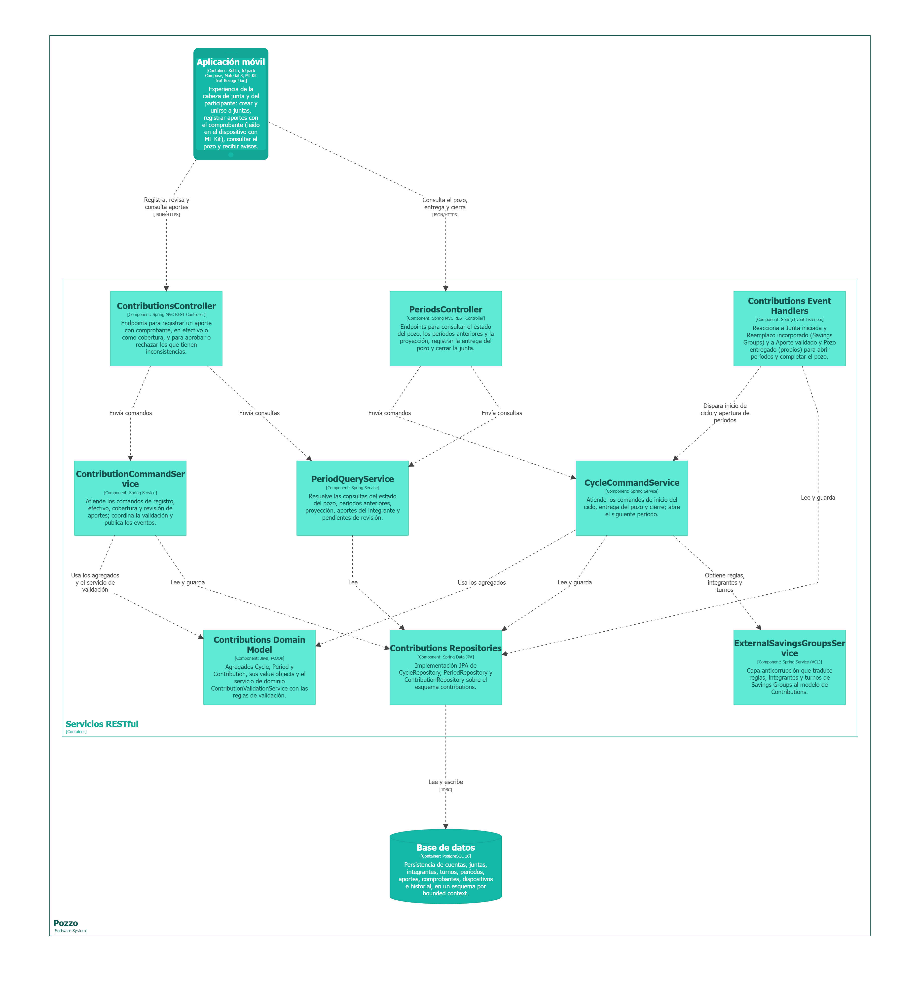{width=80%}

Los dos controllers reciben las solicitudes de la aplicación móvil y las convierten en comandos o consultas. Los command services usan el modelo de dominio y los repositorios, y el CycleCommandService es el único que habla con ExternalSavingsGroupsService, la capa anticorrupción hacia Savings Groups. Los event handlers son la entrada reactiva del contexto: reciben Junta iniciada y Reemplazo incorporado desde Savings Groups, y Aporte validado y Pozo entregado desde el propio contexto, y disparan comandos. Los repositorios son el único componente que toca la base de datos. La lectura del comprobante con ML Kit no aparece aquí porque ocurre en la aplicación móvil: el servicio recibe los cuatro campos ya leídos y confirmados por el participante.

#### 2.6.1.6. Bounded Context Software Architecture Code Level Diagrams

##### 2.6.1.6.1. Bounded Context Domain Layer Class Diagrams

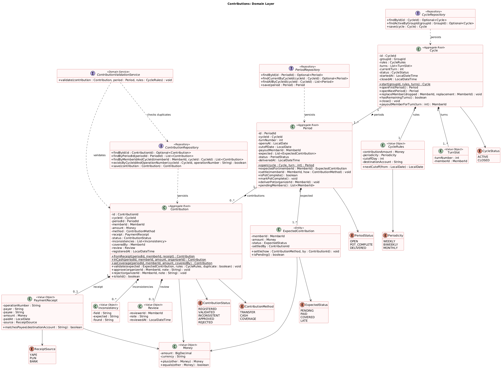

El diagrama muestra los tres agregados y sus relaciones de composición: un Cycle contiene sus reglas y turnos y agrupa uno o más Period; un Period contiene un ExpectedContribution por integrante y agrupa los Contribution que se registran en él; un Contribution contiene como máximo un comprobante y una revisión y cero o más inconsistencias. Las asociaciones entre agregados se expresan por identificador (cycleId, periodId), no por referencia de objeto, para que cada agregado se cargue y guarde de forma independiente. Los repositorios dependen de los agregados y el domain service depende de Contribution y de ContributionRepository.

##### 2.6.1.6.2. Bounded Context Database Design Diagram

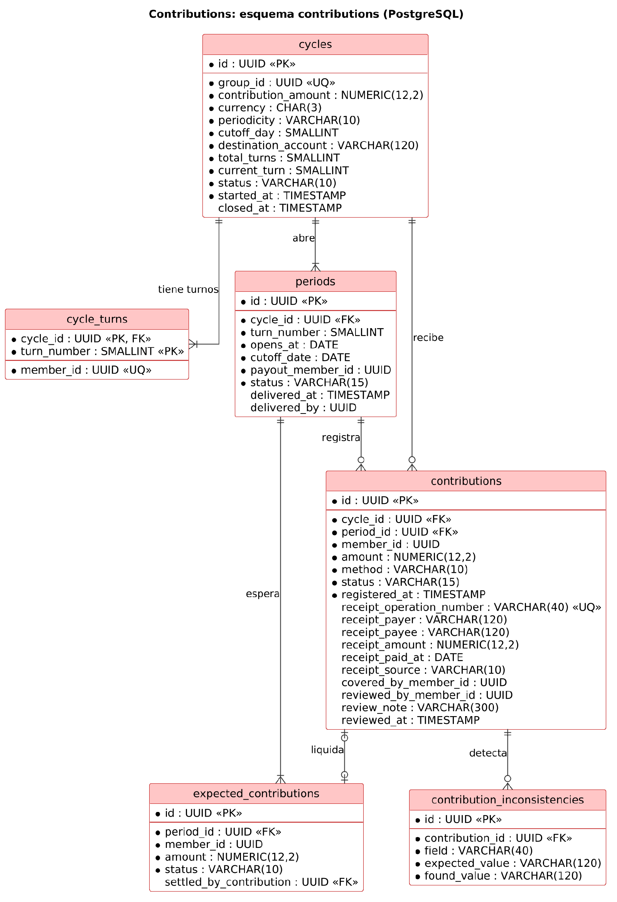

El esquema `contributions` tiene seis tablas. `cycles` guarda el ciclo con sus reglas desnormalizadas (monto, periodicidad, día de corte, destino) porque son una copia congelada al iniciar y no deben cambiar si Savings Groups cambia; `cycle_turns` guarda el orden de cobro con clave compuesta por ciclo y turno y unicidad por integrante. `periods` tiene un período por turno del ciclo y `expected_contributions` una fila por integrante y período, con el estado y el aporte que la liquidó. `contributions` guarda el aporte con los campos del comprobante en columnas propias, el integrante que cubrió si es cobertura y la revisión de la cabeza; la restricción de unicidad sobre (cycle_id, receipt_operation_number) implementa en la base de datos la regla de que un comprobante se usa una sola vez por junta. `contribution_inconsistencies` guarda una fila por campo que no cuadró. Los identificadores de integrante y de junta son UUID sin clave foránea porque pertenecen a otros esquemas.

### 2.6.2. Bounded Context: Savings Groups

Savings Groups es el contexto de soporte que define la junta antes de que exista un ciclo: sus reglas, sus integrantes, la invitación con la que se incorporan y el orden de turnos. Su modelo tiene tres agregados. **SavingsGroup** es la junta con sus reglas, la lista de integrantes y los turnos; concentra las condiciones para iniciar y el bloqueo de reglas posterior. **Invitation** es el código y enlace vigentes de una junta, con su vencimiento; se modela aparte porque una junta puede regenerar invitaciones sin cambiar. **Auction** es la subasta de un turno con sus ofertas; tiene ciclo de vida propio (abierta, cerrada) y termina asignando el turno a la junta. Los integrantes son entidades dentro de SavingsGroup porque no tienen sentido fuera de ella: un mismo celular es un Membership distinto en cada junta, y los integrantes sin la aplicación existen solo como Membership de tipo manual.

#### 2.6.2.1. Domain Layer

<table>
  <colgroup><col width="26%"><col width="16%"><col width="26%"><col width="32%"></colgroup>
  <thead>
    <tr>
      <th>Clase</th>
      <th>Tipo</th>
      <th>Propósito</th>
      <th>Atributos y métodos principales</th>
    </tr>
  </thead>
  <tbody>
    <tr>
      <td><b>SavingsGroup</b></td>
      <td>Aggregate Root</td>
      <td>La junta: reglas, integrantes, orden de turnos y estado. Aplica las condiciones de inicio y el bloqueo de reglas.</td>
      <td>id, name, organizerId, rules, memberships, turns, turnMethod, status, createdAt, startedAt. create(organizerId, name, rules), defineDestination(account), join(memberId, displayName), addManualMember(displayName, phone), removeMember(membershipId), assignTurns(slots, method), assignTurnFromAuction(turnNumber, winner), hasFreeSeats(), canStart(), start(), registerDropout(dropped, replacement), turnCalendar().</td>
    </tr>
    <tr>
      <td><b>Invitation</b></td>
      <td>Aggregate Root</td>
      <td>Código y enlace de invitación vigentes de una junta, con vencimiento; caduca al iniciar la junta.</td>
      <td>id, groupId, code, createdBy, createdAt, expiresAt, status. generate(groupId, organizerId), link(), isUsable(), expire().</td>
    </tr>
    <tr>
      <td><b>Auction</b></td>
      <td>Aggregate Root</td>
      <td>Subasta de un turno: recibe ofertas, determina la mayor y resuelve el empate con la decisión de la cabeza.</td>
      <td>id, groupId, turnNumber, bids, status, openedAt, closedAt, winnerId. open(groupId, turnNumber), placeBid(memberId, amount), highestBids(), close(tieBreakBy).</td>
    </tr>
    <tr>
      <td><b>Membership</b></td>
      <td>Entity</td>
      <td>Un integrante dentro de una junta, con la aplicación o registrado a mano por la cabeza.</td>
      <td>id, memberId, displayName, phone, kind, status, joinedAt. isActive(), markDropped().</td>
    </tr>
    <tr>
      <td><b>Bid</b></td>
      <td>Entity</td>
      <td>Una oferta en la subasta.</td>
      <td>id, memberId, amount, placedAt.</td>
    </tr>
    <tr>
      <td><b>GroupRules</b></td>
      <td>Value Object</td>
      <td>Reglas de la junta: aporte, periodicidad, día de corte, cupos y destino de los aportes.</td>
      <td>contributionAmount, periodicity, cutoffDay, seats, destinationAccount. withDestination(account).</td>
    </tr>
    <tr>
      <td><b>TurnSlot, InvitationCode, PhoneNumber, Money</b></td>
      <td>Value Object</td>
      <td>Posición de cobro; código corto aleatorio de invitación; celular validado; monto con moneda.</td>
      <td>turnNumber y memberId; value y random(); value e isValid(); amount y currency.</td>
    </tr>
    <tr>
      <td><b>GroupStatus, MembershipKind, MembershipStatus, TurnMethod, InvitationStatus, AuctionStatus, Periodicity</b></td>
      <td>Enumeración</td>
      <td>Estados y clasificaciones del modelo.</td>
      <td>DRAFT / READY / STARTED / CLOSED; APP / MANUAL; ACTIVE / REMOVED / DROPPED / REPLACEMENT; DRAW / AGREED / AUCTION; ACTIVE / EXPIRED; OPEN / CLOSED; WEEKLY / BIWEEKLY / MONTHLY.</td>
    </tr>
    <tr>
      <td><b>TurnAssignmentService</b></td>
      <td>Domain Service</td>
      <td>Genera el orden de turnos por sorteo, con una semilla que se muestra al grupo para que el resultado sea verificable, o valida un orden acordado (todos los integrantes, sin repetidos).</td>
      <td>drawTurns(group, seed), agreedTurns(group, order).</td>
    </tr>
    <tr>
      <td><b>SavingsGroupRepository, InvitationRepository, AuctionRepository</b></td>
      <td>Repository (interfaz)</td>
      <td>Persistencia de cada agregado.</td>
      <td>findById, findByMemberId, findByCode, findActiveByGroupId, findOpenByGroupId, save.</td>
    </tr>
    <tr>
      <td><b>CreateGroupCommand, DefineDestinationCommand, GenerateInvitationCommand, JoinGroupCommand, AddManualMemberCommand, RemoveMemberCommand, AssignTurnsByDrawCommand, AssignTurnsAgreedCommand, OpenAuctionCommand, PlaceBidCommand, CloseAuctionCommand, StartGroupCommand, RegisterDropoutCommand</b></td>
      <td>Command</td>
      <td>Un comando por cada comando del EventStorming en este contexto.</td>
      <td>Identificadores, reglas, nombre y celular, orden o semilla, oferta, decisión de empate.</td>
    </tr>
    <tr>
      <td><b>GetGroupRulesQuery, GetMembersQuery, GetTurnCalendarQuery, GetGroupPreviewQuery, GetOpenBidsQuery, GetMyGroupsQuery</b></td>
      <td>Query</td>
      <td>Consultas de las vistas: reglas, lista de integrantes, calendario de turnos, resumen antes de unirse, ofertas vigentes y mis juntas.</td>
      <td>groupId, invitationCode, memberId.</td>
    </tr>
    <tr>
      <td><b>GroupCreatedEvent, InvitationGeneratedEvent, MemberJoinedEvent, ManualMemberAddedEvent, MemberRemovedEvent, TurnsAssignedEvent, AuctionOpenedEvent, BidPlacedEvent, AuctionClosedEvent, GroupStartedEvent, MemberDroppedEvent, ReplacementJoinedEvent</b></td>
      <td>Domain Event</td>
      <td>Hechos que publica el contexto. GroupStartedEvent es el que inicia el ciclo en Contributions; MemberDroppedEvent y ReplacementJoinedEvent los consumen Contributions y Compliance History.</td>
      <td>Identificadores de junta e integrantes, reglas y turnos copiados al iniciar.</td>
    </tr>
  </tbody>
</table>

Las reglas del canvas quedan en `SavingsGroup.canStart` (cupos cubiertos y turnos asignados), en `SavingsGroup.start` (bloqueo de reglas y caducidad de la invitación, que se ordena publicando GroupStartedEvent), en `Auction.close` (gana la oferta mayor, el empate lo resuelve la cabeza) y en `SavingsGroup.registerDropout` (el reemplazo hereda el turno pendiente). Que un integrante sin la aplicación no pueda aportar por sí mismo se garantiza porque su Membership no tiene memberId y, por tanto, ninguna cuenta puede actuar en su nombre.

#### 2.6.2.2. Interface Layer

<table>
  <colgroup><col width="24%"><col width="34%"><col width="42%"></colgroup>
  <thead>
    <tr>
      <th>Clase</th>
      <th>Propósito</th>
      <th>Endpoints</th>
    </tr>
  </thead>
  <tbody>
    <tr>
      <td><b>SavingsGroupsController</b></td>
      <td>Ciclo de vida de la junta: crear, definir destino, consultar reglas, listar mis juntas e iniciar.</td>
      <td>POST /api/v1/groups, GET /api/v1/groups/{id}, GET /api/v1/members/me/groups, PATCH /api/v1/groups/{id}/destination, POST /api/v1/groups/{id}/start.</td>
    </tr>
    <tr>
      <td><b>MembershipsController</b></td>
      <td>Invitaciones e integrantes: generar invitación, resolver un código (resumen antes de unirse), unirse, agregar integrante sin la aplicación, retirar y registrar deserción con reemplazo.</td>
      <td>POST /api/v1/groups/{id}/invitations, GET /api/v1/invitations/{code}, POST /api/v1/invitations/{code}/join, GET /api/v1/groups/{id}/members, POST /api/v1/groups/{id}/members/manual, DELETE /api/v1/groups/{id}/members/{membershipId}, POST /api/v1/groups/{id}/members/{membershipId}/dropout.</td>
    </tr>
    <tr>
      <td><b>TurnsController</b></td>
      <td>Asignación de turnos: sorteo, orden acordado, subasta (abrir, ofertar, cerrar) y calendario.</td>
      <td>POST /api/v1/groups/{id}/turns/draw, POST /api/v1/groups/{id}/turns/agreed, GET /api/v1/groups/{id}/turns, POST /api/v1/groups/{id}/auctions, POST /api/v1/auctions/{auctionId}/bids, GET /api/v1/auctions/{auctionId}/bids, POST /api/v1/auctions/{auctionId}/close.</td>
    </tr>
    <tr>
      <td><b>CreateGroupResource, GroupResource, GroupPreviewResource, MembershipResource, TurnSlotResource, BidResource</b> y sus assemblers</td>
      <td>Recursos JSON y transformaciones entre recursos, comandos y agregados.</td>
      <td>No aplica.</td>
    </tr>
  </tbody>
</table>

#### 2.6.2.3. Application Layer

<table>
  <colgroup><col width="26%"><col width="16%"><col width="58%"></colgroup>
  <thead>
    <tr>
      <th>Clase</th>
      <th>Tipo</th>
      <th>Responsabilidad</th>
    </tr>
  </thead>
  <tbody>
    <tr>
      <td><b>SavingsGroupCommandServiceImpl</b></td>
      <td>Command Service</td>
      <td>Atiende CreateGroup, DefineDestination, GenerateInvitation, JoinGroup, AddManualMember, RemoveMember, StartGroup y RegisterDropout. Verifica que quien invoca es la cabeza cuando corresponde, carga el SavingsGroup, invoca el método del agregado, guarda y publica los eventos. Al unirse por código, resuelve la Invitation y comprueba que sea usable y que haya cupos.</td>
    </tr>
    <tr>
      <td><b>TurnCommandServiceImpl</b></td>
      <td>Command Service</td>
      <td>Atiende AssignTurnsByDraw y AssignTurnsAgreed con TurnAssignmentService, y OpenAuction, PlaceBid y CloseAuction; al cerrar la subasta asigna el turno en el SavingsGroup.</td>
    </tr>
    <tr>
      <td><b>SavingsGroupQueryServiceImpl</b></td>
      <td>Query Service</td>
      <td>Resuelve reglas, integrantes, calendario, ofertas vigentes y mis juntas. Para el resumen antes de unirse (GetGroupPreviewQuery) devuelve solo nombre, reglas y cupos libres, sin la lista de integrantes. Cuando la cabeza consulta la lista, completa cada integrante con su resumen de cumplimiento a través de ExternalComplianceHistoryService.</td>
    </tr>
    <tr>
      <td><b>ExternalComplianceHistoryService</b></td>
      <td>Outbound Service (interfaz)</td>
      <td>Contrato de la capa anticorrupción hacia Compliance History: fetchSummary(memberId) devuelve un value object ComplianceBadge (nivel y juntas completadas), no el historial completo.</td>
    </tr>
  </tbody>
</table>

Este contexto no tiene event handlers entrantes: todo lo que ocurre en una junta lo inicia una persona desde la aplicación. Es, en cambio, el mayor publicador de eventos hacia Contributions y Notifications.

#### 2.6.2.4. Infrastructure Layer

<table>
  <colgroup><col width="26%"><col width="16%"><col width="58%"></colgroup>
  <thead>
    <tr>
      <th>Clase</th>
      <th>Tipo</th>
      <th>Responsabilidad</th>
    </tr>
  </thead>
  <tbody>
    <tr>
      <td><b>SavingsGroupRepositoryImpl, InvitationRepositoryImpl, AuctionRepositoryImpl</b></td>
      <td>Repository (JPA)</td>
      <td>Implementan las interfaces del dominio sobre el esquema `savings_groups`.</td>
    </tr>
    <tr>
      <td><b>TurnAssignmentServiceImpl</b></td>
      <td>Domain Service (implementación)</td>
      <td>Sorteo con SecureRandom sembrado con una cadena que se publica al grupo, para que cualquier integrante pueda reproducir el resultado.</td>
    </tr>
    <tr>
      <td><b>ExternalComplianceHistoryServiceImpl</b></td>
      <td>Anti-corruption Layer</td>
      <td>Llama al query service de Compliance History dentro del mismo proceso y traduce su resumen al ComplianceBadge de este contexto.</td>
    </tr>
    <tr>
      <td><b>InvitationLinkBuilder</b></td>
      <td>Adaptador</td>
      <td>Construye el enlace de invitación con el dominio verificado de Android App Links, para que abra la aplicación o lleve a la tienda.</td>
    </tr>
    <tr>
      <td><b>DomainEventPublisher, SavingsGroupsJpaConfig</b></td>
      <td>Adaptador de eventos y configuración</td>
      <td>Publicación de eventos tras confirmar la transacción; esquema, convertidores y auditoría.</td>
    </tr>
  </tbody>
</table>

#### 2.6.2.5. Bounded Context Software Architecture Component Level Diagrams

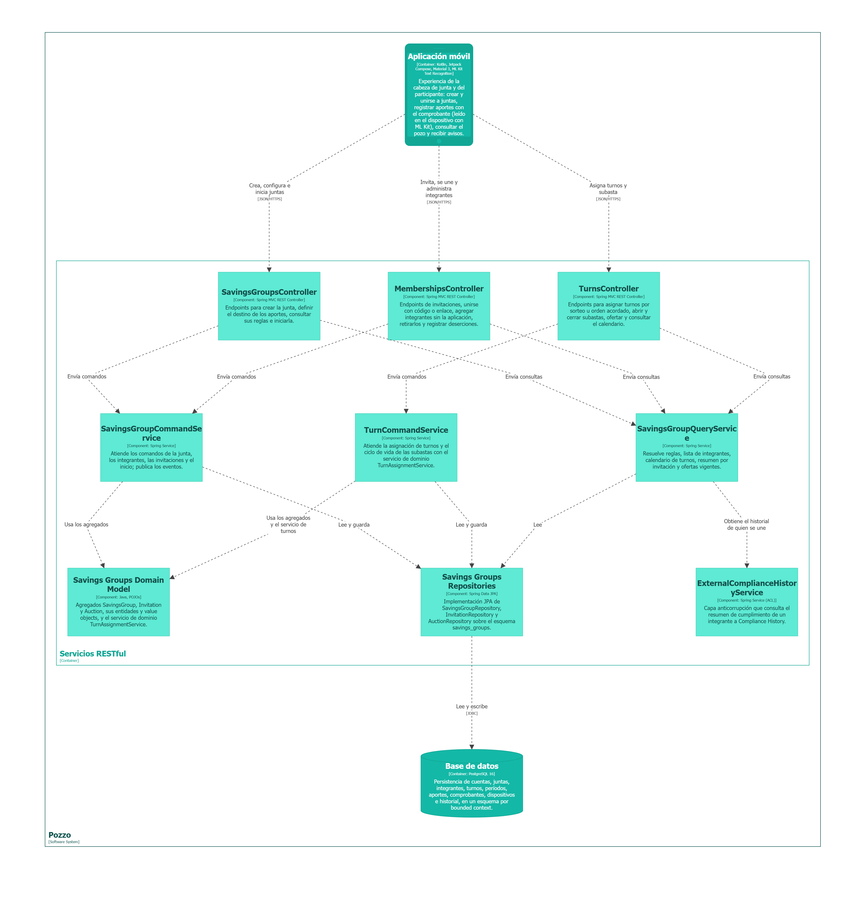{width=80%}

Tres controllers reparten las responsabilidades de junta, integrantes y turnos. SavingsGroupCommandService y TurnCommandService comparten el modelo de dominio y los repositorios; el query service es el único que sale del contexto, a través de ExternalComplianceHistoryService, para completar la lista de integrantes con su nivel de cumplimiento. El componente ExternalSavingsGroupsService de Contributions consume a su vez el query service de este contexto, lo que se refleja en el diagrama como una dependencia entrante desde el módulo core.

#### 2.6.2.6. Bounded Context Software Architecture Code Level Diagrams

##### 2.6.2.6.1. Bounded Context Domain Layer Class Diagrams

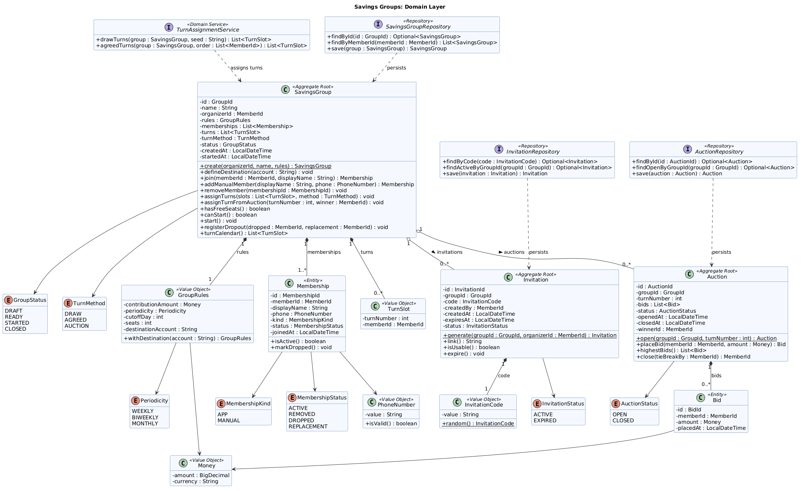

SavingsGroup compone sus reglas, sus integrantes y sus turnos, y agrega por identificador las invitaciones y subastas que le pertenecen. Auction compone sus ofertas. El domain service TurnAssignmentService opera sobre SavingsGroup y devuelve la lista de TurnSlot que el agregado acepta con `assignTurns`.

##### 2.6.2.6.2. Bounded Context Database Design Diagram

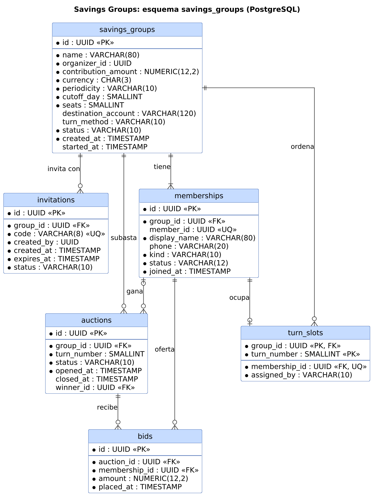{width=85%}

El esquema `savings_groups` tiene seis tablas. `savings_groups` guarda la junta con sus reglas en columnas; `memberships` una fila por integrante, con `member_id` nulo para los registrados sin la aplicación y una restricción que exige celular en ese caso; `invitations` los códigos, únicos en toda la base; `turn_slots` el orden de cobro con clave compuesta por junta y turno y unicidad por integrante, de modo que nadie ocupa dos turnos; `auctions` una subasta por turno y `bids` sus ofertas con índice descendente por monto para resolver rápido la mayor.

### 2.6.3. Bounded Context: Compliance History

Compliance History es un contexto de análisis: no toma decisiones sobre la junta, solo acumula hechos de cumplimiento por persona y los resume. Su modelo tiene dos agregados. **MemberRecord** es el historial de un integrante, con una entrada por cada hecho relevante recibido de otros contextos; produce un resumen agregado que es lo único que se muestra fuera. **ShareLink** es un enlace con vigencia limitada que permite mostrar ese resumen a alguien que no es integrante de Pozzo. La capa anticorrupción está en los event handlers: reciben eventos de Contributions y Savings Groups expresados en términos de aportes y períodos, y los traducen a entradas de cumplimiento (puntual, tardío, cubierto, rechazado, deserción, ciclo completado).

#### 2.6.3.1. Domain Layer

<table>
  <colgroup><col width="26%"><col width="16%"><col width="26%"><col width="32%"></colgroup>
  <thead>
    <tr>
      <th>Clase</th>
      <th>Tipo</th>
      <th>Propósito</th>
      <th>Atributos y métodos principales</th>
    </tr>
  </thead>
  <tbody>
    <tr>
      <td><b>MemberRecord</b></td>
      <td>Aggregate Root</td>
      <td>Historial de un integrante a lo largo de todas sus juntas. Su identidad es el propio memberId.</td>
      <td>memberId, entries, updatedAt. forMember(memberId), record(entry), summary(), entriesInCycle(cycleId).</td>
    </tr>
    <tr>
      <td><b>ShareLink</b></td>
      <td>Aggregate Root</td>
      <td>Enlace verificable para compartir el historial, con vigencia y revocación.</td>
      <td>token, memberId, createdAt, expiresAt, revoked. issue(memberId, validity), isValid(now), revoke().</td>
    </tr>
    <tr>
      <td><b>ComplianceEntry</b></td>
      <td>Entity</td>
      <td>Un hecho de cumplimiento, con el evento de origen que lo produjo para no registrarlo dos veces.</td>
      <td>id, cycleId, periodId, kind, occurredAt, sourceEventId. isNegative().</td>
    </tr>
    <tr>
      <td><b>ComplianceSummary</b></td>
      <td>Value Object</td>
      <td>Resumen agregado: conteos por tipo, juntas completadas y nivel. Es lo que se muestra a la cabeza y en el enlace compartido; nunca los montos ni los nombres de otras juntas.</td>
      <td>onTime, late, covered, dropouts, cyclesCompleted, level. complianceRate().</td>
    </tr>
    <tr>
      <td><b>ShareToken</b></td>
      <td>Value Object</td>
      <td>Token aleatorio del enlace.</td>
      <td>value, random().</td>
    </tr>
    <tr>
      <td><b>EntryKind, ComplianceLevel</b></td>
      <td>Enumeración</td>
      <td>Tipos de hecho y niveles del resumen.</td>
      <td>ON_TIME / LATE / COVERED / REJECTED / DROPOUT / CYCLE_COMPLETED; EXCELLENT / GOOD / REGULAR / RISKY / NEW.</td>
    </tr>
    <tr>
      <td><b>ComplianceScoringService</b></td>
      <td>Domain Service</td>
      <td>Calcula el resumen y el nivel a partir de las entradas. Un integrante sin entradas es NEW; una deserción reciente lo lleva a RISKY; más del 90 % de aportes puntuales en tres o más juntas completadas es EXCELLENT.</td>
      <td>summarize(entries).</td>
    </tr>
    <tr>
      <td><b>MemberRecordRepository, ShareLinkRepository</b></td>
      <td>Repository (interfaz)</td>
      <td>Persistencia de los agregados y verificación de idempotencia por evento de origen.</td>
      <td>findByMemberId, existsEntryBySourceEventId, findByToken, save.</td>
    </tr>
    <tr>
      <td><b>RecordComplianceEntryCommand, ShareHistoryCommand, RevokeShareLinkCommand</b></td>
      <td>Command</td>
      <td>Registrar un hecho (lo emiten los event handlers), compartir el historial y revocar un enlace.</td>
      <td>memberId, cycleId, periodId, kind, sourceEventId; validity; token.</td>
    </tr>
    <tr>
      <td><b>GetMyHistoryQuery, GetMemberSummaryQuery, GetSharedHistoryQuery</b></td>
      <td>Query</td>
      <td>Historial propio con detalle, resumen de otro integrante (para la cabeza y para Savings Groups) e historial por enlace compartido.</td>
      <td>memberId, token.</td>
    </tr>
    <tr>
      <td><b>HistoryUpdatedEvent, HistorySharedEvent</b></td>
      <td>Domain Event</td>
      <td>Hechos que publica el contexto; Notifications no los consume, se conservan para auditoría.</td>
      <td>memberId, fecha.</td>
    </tr>
  </tbody>
</table>

#### 2.6.3.2. Interface Layer

<table>
  <colgroup><col width="24%"><col width="34%"><col width="42%"></colgroup>
  <thead>
    <tr>
      <th>Clase</th>
      <th>Propósito</th>
      <th>Endpoints</th>
    </tr>
  </thead>
  <tbody>
    <tr>
      <td><b>ComplianceHistoryController</b></td>
      <td>Consulta y compartición del historial. El endpoint del resumen de otro integrante exige que quien consulta sea cabeza de una junta no iniciada a la que ese integrante se unió.</td>
      <td>GET /api/v1/members/me/compliance, GET /api/v1/members/{memberId}/compliance/summary, POST /api/v1/members/me/compliance/share, DELETE /api/v1/compliance/shares/{token}, GET /api/v1/compliance/shared/{token} (público, sin token de sesión).</td>
    </tr>
    <tr>
      <td><b>ComplianceHistoryResource, ComplianceSummaryResource, ShareLinkResource</b> y sus assemblers</td>
      <td>Recursos JSON y transformaciones.</td>
      <td>No aplica.</td>
    </tr>
  </tbody>
</table>

#### 2.6.3.3. Application Layer

<table>
  <colgroup><col width="26%"><col width="16%"><col width="58%"></colgroup>
  <thead>
    <tr>
      <th>Clase</th>
      <th>Tipo</th>
      <th>Responsabilidad</th>
    </tr>
  </thead>
  <tbody>
    <tr>
      <td><b>ComplianceCommandServiceImpl</b></td>
      <td>Command Service</td>
      <td>handle(RecordComplianceEntryCommand): ignora el comando si el evento de origen ya se registró, crea el MemberRecord si no existe y agrega la entrada. handle(ShareHistoryCommand) y handle(RevokeShareLinkCommand): emite y revoca enlaces.</td>
    </tr>
    <tr>
      <td><b>ComplianceQueryServiceImpl</b></td>
      <td>Query Service</td>
      <td>Resuelve el historial propio, el resumen de otro integrante y el historial compartido; en los dos últimos devuelve solo ComplianceSummary.</td>
    </tr>
    <tr>
      <td><b>ContributionEventsHandler</b></td>
      <td>Event Handler (ACL)</td>
      <td>Traduce ContributionValidatedEvent a ON_TIME o LATE según la fecha de pago frente a la fecha de corte, ContributionCoveredEvent a COVERED y ContributionRejectedEvent a REJECTED.</td>
    </tr>
    <tr>
      <td><b>GroupEventsHandler</b></td>
      <td>Event Handler (ACL)</td>
      <td>Traduce MemberDroppedEvent a DROPOUT y CycleClosedEvent a CYCLE_COMPLETED para cada integrante que terminó el ciclo.</td>
    </tr>
  </tbody>
</table>

#### 2.6.3.4. Infrastructure Layer

<table>
  <colgroup><col width="26%"><col width="16%"><col width="58%"></colgroup>
  <thead>
    <tr>
      <th>Clase</th>
      <th>Tipo</th>
      <th>Responsabilidad</th>
    </tr>
  </thead>
  <tbody>
    <tr>
      <td><b>MemberRecordRepositoryImpl, ShareLinkRepositoryImpl</b></td>
      <td>Repository (JPA)</td>
      <td>Persistencia sobre el esquema `compliance_history`; los conteos del resumen se guardan desnormalizados en `member_records` para que la consulta de la cabeza no recorra todas las entradas.</td>
    </tr>
    <tr>
      <td><b>ComplianceScoringServiceImpl</b></td>
      <td>Domain Service (implementación)</td>
      <td>Implementa los umbrales de nivel, configurables por propiedades.</td>
    </tr>
    <tr>
      <td><b>SharedHistoryLinkBuilder</b></td>
      <td>Adaptador</td>
      <td>Construye la URL pública del historial compartido que la aplicación entrega a la hoja de compartir del sistema.</td>
    </tr>
  </tbody>
</table>

#### 2.6.3.5. Bounded Context Software Architecture Component Level Diagrams

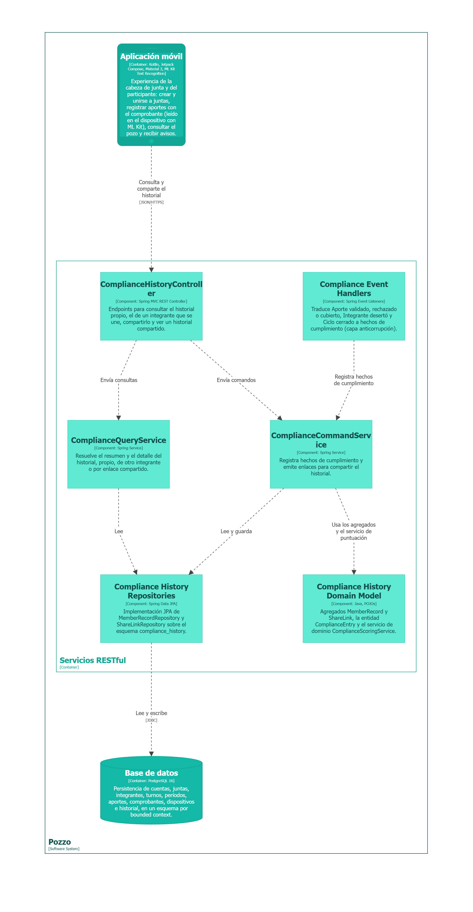{width=75%}

El contexto tiene dos entradas: el controller, para las consultas y la compartición desde la aplicación, y los event handlers, que reciben los eventos de Contributions y Savings Groups y los convierten en comandos de registro. Ambos pasan por el command service, que es el único que escribe. Savings Groups consume el query service a través de su propia capa anticorrupción.

#### 2.6.3.6. Bounded Context Software Architecture Code Level Diagrams

##### 2.6.3.6.1. Bounded Context Domain Layer Class Diagrams

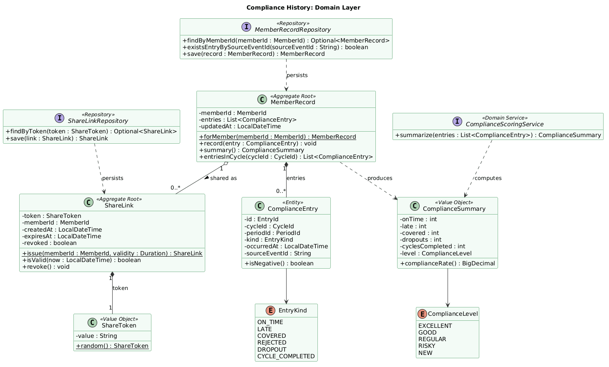{width=80%}

##### 2.6.3.6.2. Bounded Context Database Design Diagram

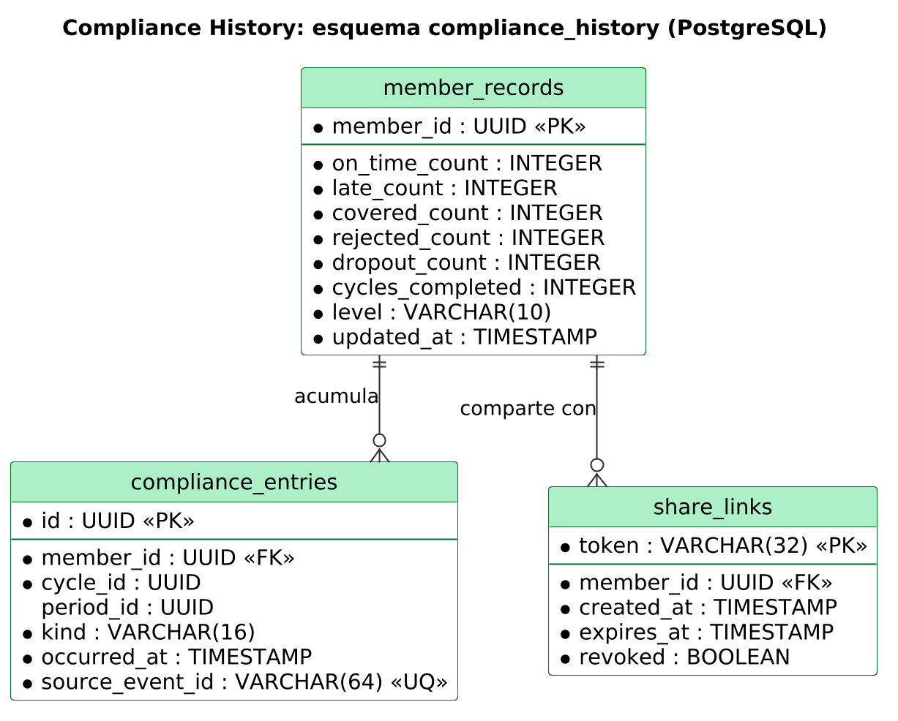{width=75%}

El esquema `compliance_history` tiene tres tablas. `member_records` usa el identificador del integrante como clave y guarda los conteos y el nivel ya calculados; `compliance_entries` guarda cada hecho con el identificador del evento que lo originó, único para garantizar que un mismo evento no se cuente dos veces aunque se vuelva a publicar; `share_links` guarda los enlaces con su vencimiento y revocación.

### 2.6.4. Bounded Context: Notifications

Notifications es un contexto genérico y reactivo: casi todo lo que hace lo dispara un evento de otro contexto. Su modelo tiene tres agregados. **Device** es un dispositivo registrado para recibir push, con su token de Firebase Cloud Messaging. **ReminderPlan** es la política de recordatorios de una junta: cuántos días antes de la fecha de corte se envían y a qué hora; existe uno por junta y por defecto es tres días, un día y el mismo día. **Notification** es un recordatorio o aviso programado o enviado a un integrante, con una clave de deduplicación que impide que un mismo hecho produzca dos avisos. El domain service ReminderSchedulingService convierte un plan y una fecha de corte en las notificaciones programadas de cada integrante pendiente, y las cancela cuando el aporte se valida.

#### 2.6.4.1. Domain Layer

<table>
  <colgroup><col width="26%"><col width="16%"><col width="26%"><col width="32%"></colgroup>
  <thead>
    <tr>
      <th>Clase</th>
      <th>Tipo</th>
      <th>Propósito</th>
      <th>Atributos y métodos principales</th>
    </tr>
  </thead>
  <tbody>
    <tr>
      <td><b>Device</b></td>
      <td>Aggregate Root</td>
      <td>Dispositivo de un integrante con su token push; se registra al iniciar sesión y se desactiva al cerrarla o cuando FCM informa que el token ya no es válido.</td>
      <td>id, memberId, pushToken, platform, registeredAt, active. register(memberId, token, platform), refreshToken(token), deactivate().</td>
    </tr>
    <tr>
      <td><b>ReminderPlan</b></td>
      <td>Aggregate Root</td>
      <td>Política de recordatorios de una junta.</td>
      <td>id, groupId, offsetsInDays, sendHour, enabled. defaultFor(groupId), configure(offsets, sendHour, enabled), scheduleFor(cutoffDate).</td>
    </tr>
    <tr>
      <td><b>Notification</b></td>
      <td>Aggregate Root</td>
      <td>Un recordatorio o aviso con su contenido, su momento de envío, su estado y su clave de deduplicación.</td>
      <td>id, memberId, groupId, kind, content, dedupKey, scheduledAt, sentAt, status, attempts. reminder(...), alert(...), isDue(now), markSent(), markFailed(), cancel().</td>
    </tr>
    <tr>
      <td><b>NotificationContent, DedupKey, PushToken</b></td>
      <td>Value Object</td>
      <td>Título, cuerpo y enlace profundo; clave única por tipo, integrante y referencia; token de FCM.</td>
      <td>title, body, deepLink; of(kind, memberId, referenceId); value.</td>
    </tr>
    <tr>
      <td><b>NotificationKind, NotificationStatus, Platform</b></td>
      <td>Enumeración</td>
      <td>Tipo, estado y plataforma.</td>
      <td>REMINDER / ALERT; SCHEDULED / SENT / CANCELLED / FAILED; ANDROID / IOS.</td>
    </tr>
    <tr>
      <td><b>ReminderSchedulingService</b></td>
      <td>Domain Service</td>
      <td>Programa los recordatorios de un período para los integrantes pendientes según el plan, y los cancela para un integrante cuando su aporte se valida.</td>
      <td>scheduleReminders(plan, periodId, cutoffDate, pending), cancelReminders(periodId, memberId).</td>
    </tr>
    <tr>
      <td><b>DeviceRepository, ReminderPlanRepository, NotificationRepository</b></td>
      <td>Repository (interfaz)</td>
      <td>Persistencia; NotificationRepository expone las notificaciones vencidas para el despachador y la verificación de la clave de deduplicación.</td>
      <td>findActiveByMemberId, findByPushToken, findByGroupId, findDue, findScheduledByPeriodAndMember, existsByDedupKey, findByMemberId, save.</td>
    </tr>
    <tr>
      <td><b>RegisterDeviceCommand, DeactivateDeviceCommand, ConfigureReminderPlanCommand, ScheduleRemindersCommand, CancelRemindersCommand, CreateAlertCommand</b></td>
      <td>Command</td>
      <td>Comandos de la aplicación (dispositivo y plan) y comandos internos que emiten los event handlers.</td>
      <td>memberId, token, plataforma; groupId, offsets, hora; periodId, fecha de corte, pendientes; contenido y clave.</td>
    </tr>
    <tr>
      <td><b>GetNotificationsQuery, GetReminderPlanQuery</b></td>
      <td>Query</td>
      <td>Avisos recibidos y plan de recordatorios de la junta.</td>
      <td>memberId, groupId.</td>
    </tr>
    <tr>
      <td><b>DeviceRegisteredEvent, ReminderPlanConfiguredEvent, ReminderSentEvent, AlertSentEvent</b></td>
      <td>Domain Event</td>
      <td>Hechos que publica el contexto, usados para métricas.</td>
      <td>Identificadores y fecha.</td>
    </tr>
  </tbody>
</table>

#### 2.6.4.2. Interface Layer

<table>
  <colgroup><col width="24%"><col width="34%"><col width="42%"></colgroup>
  <thead>
    <tr>
      <th>Clase</th>
      <th>Propósito</th>
      <th>Endpoints</th>
    </tr>
  </thead>
  <tbody>
    <tr>
      <td><b>DevicesController</b></td>
      <td>Registro y baja del dispositivo.</td>
      <td>POST /api/v1/members/me/devices, DELETE /api/v1/members/me/devices/{deviceId}.</td>
    </tr>
    <tr>
      <td><b>ReminderPlansController</b></td>
      <td>Consulta y configuración del plan de recordatorios de la junta, solo para la cabeza.</td>
      <td>GET /api/v1/groups/{groupId}/reminder-plan, PUT /api/v1/groups/{groupId}/reminder-plan.</td>
    </tr>
    <tr>
      <td><b>NotificationsController</b></td>
      <td>Avisos recibidos por el integrante.</td>
      <td>GET /api/v1/members/me/notifications.</td>
    </tr>
    <tr>
      <td><b>RegisterDeviceResource, ReminderPlanResource, NotificationResource</b> y sus assemblers</td>
      <td>Recursos JSON y transformaciones.</td>
      <td>No aplica.</td>
    </tr>
  </tbody>
</table>

#### 2.6.4.3. Application Layer

<table>
  <colgroup><col width="26%"><col width="16%"><col width="58%"></colgroup>
  <thead>
    <tr>
      <th>Clase</th>
      <th>Tipo</th>
      <th>Responsabilidad</th>
    </tr>
  </thead>
  <tbody>
    <tr>
      <td><b>NotificationCommandServiceImpl</b></td>
      <td>Command Service</td>
      <td>Registra y da de baja dispositivos, configura el plan, programa y cancela recordatorios con ReminderSchedulingService y crea avisos descartando los que repiten una clave de deduplicación.</td>
    </tr>
    <tr>
      <td><b>NotificationQueryServiceImpl</b></td>
      <td>Query Service</td>
      <td>Resuelve los avisos de un integrante y el plan de una junta.</td>
    </tr>
    <tr>
      <td><b>PeriodEventsHandler</b></td>
      <td>Event Handler</td>
      <td>Al recibir PeriodOpenedEvent, obtiene el plan de la junta y programa los recordatorios de todos los integrantes; al recibir ContributionValidatedEvent o ContributionCoveredEvent, cancela los del integrante.</td>
    </tr>
    <tr>
      <td><b>GroupEventsHandler</b></td>
      <td>Event Handler</td>
      <td>Convierte Junta iniciada, Turnos asignados, Reemplazo incorporado, Pozo completo, Pozo entregado, Aporte rechazado y Ciclo cerrado en avisos para los integrantes correspondientes.</td>
    </tr>
    <tr>
      <td><b>NotificationDispatcher</b></td>
      <td>Tarea programada</td>
      <td>Cada minuto toma las notificaciones vencidas, las envía a los dispositivos activos del integrante con FcmPushSender y marca el resultado; reintenta hasta tres veces y desactiva los dispositivos cuyo token FCM rechaza.</td>
    </tr>
  </tbody>
</table>

El equipo eligió un despachador con tarea programada sobre la tabla de notificaciones, en lugar de una cola con retardo, porque no añade infraestructura, sobrevive a reinicios y hace trivial cancelar un recordatorio: basta con cambiar su estado antes de que venza. Es la respuesta a la Spike Story sobre notificaciones.

#### 2.6.4.4. Infrastructure Layer

<table>
  <colgroup><col width="26%"><col width="16%"><col width="58%"></colgroup>
  <thead>
    <tr>
      <th>Clase</th>
      <th>Tipo</th>
      <th>Responsabilidad</th>
    </tr>
  </thead>
  <tbody>
    <tr>
      <td><b>DeviceRepositoryImpl, ReminderPlanRepositoryImpl, NotificationRepositoryImpl</b></td>
      <td>Repository (JPA)</td>
      <td>Persistencia sobre el esquema `notifications`, con un índice por estado y fecha programada para el despachador.</td>
    </tr>
    <tr>
      <td><b>ReminderSchedulingServiceImpl</b></td>
      <td>Domain Service (implementación)</td>
      <td>Calcula las fechas de envío en la zona horaria de Lima y crea las Notification con su clave de deduplicación.</td>
    </tr>
    <tr>
      <td><b>FcmPushSender</b></td>
      <td>Adaptador (Conformist)</td>
      <td>Envía mensajes con el SDK de Firebase Admin y traduce sus errores a resultados de entrega.</td>
    </tr>
    <tr>
      <td><b>NotificationsJpaConfig, SchedulingConfig</b></td>
      <td>Configuración</td>
      <td>Esquema y convertidores; habilitación del programador de tareas con un solo hilo para evitar envíos duplicados.</td>
    </tr>
  </tbody>
</table>

#### 2.6.4.5. Bounded Context Software Architecture Component Level Diagrams

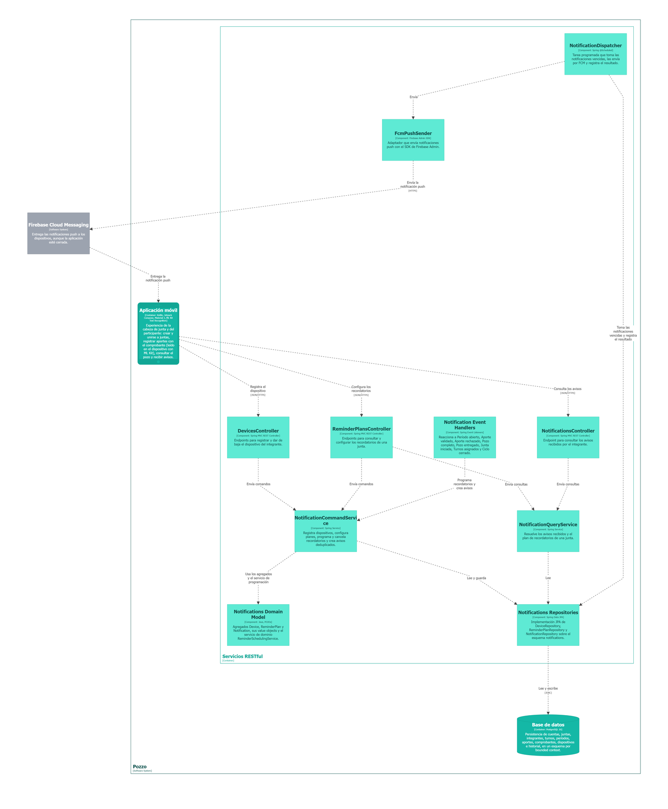{width=80%}

Los event handlers son la entrada principal del contexto y los controllers la secundaria. El despachador es el único componente que habla con Firebase Cloud Messaging, a través del adaptador FcmPushSender, lo que concentra en un punto el manejo de tokens inválidos y reintentos.

#### 2.6.4.6. Bounded Context Software Architecture Code Level Diagrams

##### 2.6.4.6.1. Bounded Context Domain Layer Class Diagrams

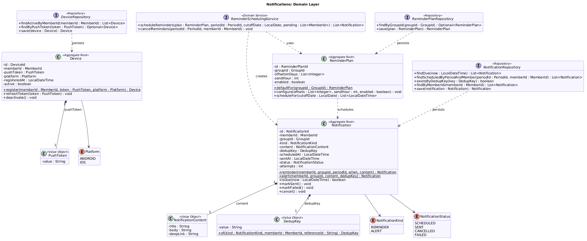{width=90%}

##### 2.6.4.6.2. Bounded Context Database Design Diagram

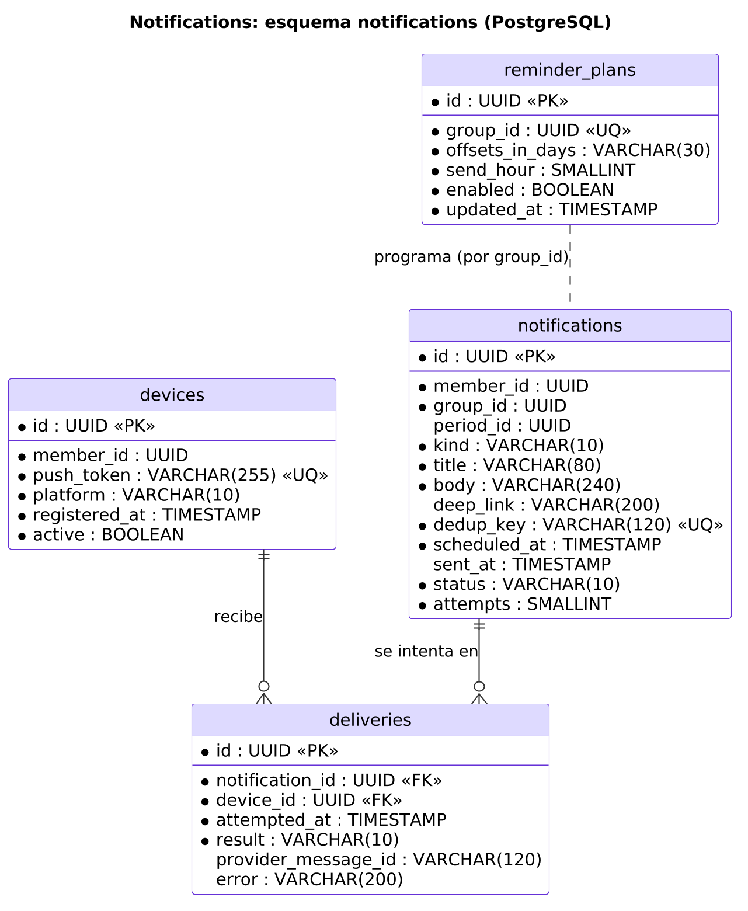{width=85%}

El esquema `notifications` tiene cuatro tablas. `devices` guarda los tokens, únicos, con su plataforma y si están activos; `reminder_plans` un plan por junta; `notifications` cada recordatorio o aviso con su clave de deduplicación única, su fecha programada y su estado, más el período y el integrante para poder cancelar los recordatorios de quien ya aportó; `deliveries` registra cada intento de envío a cada dispositivo con el resultado que devolvió FCM. Las tablas no se relacionan con las de otros esquemas: `member_id`, `group_id` y `period_id` son referencias por identificador.

### 2.6.5. Bounded Context: Identity & Access

Identity & Access es el contexto genérico que identifica a cada integrante por su número de celular, sin contraseña. Su modelo tiene tres agregados. **Account** es la cuenta de un integrante con su celular, su perfil y la aceptación de términos. **VerificationCode** es un código SMS emitido para un celular, con su vencimiento y sus intentos; se modela como agregado separado porque existe antes de que exista la cuenta. **Session** es una sesión abierta en un dispositivo, representada por el hash de su token, para poder revocarla. Dos servicios de dominio se definen como interfaces: la generación y comparación de códigos y la emisión y validación de tokens, cuyas implementaciones dependen de bibliotecas de infraestructura.

#### 2.6.5.1. Domain Layer

<table>
  <colgroup><col width="26%"><col width="16%"><col width="26%"><col width="32%"></colgroup>
  <thead>
    <tr>
      <th>Clase</th>
      <th>Tipo</th>
      <th>Propósito</th>
      <th>Atributos y métodos principales</th>
    </tr>
  </thead>
  <tbody>
    <tr>
      <td><b>Account</b></td>
      <td>Aggregate Root</td>
      <td>Cuenta del integrante: celular único, perfil, términos aceptados y estado.</td>
      <td>id, phoneNumber, profile, termsAcceptedAt, status, createdAt. register(phone, profile, termsAccepted), updateProfile(profile), hasAcceptedTerms(), deactivate().</td>
    </tr>
    <tr>
      <td><b>VerificationCode</b></td>
      <td>Aggregate Root</td>
      <td>Código de seis dígitos emitido para un celular; vence a los cinco minutos y admite tres intentos, después de los cuales queda bloqueado.</td>
      <td>id, phoneNumber, codeHash, issuedAt, expiresAt, attempts, status. issue(phone, code), verify(input, now), isExpired(now), remainingAttempts().</td>
    </tr>
    <tr>
      <td><b>Session</b></td>
      <td>Aggregate Root</td>
      <td>Sesión abierta en un dispositivo; persiste hasta que el integrante la cierra o vence.</td>
      <td>id, accountId, tokenHash, deviceLabel, issuedAt, expiresAt, revokedAt. open(accountId, tokenHash, deviceLabel), isActive(now), revoke().</td>
    </tr>
    <tr>
      <td><b>PhoneNumber</b></td>
      <td>Value Object</td>
      <td>Celular en formato E.164; valida que sea un móvil peruano.</td>
      <td>countryCode, number. e164(), isPeruvianMobile().</td>
    </tr>
    <tr>
      <td><b>Profile</b></td>
      <td>Value Object</td>
      <td>Nombre visible, foto y tema visual.</td>
      <td>displayName, photoUrl, theme.</td>
    </tr>
    <tr>
      <td><b>AccountStatus, VerificationStatus, Theme</b></td>
      <td>Enumeración</td>
      <td>Estados y tema.</td>
      <td>ACTIVE / DEACTIVATED; PENDING / VERIFIED / EXPIRED / BLOCKED; SYSTEM / LIGHT / DARK.</td>
    </tr>
    <tr>
      <td><b>CodeGenerationService</b></td>
      <td>Domain Service (interfaz)</td>
      <td>Genera códigos aleatorios y los compara con su hash; el código en claro nunca se persiste.</td>
      <td>generate(), hash(code), matches(code, hash).</td>
    </tr>
    <tr>
      <td><b>TokenService</b></td>
      <td>Domain Service (interfaz)</td>
      <td>Emite y valida los tokens de sesión que autorizan cada solicitud.</td>
      <td>issue(accountId), hash(token), validate(token).</td>
    </tr>
    <tr>
      <td><b>AccountRepository, VerificationCodeRepository, SessionRepository</b></td>
      <td>Repository (interfaz)</td>
      <td>Persistencia de los agregados.</td>
      <td>findById, findByPhoneNumber, existsByPhoneNumber, findPendingByPhoneNumber, findByTokenHash, findActiveByAccountId, save.</td>
    </tr>
    <tr>
      <td><b>RequestCodeCommand, VerifyCodeCommand, CompleteRegistrationCommand, SignOutCommand, UpdateProfileCommand</b></td>
      <td>Command</td>
      <td>Comandos del EventStorming de acceso.</td>
      <td>phone; phone y código; phone, nombre, foto y aceptación de términos; token; perfil.</td>
    </tr>
    <tr>
      <td><b>GetProfileQuery, GetAccountByPhoneQuery, ValidateTokenQuery</b></td>
      <td>Query</td>
      <td>Perfil, existencia de cuenta por celular (para decidir si se pide el registro) y validación del token desde el filtro de seguridad.</td>
      <td>accountId, phone, token.</td>
    </tr>
    <tr>
      <td><b>CodeRequestedEvent, CodeVerifiedEvent, AccountCreatedEvent, SessionOpenedEvent, SessionRevokedEvent, ProfileUpdatedEvent</b></td>
      <td>Domain Event</td>
      <td>Hechos que publica el contexto. SessionRevokedEvent lo consume Notifications para desactivar el dispositivo.</td>
      <td>accountId, phone, fecha.</td>
    </tr>
  </tbody>
</table>

#### 2.6.5.2. Interface Layer

<table>
  <colgroup><col width="24%"><col width="34%"><col width="42%"></colgroup>
  <thead>
    <tr>
      <th>Clase</th>
      <th>Propósito</th>
      <th>Endpoints</th>
    </tr>
  </thead>
  <tbody>
    <tr>
      <td><b>AuthenticationController</b></td>
      <td>Acceso sin contraseña: solicitar el código, verificarlo (devuelve el token si la cuenta existe o un token de registro si no), completar el registro y cerrar sesión.</td>
      <td>POST /api/v1/auth/codes, POST /api/v1/auth/codes/verify, POST /api/v1/auth/register, POST /api/v1/auth/sign-out.</td>
    </tr>
    <tr>
      <td><b>ProfilesController</b></td>
      <td>Perfil y tema visual del integrante autenticado.</td>
      <td>GET /api/v1/members/me/profile, PUT /api/v1/members/me/profile.</td>
    </tr>
    <tr>
      <td><b>RequestCodeResource, VerifyCodeResource, RegisterResource, AuthenticatedResource, ProfileResource</b> y sus assemblers</td>
      <td>Recursos JSON y transformaciones.</td>
      <td>No aplica.</td>
    </tr>
  </tbody>
</table>

#### 2.6.5.3. Application Layer

<table>
  <colgroup><col width="26%"><col width="16%"><col width="58%"></colgroup>
  <thead>
    <tr>
      <th>Clase</th>
      <th>Tipo</th>
      <th>Responsabilidad</th>
    </tr>
  </thead>
  <tbody>
    <tr>
      <td><b>AuthenticationCommandServiceImpl</b></td>
      <td>Command Service</td>
      <td>handle(RequestCodeCommand): invalida códigos pendientes, genera uno nuevo, lo guarda con hash y lo envía por SmsSender. handle(VerifyCodeCommand): verifica el código y, si el celular ya tiene cuenta, abre una Session y devuelve el token; si no, devuelve un token de registro de corta vida. handle(CompleteRegistrationCommand): crea la Account y abre la sesión. handle(SignOutCommand): revoca la sesión y publica SessionRevokedEvent.</td>
    </tr>
    <tr>
      <td><b>AccountQueryServiceImpl</b></td>
      <td>Query Service</td>
      <td>Resuelve el perfil, la existencia por celular y la validación del token (sesión activa y no revocada).</td>
    </tr>
    <tr>
      <td><b>SmsSender</b></td>
      <td>Outbound Service (interfaz)</td>
      <td>Contrato hacia el proveedor de SMS: send(phone, message).</td>
    </tr>
  </tbody>
</table>

#### 2.6.5.4. Infrastructure Layer

<table>
  <colgroup><col width="26%"><col width="16%"><col width="58%"></colgroup>
  <thead>
    <tr>
      <th>Clase</th>
      <th>Tipo</th>
      <th>Responsabilidad</th>
    </tr>
  </thead>
  <tbody>
    <tr>
      <td><b>AccountRepositoryImpl, VerificationCodeRepositoryImpl, SessionRepositoryImpl</b></td>
      <td>Repository (JPA)</td>
      <td>Persistencia sobre el esquema `identity_access`.</td>
    </tr>
    <tr>
      <td><b>SecureRandomCodeGenerationService</b></td>
      <td>Domain Service (implementación)</td>
      <td>Códigos de seis dígitos con SecureRandom y hash con BCrypt.</td>
    </tr>
    <tr>
      <td><b>JwtTokenService</b></td>
      <td>Domain Service (implementación)</td>
      <td>Tokens JWT firmados con clave del servidor, con el identificador de la cuenta y la sesión como claims.</td>
    </tr>
    <tr>
      <td><b>SmsSenderImpl</b></td>
      <td>Anti-corruption Layer</td>
      <td>Adaptador al proveedor de SMS elegido en la Spike Story correspondiente; el contexto solo conoce la interfaz SmsSender.</td>
    </tr>
    <tr>
      <td><b>BearerAuthorizationFilter</b></td>
      <td>Filtro de seguridad</td>
      <td>Lee el token de cada solicitud, lo valida con AccountQueryService y coloca la identidad del integrante en el contexto de seguridad, que los controllers de los demás módulos leen como principal.</td>
    </tr>
    <tr>
      <td><b>SecurityConfig, IdentityJpaConfig</b></td>
      <td>Configuración</td>
      <td>Rutas públicas (códigos, verificación, registro, historial compartido, OpenAPI) y protegidas; esquema y convertidores.</td>
    </tr>
  </tbody>
</table>

#### 2.6.5.5. Bounded Context Software Architecture Component Level Diagrams

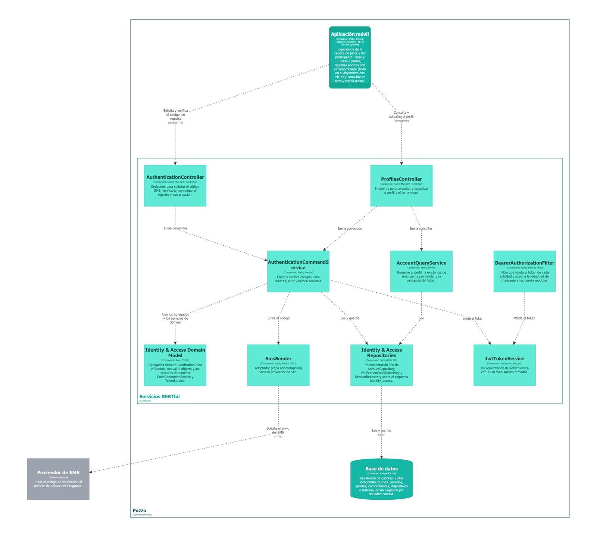{width=80%}

Además de los controllers y servicios habituales, el diagrama muestra BearerAuthorizationFilter, el componente por el que Identity & Access actúa como Open Host Service para los demás módulos: valida el token de cada solicitud y expone la identidad del integrante sin que los otros contextos conozcan cuentas ni sesiones. SmsSender es el único componente que habla con el proveedor de SMS.

#### 2.6.5.6. Bounded Context Software Architecture Code Level Diagrams

##### 2.6.5.6.1. Bounded Context Domain Layer Class Diagrams

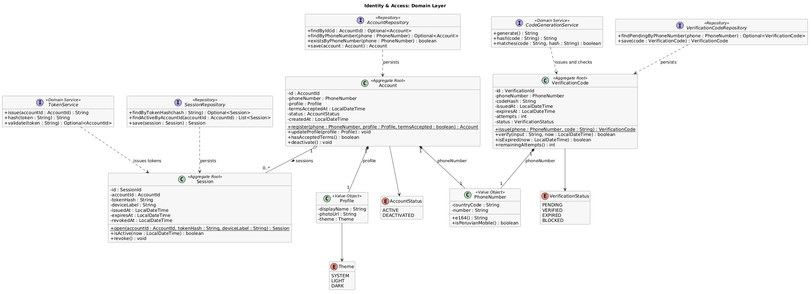{width=90%}

##### 2.6.5.6.2. Bounded Context Database Design Diagram

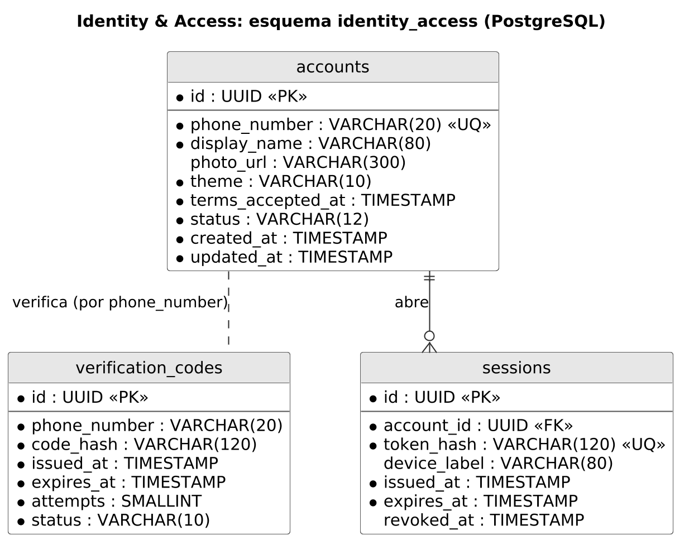{width=75%}

El esquema `identity_access` tiene tres tablas. `accounts` guarda la cuenta con el celular único y el perfil; `verification_codes` los códigos con su hash, vencimiento e intentos, sin clave foránea a la cuenta porque se emiten antes de que exista; `sessions` las sesiones con el hash del token, único, y la fecha de revocación. Ningún dato de otros contextos vive aquí: los demás esquemas guardan el identificador de la cuenta como referencia.

