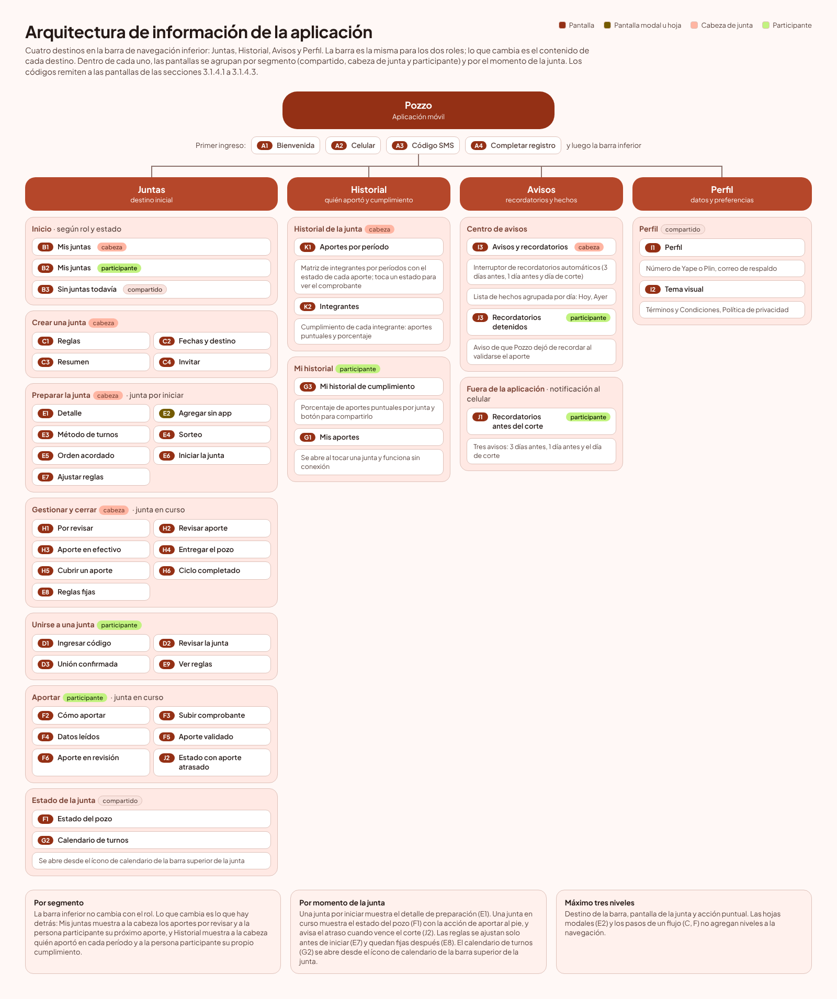
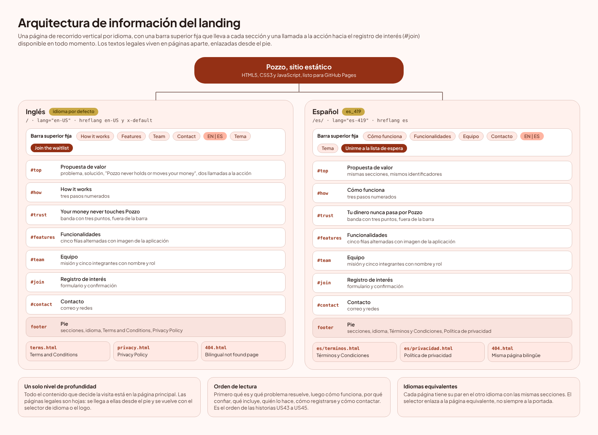

# Capítulo III: Solution UI/UX Design

## 3.1. Product design

### 3.1.1. Style Guidelines

#### 3.1.1.1. General Style Guidelines

### 3.1.2. Information Architecture
La arquitectura de información define dónde se ubica cada contenido, cómo se denomina, de qué manera se accede a él y cómo puede ser localizado por los usuarios. Las cinco secciones siguientes desarrollan los cuatro sistemas principales de la arquitectura de información: organización, etiquetado, navegación y búsqueda. Además, tanto la aplicación móvil como la landing page incorporan una sección específica de etiquetado. En el caso de la landing page, estas etiquetas también contribuyen a mejorar su visibilidad en la búsqueda y la forma en que se presenta el contenido al ser compartido.

En los dos productos el punto de partida es el mismo. La persona que usa Pozzo no explora un catálogo: llega con una tarea concreta (aportar, revisar un aporte, saber cuándo cobra, decidir si le interesa) y la arquitectura debe llevarla a ella con el menor número de toques posible.
#### 3.1.2.1. Organization Systems
Un sistema de organización combina un esquema, que decide cómo se agrupan los elementos, y una estructura, que decide cómo se relacionan entre sí. En Pozzo el esquema cambia según el producto, porque la aplicación se usa muchas veces con una tarea distinta cada vez y el landing se recorre una sola vez de arriba abajo.

<table>
  <colgroup><col width="22%"><col width="53%"><col width="25%"></colgroup>
  <thead>
    <tr>
      <th>Esquema</th>
      <th>Cómo se aplica</th>
      <th>Dónde se ve</th>
    </tr>
  </thead>
  <tbody>
    <tr>
      <td><b>Por segmento objetivo </b></td>
      <td>El contenido cambia según el rol. La cabeza de junta puede crear, configurar, gestionar aportes y revisar el historial general; el participante puede unirse, aportar, consultar su cumplimiento y recibir recordatorios. Ambos comparten la misma navegación principal.</td>
      <td>B1/B2, K1/K2/G3 y E8/E9.</td>
    </tr>
    <tr>
      <td><b>Por tarea</b></td>
      <td>Las pantallas se agrupan según las acciones principales de cada usuario: crear o unirse a una junta, gestionar o realizar aportes, consultar el avance y revisar el historial.</td>
      <td>Grupos de tareas y wireflows.</td>
    </tr>
    <tr>
      <td><b>Por momento de la junta</b></td>
      <td>La información y las acciones disponibles cambian según si la junta está por iniciar, en curso o cerrada.</td>
      <td>E1, E7, E8, F1, J2 y H6.</td>
    </tr>
    <tr>
      <td><b>Cronológico</b></td>
      <td>El calendario, los aportes, el historial y los avisos se ordenan temporalmente para facilitar el seguimiento de turnos, períodos y eventos recientes.</td>
      <td>G2, K1, I3 y J3.</td>
    </tr>
  </tbody>
</table>

La estructura utiliza una jerarquía poco profunda centrada en cada junta. La navegación inferior contiene cuatro destinos principales: Juntas, Historial, Avisos y Perfil. Desde Juntas, cada junta funciona como punto central para acceder a sus acciones y al calendario de turnos.

La profundidad máxima es de tres niveles: destino principal, detalle de la junta y acción específica. Los modales y los pasos internos de un flujo no se consideran niveles adicionales. Esta estructura reduce la cantidad de toques necesarios para completar tareas frecuentes, especialmente realizar aportes. El primer ingreso funciona como un flujo lineal previo a la navegación principal y, si el usuario aún no pertenece a una junta, se muestra un estado vacío con las opciones de crear una o unirse mediante un código.

{width=95%}

##### Landing page

El landing se organiza por tema y por tarea en una sola página de recorrido vertical, con la estructura lineal de un relato: primero qué es Pozzo y qué problema resuelve, luego cómo funciona, por qué confiar, qué incluye, quién lo hace, cómo registrarse y cómo contactar. Es el orden en que las historias US43 a US45 plantean las preguntas de un visitante. La barra superior fija y los enlaces ancla convierten ese recorrido en una estructura de hipertexto interno, de modo que se puede saltar a cualquier sección desde cualquier punto de la página.

<table>
  <colgroup><col width="14%"><col width="22%"><col width="42%"><col width="22%"></colgroup>
  <thead>
    <tr>
      <th>Ancla</th>
      <th>Sección</th>
      <th>Contenido</th>
      <th>Historia</th>
    </tr>
  </thead>
  <tbody>
    <tr>
      <td><b>#top</b></td>
      <td>Propuesta de valor</td>
      <td>Problema, solución, el aviso de que Pozzo no maneja ni mueve el dinero y dos llamadas a la acción.</td>
      <td>US43 (escenario 1)</td>
    </tr>
    <tr>
      <td><b>#how</b></td>
      <td>Cómo funciona</td>
      <td>Tres pasos numerados: crear o unirse, aportar y subir el comprobante, y que Pozzo valide y lleve la cuenta.</td>
      <td>US43</td>
    </tr>
    <tr>
      <td><b>#trust</b></td>
      <td>Tu dinero nunca pasa por Pozzo</td>
      <td>Franja con tres puntos: sin billeteras que conectar, pagos directos entre integrantes y sin comisión sobre el pozo. No figura en la barra superior.</td>
      <td>US43 (aclaración sobre el dinero)</td>
    </tr>
    <tr>
      <td><b>#features</b></td>
      <td>Funcionalidades</td>
      <td>Cinco filas alternadas, cada una con una pantalla de la aplicación: validación de comprobantes, estado del pozo, recordatorios, turnos y historial.</td>
      <td>US43 (escenario 2)</td>
    </tr>
    <tr>
      <td><b>#team</b></td>
      <td>Equipo</td>
      <td>Misión de la startup y los cinco integrantes con nombre, rol y foto.</td>
      <td>US45 (escenario 1)</td>
    </tr>
    <tr>
      <td><b>#join</b></td>
      <td>Registro de interés</td>
      <td>Formulario con nombre y correo o celular, aceptación de los términos y mensaje de confirmación.</td>
      <td>US44 (escenario 2)</td>
    </tr>
    <tr>
      <td><b>#contact</b></td>
      <td>Contacto</td>
      <td>Correo de contacto y enlaces a las redes de la startup.</td>
      <td>US45 (escenario 2)</td>
    </tr>
    <tr>
      <td><b>pie</b></td>
      <td>Pie de página</td>
      <td>Enlaces a las secciones, selector de idioma, Términos y Condiciones y Política de privacidad.</td>
      <td>US44 y US46</td>
    </tr>
  </tbody>
</table>

{width=95%}

#### 3.1.2.2. Labelling Systems

Las etiquetas son la manera en que el sistema habla: el nombre de un destino, el texto de un botón, el título de una sección. Una etiqueta mal elegida obliga a la persona a adivinar qué hay detrás, y eso rompe la heurística de coincidir con el mundo real. Para Pozzo el equipo fijó cuatro reglas:

1. Las etiquetas salen del Ubiquitous Language de la sección 2.3.6. Si un concepto ya tiene nombre en el glosario, la interfaz usa ese nombre y no inventa uno.
2. Cada concepto tiene una sola etiqueta. El glosario registra junta y pandero como sinónimos, pero la interfaz usa solo "junta", para no tener dos nombres para lo mismo.
3. Una etiqueta describe el destino o la acción, no el contenedor: "Historial" y "Avisos" dicen qué se va a encontrar; "Registrar mi aporte de S/ 300" dice qué va a pasar y cuánto.
4. La misma acción lleva el mismo texto en todos los lugares donde aparece. En el landing, los tres botones que llevan al formulario dicen exactamente lo mismo.

##### Etiquetas de la aplicación

<table>
  <colgroup><col width="22%"><col width="25%"><col width="53%"></colgroup>
  <thead>
    <tr>
      <th>Término del Ubiquitous Language</th>
      <th>Etiqueta en la interfaz</th>
      <th>Dónde aparece</th>
    </tr>
  </thead>
  <tbody>
    <tr>
      <td>Savings Group (Junta)</td>
      <td>Junta, Mis juntas</td>
      <td>Destino de la barra inferior y título de B1 y B2.</td>
    </tr>
    <tr>
      <td>Contribution (Aporte)</td>
      <td>Aporte, Aportar</td>
      <td>"Registrar mi aporte de S/ 300" (F1), "Aportar ahora" (B2), "Aporte validado" (F5).</td>
    </tr>
    <tr>
      <td>Pot (Pozo)</td>
      <td>Pozo</td>
      <td>"Estado del pozo" (F1), "Entregar el pozo" (H4).</td>
    </tr>
    <tr>
      <td>Turn y Turn Assignment (Turno, Asignación de turnos)</td>
      <td>Turno, Asignar turnos</td>
      <td>"Tu turno (4.º)" (B2), "Asignar turnos" (E1), "Ordenar turnos" (E5), "Calendario de turnos" (G2).</td>
    </tr>
    <tr>
      <td>Draw, Agreed Order y Bidding (Sorteo, Orden acordado, Subasta)</td>
      <td>Sorteo, Orden acordado, Subasta (con el chip "Próximamente")</td>
      <td>E3, E4 y E5. La subasta se muestra desactivada porque no entra en la primera versión.</td>
    </tr>
    <tr>
      <td>Organizer y Member (Cabeza de junta, Participante)</td>
      <td>Cabeza de junta, Participante</td>
      <td>Chips de las tarjetas de B1 y B2. En la lista de integrantes (E1) el chip se abrevia a "Cabeza".</td>
    </tr>
    <tr>
      <td>Cut-off Date (Fecha de corte)</td>
      <td>Fecha de corte, Corte</td>
      <td>"Fecha de corte 5 de ene" (B1), "Corte 5 ene" (F1).</td>
    </tr>
    <tr>
      <td>Payout (Cobro)</td>
      <td>Cobro, Cobra, Entregar el pozo</td>
      <td>"Cobra Carla Vega" (F1 y H4): el participante cobra y la cabeza entrega.</td>
    </tr>
    <tr>
      <td>Payment Proof (Comprobante)</td>
      <td>Comprobante</td>
      <td>"Subir comprobante" (F3). La palabra voucher no aparece en pantalla.</td>
    </tr>
    <tr>
      <td>Coverage (Cobertura)</td>
      <td>Cubrir un aporte, cubierto</td>
      <td>H5 y el resumen de cierre (H6).</td>
    </tr>
    <tr>
      <td>Compliance History (Historial de cumplimiento)</td>
      <td>Historial, Mi historial de cumplimiento, Integrantes</td>
      <td>Destino Historial de la barra inferior: "Mi historial de cumplimiento" para el participante (G3) y la pestaña Integrantes, con el porcentaje de puntualidad de cada uno, para la cabeza (K2).</td>
    </tr>
    <tr>
      <td>Reminder (Recordatorio)</td>
      <td>Recordatorios automáticos, Detenidos</td>
      <td>Interruptor en Avisos (I3), chip "Detenidos" cuando el aporte ya se validó (J3) y notificaciones de Pozzo antes del corte (J1).</td>
    </tr>
    <tr>
      <td>Cycle y Contribution Period (Ciclo, Período)</td>
      <td>Ciclo, Período</td>
      <td>"Período 3 de 8" (F1), "Ciclo completado" (H6).</td>
    </tr>
    <tr>
      <td>Delinquency y Dropout (Morosidad, Deserción)</td>
      <td>No aparecen</td>
      <td>Son términos del análisis que suenan a reproche. La interfaz dice "Atrasado" (chip en J2) y deja que el dato hable por sí solo.</td>
    </tr>
  </tbody>
</table>

Los estados de un aporte y de una junta también son etiquetas, y se escriben siempre igual y con el mismo tono de color (sección 3.1.1.1):

<table>
  <colgroup><col width="20%"><col width="18%"><col width="62%"></colgroup>
  <thead>
    <tr>
      <th>Etiqueta</th>
      <th>Tono</th>
      <th>Significado</th>
    </tr>
  </thead>
  <tbody>
    <tr>
      <td><b>Validado</b></td>
      <td>success</td>
      <td>El comprobante coincide con lo esperado, o la cabeza aprobó el aporte.</td>
    </tr>
    <tr>
      <td><b>En revisión</b></td>
      <td>warning</td>
      <td>Pozzo leyó el comprobante pero no coincide con lo esperado, y la cabeza debe revisarlo.</td>
    </tr>
    <tr>
      <td><b>Monto distinto, Destinatario</b></td>
      <td>error en texto e icono</td>
      <td>Indican en qué dato no coincide un aporte en revisión: el monto o el destinatario.</td>
    </tr>
    <tr>
      <td><b>Pendiente</b></td>
      <td>warning o neutral</td>
      <td>El aporte todavía no se registró. Va en warning cuando es el propio de la persona y en neutral cuando es el de otro integrante.</td>
    </tr>
    <tr>
      <td><b>Atrasado</b></td>
      <td>error</td>
      <td>Pasó la fecha de corte y el aporte sigue sin registrarse. Se muestra a la cabeza y a todo el grupo (J2), con un reloj junto al texto para no depender solo del color.</td>
    </tr>
    <tr>
      <td><b>Por iniciar, En curso</b></td>
      <td>warning, success</td>
      <td>Estado de la junta: aún se están definiendo los turnos, o ya corre el ciclo.</td>
    </tr>
    <tr>
      <td><b>Usa Pozzo</b></td>
      <td>neutral</td>
      <td>En la lista de integrantes, distingue a quien usa la aplicación de quien fue agregado por la cabeza sin ella.</td>
    </tr>
    <tr>
      <td><b>Solo lectura, Recalculado, Detenidos</b></td>
      <td>neutral, gold, success</td>
      <td>Marcan el estado de una pantalla: reglas que el participante solo puede consultar (E9), pozo por turno recalculado al ajustar el aporte (E7) y recordatorios que Pozzo dejó de enviar al validarse el aporte (J3).</td>
    </tr>
  </tbody>
</table>

##### Etiquetas del landing

El landing tiene dos conjuntos de etiquetas, uno por idioma, que se mantienen en archivos separados y con las mismas claves. Los nombres de los idiomas se escriben en su propio idioma (English y Español) y no se traducen. Las etiquetas de navegación son sustantivos cortos que repiten el título de la sección a la que llevan.

<table>
  <colgroup><col width="28%"><col width="36%"><col width="36%"></colgroup>
  <thead>
    <tr>
      <th>Elemento</th>
      <th>English (en_US)</th>
      <th>Español (es_419)</th>
    </tr>
  </thead>
  <tbody>
    <tr>
      <td><b>Barra superior</b></td>
      <td>How it works, Features, Team, Contact</td>
      <td>Cómo funciona, Funcionalidades, Equipo, Contacto</td>
    </tr>
    <tr>
      <td><b>Llamada a la acción principal</b></td>
      <td>Join the waitlist</td>
      <td>Unirme a la lista de espera</td>
    </tr>
    <tr>
      <td><b>Llamada a la acción secundaria</b></td>
      <td>See how it works</td>
      <td>Ver cómo funciona</td>
    </tr>
    <tr>
      <td><b>Título del hero</b></td>
      <td>Your junta, without the notebook or the screenshots</td>
      <td>Tu junta, sin cuaderno ni capturas</td>
    </tr>
    <tr>
      <td><b>Aviso sobre el dinero</b></td>
      <td>Pozzo never holds or moves your money</td>
      <td>Pozzo no maneja ni mueve tu dinero</td>
    </tr>
    <tr>
      <td><b>Franja de confianza</b></td>
      <td>Your money never touches Pozzo</td>
      <td>Tu dinero nunca pasa por Pozzo</td>
    </tr>
    <tr>
      <td><b>Funcionalidades</b></td>
      <td>Receipts checked for you, The pot in real time, Automatic reminders, Fair turns: draw, agreed order or auction, A track record that travels with you</td>
      <td>Comprobantes validados para ti, El pozo en tiempo real, Recordatorios automáticos, Turnos justos: sorteo, orden acordado o subasta, Un historial que te acompaña</td>
    </tr>
    <tr>
      <td><b>Marca de disponibilidad</b></td>
      <td>Available in v1</td>
      <td>Disponible en la v1</td>
    </tr>
    <tr>
      <td><b>Pie de página</b></td>
      <td>Terms and Conditions, Privacy Policy, Back to top</td>
      <td>Términos y Condiciones, Política de privacidad, Volver arriba</td>
    </tr>
    <tr>
      <td><b>Accesibilidad</b></td>
      <td>Skip to content, Main navigation, Theme: system</td>
      <td>Saltar al contenido, Navegación principal, Tema: sistema</td>
    </tr>
  </tbody>
</table>

En el texto del landing, la cabeza de junta se nombra con el mismo término del glosario ("la cabeza de junta") y no con un sinónimo; en inglés se escribe "the organizer" porque el término cabeza de junta no tiene equivalente en esa lengua.

#### 3.1.2.3. SEO Tags and Meta Tags

El landing page es el principal contenido de Pozzo accesible para los motores de búsqueda. Por ello, sus etiquetas SEO y metadatos forman parte de la arquitectura del sitio y se generan desde una plantilla común, asegurando su presencia en todas las páginas.
<table>
  <colgroup><col width="22%"><col width="48%"><col width="30%"></colgroup>
  <thead>
    <tr>
      <th>Etiqueta</th>
      <th>Aplicación en Pozzo</th>
      <th>Función</th>
    </tr>
  </thead>
  <tbody>
    <tr>
      <td><b>title</b></td>
      <td>Incluye el nombre Pozzo y una propuesta breve de valor, adaptada al idioma y al tipo de página.</td>
      <td>Identifica la página en los resultados de búsqueda y en la pestaña del navegador.</td>
    </tr>
    <tr>
      <td><b>meta description</b></td>
      <td>Resume las principales funciones de Pozzo, aclara que no administra el dinero e incluye una invitación a registrarse.</td>
      <td>Describe brevemente la página en los resultados de búsqueda.</td>
    </tr>
    <tr>
      <td><b>charset y viewport</b></td>
      <td>UTF-8 y configuración responsive para dispositivos móviles.</td>
      <td>Garantiza la correcta visualización del contenido.</td>
    </tr>
    <tr>
      <td><b>robots</b></td>
      <td>Permite indexar y seguir los enlaces de las páginas públicas del sitio.</td>
      <td>Facilita el rastreo e indexación.</td>
    </tr>
    <tr>
      <td><b>canonical</b></td>
      <td>Cada página define su dirección oficial.</td>
      <td>Evita problemas de contenido duplicado.</td>
    </tr>
    <tr>
      <td><b>hreflang</b></td>
      <td>Relaciona las versiones en inglés y español e incluye una versión predeterminada.</td>
      <td>Ayuda al buscador a mostrar el idioma adecuado.</td>
    </tr>
    <tr>
      <td><b>Open Graph</b></td>
      <td>Incluye título, descripción, imagen, URL e idioma.</td>
      <td>Define la vista previa al compartir Pozzo en WhatsApp y redes sociales.</td>
    </tr>
    <tr>
      <td><b>Twitter card</b></td>
      <td>Utiliza una tarjeta con imagen, título y descripción.</td>
      <td>Mejora la presentación del enlace en plataformas compatibles.</td>
    </tr>
    <tr>
      <td><b>JSON-LD</b></td>
      <td>Describe a Kerolabs, el sitio web Pozzo y la aplicación móvil mediante datos estructurados.</td>
      <td>Ayuda a los buscadores a interpretar el contenido y su relación con el producto.</td>
    </tr>
    <tr>
      <td><b>Íconos y manifest</b></td>
      <td>Incluye favicon, iconos para dispositivos móviles y archivo manifest.</td>
      <td>Define la identidad visual del sitio en pestañas, accesos directos y marcadores.</td>
    </tr>
    <tr>
      <td><b>sitemap.xml y robots.txt</b></td>
      <td>El sitemap registra las páginas públicas y robots.txt permite su rastreo.</td>
      <td>Facilita el descubrimiento e indexación del sitio.</td>
    </tr>
  </tbody>
</table>

El atributo lang diferencia las páginas en inglés y español, mientras que hreflang relaciona ambas versiones y define una alternativa predeterminada para otros idiomas. Además, cada versión referencia tanto a sí misma como a las demás, siguiendo las recomendaciones de Google.

El sitio también emplea una estructura semántica clara, con un único h1 por página, encabezados jerarquizados, etiquetas de navegación, contenido principal y pie de página. Las imágenes incluyen texto alternativo, formatos optimizados y carga diferida cuando corresponde, mejorando tanto la accesibilidad como el rendimiento.

##### Ficha de Google Play

La ficha de Google Play cumple una función similar a los metadatos del landing, ya que permite presentar y posicionar la aplicación dentro de la tienda. El equipo propone inicialmente los siguientes contenidos:

<table>
  <colgroup><col width="25%"><col width="75%"></colgroup>
  <thead>
    <tr>
      <th>Campo</th>
      <th>Texto propuesto</th>
    </tr>
  </thead>
  <tbody>
    <tr>
      <td><b>Título</b></td>
      <td>Pozzo: administra tu junta</td>
    </tr>
    <tr>
      <td><b>Descripción corta</b></td>
      <td>Valida aportes, mira el pozo en tiempo real y recuerda a quien se atrasa.</td>
    </tr>
    <tr>
      <td><b>Descripción completa</b></td>
      <td>Presentará primero la propuesta de valor y la aclaración de que Pozzo no administra el dinero. Luego resumirá las principales funciones: validación de comprobantes, seguimiento del pozo, recordatorios, turnos e historial, y cerrará con una invitación a crear o unirse a una junta.</td>
    </tr>
  </tbody>
</table>

#### 3.1.2.4. Searching Systems

#### 3.1.2.5. Navigation Systems

### 3.1.3. Landing Page UI Design

#### 3.1.3.1. Landing Page Wireframe

#### 3.1.3.2. Landing Page Mock-up

### 3.1.4. Mobile Applications UX/UI Design

#### 3.1.4.1. Mobile Applications Wireframes

#### 3.1.4.2. Mobile Applications Wireflow Diagrams

#### 3.1.4.3. Mobile Applications Mock-ups

#### 3.1.4.4. Mobile Applications User Flow Diagrams

#### 3.1.4.5. Mobile Applications Prototyping
