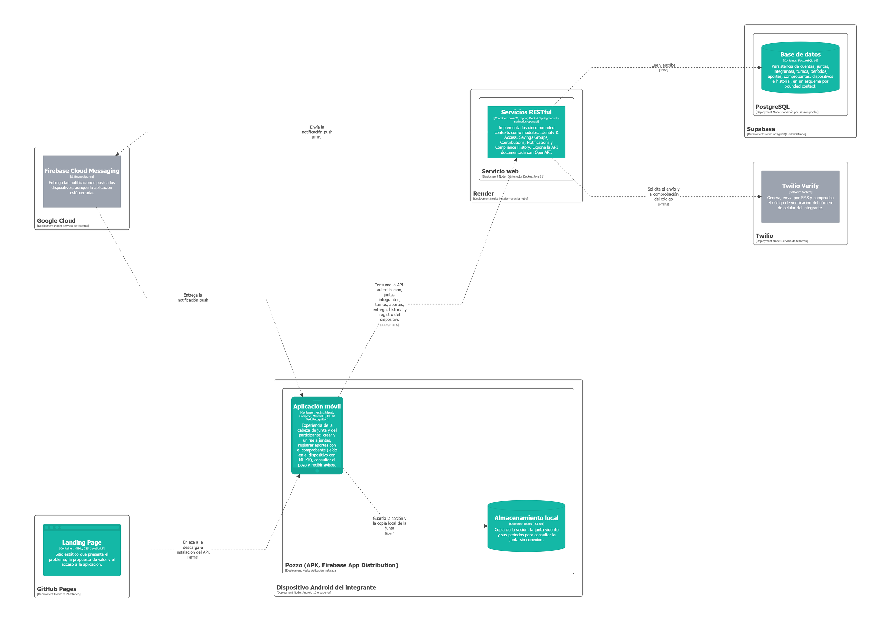
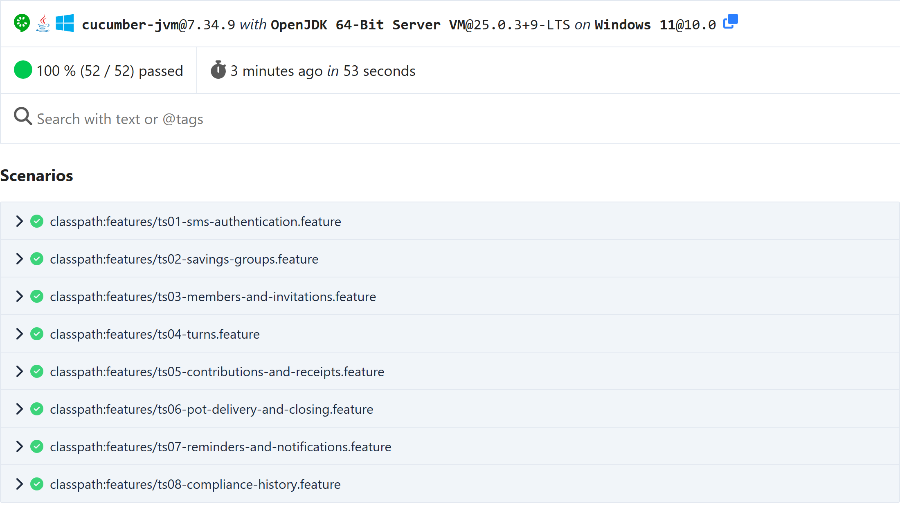
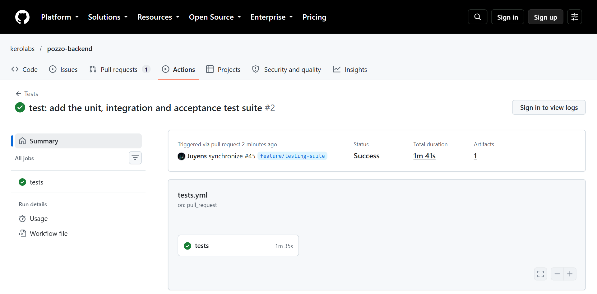
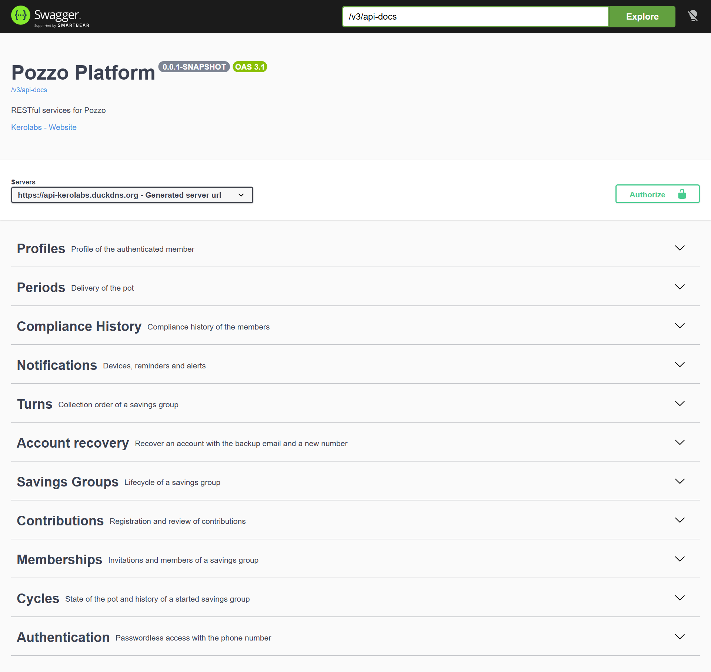
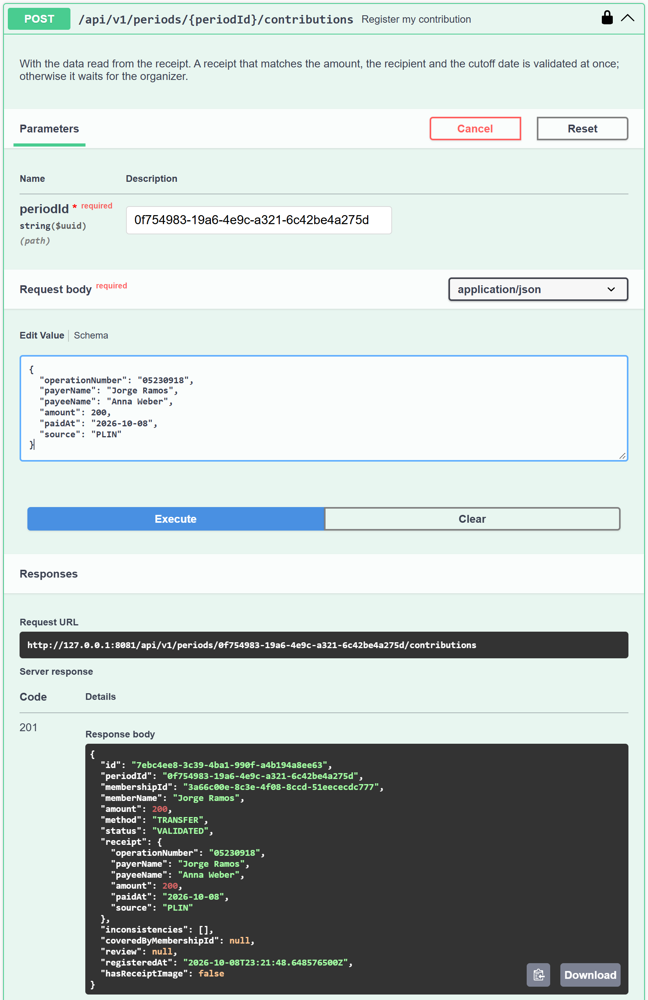
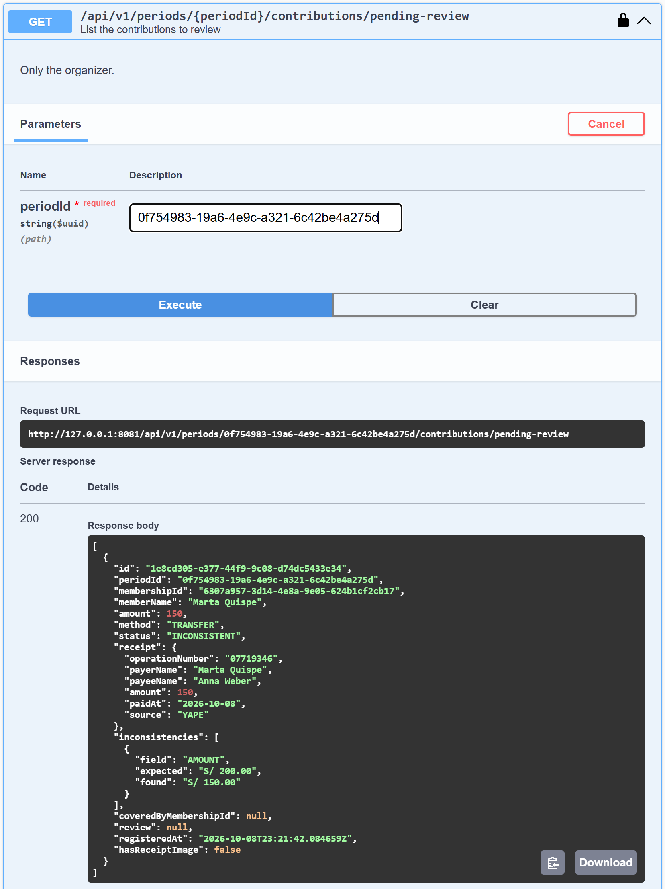
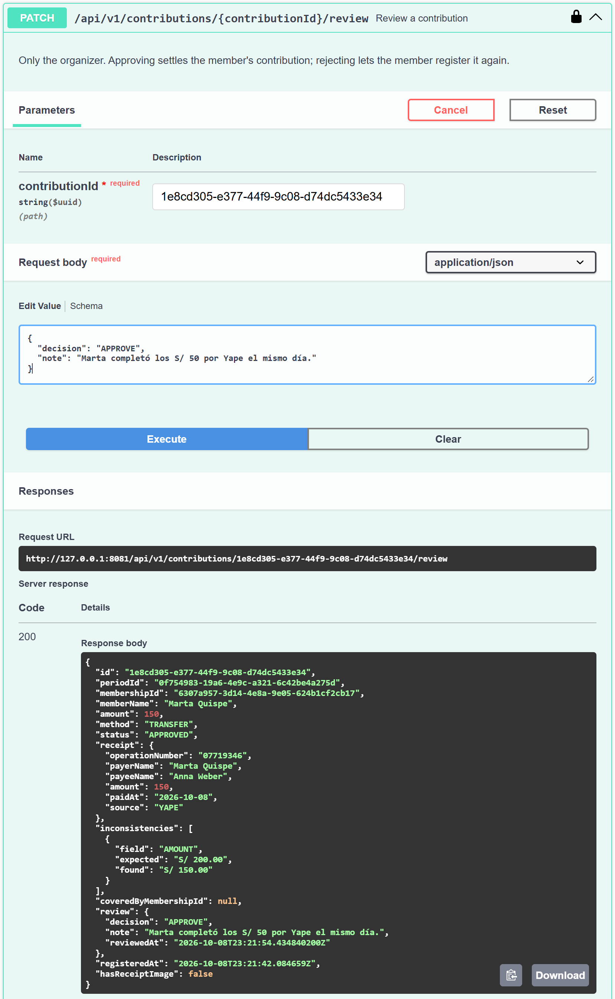
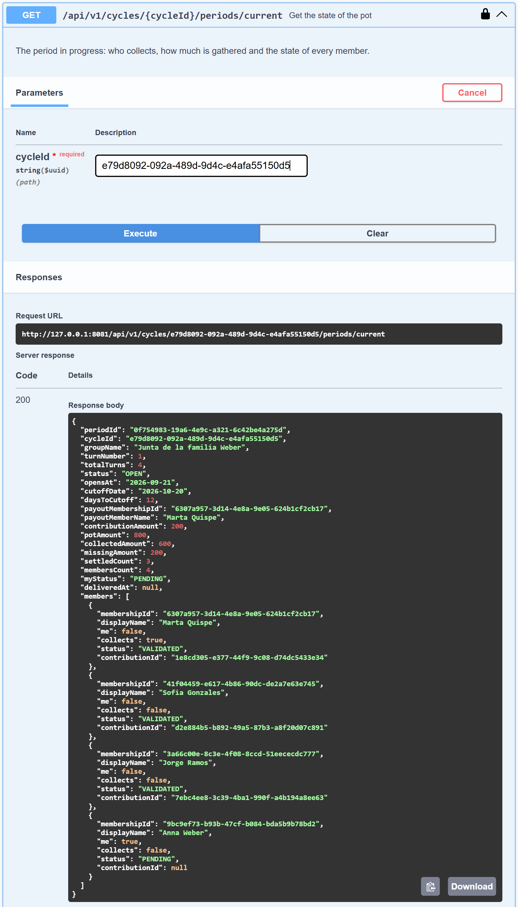

# Capítulo IV: Product Implementation & Validation

## 4.1. Software Configuration Management

En esta sección se fijan las decisiones que mantienen consistentes los productos de Pozzo durante todo el ciclo de vida: con qué herramientas trabaja el equipo, cómo se organiza y protege el código fuente, qué convenciones siguen el código y los mensajes de commit, y cómo se despliega cada producto a partir de su repositorio. Pozzo se compone de cinco productos, cada uno con su repositorio en la organización `kerolabs` de GitHub: el landing page, los servicios RESTful, la aplicación móvil, las páginas públicas de los enlaces que comparte la aplicación y este informe.

### 4.1.1. Software Development Environment Configuration

El equipo trabaja con las herramientas de la Tabla 133, agrupadas por la actividad del ciclo de vida en la que se usan. Las que funcionan como servicio en la nube se indican con su ruta de referencia; las que se instalan en el computador de cada integrante, con su ruta de descarga. Todas respetan las restricciones de tecnología del curso: UXPressia para personas, journeys, empathy e impact maps; Figma para wireframes, mock-ups y prototipos; Structurizr para el C4 Model; Kotlin nativo para Android; Spring Boot para los servicios; OpenAPI con Swagger para su documentación, y Trello para la gestión del backlog.

<table>
  <caption>Herramientas del entorno de desarrollo por actividad del ciclo de vida</caption>
  <colgroup><col width="17%"><col width="18%"><col width="40%"><col width="25%"></colgroup>
  <thead>
    <tr>
      <th>Actividad</th>
      <th>Producto</th>
      <th>Propósito en Pozzo</th>
      <th>Ruta</th>
    </tr>
  </thead>
  <tbody>
    <tr>
      <td rowspan="2">Project Management</td>
      <td>Trello</td>
      <td>Tablero del Product Backlog y de cada Sprint Backlog, con el estado de cada User Story y de sus tareas.</td>
      <td><a href="https://trello.com/b/fRocSVZA/pozzo-product-backlog">trello.com/b/fRocSVZA</a></td>
    </tr>
    <tr>
      <td>GitHub</td>
      <td>Organización <code>kerolabs</code>: repositorios, Pull Requests, revisión de código y analíticos de colaboración.</td>
      <td><a href="https://github.com/kerolabs">github.com/kerolabs</a></td>
    </tr>
    <tr>
      <td rowspan="3">Requirements Management</td>
      <td>Miro</td>
      <td>Big Picture EventStorming, descubrimiento de bounded contexts, flujos de mensajes y Bounded Context Canvases.</td>
      <td><a href="https://miro.com/app/board/uXjVHm8In_g=/">miro.com</a></td>
    </tr>
    <tr>
      <td>UXPressia</td>
      <td>User Personas, Empathy Maps, User Journey Maps e Impact Maps.</td>
      <td><a href="https://uxpressia.com">uxpressia.com</a></td>
    </tr>
    <tr>
      <td>Trello</td>
      <td>Registro de las User Stories, Technical Stories y Spike Stories priorizadas del Product Backlog.</td>
      <td><a href="https://trello.com/b/fRocSVZA/pozzo-product-backlog">trello.com/b/fRocSVZA</a></td>
    </tr>
    <tr>
      <td>Product UX/UI Design</td>
      <td>Figma</td>
      <td>Guía de estilo, wireframes y mock-ups del landing page y de la aplicación, wireflows, user flows y prototipo navegable, en un solo archivo.</td>
      <td><a href="https://www.figma.com/design/8KoGtoEQuWzHgtOih3hTgF/">figma.com</a></td>
    </tr>
    <tr>
      <td rowspan="6">Software Development</td>
      <td>Git</td>
      <td>Control de versiones local de todos los repositorios.</td>
      <td><a href="https://git-scm.com/downloads">git-scm.com/downloads</a></td>
    </tr>
    <tr>
      <td>Android Studio</td>
      <td>Desarrollo de la aplicación móvil en Kotlin con Jetpack Compose, emulador de pruebas y generación del APK firmado.</td>
      <td><a href="https://developer.android.com/studio">developer.android.com/studio</a></td>
    </tr>
    <tr>
      <td>IntelliJ IDEA</td>
      <td>Desarrollo de los servicios RESTful en Java 21 con Spring Boot 4.1 y Maven.</td>
      <td><a href="https://www.jetbrains.com/idea/download">jetbrains.com/idea/download</a></td>
    </tr>
    <tr>
      <td>Eclipse Temurin JDK 21</td>
      <td>Compilación y ejecución local de los servicios; la misma versión que usa el servidor.</td>
      <td><a href="https://adoptium.net">adoptium.net</a></td>
    </tr>
    <tr>
      <td>Visual Studio Code</td>
      <td>Edición del landing page (HTML5, CSS3 y JavaScript), de las páginas públicas de enlaces y de este informe en Markdown.</td>
      <td><a href="https://code.visualstudio.com/download">code.visualstudio.com/download</a></td>
    </tr>
    <tr>
      <td>Supabase</td>
      <td>PostgreSQL de los cinco bounded contexts, con un esquema por contexto, y almacenamiento de fotos de perfil y de imágenes de comprobantes.</td>
      <td><a href="https://supabase.com/dashboard">supabase.com/dashboard</a></td>
    </tr>
    <tr>
      <td rowspan="4">Software Testing</td>
      <td>JUnit 6 y Spring Boot Test</td>
      <td>Pruebas unitarias del dominio y pruebas de integración de los servicios.</td>
      <td><a href="https://junit.org">junit.org</a></td>
    </tr>
    <tr>
      <td>Testcontainers</td>
      <td>Levanta PostgreSQL en un contenedor de Docker para las pruebas de integración y de aceptación, con el mismo motor de producción.</td>
      <td><a href="https://testcontainers.com">testcontainers.com</a></td>
    </tr>
    <tr>
      <td>Cucumber</td>
      <td>Pruebas de aceptación escritas en Gherkin a partir de los criterios de aceptación de las Technical Stories.</td>
      <td><a href="https://cucumber.io/docs/installation/java">cucumber.io</a></td>
    </tr>
    <tr>
      <td>Swagger UI</td>
      <td>Prueba manual de cada endpoint contra el servidor desplegado, con datos de muestra.</td>
      <td><a href="https://api-kerolabs.duckdns.org/swagger-ui.html">api-kerolabs.duckdns.org/swagger-ui.html</a></td>
    </tr>
    <tr>
      <td rowspan="5">Software Deployment</td>
      <td>GitHub Actions</td>
      <td>Comprueba los mensajes de commit en cada push y Pull Request, despliega los servicios en cada merge a <code>main</code> y compila este informe a PDF en cada entrega.</td>
      <td><a href="https://github.com/features/actions">github.com/features/actions</a></td>
    </tr>
    <tr>
      <td>Oracle Cloud Infrastructure</td>
      <td>Instancia Always Free con Ubuntu 24.04 donde corren los servicios RESTful, detrás de Caddy.</td>
      <td><a href="https://cloud.oracle.com">cloud.oracle.com</a></td>
    </tr>
    <tr>
      <td>DuckDNS</td>
      <td>Nombre de dominio <code>api-kerolabs.duckdns.org</code> que apunta a la instancia.</td>
      <td><a href="https://www.duckdns.org">duckdns.org</a></td>
    </tr>
    <tr>
      <td>GitHub Pages</td>
      <td>Publicación del landing page y de las páginas públicas de los enlaces de invitación e historial.</td>
      <td><a href="https://pages.github.com">pages.github.com</a></td>
    </tr>
    <tr>
      <td>Firebase</td>
      <td>Cloud Messaging para las notificaciones push y App Distribution para entregar la aplicación a quienes la prueban.</td>
      <td><a href="https://console.firebase.google.com">console.firebase.google.com</a></td>
    </tr>
    <tr>
      <td rowspan="4">Software Documentation</td>
      <td>springdoc-openapi</td>
      <td>Genera la especificación OpenAPI de los servicios a partir del código y la publica con Swagger UI.</td>
      <td><a href="https://springdoc.org">springdoc.org</a></td>
    </tr>
    <tr>
      <td>Structurizr</td>
      <td>Diagramas del C4 Model escritos como código en <code>docs/architecture/workspace.dsl</code>.</td>
      <td><a href="https://structurizr.com">structurizr.com</a></td>
    </tr>
    <tr>
      <td>PlantUML</td>
      <td>Diagramas de clases del dominio y de base de datos de cada bounded context.</td>
      <td><a href="https://plantuml.com">plantuml.com</a></td>
    </tr>
    <tr>
      <td>Pandoc y XeLaTeX</td>
      <td>Convierten este informe de Markdown a PDF con formato APA 7.</td>
      <td><a href="https://pandoc.org/installing.html">pandoc.org/installing.html</a></td>
    </tr>
  </tbody>
</table>

### 4.1.2. Source Code Management

El código de Pozzo se versiona con Git y se aloja en GitHub, en la organización `kerolabs`. Cada producto tiene su propio repositorio, de modo que se versiona, se revisa y se despliega por separado. El repositorio de los servicios RESTful incluye, junto al proyecto, sus pruebas unitarias, de integración y de aceptación (ver Tabla 134).

<table>
  <caption>Repositorios de los productos de Pozzo en la organización kerolabs</caption>
  <colgroup><col width="28%"><col width="32%"><col width="40%"></colgroup>
  <thead>
    <tr>
      <th>Producto</th>
      <th>Repositorio</th>
      <th>Contenido</th>
    </tr>
  </thead>
  <tbody>
    <tr>
      <td>Landing Page</td>
      <td><a href="https://github.com/kerolabs/pozzo-landing-page">kerolabs/pozzo-landing-page</a></td>
      <td>Sitio estático en HTML5, CSS3 y JavaScript, en inglés y español.</td>
    </tr>
    <tr>
      <td>Web Services</td>
      <td><a href="https://github.com/kerolabs/pozzo-backend">kerolabs/pozzo-backend</a></td>
      <td>Servicios RESTful en Spring Boot con sus pruebas, el workflow de despliegue y la configuración del servidor.</td>
    </tr>
    <tr>
      <td>Mobile Application</td>
      <td><a href="https://github.com/kerolabs/pozzo-mobile">kerolabs/pozzo-mobile</a></td>
      <td>Aplicación Android en Kotlin con Jetpack Compose.</td>
    </tr>
    <tr>
      <td>Páginas públicas de enlaces</td>
      <td><a href="https://github.com/kerolabs/kerolabs.github.io">kerolabs/kerolabs.github.io</a></td>
      <td>Páginas que abren los enlaces de invitación a una junta y de historial compartido.</td>
    </tr>
    <tr>
      <td>Informe</td>
      <td><a href="https://github.com/kerolabs/pozzo-doc">kerolabs/pozzo-doc</a></td>
      <td>Este documento en Markdown, los diagramas como código y la configuración que lo compila a PDF.</td>
    </tr>
  </tbody>
</table>

El flujo de trabajo sigue GitFlow [@driessen2010gitflow]. Además de la rama principal, cada repositorio tiene una rama de integración y ramas de vida corta para cada cambio (ver Tabla 135):

<table>
  <caption>Ramas de GitFlow en los repositorios de Pozzo</caption>
  <colgroup><col width="20%"><col width="18%"><col width="62%"></colgroup>
  <thead>
    <tr>
      <th>Rama</th>
      <th>Sale de</th>
      <th>Uso y convención de nombre</th>
    </tr>
  </thead>
  <tbody>
    <tr>
      <td><code>main</code></td>
      <td>(permanente)</td>
      <td>Solo estados entregables. En los servicios RESTful, cada merge a <code>main</code> se despliega en el servidor; en el landing page y en las páginas de enlaces, lo publica GitHub Pages.</td>
    </tr>
    <tr>
      <td><code>develop</code></td>
      <td>(permanente)</td>
      <td>Integra el trabajo terminado del equipo. Es la base de todas las ramas de trabajo.</td>
    </tr>
    <tr>
      <td><code>feature/&lt;nombre&gt;</code></td>
      <td><code>develop</code></td>
      <td>Una por funcionalidad, con el nombre en inglés y en kebab-case según lo que agrega: <code>feature/receipts-and-group-notices</code>, <code>feature/group-management</code>. En el informe llevan además el número de la sección: <code>feature/4-1-configuration-management</code>. Vuelven a <code>develop</code> por Pull Request.</td>
    </tr>
    <tr>
      <td><code>fix/</code>, <code>chore/</code>, <code>ci/&lt;nombre&gt;</code></td>
      <td><code>develop</code></td>
      <td>Correcciones que no son urgentes, cambios de configuración y cambios de los workflows, con la misma convención: <code>fix/device-registration-race</code>, <code>chore/oracle-backend</code>, <code>ci/deploy-oracle</code>.</td>
    </tr>
    <tr>
      <td><code>release/&lt;versión&gt;</code></td>
      <td><code>develop</code></td>
      <td>Prepara una entrega: solo admite el número de versión y correcciones de último momento. Se mergea a <code>main</code>, se etiqueta con su versión y se mergea de vuelta a <code>develop</code>. Ejemplo: <code>release/0.1.0</code>.</td>
    </tr>
    <tr>
      <td><code>hotfix/&lt;versión&gt;</code></td>
      <td><code>main</code></td>
      <td>Corrige un error en producción sin esperar la siguiente entrega. Sube el número de parche, se mergea a <code>main</code> y a <code>develop</code> y se etiqueta. Ejemplo: <code>hotfix/0.1.1</code>.</td>
    </tr>
  </tbody>
</table>

Los releases se nombran con Semantic Versioning 2.0.0 [@preston2013semver]: `MAJOR.MINOR.PATCH`, con la etiqueta `v` delante (`v0.1.0`). Mientras el producto se construye la versión mayor es 0, y cada entrega con un Sprint terminado sube la versión menor: `v0.1.0` en la TB1 (Sprint 1) y `v0.2.0` en la AV2 (Sprint 2). La TB2, que es el Release Review, publica la `v1.0.0`. Las correcciones urgentes entre entregas suben solo el parche. El informe usa como etiqueta el nombre de la entrega (`av1`, `tb1`), porque cada una dispara la compilación de su PDF.

Los mensajes de commit siguen Conventional Commits [@conventionalcommits2019]: un tipo, dos puntos y qué hace el cambio, en inglés. Los tipos admitidos son `feat`, `fix`, `docs`, `style`, `refactor`, `perf`, `test`, `build`, `ci`, `chore` y `revert`, con un ámbito opcional entre paréntesis.

```
feat: keep receipt images in a private bucket and show them through signed links
fix: retry a device registration that collided with a simultaneous one
ci: deploy main to the Oracle Cloud instance through a restricted SSH key
```

Tres mecanismos hacen que estas reglas se cumplan y no dependan de la memoria de cada integrante:

- **Workflow `commit-policy`.** Corre en GitHub Actions con cada push y cada Pull Request de todos los repositorios, y rechaza los commits que no siguen el formato. También rechaza los pies que algunas herramientas añaden solas al mensaje, porque cada commit debe atribuirse a un integrante del equipo.
- **Hook `commit-msg`.** Aplica las mismas reglas en el computador del integrante, al momento de hacer el commit, para que el error se corrija antes de subirlo.
- **Protección de ramas.** `main` y `develop` rechazan los pushes directos en todos los repositorios, también los de los administradores. Todo cambio entra por Pull Request y solo se puede mergear con el check `commit-policy` en verde. Al terminar, la rama de trabajo se borra.

### 4.1.3. Source Code Style Guide & Conventions

Todo el código de Pozzo se escribe en inglés: nombres de clases, funciones, variables, archivos, rutas de la API, comentarios y mensajes de commit. El español queda para los textos que ve el usuario (pantallas, notificaciones, mensajes de error de la API) y para este informe. Sobre esa base, cada lenguaje sigue una guía de referencia (ver Tabla 136):

<table>
  <caption>Guías de estilo de referencia por lenguaje</caption>
  <colgroup><col width="17%"><col width="27%"><col width="56%"></colgroup>
  <thead>
    <tr>
      <th>Lenguaje</th>
      <th>Guía de referencia</th>
      <th>Convenciones que aplica Pozzo</th>
    </tr>
  </thead>
  <tbody>
    <tr>
      <td>Kotlin (aplicación móvil)</td>
      <td>Kotlin Coding Conventions [@kotlin2026conventions] y Android Kotlin Style Guide [@android2026kotlinstyle]</td>
      <td>Clases y composables en PascalCase; funciones y propiedades en camelCase; constantes en UPPER_SNAKE_CASE. Un paquete por bounded context dentro de <code>features</code>, con las capas <code>domain</code>, <code>application</code>, <code>infrastructure</code> y <code>presentation</code>. Las pantallas terminan en <code>Screen</code>, sus view models en <code>ViewModel</code> y los casos de uso en <code>UseCase</code>.</td>
    </tr>
    <tr>
      <td>Java (servicios RESTful)</td>
      <td>Google Java Style Guide [@google2026javastyle] y Spring Boot Reference Documentation [@spring2026boot]</td>
      <td>Nomenclatura de la guía de Google, con sangría de cuatro espacios como el código de Spring. Un paquete por bounded context con las capas <code>domain</code>, <code>application</code>, <code>infrastructure</code> e <code>interfaces</code>. Commands, queries, events y resources son records y terminan en <code>Command</code>, <code>Query</code>, <code>Event</code> y <code>Resource</code>. Las rutas de la API van en plural y en kebab-case bajo <code>/api/v1</code>, por ejemplo <code>/api/v1/groups/{groupId}/members</code>.</td>
    </tr>
    <tr>
      <td>HTML, CSS y JavaScript (landing page y páginas de enlaces)</td>
      <td>Google HTML/CSS Style Guide [@google2026htmlcss]</td>
      <td>Elementos semánticos (<code>header</code>, <code>main</code>, <code>section</code>, <code>footer</code>), etiquetas y atributos en minúsculas y sangría de dos espacios. Clases con la convención Block Element Modifier (<code>brand__logo</code>, <code>brand__logo--dark</code>). Colores, espaciados y tipografía como variables CSS; JavaScript sin dependencias, con <code>const</code> y <code>let</code>.</td>
    </tr>
    <tr>
      <td>Gherkin (pruebas de aceptación)</td>
      <td>Gherkin Reference [@cucumber2026gherkin]</td>
      <td>Un archivo <code>.feature</code> por User Story, con su identificador en el nombre (<code>us23-register-contribution.feature</code>). Palabras clave y pasos en inglés; cada escenario sigue la estructura Given, When, Then de los criterios de aceptación de su User Story.</td>
    </tr>
    <tr>
      <td>Markdown (informe)</td>
      <td>Guía para contribuir del repositorio <code>pozzo-doc</code></td>
      <td>Numeración de títulos escrita a mano, tablas en HTML, imágenes con ruta relativa y citas desde <code>references.bib</code>, para que el mismo archivo se lea en GitHub y se compile a PDF.</td>
    </tr>
  </tbody>
</table>

Los comentarios explican por qué el código hace algo y no qué hace, que ya se lee en el código. Las clases públicas llevan un comentario de documentación (Javadoc o KDoc) que dice qué representan en el dominio, usando los términos del Ubiquitous Language (sección Ubiquitous Language).

### 4.1.4. Software Deployment Configuration

Cada producto se despliega a partir de la rama `main` de su repositorio. Para los servicios RESTful y las páginas web el despliegue es automático: basta con mergear la Pull Request de la entrega. La aplicación móvil se compila y firma en el computador de un integrante y se distribuye como APK.

**Landing Page.** GitHub Pages publica el contenido de la rama `main` de `pozzo-landing-page` en <https://kerolabs.github.io/pozzo-landing-page/>. El sitio no tiene compilación: al mergear a `main`, el workflow `pages-build-deployment` de GitHub publica los archivos tal como están, en uno o dos minutos.

**Páginas públicas de enlaces.** El repositorio `kerolabs.github.io` se publica igual, en la raíz del dominio <https://kerolabs.github.io>. Sirve dos páginas: `unirme`, que muestra el código de una invitación y cómo unirse desde la aplicación, e `historial`, que lee de los servicios el resumen de cumplimiento que un integrante compartió. El archivo `.nojekyll` evita que GitHub Pages ignore las carpetas que empiezan con punto, donde irán los archivos de verificación de Android App Links.

**Web Services.** Los servicios RESTful corren en una instancia Always Free de Oracle Cloud Infrastructure (1 GB de memoria y Ubuntu 24.04), que a diferencia de los planes gratuitos de otras plataformas no se suspende cuando no recibe tráfico. La instancia se preparó una sola vez con el script `deploy/oracle-setup.sh` del repositorio, que deja:

- Java 21, una memoria de intercambio de 2 GB y los puertos 80 y 443 abiertos, tanto en el firewall del sistema como en la Security List de la red de Oracle.
- Caddy como proxy inverso, que obtiene y renueva solo el certificado HTTPS de Let's Encrypt para <https://api-kerolabs.duckdns.org>, el nombre que DuckDNS resuelve a la dirección de la instancia.
- El servicio `pozzo` de systemd, que ejecuta el jar con un usuario sin acceso a consola, escucha solo en `127.0.0.1:8080` detrás de Caddy y se reinicia solo si falla.
- La configuración en `/etc/pozzo/pozzo.env`, que solo leen el servicio y el administrador: conexión a la base de datos, clave de firma de las sesiones y credenciales de SMS Gate (códigos por SMS), Brevo (correos de recuperación), Firebase Cloud Messaging (notificaciones push) y Supabase Storage (imágenes).

Con la instancia preparada, el workflow `deploy.yml` despliega cada merge a `main`:

1. Compila el jar con Java 21 en un runner de GitHub. La instancia no compila nada.
2. Se conecta por SSH con una llave dedicada al usuario `deploy`. Esa llave solo puede ejecutar el script que recibe el jar: no abre consola ni túneles, y el workflow verifica la huella del servidor antes de conectarse.
3. El servidor instala la nueva versión, reinicia el servicio y espera hasta cinco minutos a que `/actuator/health` responda `UP`, mientras envía al workflow el log del arranque. Si la versión nueva no arranca, vuelve a la anterior y el workflow falla.

El estado de los despliegues, los recursos de la instancia y el log en vivo de los servicios se consultan en <https://api-kerolabs.duckdns.org/status>, una página protegida con usuario y contraseña. La documentación OpenAPI se publica en <https://api-kerolabs.duckdns.org/swagger-ui.html>.

**Base de datos y almacenamiento.** PostgreSQL corre en Supabase, con un esquema por bounded context, y los servicios se conectan por el session pooler. Supabase Storage guarda las fotos de perfil en un bucket público y las imágenes de los comprobantes en uno privado, que solo se leen con enlaces firmados que vencen a los quince minutos.

**Mobile Application.** La aplicación tiene dos variantes. `cloud`, la predeterminada, apunta a los servicios desplegados; `local` apunta a los servicios corriendo en el computador del integrante y se instala aparte, para que las dos convivan en el mismo celular. El APK de entrega se genera en Android Studio con la variante `cloudRelease`, firmado con la llave de la aplicación, que se guarda fuera del repositorio. El proyecto de Firebase `kerolabs-pozzo` provee las notificaciones push y, para la entrega final, la distribución de la aplicación a quienes la prueban mediante Firebase App Distribution.

El diagrama de despliegue del C4 Model resume dónde corre cada contenedor de la solución (ver Figura 138):

{width=85%}

## 4.2. Landing Page & Mobile Application Implementation

### 4.2.1. Sprint 1

#### 4.2.1.1. Sprint Planning 1

#### 4.2.1.2. Aspect Leaders and Collaborators

#### 4.2.1.3. Sprint Backlog 1

#### 4.2.1.4. Development Evidence for Sprint Review

#### 4.2.1.5. Testing Suite Evidence for Sprint Review

En este Sprint se construyó la suite de pruebas automatizadas de los servicios RESTful en tres niveles: pruebas unitarias del dominio, pruebas de integración del API REST y pruebas de aceptación escritas en Gherkin con el enfoque BDD. Las pruebas de aceptación se relacionan con las Technical Stories TS01 a TS08, que son las historias de los servicios: cada una tiene un archivo `.feature` con los escenarios de request y response de sus criterios de aceptación. La suite suma 14 clases de pruebas unitarias con 72 métodos, 3 clases de integración con 15 métodos y 52 escenarios de aceptación, y todas pasan.

Las pruebas usan JUnit 6 y AssertJ; las de aceptación, Cucumber. Las de integración y las de aceptación arrancan la aplicación completa contra PostgreSQL 16, el mismo motor de producción, que Testcontainers levanta en un contenedor para cada ejecución, y llaman a los endpoints con MockMvc, así que cada solicitud pasa por la seguridad, la validación, los controllers y la base de datos. Ninguna prueba envía SMS, correos ni notificaciones reales: el correo y las notificaciones push quedan en el registro de la aplicación, y el envío de SMS se reemplaza por uno que guarda el mensaje, del que la prueba lee el código como lo leería el integrante en su celular. Un reloj que la prueba adelanta permite comprobar las reglas de 30 segundos y de 10 minutos sin esperar.

Las pruebas están en el repositorio de los servicios, en la carpeta `src/test`: <https://github.com/kerolabs/pozzo-backend/tree/develop/src/test>. Se ejecutan con `./mvnw test`, y el workflow `Tests` de GitHub Actions las corre en cada pull request y en cada push a `develop` y `main`.

La aplicación móvil, en cambio, solo tiene por ahora pruebas unitarias del lector de comprobantes. Es la carencia más común en el desarrollo Android: un estudio sobre 2965 aplicaciones Android de código abierto y una encuesta a sus desarrolladores encontró poca adopción de pruebas automatizadas, pocas herramientas en uso y baja cobertura de código y de API [@mahmud2025androidtesting]. Ampliar las pruebas de la aplicación queda para el siguiente Sprint.

**Unit Tests.** Prueban las reglas del dominio sin Spring ni base de datos: los aggregates, los value objects y los domain services de los cinco bounded contexts. La Tabla 137 indica la clase y los comportamientos que verifica cada clase de prueba.

<table>
  <caption>Pruebas unitarias del dominio</caption>
  <colgroup><col width="24%"><col width="22%"><col width="54%"></colgroup>
  <thead>
    <tr>
      <th>Clase de prueba</th>
      <th>Clase probada</th>
      <th>Comportamientos verificados</th>
    </tr>
  </thead>
  <tbody>
    <tr>
      <td><code>ContributionTest</code></td>
      <td>Contribution (Contributions)</td>
      <td>Valida en el acto un comprobante que coincide en monto, destinatario y fecha; marca como INCONSISTENT el que no coincide e indica cada campo; acepta el pago hecho el mismo día de corte; la aprobación de la cabeza salda el aporte y el rechazo permite registrarlo de nuevo; solo se revisa un aporte que está en revisión; el efectivo es válido sin comprobante; la cobertura registra quién puso el dinero y nadie se cubre a sí mismo; solo una transferencia guarda la imagen de su comprobante.</td>
    </tr>
    <tr>
      <td><code>PeriodTest</code></td>
      <td>Period (Contributions)</td>
      <td>Cada integrante debe el aporte, incluido quien cobra; la fecha de corte de cada turno; el pozo se completa con el último aporte; nadie salda dos veces el mismo período ni salda quien no es del ciclo; el pozo no se entrega incompleto y se entrega una sola vez.</td>
    </tr>
    <tr>
      <td><code>CycleTest</code></td>
      <td>Cycle (Contributions)</td>
      <td>Empieza activo en el turno 1; necesita al menos dos integrantes; no se cierra antes del último turno y se cierra cuando todos cobraron.</td>
    </tr>
    <tr>
      <td><code>MoneyTest</code></td>
      <td>Money (Contributions)</td>
      <td>Guarda dos decimales y se muestra en soles; suma y resta sin bajar de cero; rechaza montos negativos, más de dos decimales y la mezcla de monedas.</td>
    </tr>
    <tr>
      <td><code>PaymentReceiptTest</code></td>
      <td>PaymentReceipt (Contributions)</td>
      <td>Reconoce al destinatario sin importar mayúsculas, tildes ni el apellido enmascarado que muestran Yape y Plin, y no lo confunde con otra persona.</td>
    </tr>
    <tr>
      <td><code>SavingsGroupTest</code></td>
      <td>SavingsGroup (Savings Groups)</td>
      <td>Nace en DRAFT con quien la crea como cabeza; avisa cuando se ocupa el último cupo; rechaza unirse sin cupo o dos veces; un integrante retirado vuelve con la misma membresía; la cabeza no puede retirarse; un integrante sin la aplicación ocupa un cupo; los cupos no bajan de los integrantes; el cambio de reglas se avisa; los turnos dan uno a cada integrante; no inicia sin estar llena, con turnos y con destino; una vez iniciada ya no cambia.</td>
    </tr>
    <tr>
      <td><code>GroupRulesTest</code></td>
      <td>GroupRules, Destination (Savings Groups)</td>
      <td>Acepta de 2 a 50 cupos; el pozo es el aporte por los cupos; la fecha de corte de cada turno según la periodicidad; el destino es un celular peruano.</td>
    </tr>
    <tr>
      <td><code>InvitationCodeTest</code></td>
      <td>InvitationCode (Savings Groups)</td>
      <td>El código empieza con las iniciales de la junta y no usa caracteres que se confunden, en 20 repeticiones; usa las primeras letras cuando el nombre tiene una palabra; lee un código escrito sin guion o en minúsculas; rechaza el largo incorrecto.</td>
    </tr>
    <tr>
      <td><code>SeededTurnAssignmentServiceTest</code></td>
      <td>SeededTurnAssignmentService (Savings Groups)</td>
      <td>Da a cada integrante un turno del 1 al número de integrantes; la misma semilla da siempre el mismo orden y otra semilla, otro; el orden acordado respeta el que envió la cabeza.</td>
    </tr>
    <tr>
      <td><code>VerificationCodeTest</code></td>
      <td>VerificationCode (Identity &amp; Access)</td>
      <td>Dura diez minutos y se puede reemplazar a los 30 segundos; el código correcto verifica el celular; uno incorrecto resta intentos y el tercero lo bloquea; no acepta un código vencido ni uno reemplazado.</td>
    </tr>
    <tr>
      <td><code>PhoneNumberTest</code></td>
      <td>PhoneNumber (Identity &amp; Access)</td>
      <td>Acepta un celular peruano de nueve dígitos con o sin espacios y rechaza los que no lo son o son de otro país.</td>
    </tr>
    <tr>
      <td><code>ThresholdComplianceScoringServiceTest</code></td>
      <td>ThresholdComplianceScoringService (Compliance History)</td>
      <td>Sin aportes el nivel es NEW; los aportes atrasados y cubiertos bajan la tasa; EXCELLENT pide 90 % y tres ciclos completados; bajo 60 % es RISKY y desde 60 % es REGULAR; una deserción lo vuelve RISKY.</td>
    </tr>
    <tr>
      <td><code>ShareLinkTest</code></td>
      <td>ShareLink (Compliance History)</td>
      <td>El enlace funciona siete días, deja de funcionar al revocarlo y cada uno tiene su propio token.</td>
    </tr>
    <tr>
      <td><code>ReminderPlanTest</code></td>
      <td>ReminderPlan (Notifications)</td>
      <td>Recuerda tres días antes, un día antes y el día de corte a las 9:00; la cabeza elige los días y la hora; un plan desactivado no programa nada; rechaza días repetidos o fuera de rango y horas inválidas.</td>
    </tr>
  </tbody>
</table>

**Integration Tests.** Prueban que las capas y los bounded contexts funcionen juntos: la seguridad, los controllers, la persistencia en PostgreSQL y los eventos que llevan un aporte de Contributions a Compliance History y a Notifications después de confirmar la transacción. La Tabla 138 los detalla.

<table>
  <caption>Pruebas de integración del API REST</caption>
  <colgroup><col width="26%"><col width="24%"><col width="50%"></colgroup>
  <thead>
    <tr>
      <th>Clase de prueba</th>
      <th>Qué integra</th>
      <th>Comportamientos verificados</th>
    </tr>
  </thead>
  <tbody>
    <tr>
      <td><code>AuthenticationIntegrationTest</code></td>
      <td>Seguridad, Identity &amp; Access y PostgreSQL</td>
      <td>Un endpoint protegido sin token responde 401 con el cuerpo de error común; el integrante registrado lee su perfil con su token; verificar el código de una cuenta que ya existe abre una sesión; un código incorrecto se rechaza y el tercero lo bloquea; no se envía otro código antes de 30 segundos; tras cerrar sesión el token deja de servir.</td>
    </tr>
    <tr>
      <td><code>SavingsGroupsIntegrationTest</code></td>
      <td>Savings Groups, Contributions y PostgreSQL</td>
      <td>La junta creada se guarda y aparece en las juntas de su cabeza; un integrante se une con el código y aparece en la lista; alguien ajeno a la junta no la ve; los cupos no bajan de los integrantes; iniciar la junta la congela y abre el primer período en Contributions.</td>
    </tr>
    <tr>
      <td><code>ContributionsIntegrationTest</code></td>
      <td>Contributions, Compliance History, Notifications y PostgreSQL</td>
      <td>Un aporte validado suma al pozo; un comprobante no se usa dos veces en la junta; el aporte validado entra al historial de cumplimiento del integrante; un comprobante con diferencias avisa a la cabeza de la junta.</td>
    </tr>
    <tr>
      <td><code>PozzoApplicationTests</code></td>
      <td>Toda la aplicación</td>
      <td>El contexto de Spring arranca con todos sus componentes contra PostgreSQL.</td>
    </tr>
  </tbody>
</table>

**Acceptance Tests.** Siguen el enfoque BDD: cada Technical Story tiene un archivo `.feature` en `src/test/resources/features`, con su identificador en el nombre, y sus escenarios repiten los criterios de aceptación de la historia en Gherkin, en inglés, como lo fija la guía de estilo. Los archivos Steps están en Java, en el paquete `pe.kerolabs.pozzo.acceptance`: una clase por grupo de historias y `CommonSteps` con los pasos que comparten, como crear la cuenta de un integrante o comprobar el código de la respuesta. La Tabla 139 relaciona cada archivo con su Technical Story y su clase de Steps.

<table>
  <caption>Archivos .feature de las pruebas de aceptación</caption>
  <colgroup><col width="36%"><col width="32%"><col width="21%"><col width="11%"></colgroup>
  <thead>
    <tr>
      <th>Archivo .feature</th>
      <th>Technical Story</th>
      <th>Steps</th>
      <th>Escenarios</th>
    </tr>
  </thead>
  <tbody>
    <tr>
      <td>ts01-sms-authentication.feature</td>
      <td>TS01. Servicio de autenticación por SMS</td>
      <td>AuthenticationSteps</td>
      <td>8</td>
    </tr>
    <tr>
      <td>ts02-savings-groups.feature</td>
      <td>TS02. Servicio de juntas</td>
      <td>SavingsGroupSteps</td>
      <td>7</td>
    </tr>
    <tr>
      <td>ts03-members-and-invitations.feature</td>
      <td>TS03. Servicio de integrantes e invitaciones</td>
      <td>SavingsGroupSteps</td>
      <td>9</td>
    </tr>
    <tr>
      <td>ts04-turns.feature</td>
      <td>TS04. Servicio de turnos y subastas</td>
      <td>SavingsGroupSteps</td>
      <td>3</td>
    </tr>
    <tr>
      <td>ts05-contributions-and-receipts.feature</td>
      <td>TS05. Servicio de aportes y comprobantes</td>
      <td>ContributionSteps</td>
      <td>8</td>
    </tr>
    <tr>
      <td>ts06-pot-delivery-and-closing.feature</td>
      <td>TS06. Servicio de entrega del pozo y cierre</td>
      <td>ContributionSteps</td>
      <td>4</td>
    </tr>
    <tr>
      <td>ts07-reminders-and-notifications.feature</td>
      <td>TS07. Servicio de recordatorios y notificaciones</td>
      <td>NotificationSteps</td>
      <td>7</td>
    </tr>
    <tr>
      <td>ts08-compliance-history.feature</td>
      <td>TS08. Servicio de historial de cumplimiento</td>
      <td>ComplianceSteps</td>
      <td>6</td>
    </tr>
  </tbody>
</table>

Dos criterios de aceptación todavía no tienen escenario porque su endpoint no existe en los servicios: la subasta de turnos de TS04 (ofertas y cierre) y la deserción de TS06. Quedan para el siguiente Sprint. El escenario 2 de TS07, la programación de los recordatorios, se prueba en la prueba unitaria de `ReminderPlan`, porque el envío depende de la hora y no de una solicitud.

A continuación se presenta el código de cada archivo `.feature`.

`ts01-sms-authentication.feature` corresponde a TS01. Servicio de autenticación por SMS y cubre solicitar el código, verificarlo con y sin cuenta, completar el registro, y los casos de código incorrecto, bloqueado, vencido y pedido antes de tiempo.

```
Feature: TS01 SMS authentication service
  As a developer
  I want endpoints to request and verify SMS codes and to issue session tokens
  So that the mobile application signs members in without a password

  Scenario: Request a verification code
    Given a phone number without an account
    When the client requests a verification code for the number
    Then the service responds 202 Accepted
    And an SMS with a six-digit code reaches the number
    And the code expires 10 minutes after the request
    And another code can be requested 30 seconds after the request

  Scenario: Verify the code of a number without an account
    Given a phone number without an account received a verification code
    When the client verifies the number with the code it received
    Then the service responds 200 OK
    And the response asks to complete the registration with a registration token

  Scenario: Complete the registration
    Given a phone number without an account was verified
    When the client completes the registration as "Anna Weber" accepting the terms
    Then the service responds 201 Created
    And the response contains a session token for "Anna Weber"

  Scenario: Verify the code of a number with an account
    Given "Anna Weber" has a Pozzo account
    And 30 seconds have passed
    And "Anna Weber" received a new verification code
    When the client verifies the number of "Anna Weber" with the code it received
    Then the service responds 200 OK
    And the response contains a session token

  Scenario: A wrong code
    Given a phone number without an account received a verification code
    When the client verifies the number with the code "000000"
    Then the service responds 401 Unauthorized
    And the error code is "INVALID_VERIFICATION_CODE"
    And the error says "2 attempts left"

  Scenario: The third wrong code blocks the code
    Given a phone number without an account received a verification code
    And the client verified the number with the code "000000" 2 times
    When the client verifies the number with the code "000000"
    Then the service responds 401 Unauthorized
    And the error code is "BLOCKED_VERIFICATION_CODE"

  Scenario: An expired code
    Given a phone number without an account received a verification code
    And 10 minutes have passed
    When the client verifies the number with the code it received
    Then the service responds 401 Unauthorized
    And the error code is "EXPIRED_VERIFICATION_CODE"

  Scenario: Another code requested too soon
    Given a phone number without an account received a verification code
    When the client requests a verification code for the number
    Then the service responds 429 Too Many Requests
    And the error code is "VERIFICATION_CODE_RESEND_TOO_SOON"
```

`ts02-savings-groups.feature` corresponde a TS02. Servicio de juntas y cubre crear la junta, el rango de cupos, listar las juntas del integrante, iniciar una junta lista y una que no lo está, y el bloqueo de las reglas después del inicio.

```
Feature: TS02 Savings groups service
  As a developer
  I want endpoints to create, read, update and start savings groups
  So that the mobile application manages the life cycle of each group

  Background:
    Given "Anna Weber" has a Pozzo account

  Scenario: Create a savings group
    When "Anna Weber" creates a monthly group "Junta de la familia Weber" of S/ 200 with 4 seats and Yape as destination
    Then the service responds 201 Created
    And the group is in status "DRAFT"
    And "Anna Weber" is its organizer

  Scenario Outline: The number of seats goes from 2 to 50
    When "Anna Weber" creates a monthly group "Junta de la familia Weber" of S/ 200 with <seats> seats and Yape as destination
    Then the service responds 400 Bad Request
    And the error code is "VALIDATION_ERROR"

    Examples:
      | seats |
      | 1     |
      | 51    |

  Scenario: List the groups of the member
    Given "Sofia Gonzales" has a Pozzo account
    And "Anna Weber" started a group with "Sofia Gonzales"
    When "Sofia Gonzales" lists the groups
    Then the service responds 200 OK
    And the list has the group with the role "PARTICIPANT" and a turn

  Scenario: Start a group that is ready
    Given "Sofia Gonzales" has a Pozzo account
    And "Anna Weber" has a group of 2 seats where "Sofia Gonzales" joined
    And "Anna Weber" drew the turns
    When "Anna Weber" starts the group
    Then the service responds 200 OK
    And the group is in status "STARTED"
    And the cycle of the group is open on turn 1

  Scenario: Start a group that is not ready
    Given "Anna Weber" has a group of 2 seats
    When "Anna Weber" starts the group
    Then the service responds 422 Unprocessable Entity
    And the error code is "SAVINGS_GROUP_NOT_READY"

  Scenario: The rules of a started group cannot change
    Given "Sofia Gonzales" has a Pozzo account
    And "Anna Weber" started a group with "Sofia Gonzales"
    When "Anna Weber" changes the contribution of the group to S/ 300
    Then the service responds 422 Unprocessable Entity
    And the error code is "SAVINGS_GROUP_ALREADY_STARTED"
```

`ts03-members-and-invitations.feature` corresponde a TS03. Servicio de integrantes e invitaciones y cubre resolver una invitación válida, inexistente o de una junta iniciada, unirse con cupo, sin cupo o dos veces, el integrante sin la aplicación y el retiro antes y después del inicio.

```
Feature: TS03 Members and invitations service
  As a developer
  I want endpoints to resolve an invitation code, add a member to a group and manage its members
  So that joining works by code, by link and by manual registration

  Background:
    Given "Anna Weber" has a Pozzo account
    And "Sofia Gonzales" has a Pozzo account

  Scenario: Resolve a valid invitation
    Given "Anna Weber" has a group of 3 seats with an invitation
    When "Sofia Gonzales" opens the invitation
    Then the service responds 200 OK
    And the preview shows the name, the rules and 2 free seats
    And the preview does not show the members or the destination

  Scenario: Resolve an invitation that does not exist
    When "Sofia Gonzales" opens the invitation "ZZ-2222"
    Then the service responds 404 Not Found

  Scenario: Resolve the invitation of a group that already started
    Given "Anna Weber" started a group with "Sofia Gonzales"
    When "Sofia Gonzales" opens the invitation
    Then the service responds 404 Not Found

  Scenario: Join a group with free seats
    Given "Anna Weber" has a group of 3 seats with an invitation
    When "Sofia Gonzales" joins with the invitation
    Then the service responds 200 OK
    And "Sofia Gonzales" is a member of the group

  Scenario: Join a full group
    Given "Jorge Ramos" has a Pozzo account
    And "Anna Weber" has a group of 2 seats where "Sofia Gonzales" joined
    When "Jorge Ramos" joins with the invitation
    Then the service responds 422 Unprocessable Entity
    And the error code is "SAVINGS_GROUP_FULL"

  Scenario: Join a group twice
    Given "Anna Weber" has a group of 3 seats where "Sofia Gonzales" joined
    When "Sofia Gonzales" joins with the invitation
    Then the service responds 422 Unprocessable Entity
    And the error code is "ALREADY_A_MEMBER"

  Scenario: Register a member without the application
    Given "Anna Weber" has a group of 3 seats with an invitation
    When "Anna Weber" registers "Marta Quispe" without the application with the number 923456789
    Then the service responds 201 Created
    And "Marta Quispe" is a member of kind "MANUAL"

  Scenario: Remove a member before the group starts
    Given "Anna Weber" has a group of 3 seats where "Sofia Gonzales" joined
    When "Anna Weber" removes "Sofia Gonzales" from the group
    Then the service responds 204 No Content
    And "Sofia Gonzales" is no longer a member of the group

  Scenario: Remove a member after the group started
    Given "Anna Weber" started a group with "Sofia Gonzales"
    When "Anna Weber" removes "Sofia Gonzales" from the group
    Then the service responds 422 Unprocessable Entity
    And the error code is "SAVINGS_GROUP_ALREADY_STARTED"
```

`ts04-turns.feature` corresponde a TS04. Servicio de turnos y subastas y cubre el sorteo con su semilla, el orden acordado y la regla de que los turnos necesitan todos los cupos ocupados.

```
Feature: TS04 Turns service
  As a developer
  I want endpoints to assign the turns by draw or by an agreed order
  So that the mobile application supports the ways a group decides who collects first

  Background:
    Given "Anna Weber" has a Pozzo account
    And "Sofia Gonzales" has a Pozzo account
    And "Jorge Ramos" has a Pozzo account
    And "Anna Weber" has a group of 3 seats where "Sofia Gonzales" and "Jorge Ramos" joined

  Scenario: Assign the turns by draw
    When "Anna Weber" draws the turns
    Then the service responds 200 OK
    And every member has one turn from 1 to 3 with its cutoff date
    And the calendar shows the seed of the draw

  Scenario: Assign the turns in an agreed order
    When "Anna Weber" sets the order "Jorge Ramos", "Anna Weber", "Sofia Gonzales"
    Then the service responds 200 OK
    And the turns follow the order "Jorge Ramos", "Anna Weber", "Sofia Gonzales"

  Scenario: The turns need every seat taken
    Given "Anna Weber" removed "Jorge Ramos" from the group
    When "Anna Weber" draws the turns
    Then the service responds 422 Unprocessable Entity
    And the error code is "SAVINGS_GROUP_NOT_FULL"
```

`ts05-contributions-and-receipts.feature` corresponde a TS05. Servicio de aportes y comprobantes y cubre el comprobante que coincide, el que no coincide en monto o destinatario, el comprobante repetido, la aprobación, el rechazo, el efectivo y el estado del período.

```
Feature: TS05 Contributions and receipts service
  As a developer
  I want endpoints to register a contribution with its receipt, validate it, review it and register cash
  So that the state of the pot is computed on the server

  Background:
    Given "Anna Weber" has a Pozzo account
    And "Sofia Gonzales" has a Pozzo account
    And "Anna Weber" started a group with "Sofia Gonzales" that sends the contributions to Yape

  Scenario: Register a receipt that matches
    When "Sofia Gonzales" registers a receipt of S/ 200 paid to "Anna Weber" with the operation "04581273"
    Then the service responds 201 Created
    And the contribution is in status "VALIDATED" without inconsistencies

  Scenario Outline: Register a receipt that does not match
    When "Sofia Gonzales" registers a receipt of S/ <amount> paid to "<payee>" with the operation "04581273"
    Then the service responds 201 Created
    And the contribution is in status "INCONSISTENT"
    And the field "<field>" did not match

    Examples:
      | amount | payee      | field  |
      | 150    | Anna Weber | AMOUNT |
      | 200    | Carla Vega | PAYEE  |

  Scenario: Register a receipt already used in the group
    Given "Sofia Gonzales" registered a receipt of S/ 200 paid to "Anna Weber" with the operation "04581273"
    When "Anna Weber" registers a receipt of S/ 200 paid to "Anna Weber" with the operation "04581273"
    Then the service responds 409 Conflict
    And the error code is "RECEIPT_CONFLICT"

  Scenario: Approve a contribution that did not match
    Given "Sofia Gonzales" registered a receipt of S/ 150 paid to "Anna Weber" with the operation "04581273"
    When "Anna Weber" approves the contribution of "Sofia Gonzales"
    Then the service responds 200 OK
    And the contribution is in status "APPROVED"
    And "Sofia Gonzales" appears as paid in the pot

  Scenario: Reject a contribution that did not match
    Given "Sofia Gonzales" registered a receipt of S/ 150 paid to "Anna Weber" with the operation "04581273"
    When "Anna Weber" rejects the contribution of "Sofia Gonzales"
    Then the service responds 200 OK
    And the contribution is in status "REJECTED"
    And "Sofia Gonzales" can register a receipt of S/ 200 paid to "Anna Weber" with the operation "05230918"

  Scenario: Register a cash contribution
    When "Anna Weber" registers S/ 200 in cash for "Sofia Gonzales"
    Then the service responds 201 Created
    And the contribution has the method "CASH" and the status "VALIDATED"

  Scenario: State of the period
    Given "Sofia Gonzales" registered a receipt of S/ 200 paid to "Anna Weber" with the operation "04581273"
    When "Sofia Gonzales" checks the state of the pot
    Then the service responds 200 OK
    And the pot has S/ 200 collected of S/ 400 and S/ 200 missing
    And the pot shows who collects, the days to the cutoff and the state of each member
```

`ts06-pot-delivery-and-closing.feature` corresponde a TS06. Servicio de entrega del pozo y cierre y cubre la entrega del pozo completo, la del último turno que cierra el ciclo, la entrega prematura y la cobertura con su efecto en el historial.

```
Feature: TS06 Pot delivery and closing service
  As a developer
  I want endpoints to record the delivery of the pot, the coverages and the closing of the cycle
  So that the progress of the group is recorded consistently

  Background:
    Given "Anna Weber" has a Pozzo account
    And "Sofia Gonzales" has a Pozzo account
    And "Anna Weber" started a group with "Sofia Gonzales" that sends the contributions to Yape

  Scenario: Deliver a complete pot
    Given every member paid the current period
    When "Anna Weber" confirms the delivery of the pot
    Then the service responds 200 OK
    And the period was delivered and turn 2 is open

  Scenario: Deliver the pot of the last turn
    Given every member paid the current period
    And "Anna Weber" confirmed the delivery of the pot
    And every member paid the current period
    When "Anna Weber" confirms the delivery of the pot
    Then the service responds 200 OK
    And the cycle is "CLOSED"

  Scenario: Deliver the pot before everyone paid
    Given "Sofia Gonzales" registered a receipt of S/ 200 paid to "Anna Weber" with the operation "04581273"
    When "Anna Weber" confirms the delivery of the pot
    Then the service responds 422 Unprocessable Entity
    And the error code is "POT_NOT_COMPLETE"

  Scenario: Cover the contribution of a member
    When "Anna Weber" covers the contribution of "Sofia Gonzales"
    Then the service responds 201 Created
    And "Sofia Gonzales" appears as covered in the pot
    And the history of "Sofia Gonzales" counts 1 covered contribution
```

`ts07-reminders-and-notifications.feature` corresponde a TS07. Servicio de recordatorios y notificaciones y cubre el registro del dispositivo, el token que pasa a otra cuenta, el plan de recordatorios por defecto y los avisos que generan los eventos.

```
Feature: TS07 Reminders and notifications service
  As a developer
  I want the registration of devices and a reminder plan on the server
  So that the notifications are sent even when the application is closed

  Background:
    Given "Anna Weber" has a Pozzo account
    And "Sofia Gonzales" has a Pozzo account

  Scenario: Register a device
    When "Anna Weber" registers a phone with the push token "fcm-token-of-the-phone"
    Then the service responds 201 Created
    And the device is active

  Scenario: A push token moves to the account that registers it
    Given "Anna Weber" registered a phone with the push token "fcm-shared-phone"
    When "Sofia Gonzales" registers a phone with the push token "fcm-shared-phone"
    Then the service responds 201 Created
    And the device is active

  Scenario: Default reminder plan of a group
    Given "Anna Weber" started a group with "Sofia Gonzales"
    When "Sofia Gonzales" checks the reminders of the group
    Then the service responds 200 OK
    And the reminders are sent 3, 1 and 0 days before the cutoff at 9:00

  Scenario Outline: Notices by event
    Given "Anna Weber" started a group with "Sofia Gonzales" that sends the contributions to Yape
    When <event>
    Then "<recipient>" has the notice "<title>"

    Examples:
      | event                                                                                             | recipient      | title                   |
      | "Sofia Gonzales" registers a receipt of S/ 200 paid to "Anna Weber" with the operation "04581273" | Sofia Gonzales | Aporte registrado       |
      | "Sofia Gonzales" registers a receipt of S/ 150 paid to "Anna Weber" with the operation "04581273" | Anna Weber     | Comprobante por revisar |
      | "Anna Weber" covers the contribution of "Sofia Gonzales"                                          | Sofia Gonzales | Aporte cubierto         |

  Scenario: Notice when the group starts
    When "Anna Weber" started a group with "Sofia Gonzales"
    Then "Sofia Gonzales" has the notice "La junta inició"
```

`ts08-compliance-history.feature` corresponde a TS08. Servicio de historial de cumplimiento y cubre el historial propio, el de un integrante de la junta, el de todos los integrantes, el de alguien ajeno y el enlace público vigente y revocado.

```
Feature: TS08 Compliance history service
  As a developer
  I want an endpoint that computes the compliance history of a member from their contributions
  So that the application shows it and shares it in a verifiable way

  Background:
    Given "Anna Weber" has a Pozzo account
    And "Sofia Gonzales" has a Pozzo account
    And "Anna Weber" started a group with "Sofia Gonzales" that sends the contributions to Yape
    And "Sofia Gonzales" registered a receipt of S/ 200 paid to "Anna Weber" with the operation "04581273"

  Scenario: Own history
    When "Sofia Gonzales" checks the compliance history
    Then the service responds 200 OK
    And the history has the level "GOOD", 100 % compliance and 1 contribution on time
    And the history has the detail of the group

  Scenario: History of a member of my group
    When "Anna Weber" checks the summary of "Sofia Gonzales"
    Then the service responds 200 OK
    And the summary has 1 contribution on time

  Scenario: Compliance of every member of my group
    When "Anna Weber" checks the compliance of the group
    Then the service responds 200 OK
    And the compliance lists "Anna Weber" and "Sofia Gonzales"

  Scenario: History of someone outside my groups
    Given "Carla Vega" has a Pozzo account
    When "Carla Vega" checks the summary of "Sofia Gonzales"
    Then the service responds 404 Not Found

  Scenario: Open a shared history without signing in
    Given "Sofia Gonzales" shared the history
    When anyone opens the shared link without signing in
    Then the service responds 200 OK
    And the shared history shows "Sofia Gonzales" and the summary without amounts or group names

  Scenario: Open a revoked link
    Given "Sofia Gonzales" shared the history
    And "Sofia Gonzales" revoked the link
    When anyone opens the shared link without signing in
    Then the service responds 404 Not Found
```

La Figura 139 muestra el reporte de Cucumber de una ejecución local, con los 52 escenarios aprobados, y la Figura 140 la ejecución del workflow `Tests` en el pull request que agregó la suite, que en GitHub Actions corrió las 170 pruebas sin fallas.

{width=80%}

{width=90%}

La Tabla 140 relaciona los commits de los avances en Testing de este Sprint.

<table>
  <caption>Commits de las pruebas de los servicios RESTful</caption>
  <colgroup><col width="13%"><col width="13%"><col width="10%"><col width="24%"><col width="27%"><col width="13%"></colgroup>
  <thead>
    <tr>
      <th>Repository</th>
      <th>Branch</th>
      <th>Commit Id</th>
      <th>Commit Message</th>
      <th>Commit Message Body</th>
      <th>Committed on (Date)</th>
    </tr>
  </thead>
  <tbody>
    <tr>
      <td>kerolabs/pozzo-backend</td>
      <td>feature/testing-suite</td>
      <td><a href="https://github.com/kerolabs/pozzo-backend/commit/9c4aa4a">9c4aa4a</a></td>
      <td>test: add the test infrastructure with Testcontainers and Cucumber</td>
      <td>The integration and acceptance tests start the whole application against PostgreSQL 16 in a container, call the API through MockMvc and read the SMS codes from a recording sender, with a clock the tests can move forward. Surefire also runs the Cucumber suite.</td>
      <td>08/10/2026</td>
    </tr>
    <tr>
      <td>kerolabs/pozzo-backend</td>
      <td>feature/testing-suite</td>
      <td><a href="https://github.com/kerolabs/pozzo-backend/commit/1b0c52e">1b0c52e</a></td>
      <td>test: add unit tests for the domain of the five bounded contexts</td>
      <td>Cover the aggregates, value objects and domain services without Spring or a database: receipt validation and review, the pot of a period, the setup of a savings group, the turn draw, the SMS code, the compliance level and the reminder plan.</td>
      <td>08/10/2026</td>
    </tr>
    <tr>
      <td>kerolabs/pozzo-backend</td>
      <td>feature/testing-suite</td>
      <td><a href="https://github.com/kerolabs/pozzo-backend/commit/1d65858">1d65858</a></td>
      <td>test: add integration tests of the REST API against PostgreSQL</td>
      <td>Check security, the standard error body, persistence and the events that carry a contribution to Compliance History and Notifications.</td>
      <td>08/10/2026</td>
    </tr>
    <tr>
      <td>kerolabs/pozzo-backend</td>
      <td>feature/testing-suite</td>
      <td><a href="https://github.com/kerolabs/pozzo-backend/commit/884bf11">884bf11</a></td>
      <td>test: add the acceptance tests of the technical stories in Gherkin</td>
      <td>One .feature file per Technical Story, TS01 to TS08, with the request and response scenarios of its acceptance criteria and their steps in Java.</td>
      <td>08/10/2026</td>
    </tr>
    <tr>
      <td>kerolabs/pozzo-backend</td>
      <td>feature/testing-suite</td>
      <td><a href="https://github.com/kerolabs/pozzo-backend/commit/de8a9d4">de8a9d4</a></td>
      <td>ci: run the test suite on every pull request</td>
      <td>The deploy builds without tests, so this workflow runs them on every pull request and on every push to develop and main, and keeps the Cucumber and Surefire reports.</td>
      <td>08/10/2026</td>
    </tr>
    <tr>
      <td>kerolabs/pozzo-backend</td>
      <td>feature/testing-suite</td>
      <td><a href="https://github.com/kerolabs/pozzo-backend/commit/6d18d17">6d18d17</a></td>
      <td>docs: describe the test suite in the README and fix its code blocks</td>
      <td>Sin cuerpo</td>
      <td>08/10/2026</td>
    </tr>
    <tr>
      <td>kerolabs/pozzo-backend</td>
      <td>feature/testing-suite</td>
      <td><a href="https://github.com/kerolabs/pozzo-backend/commit/c520f48">c520f48</a></td>
      <td>ci: move the test workflow to the actions that run on Node 24</td>
      <td>checkout v4 and setup-java v4 run on Node 20, which GitHub deprecated.</td>
      <td>08/10/2026</td>
    </tr>
  </tbody>
</table>

#### 4.2.1.6. Execution Evidence for Sprint Review

#### 4.2.1.7. Services Documentation Evidence for Sprint Review

En este Sprint se documentaron con OpenAPI los 54 endpoints de los servicios RESTful de Pozzo, agrupados en 11 recursos que corresponden a los cinco bounded contexts. La documentación se genera desde el código con springdoc-openapi: cada controller declara el resumen y la descripción de sus operaciones, los parámetros, el cuerpo esperado y los códigos de respuesta, incluidos los de error, que comparten el mismo cuerpo `Error` con un código y un mensaje. Los recursos describen cada campo y traen valores de ejemplo, y el documento declara el esquema de seguridad Bearer con el token JWT que emite Identity & Access.

La documentación está desplegada junto con los servicios: Swagger UI en <https://api-kerolabs.duckdns.org/swagger-ui/index.html> y el documento OpenAPI 3.1 en <https://api-kerolabs.duckdns.org/v3/api-docs>. El código está en el repositorio <https://github.com/kerolabs/pozzo-backend>. La Figura 141 muestra la documentación desplegada con sus 11 recursos.

{width=85%}

Las rutas parten de `https://api-kerolabs.duckdns.org/api/v1` y todas requieren el token Bearer, salvo las marcadas como públicas. Las Tablas 141 a 145 presentan los endpoints de cada bounded context: el verbo HTTP, la sintaxis de la llamada, la acción con su enlace a la documentación desplegada, los parámetros y la respuesta exitosa. Los errores de cada operación están en la documentación desplegada.

<table>
  <caption>Endpoints documentados de Identity &amp; Access</caption>
  <colgroup><col width="12%"><col width="24%"><col width="20%"><col width="18%"><col width="26%"></colgroup>
  <thead>
    <tr>
      <th>Verbo</th>
      <th>Sintaxis de llamada</th>
      <th>Acción</th>
      <th>Parámetros</th>
      <th>Respuesta</th>
    </tr>
  </thead>
  <tbody>
    <tr>
      <td>POST</td>
      <td>/auth/codes</td>
      <td><a href="https://api-kerolabs.duckdns.org/swagger-ui/index.html#/Authentication/requestCode_2">Solicitar el código de verificación por SMS</a> (pública)</td>
      <td>cuerpo: phoneNumber</td>
      <td><b>202 Accepted</b>: el número al que se envió el código, su vencimiento a los 10 minutos y desde cuándo se puede pedir otro.</td>
    </tr>
    <tr>
      <td>POST</td>
      <td>/auth/codes/verify</td>
      <td><a href="https://api-kerolabs.duckdns.org/swagger-ui/index.html#/Authentication/verifyCode_1">Verificar el código</a> (pública)</td>
      <td>cuerpo: code, phoneNumber</td>
      <td><b>200 OK</b>: la sesión si el número ya tiene cuenta; si no, un token de registro válido por 15 minutos.</td>
    </tr>
    <tr>
      <td>POST</td>
      <td>/auth/register</td>
      <td><a href="https://api-kerolabs.duckdns.org/swagger-ui/index.html#/Authentication/register">Completar el registro</a> (pública)</td>
      <td>cuerpo: displayName, registrationToken</td>
      <td><b>201 Created</b>: el token de sesión, su vencimiento y el perfil de la cuenta creada.</td>
    </tr>
    <tr>
      <td>POST</td>
      <td>/auth/sign-out</td>
      <td><a href="https://api-kerolabs.duckdns.org/swagger-ui/index.html#/Authentication/signOut">Cerrar la sesión</a></td>
      <td>Ninguno</td>
      <td><b>204 No Content</b>: sin cuerpo; la sesión con la que se hizo la solicitud queda revocada.</td>
    </tr>
    <tr>
      <td>POST</td>
      <td>/auth/recovery/codes</td>
      <td><a href="https://api-kerolabs.duckdns.org/swagger-ui/index.html#/Account%20recovery/requestCode_1">Solicitar un código de recuperación al correo de respaldo</a> (pública)</td>
      <td>cuerpo: email</td>
      <td><b>202 Accepted</b>: la misma respuesta exista o no una cuenta con ese correo, para no revelar cuáles están registrados.</td>
    </tr>
    <tr>
      <td>POST</td>
      <td>/auth/recovery/codes/verify</td>
      <td><a href="https://api-kerolabs.duckdns.org/swagger-ui/index.html#/Account%20recovery/verifyCode">Verificar el código de recuperación</a> (pública)</td>
      <td>cuerpo: code, email</td>
      <td><b>200 OK</b>: un token válido por 15 minutos para vincular un número nuevo.</td>
    </tr>
    <tr>
      <td>POST</td>
      <td>/auth/recovery/phone-number</td>
      <td><a href="https://api-kerolabs.duckdns.org/swagger-ui/index.html#/Account%20recovery/recover">Vincular el número nuevo e iniciar sesión</a> (pública)</td>
      <td>cuerpo: code, phoneNumber, recoveryToken</td>
      <td><b>200 OK</b>: la sesión nueva; las sesiones del celular perdido se cierran y las juntas y el historial se conservan.</td>
    </tr>
    <tr>
      <td>POST</td>
      <td>/auth/recovery/phone-number/codes</td>
      <td><a href="https://api-kerolabs.duckdns.org/swagger-ui/index.html#/Account%20recovery/requestPhoneCode">Solicitar el código SMS del número nuevo</a> (pública)</td>
      <td>cuerpo: phoneNumber, recoveryToken</td>
      <td><b>202 Accepted</b>: el número, el vencimiento del código y desde cuándo se puede pedir otro.</td>
    </tr>
    <tr>
      <td>PUT</td>
      <td>/members/me/phone-number</td>
      <td><a href="https://api-kerolabs.duckdns.org/swagger-ui/index.html#/Profiles/changePhoneNumber">Cambiar mi número de celular</a></td>
      <td>cuerpo: code, phoneNumber</td>
      <td><b>200 OK</b>: el perfil con el número nuevo; las juntas y el historial se conservan.</td>
    </tr>
    <tr>
      <td>POST</td>
      <td>/members/me/phone-number/codes</td>
      <td><a href="https://api-kerolabs.duckdns.org/swagger-ui/index.html#/Profiles/requestCode">Solicitar el código del número nuevo</a></td>
      <td>cuerpo: phoneNumber</td>
      <td><b>202 Accepted</b>: el número al que se envió el código y su vencimiento.</td>
    </tr>
    <tr>
      <td>GET</td>
      <td>/members/me/profile</td>
      <td><a href="https://api-kerolabs.duckdns.org/swagger-ui/index.html#/Profiles/getProfile">Consultar mi perfil</a></td>
      <td>Ninguno</td>
      <td><b>200 OK</b>: el perfil del integrante autenticado.</td>
    </tr>
    <tr>
      <td>PUT</td>
      <td>/members/me/profile</td>
      <td><a href="https://api-kerolabs.duckdns.org/swagger-ui/index.html#/Profiles/updateProfile">Actualizar mi perfil</a></td>
      <td>cuerpo: displayName, theme</td>
      <td><b>200 OK</b>: el perfil con el nombre, el tema visual, el número de Yape o Plin y el correo de respaldo nuevos.</td>
    </tr>
    <tr>
      <td>PUT</td>
      <td>/members/me/profile/photo</td>
      <td><a href="https://api-kerolabs.duckdns.org/swagger-ui/index.html#/Profiles/changePhoto">Cambiar mi foto</a></td>
      <td>archivo de imagen (multipart/form-data)</td>
      <td><b>200 OK</b>: el perfil con la URL de la foto nueva; la anterior se borra.</td>
    </tr>
    <tr>
      <td>DELETE</td>
      <td>/members/me/profile/photo</td>
      <td><a href="https://api-kerolabs.duckdns.org/swagger-ui/index.html#/Profiles/removePhoto">Quitar mi foto</a></td>
      <td>Ninguno</td>
      <td><b>200 OK</b>: el perfil sin foto; la aplicación muestra las iniciales.</td>
    </tr>
  </tbody>
</table>

<table>
  <caption>Endpoints documentados de Savings Groups</caption>
  <colgroup><col width="12%"><col width="24%"><col width="20%"><col width="18%"><col width="26%"></colgroup>
  <thead>
    <tr>
      <th>Verbo</th>
      <th>Sintaxis de llamada</th>
      <th>Acción</th>
      <th>Parámetros</th>
      <th>Respuesta</th>
    </tr>
  </thead>
  <tbody>
    <tr>
      <td>POST</td>
      <td>/groups</td>
      <td><a href="https://api-kerolabs.duckdns.org/swagger-ui/index.html#/Savings%20Groups/createGroup">Crear una junta</a></td>
      <td>cuerpo: contributionAmount, firstContributionDate, name, periodicity</td>
      <td><b>201 Created</b>: la junta en estado DRAFT, con quien la crea como cabeza.</td>
    </tr>
    <tr>
      <td>GET</td>
      <td>/groups/{groupId}</td>
      <td><a href="https://api-kerolabs.duckdns.org/swagger-ui/index.html#/Savings%20Groups/getGroup">Consultar una junta</a></td>
      <td>groupId (ruta)</td>
      <td><b>200 OK</b>: la junta con sus reglas, cupos libres y lo que le falta para iniciar.</td>
    </tr>
    <tr>
      <td>DELETE</td>
      <td>/groups/{groupId}</td>
      <td><a href="https://api-kerolabs.duckdns.org/swagger-ui/index.html#/Savings%20Groups/deleteGroup">Eliminar la junta</a></td>
      <td>groupId (ruta)</td>
      <td><b>204 No Content</b>: sin cuerpo; los integrantes con la aplicación reciben un aviso.</td>
    </tr>
    <tr>
      <td>PATCH</td>
      <td>/groups/{groupId}/destination</td>
      <td><a href="https://api-kerolabs.duckdns.org/swagger-ui/index.html#/Savings%20Groups/defineDestination">Definir a dónde se envían los aportes</a></td>
      <td>groupId (ruta), cuerpo: method, phoneNumber</td>
      <td><b>200 OK</b>: la junta con el método (Yape o Plin) y el número de destino.</td>
    </tr>
    <tr>
      <td>PUT</td>
      <td>/groups/{groupId}/rules</td>
      <td><a href="https://api-kerolabs.duckdns.org/swagger-ui/index.html#/Savings%20Groups/updateRules">Ajustar las reglas</a></td>
      <td>groupId (ruta), cuerpo: contributionAmount, firstContributionDate, name, periodicity</td>
      <td><b>200 OK</b>: la junta con las reglas nuevas; no acepta menos cupos que integrantes.</td>
    </tr>
    <tr>
      <td>POST</td>
      <td>/groups/{groupId}/start</td>
      <td><a href="https://api-kerolabs.duckdns.org/swagger-ui/index.html#/Savings%20Groups/startGroup">Iniciar la junta</a></td>
      <td>groupId (ruta)</td>
      <td><b>200 OK</b>: la junta en estado STARTED; las reglas ya no cambian y la invitación vence.</td>
    </tr>
    <tr>
      <td>GET</td>
      <td>/members/me/groups</td>
      <td><a href="https://api-kerolabs.duckdns.org/swagger-ui/index.html#/Savings%20Groups/getMyGroups">Listar mis juntas</a></td>
      <td>Ninguno</td>
      <td><b>200 OK</b>: las juntas en las que el integrante participa, con su rol y su turno.</td>
    </tr>
    <tr>
      <td>POST</td>
      <td>/groups/{groupId}/invitations</td>
      <td><a href="https://api-kerolabs.duckdns.org/swagger-ui/index.html#/Memberships/generateInvitation">Generar una invitación</a></td>
      <td>groupId (ruta)</td>
      <td><b>201 Created</b>: el código, el enlace para compartir y su vencimiento; la invitación anterior vence.</td>
    </tr>
    <tr>
      <td>GET</td>
      <td>/groups/{groupId}/invitations/active</td>
      <td><a href="https://api-kerolabs.duckdns.org/swagger-ui/index.html#/Memberships/getActiveInvitation">Consultar la invitación vigente</a></td>
      <td>groupId (ruta)</td>
      <td><b>200 OK</b>: el código y el enlace que siguen activos.</td>
    </tr>
    <tr>
      <td>GET</td>
      <td>/groups/{groupId}/members</td>
      <td><a href="https://api-kerolabs.duckdns.org/swagger-ui/index.html#/Memberships/getMembers">Listar los integrantes</a></td>
      <td>groupId (ruta)</td>
      <td><b>200 OK</b>: los integrantes con su tipo, su turno y su foto; la cabeza va primero.</td>
    </tr>
    <tr>
      <td>POST</td>
      <td>/groups/{groupId}/members/manual</td>
      <td><a href="https://api-kerolabs.duckdns.org/swagger-ui/index.html#/Memberships/addManualMember">Registrar un integrante sin la aplicación</a></td>
      <td>groupId (ruta), cuerpo: displayName</td>
      <td><b>201 Created</b>: la lista de integrantes actualizada.</td>
    </tr>
    <tr>
      <td>DELETE</td>
      <td>/groups/{groupId}/members/{membershipId}</td>
      <td><a href="https://api-kerolabs.duckdns.org/swagger-ui/index.html#/Memberships/removeMember">Retirar a un integrante</a></td>
      <td>groupId (ruta), membershipId (ruta)</td>
      <td><b>204 No Content</b>: sin cuerpo; el integrante puede volver a unirse con otra invitación.</td>
    </tr>
    <tr>
      <td>GET</td>
      <td>/invitations/{code}</td>
      <td><a href="https://api-kerolabs.duckdns.org/swagger-ui/index.html#/Memberships/previewGroup">Ver una junta antes de unirse</a></td>
      <td>code (ruta)</td>
      <td><b>200 OK</b>: el nombre, la cabeza, las reglas y los cupos libres, sin la lista de integrantes.</td>
    </tr>
    <tr>
      <td>POST</td>
      <td>/invitations/{code}/join</td>
      <td><a href="https://api-kerolabs.duckdns.org/swagger-ui/index.html#/Memberships/joinGroup">Unirse con un código de invitación</a></td>
      <td>code (ruta)</td>
      <td><b>200 OK</b>: la junta a la que el integrante se unió.</td>
    </tr>
    <tr>
      <td>GET</td>
      <td>/groups/{groupId}/turns</td>
      <td><a href="https://api-kerolabs.duckdns.org/swagger-ui/index.html#/Turns/getTurns">Consultar el calendario de turnos</a></td>
      <td>groupId (ruta)</td>
      <td><b>200 OK</b>: el turno, la fecha y el integrante que cobra en cada período.</td>
    </tr>
    <tr>
      <td>POST</td>
      <td>/groups/{groupId}/turns/agreed</td>
      <td><a href="https://api-kerolabs.duckdns.org/swagger-ui/index.html#/Turns/agreedTurns">Fijar el orden acordado</a></td>
      <td>groupId (ruta), cuerpo: order</td>
      <td><b>200 OK</b>: el calendario de turnos en el orden enviado.</td>
    </tr>
    <tr>
      <td>POST</td>
      <td>/groups/{groupId}/turns/draw</td>
      <td><a href="https://api-kerolabs.duckdns.org/swagger-ui/index.html#/Turns/drawTurns">Sortear los turnos</a></td>
      <td>groupId (ruta)</td>
      <td><b>200 OK</b>: el calendario de turnos y la semilla que permite reproducir el sorteo.</td>
    </tr>
  </tbody>
</table>

<table>
  <caption>Endpoints documentados de Contributions</caption>
  <colgroup><col width="12%"><col width="24%"><col width="20%"><col width="18%"><col width="26%"></colgroup>
  <thead>
    <tr>
      <th>Verbo</th>
      <th>Sintaxis de llamada</th>
      <th>Acción</th>
      <th>Parámetros</th>
      <th>Respuesta</th>
    </tr>
  </thead>
  <tbody>
    <tr>
      <td>GET</td>
      <td>/contributions/{contributionId}/receipt-image</td>
      <td><a href="https://api-kerolabs.duckdns.org/swagger-ui/index.html#/Contributions/getReceiptImage">Ver la imagen de un comprobante</a></td>
      <td>contributionId (ruta)</td>
      <td><b>200 OK</b>: un enlace firmado que funciona durante 15 minutos.</td>
    </tr>
    <tr>
      <td>PUT</td>
      <td>/contributions/{contributionId}/receipt-image</td>
      <td><a href="https://api-kerolabs.duckdns.org/swagger-ui/index.html#/Contributions/attachReceiptImage">Guardar la imagen de mi comprobante</a></td>
      <td>contributionId (ruta), archivo de imagen (multipart/form-data)</td>
      <td><b>200 OK</b>: el aporte, que indica que ya tiene imagen guardada.</td>
    </tr>
    <tr>
      <td>PATCH</td>
      <td>/contributions/{contributionId}/review</td>
      <td><a href="https://api-kerolabs.duckdns.org/swagger-ui/index.html#/Contributions/reviewContribution">Revisar un aporte</a></td>
      <td>contributionId (ruta), cuerpo: decision</td>
      <td><b>200 OK</b>: el aporte en APPROVED, que cuenta como pagado, o REJECTED, que el integrante puede registrar de nuevo.</td>
    </tr>
    <tr>
      <td>POST</td>
      <td>/periods/{periodId}/contributions</td>
      <td><a href="https://api-kerolabs.duckdns.org/swagger-ui/index.html#/Contributions/registerContribution">Registrar mi aporte con el comprobante</a></td>
      <td>periodId (ruta), cuerpo: amount, operationNumber, paidAt, payeeName, source</td>
      <td><b>201 Created</b>: el aporte en estado VALIDATED, o INCONSISTENT con los campos que no coinciden.</td>
    </tr>
    <tr>
      <td>POST</td>
      <td>/periods/{periodId}/contributions/cash</td>
      <td><a href="https://api-kerolabs.duckdns.org/swagger-ui/index.html#/Contributions/registerCash">Registrar un aporte en efectivo</a></td>
      <td>periodId (ruta), cuerpo: amount, membershipId, receivedOn</td>
      <td><b>201 Created</b>: el aporte validado, de método CASH.</td>
    </tr>
    <tr>
      <td>POST</td>
      <td>/periods/{periodId}/contributions/coverage</td>
      <td><a href="https://api-kerolabs.duckdns.org/swagger-ui/index.html#/Contributions/registerCoverage">Registrar una cobertura</a></td>
      <td>periodId (ruta), cuerpo: coveredByMembershipId, membershipId</td>
      <td><b>201 Created</b>: el aporte de método COVERAGE e indica quién puso el dinero.</td>
    </tr>
    <tr>
      <td>GET</td>
      <td>/periods/{periodId}/contributions/pending-review</td>
      <td><a href="https://api-kerolabs.duckdns.org/swagger-ui/index.html#/Contributions/getPendingReviews">Listar los aportes por revisar</a></td>
      <td>periodId (ruta)</td>
      <td><b>200 OK</b>: los aportes INCONSISTENT del período, con lo esperado y lo encontrado.</td>
    </tr>
    <tr>
      <td>GET</td>
      <td>/cycles/{cycleId}/members/me/contributions</td>
      <td><a href="https://api-kerolabs.duckdns.org/swagger-ui/index.html#/Cycles/getMyContributions">Listar mis aportes</a></td>
      <td>cycleId (ruta)</td>
      <td><b>200 OK</b>: lo aportado, lo pendiente y el estado de cada período.</td>
    </tr>
    <tr>
      <td>GET</td>
      <td>/cycles/{cycleId}/periods</td>
      <td><a href="https://api-kerolabs.duckdns.org/swagger-ui/index.html#/Cycles/getPeriods">Listar los períodos</a></td>
      <td>cycleId (ruta)</td>
      <td><b>200 OK</b>: los períodos abiertos hasta ahora, en orden de turno.</td>
    </tr>
    <tr>
      <td>GET</td>
      <td>/cycles/{cycleId}/periods/current</td>
      <td><a href="https://api-kerolabs.duckdns.org/swagger-ui/index.html#/Cycles/getCurrentPeriod">Consultar el estado del pozo</a></td>
      <td>cycleId (ruta)</td>
      <td><b>200 OK</b>: quién cobra, cuánto se reunió y cuánto falta, y el estado de cada integrante.</td>
    </tr>
    <tr>
      <td>GET</td>
      <td>/groups/{groupId}/cycle</td>
      <td><a href="https://api-kerolabs.duckdns.org/swagger-ui/index.html#/Cycles/getCycle">Consultar el ciclo de una junta</a></td>
      <td>groupId (ruta)</td>
      <td><b>200 OK</b>: el ciclo con el turno en curso, el pozo y el destino de los aportes.</td>
    </tr>
    <tr>
      <td>POST</td>
      <td>/periods/{periodId}/payout</td>
      <td><a href="https://api-kerolabs.duckdns.org/swagger-ui/index.html#/Periods/deliverPot">Confirmar la entrega del pozo</a></td>
      <td>periodId (ruta)</td>
      <td><b>200 OK</b>: el período entregado; se abre el siguiente o, si era el último, se cierra el ciclo.</td>
    </tr>
  </tbody>
</table>

<table>
  <caption>Endpoints documentados de Compliance History</caption>
  <colgroup><col width="12%"><col width="24%"><col width="20%"><col width="18%"><col width="26%"></colgroup>
  <thead>
    <tr>
      <th>Verbo</th>
      <th>Sintaxis de llamada</th>
      <th>Acción</th>
      <th>Parámetros</th>
      <th>Respuesta</th>
    </tr>
  </thead>
  <tbody>
    <tr>
      <td>GET</td>
      <td>/compliance/shared/{token}</td>
      <td><a href="https://api-kerolabs.duckdns.org/swagger-ui/index.html#/Compliance%20History/getSharedHistory">Abrir un historial compartido</a> (pública)</td>
      <td>token (ruta)</td>
      <td><b>200 OK</b>: el nombre y el resumen, sin montos ni nombres de juntas.</td>
    </tr>
    <tr>
      <td>DELETE</td>
      <td>/compliance/shares/{token}</td>
      <td><a href="https://api-kerolabs.duckdns.org/swagger-ui/index.html#/Compliance%20History/revokeShareLink">Revocar un enlace compartido</a></td>
      <td>token (ruta)</td>
      <td><b>204 No Content</b>: sin cuerpo; el enlace deja de funcionar.</td>
    </tr>
    <tr>
      <td>GET</td>
      <td>/groups/{groupId}/compliance</td>
      <td><a href="https://api-kerolabs.duckdns.org/swagger-ui/index.html#/Compliance%20History/getGroupCompliance">Consultar el cumplimiento de los integrantes de una junta</a></td>
      <td>groupId (ruta)</td>
      <td><b>200 OK</b>: el resumen de cada integrante de la junta.</td>
    </tr>
    <tr>
      <td>GET</td>
      <td>/members/me/compliance</td>
      <td><a href="https://api-kerolabs.duckdns.org/swagger-ui/index.html#/Compliance%20History/getMyHistory">Consultar mi historial</a></td>
      <td>Ninguno</td>
      <td><b>200 OK</b>: el resumen en todas las juntas y el detalle por junta.</td>
    </tr>
    <tr>
      <td>POST</td>
      <td>/members/me/compliance/share</td>
      <td><a href="https://api-kerolabs.duckdns.org/swagger-ui/index.html#/Compliance%20History/shareHistory">Compartir mi historial</a></td>
      <td>Ninguno</td>
      <td><b>201 Created</b>: el enlace público y su vencimiento a los 7 días.</td>
    </tr>
    <tr>
      <td>GET</td>
      <td>/members/{memberId}/compliance/summary</td>
      <td><a href="https://api-kerolabs.duckdns.org/swagger-ui/index.html#/Compliance%20History/getMemberSummary">Consultar el resumen de un integrante</a></td>
      <td>memberId (ruta)</td>
      <td><b>200 OK</b>: el nivel, la tasa de cumplimiento y los conteos de aportes.</td>
    </tr>
  </tbody>
</table>

<table>
  <caption>Endpoints documentados de Notifications</caption>
  <colgroup><col width="12%"><col width="24%"><col width="20%"><col width="18%"><col width="26%"></colgroup>
  <thead>
    <tr>
      <th>Verbo</th>
      <th>Sintaxis de llamada</th>
      <th>Acción</th>
      <th>Parámetros</th>
      <th>Respuesta</th>
    </tr>
  </thead>
  <tbody>
    <tr>
      <td>GET</td>
      <td>/groups/{groupId}/reminder-plan</td>
      <td><a href="https://api-kerolabs.duckdns.org/swagger-ui/index.html#/Notifications/getReminderPlan">Consultar los recordatorios de una junta</a></td>
      <td>groupId (ruta)</td>
      <td><b>200 OK</b>: los días de anticipación y la hora de envío.</td>
    </tr>
    <tr>
      <td>PUT</td>
      <td>/groups/{groupId}/reminder-plan</td>
      <td><a href="https://api-kerolabs.duckdns.org/swagger-ui/index.html#/Notifications/configureReminderPlan">Cambiar los recordatorios de una junta</a></td>
      <td>groupId (ruta), cuerpo: enabled, offsetsInDays, sendHour</td>
      <td><b>200 OK</b>: el plan nuevo, que se aplica desde el siguiente período.</td>
    </tr>
    <tr>
      <td>POST</td>
      <td>/members/me/devices</td>
      <td><a href="https://api-kerolabs.duckdns.org/swagger-ui/index.html#/Notifications/registerDevice">Registrar mi celular</a></td>
      <td>cuerpo: platform, pushToken</td>
      <td><b>201 Created</b>: el dispositivo con su token de Firebase Cloud Messaging.</td>
    </tr>
    <tr>
      <td>DELETE</td>
      <td>/members/me/devices/{deviceId}</td>
      <td><a href="https://api-kerolabs.duckdns.org/swagger-ui/index.html#/Notifications/deactivateDevice">Quitar mi celular</a></td>
      <td>deviceId (ruta)</td>
      <td><b>204 No Content</b>: sin cuerpo; el celular deja de recibir notificaciones.</td>
    </tr>
    <tr>
      <td>GET</td>
      <td>/members/me/notifications</td>
      <td><a href="https://api-kerolabs.duckdns.org/swagger-ui/index.html#/Notifications/getMyNotifications">Consultar mis notificaciones</a></td>
      <td>Ninguno</td>
      <td><b>200 OK</b>: las últimas 50, de la más reciente a la más antigua.</td>
    </tr>
  </tbody>
</table>

La Tabla 146 muestra un ejemplo de respuesta de los recursos principales, tomado de la junta de muestra con la que se probó la documentación y reducido a los campos que explican cada recurso. La documentación desplegada tiene el esquema completo de cada uno.

<table>
  <caption>Ejemplos de respuesta de los recursos principales</caption>
  <colgroup><col width="17%"><col width="60%"><col width="23%"></colgroup>
  <thead>
    <tr>
      <th>Recurso</th>
      <th>Ejemplo de respuesta</th>
      <th>Explicación</th>
    </tr>
  </thead>
  <tbody>
    <tr>
      <td>ProfileResponse</td>
      <td><code>{<br>&nbsp;"displayName":&nbsp;"Anna&nbsp;Weber",<br>&nbsp;"phoneNumber":&nbsp;"+51987654321",<br>&nbsp;"theme":&nbsp;"SYSTEM",<br>&nbsp;"walletNumber":&nbsp;null<br>}</code></td>
      <td>Perfil de un integrante. Lo devuelven las consultas y los cambios de perfil y de número.</td>
    </tr>
    <tr>
      <td>VerificationResponse</td>
      <td><code>{<br>&nbsp;"registrationRequired":&nbsp;null,<br>&nbsp;"session":&nbsp;null,<br>&nbsp;"registrationToken":&nbsp;null<br>}</code></td>
      <td>Resultado de verificar el código: la sesión, o el token para completar el registro.</td>
    </tr>
    <tr>
      <td>Group</td>
      <td><code>{<br>&nbsp;"name":&nbsp;"Junta&nbsp;de&nbsp;la&nbsp;familia&nbsp;Weber",<br>&nbsp;"status":&nbsp;"STARTED",<br>&nbsp;"role":&nbsp;"ORGANIZER",<br>&nbsp;"membersCount":&nbsp;4,<br>&nbsp;"freeSeats":&nbsp;0,<br>&nbsp;"readiness":&nbsp;{<br>&nbsp;&nbsp;"groupFull":&nbsp;true,<br>&nbsp;&nbsp;"turnsAssigned":&nbsp;true,<br>&nbsp;&nbsp;"destinationDefined":&nbsp;true<br>&nbsp;}<br>}</code></td>
      <td>Junta con sus reglas y lo que le falta para iniciar. Lo devuelven las operaciones sobre la junta.</td>
    </tr>
    <tr>
      <td>Membership</td>
      <td><code>{<br>&nbsp;"displayName":&nbsp;"Anna&nbsp;Weber",<br>&nbsp;"kind":&nbsp;"APP",<br>&nbsp;"organizer":&nbsp;true,<br>&nbsp;"turnNumber":&nbsp;4<br>}</code></td>
      <td>Integrante de una junta: con la aplicación (APP) o registrado por la cabeza (MANUAL).</td>
    </tr>
    <tr>
      <td>TurnCalendar</td>
      <td><code>{<br>&nbsp;"method":&nbsp;"DRAW",<br>&nbsp;"drawSeed":&nbsp;"5bd6904907be3299",<br>&nbsp;"potAmount":&nbsp;800.0,<br>&nbsp;"turns":&nbsp;[<br>&nbsp;&nbsp;{<br>&nbsp;&nbsp;&nbsp;"turnNumber":&nbsp;1,<br>&nbsp;&nbsp;&nbsp;"displayName":&nbsp;"Marta&nbsp;Quispe",<br>&nbsp;&nbsp;&nbsp;"cutoffDate":&nbsp;"2026-10-20"<br>&nbsp;&nbsp;},<br>&nbsp;&nbsp;...<br>&nbsp;]<br>}</code></td>
      <td>Calendario de turnos con el método de asignación y la semilla del sorteo.</td>
    </tr>
    <tr>
      <td>Cycle</td>
      <td><code>{<br>&nbsp;"groupName":&nbsp;"Junta&nbsp;de&nbsp;la&nbsp;familia&nbsp;Weber",<br>&nbsp;"status":&nbsp;"ACTIVE",<br>&nbsp;"currentTurn":&nbsp;1,<br>&nbsp;"totalTurns":&nbsp;4,<br>&nbsp;"potAmount":&nbsp;800.0,<br>&nbsp;"destinationMethod":&nbsp;"YAPE"<br>}</code></td>
      <td>Ciclo de una junta iniciada: el turno en curso, el pozo y a dónde se envían los aportes.</td>
    </tr>
    <tr>
      <td>PeriodStatus</td>
      <td><code>{<br>&nbsp;"turnNumber":&nbsp;1,<br>&nbsp;"status":&nbsp;"OPEN",<br>&nbsp;"cutoffDate":&nbsp;"2026-10-20",<br>&nbsp;"payoutMemberName":&nbsp;"Marta&nbsp;Quispe",<br>&nbsp;"potAmount":&nbsp;800.0,<br>&nbsp;"collectedAmount":&nbsp;600.0,<br>&nbsp;"missingAmount":&nbsp;200.0<br>}</code></td>
      <td>Estado del pozo de un período: quién cobra, cuánto se reunió y cuánto falta.</td>
    </tr>
    <tr>
      <td>Contribution</td>
      <td><code>{<br>&nbsp;"memberName":&nbsp;"Marta&nbsp;Quispe",<br>&nbsp;"amount":&nbsp;150.0,<br>&nbsp;"method":&nbsp;"TRANSFER",<br>&nbsp;"status":&nbsp;"INCONSISTENT",<br>&nbsp;"inconsistencies":&nbsp;[<br>&nbsp;&nbsp;{<br>&nbsp;&nbsp;&nbsp;"field":&nbsp;"AMOUNT",<br>&nbsp;&nbsp;&nbsp;"expected":&nbsp;"S/&nbsp;200.00",<br>&nbsp;&nbsp;&nbsp;"found":&nbsp;"S/&nbsp;150.00"<br>&nbsp;&nbsp;}<br>&nbsp;]<br>}</code></td>
      <td>Aporte con su comprobante, su validación y la revisión de la cabeza.</td>
    </tr>
    <tr>
      <td>MyContributions</td>
      <td><code>{<br>&nbsp;"groupName":&nbsp;"Junta&nbsp;de&nbsp;la&nbsp;familia&nbsp;Weber",<br>&nbsp;"contributedAmount":&nbsp;200.0,<br>&nbsp;"pendingAmount":&nbsp;0.0,<br>&nbsp;"periods":&nbsp;[<br>&nbsp;&nbsp;{<br>&nbsp;&nbsp;&nbsp;"turnNumber":&nbsp;1,<br>&nbsp;&nbsp;&nbsp;"cutoffDate":&nbsp;"2026-10-20",<br>&nbsp;&nbsp;&nbsp;"amount":&nbsp;200.0<br>&nbsp;&nbsp;}<br>&nbsp;]<br>}</code></td>
      <td>Aportes del integrante autenticado en un ciclo, período por período.</td>
    </tr>
    <tr>
      <td>ComplianceSummary</td>
      <td><code>{<br>&nbsp;"level":&nbsp;"GOOD",<br>&nbsp;"complianceRate":&nbsp;100,<br>&nbsp;"contributions":&nbsp;1,<br>&nbsp;"onTime":&nbsp;1,<br>&nbsp;"late":&nbsp;0<br>}</code></td>
      <td>Resumen de cumplimiento de un integrante en todas sus juntas.</td>
    </tr>
    <tr>
      <td>ShareLink</td>
      <td><code>{<br>&nbsp;"url":&nbsp;"kerolabs.github.io/historial/?t=...",<br>&nbsp;"expiresAt":&nbsp;"2026-10-15T23:21:58Z"<br>}</code></td>
      <td>Enlace público al historial, que vence a los 7 días.</td>
    </tr>
    <tr>
      <td>Notification</td>
      <td><code>{<br>&nbsp;"kind":&nbsp;"ALERT",<br>&nbsp;"title":&nbsp;"Comprobante&nbsp;por&nbsp;revisar",<br>&nbsp;"body":&nbsp;"Marta&nbsp;Quispe&nbsp;subió&nbsp;un&nbsp;compr...",<br>&nbsp;"sentAt":&nbsp;"2026-10-08T23:21:42Z"<br>}</code></td>
      <td>Notificación enviada al integrante, tal como la muestra la aplicación.</td>
    </tr>
    <tr>
      <td>ReminderPlan</td>
      <td><code>{<br>&nbsp;"offsetsInDays":&nbsp;[<br>&nbsp;&nbsp;3,<br>&nbsp;&nbsp;...<br>&nbsp;],<br>&nbsp;"sendHour":&nbsp;9,<br>&nbsp;"enabled":&nbsp;true<br>}</code></td>
      <td>Plan de recordatorios de una junta: los días de anticipación y la hora de envío.</td>
    </tr>
    <tr>
      <td>CodeRequestedResponse</td>
      <td><code>{<br>&nbsp;"phoneNumber":&nbsp;null,<br>&nbsp;"expiresAt":&nbsp;null,<br>&nbsp;"resendAvailableAt":&nbsp;null<br>}</code></td>
      <td>Confirmación del envío de un código por SMS.</td>
    </tr>
    <tr>
      <td>Error</td>
      <td><code>{<br>&nbsp;"code":&nbsp;"INVITATION_NOT_FOUND",<br>&nbsp;"message":&nbsp;"El&nbsp;código&nbsp;de&nbsp;invitación&nbsp;no..."<br>}</code></td>
      <td>Cuerpo común de todos los errores: un código estable para la aplicación y un mensaje en el idioma del integrante.</td>
    </tr>
  </tbody>
</table>

Para mostrar la interacción con la documentación se usó una junta de muestra de cuatro integrantes: Anna Weber como cabeza, y Sofia Gonzales, Marta Quispe y Jorge Ramos. Sofia registró un aporte que coincidía con lo esperado y Marta uno por un monto menor. Las Figuras 142 a 145 muestran cuatro llamadas hechas desde Swagger UI con el token de cada integrante, con la URL de la solicitud y la respuesta del servicio. Se hicieron sobre una instancia local de los servicios con una base de datos propia, para no mezclar los datos de muestra con los de producción.

Jorge Ramos registra su aporte de S/ 200 con los datos de un comprobante de Plin. El monto, el destinatario y la fecha coinciden con lo esperado, así que el servicio responde 201 Created con el aporte en estado VALIDATED y sin inconsistencias (ver Figura 142).

{width=80%}

Anna Weber, la cabeza de la junta, consulta los aportes por revisar del período. Aparece el de Marta Quispe en estado INCONSISTENT: el comprobante dice S/ 150 y se esperaban S/ 200 (ver Figura 143).

{width=80%}

La cabeza aprueba ese aporte con una nota. El servicio responde 200 OK con el aporte en estado APPROVED y la decisión guardada en la revisión, y el aporte pasa a contar como pagado (ver Figura 144).

{width=80%}

Con los tres aportes, el estado del pozo muestra S/ 600 reunidos de S/ 800, que en este turno cobra Marta Quispe, que solo falta el aporte de Anna Weber y el estado de cada integrante (ver Figura 145).

{width=80%}

La documentación se escribió junto con cada controller, en el mismo commit que agrega sus endpoints, de modo que ningún endpoint quedó sin documentar en el historial. La Tabla 147 relaciona los commits de los servicios RESTful que agregaron o cambiaron la documentación OpenAPI en este Sprint.

<table>
  <caption>Commits de la documentación de los servicios RESTful</caption>
  <colgroup><col width="15%"><col width="19%"><col width="10%"><col width="34%"><col width="10%"><col width="12%"></colgroup>
  <thead>
    <tr>
      <th>Repository</th>
      <th>Branch</th>
      <th>Commit Id</th>
      <th>Commit Message</th>
      <th>Commit Message Body</th>
      <th>Committed on (Date)</th>
    </tr>
  </thead>
  <tbody>
    <tr>
      <td>kerolabs/pozzo-backend</td>
      <td>feature/shared-kernel</td>
      <td><a href="https://github.com/kerolabs/pozzo-backend/commit/af8a6e6">af8a6e6</a></td>
      <td>feat(shared): add the OpenAPI, locale and message bundle configuration</td>
      <td>Sin cuerpo</td>
      <td>06/10/2026</td>
    </tr>
    <tr>
      <td>kerolabs/pozzo-backend</td>
      <td>feature/shared-kernel</td>
      <td><a href="https://github.com/kerolabs/pozzo-backend/commit/b3fc64c">b3fc64c</a></td>
      <td>feat(shared): add the standard error response and global exception handler</td>
      <td>Sin cuerpo</td>
      <td>06/10/2026</td>
    </tr>
    <tr>
      <td>kerolabs/pozzo-backend</td>
      <td>feature/iam</td>
      <td><a href="https://github.com/kerolabs/pozzo-backend/commit/80cf2b0">80cf2b0</a></td>
      <td>feat(iam): add the authentication and profile endpoints</td>
      <td>Sin cuerpo</td>
      <td>06/10/2026</td>
    </tr>
    <tr>
      <td>kerolabs/pozzo-backend</td>
      <td>feature/savings-groups</td>
      <td><a href="https://github.com/kerolabs/pozzo-backend/commit/af8d172">af8d172</a></td>
      <td>feat(savings-groups): add the group, membership and turn endpoints</td>
      <td>Sin cuerpo</td>
      <td>06/10/2026</td>
    </tr>
    <tr>
      <td>kerolabs/pozzo-backend</td>
      <td>feature/contributions</td>
      <td><a href="https://github.com/kerolabs/pozzo-backend/commit/0fa3b5a">0fa3b5a</a></td>
      <td>feat(contributions): add the cycle, period and contribution endpoints</td>
      <td>Sin cuerpo</td>
      <td>07/10/2026</td>
    </tr>
    <tr>
      <td>kerolabs/pozzo-backend</td>
      <td>feature/notifications</td>
      <td><a href="https://github.com/kerolabs/pozzo-backend/commit/fe6fd9f">fe6fd9f</a></td>
      <td>feat(compliance-history): add the history, group compliance and share link endpoints</td>
      <td>Sin cuerpo</td>
      <td>07/10/2026</td>
    </tr>
    <tr>
      <td>kerolabs/pozzo-backend</td>
      <td>feature/notifications</td>
      <td><a href="https://github.com/kerolabs/pozzo-backend/commit/937d678">937d678</a></td>
      <td>feat(notifications): expose devices, reminder plans and the notification inbox</td>
      <td>Sin cuerpo</td>
      <td>07/10/2026</td>
    </tr>
    <tr>
      <td>kerolabs/pozzo-backend</td>
      <td>feature/profile-contact-data</td>
      <td><a href="https://github.com/kerolabs/pozzo-backend/commit/905057f">905057f</a></td>
      <td>feat(iam): add the Yape or Plin number and the backup email to the profile</td>
      <td>Sin cuerpo</td>
      <td>07/10/2026</td>
    </tr>
    <tr>
      <td>kerolabs/pozzo-backend</td>
      <td>feature/account-recovery</td>
      <td><a href="https://github.com/kerolabs/pozzo-backend/commit/d1ac94d">d1ac94d</a></td>
      <td>feat(iam): recover an account with the backup email and change the phone number</td>
      <td>Sin cuerpo</td>
      <td>07/10/2026</td>
    </tr>
    <tr>
      <td>kerolabs/pozzo-backend</td>
      <td>feature/profile-photo</td>
      <td><a href="https://github.com/kerolabs/pozzo-backend/commit/677812d">677812d</a></td>
      <td>feat(iam): store the profile photo in Supabase Storage</td>
      <td>Sin cuerpo</td>
      <td>07/10/2026</td>
    </tr>
    <tr>
      <td>kerolabs/pozzo-backend</td>
      <td>feature/member-photos</td>
      <td><a href="https://github.com/kerolabs/pozzo-backend/commit/76c3eff">76c3eff</a></td>
      <td>feat(savings-groups): include the profile photo of each member and turn</td>
      <td>Sin cuerpo</td>
      <td>07/10/2026</td>
    </tr>
    <tr>
      <td>kerolabs/pozzo-backend</td>
      <td>feature/group-management</td>
      <td><a href="https://github.com/kerolabs/pozzo-backend/commit/2946512">2946512</a></td>
      <td>feat: let removed members rejoin, delete groups before they start and tell the organizer who joins</td>
      <td>Sin cuerpo</td>
      <td>07/10/2026</td>
    </tr>
    <tr>
      <td>kerolabs/pozzo-backend</td>
      <td>feature/receipts-and-group-notices</td>
      <td><a href="https://github.com/kerolabs/pozzo-backend/commit/5716e4f">5716e4f</a></td>
      <td>feat: keep receipt images in a private bucket and show them through signed links</td>
      <td>Sin cuerpo</td>
      <td>07/10/2026</td>
    </tr>
    <tr>
      <td>kerolabs/pozzo-backend</td>
      <td>feature/receipts-and-group-notices</td>
      <td><a href="https://github.com/kerolabs/pozzo-backend/commit/3404b33">3404b33</a></td>
      <td>feat: tell the members when the rules change or the group fills up, and expose each member's account</td>
      <td>Sin cuerpo</td>
      <td>07/10/2026</td>
    </tr>
  </tbody>
</table>

#### 4.2.1.8. Software Deployment Evidence for Sprint Review

#### 4.2.1.9. Team Collaboration Insights during Sprint

## 4.3. Validation Interviews

### 4.3.1. Diseño de Entrevistas

### 4.3.2. Registro de Entrevistas

### 4.3.3. Evaluaciones según heurísticas
