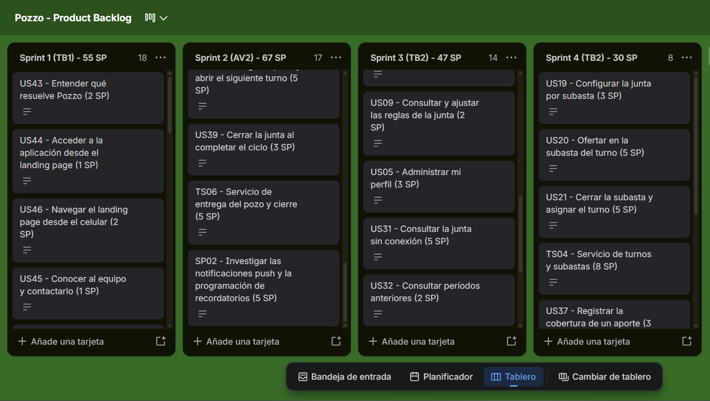
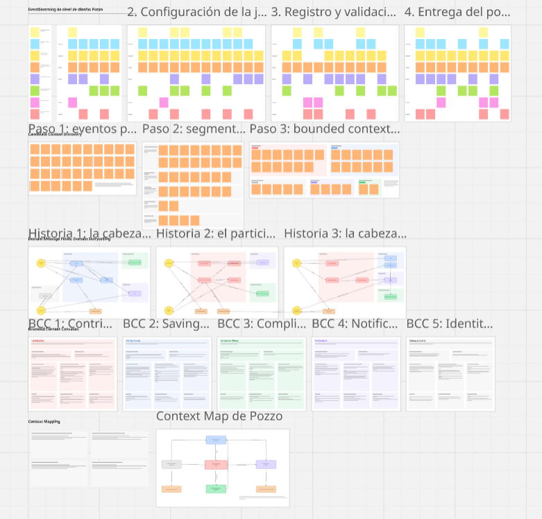

# Conclusiones

# Glosario

# Bibliografía

<!-- pdf:only
::: {#refs}
:::
-->

# Anexos

## Anexo A. Product Backlog en Trello

El Product Backlog se administra en Trello, en el tablero público "Pozzo - Product Backlog". El tablero tiene una lista por sprint y una tarjeta por historia, en el mismo orden de la tabla del Product Backlog: las 46 User Stories, las 8 Technical Stories y las 3 Spike Stories. El título de cada tarjeta lleva el código, el título y los Story Points de la historia; la descripción reproduce la posición en el backlog, la épica, el rol, la historia en el formato "Como... deseo... para..." y los criterios de aceptación en Gherkin. El nombre de cada lista indica el sprint, la entrega del curso a la que corresponde y la suma de Story Points planificados.

Enlace público del tablero: <https://trello.com/b/fRocSVZA/pozzo-product-backlog>

<!-- pdf:only
\newpage
-->

## Anexo B. Tablero de Miro del diseño estratégico

Los artefactos del Strategic-Level Domain-Driven Design se elaboraron en un único tablero de Miro, organizado en filas de frames que siguen el orden del proceso: el EventStorming de nivel de diseño en cuatro tramos (acceso, configuración de la junta, registro y validación de aportes, entrega y cierre), los tres pasos del Candidate Context Discovery, las tres historias de Domain Storytelling, los cinco Bounded Context Canvases y el Context Map con sus alternativas. Las capturas que ilustran el capítulo de Requirements Development and Software Solution Design provienen de ese tablero.

Enlace del tablero: <https://miro.com/app/board/uXjVHm8In_g=/?share_link_id=3138613697>

