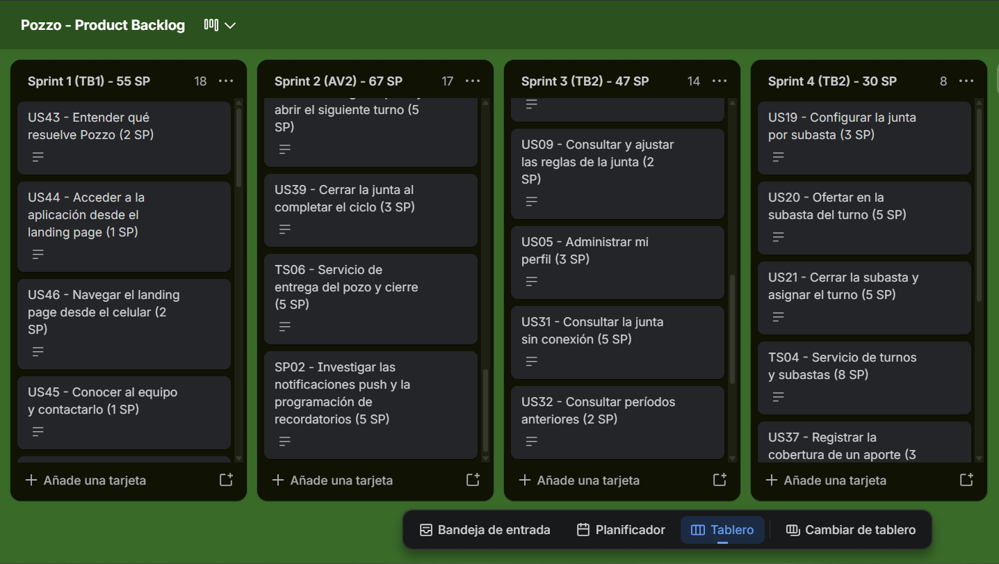
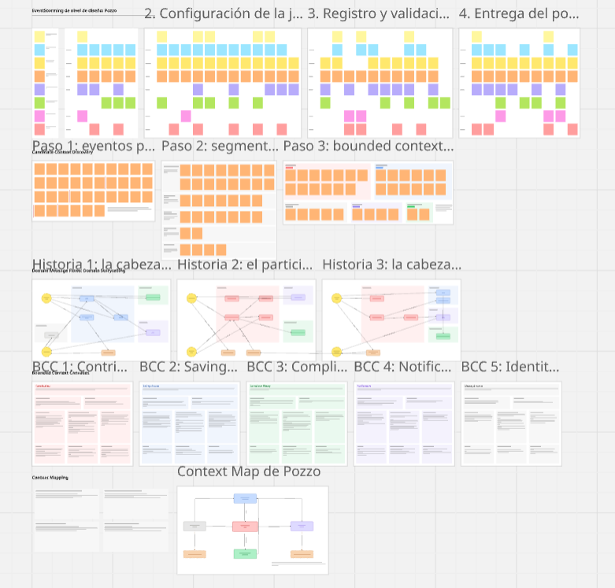

# Conclusiones

## Conclusiones y recomendaciones

La AV1 cubrió el descubrimiento del problema, la especificación de requisitos y el diseño de la solución. Esta entrega suma el diseño de la experiencia de usuario y el primer Sprint de implementación: el landing page publicado, los servicios RESTful desplegados y una aplicación móvil que recorre el flujo de una junta. Todavía no hay usuarios reales usando Pozzo, así que las hipótesis del Lean UX Process siguen sin medirse; lo que cambió es que ahora existe con qué medirlas.

**Sobre el Problem Statement.** El problema descrito en la sección Lean UX Problem Statements se confirmó en su totalidad en las seis entrevistas. Las tres cabezas de junta administran su junta con un cuaderno o un Excel, validan los pagos revisando uno por uno sus movimientos de Yape y las capturas del chat, y escriben a dos o tres integrantes en cada ciclo para cobrar. Los tres participantes guardan sus capturas sin orden, ya tuvieron que demostrar un pago que sí habían hecho y llegan a su turno sin saber si el pozo estará completo. Ninguno usa una aplicación dedicada: el sustituto real de Pozzo es el cuaderno y el chat grupal.

**Sobre los assumptions.** Las entrevistas respaldan que las juntas urbanas ya mueven sus aportes por billetera digital y que la cabeza de junta decide cómo se administra el grupo. Los User Assumptions sobre el rechazo a una solución que custodie el dinero y sobre la disposición del participante a registrar su aporte si el paso es breve se comprobarán con el producto en sus manos, en las entrevistas de validación de la siguiente entrega. Siguen sin evidencia el tamaño del mercado y el modelo de ingresos, que dependen de las juntas piloto. El assumption de que el equipo puede construir los tres productos dentro del ciclo se cumplió en este Sprint, pero con el trabajo de implementación concentrado en un integrante, lo que todavía no prueba que el equipo pueda sostenerlo.

**Sobre los Hypothesis Statements.** Las seis hipótesis siguen abiertas, porque ninguna junta real ha usado Pozzo. El Sprint 1 sí redujo el riesgo de la principal (Hypothesis Statement 01): la Spike Story de lectura de comprobantes mostró que ML Kit extrae en el propio celular el monto, la fecha, el destinatario y el número de operación de las capturas de Yape y Plin, y la aplicación ya compara esos datos con lo esperado y marca, campo por campo, lo que no coincide. Falta comprobar con juntas piloto que el 80 % de los aportes se valide sin revisión manual. El estado del pozo en tiempo real (02) y los turnos por sorteo y orden acordado (04) ya funcionan en la aplicación; los recordatorios (03) y el historial de cumplimiento (05) se adelantaron en los servicios y en la aplicación, y se completarán en los sprints que les corresponden.

**Sobre el Sprint 1.** El Sprint Goal se comprobó solo en un entorno de prueba, con una junta de muestra de cuatro integrantes: la aplicación permite crear la junta, invitar con código o enlace, asignar los turnos e iniciarla, y todos los integrantes ven el mismo calendario y el mismo estado del pozo. Falta comprobarlo con una cabeza de junta real. Los servicios RESTful quedaron desplegados en Oracle Cloud con 54 endpoints documentados en OpenAPI y 170 pruebas automatizadas que corren en cada Pull Request, y el landing page quedó publicado en GitHub Pages. El equipo además adelantó historias de los sprints siguientes, como el acceso con código SMS, el registro y la validación de aportes y los recordatorios.

**Sobre el diseño.** El diseño de la AV1 resistió la implementación. Los cinco Bounded Contexts se convirtieron en módulos de los servicios con las mismas fronteras, Contributions siguió siendo el núcleo, y el proveedor de SMS quedó detrás de la capa anticorrupción prevista en el Context Mapping. Los ajustes que pidió el código, como la base de datos de los canvases o el proveedor de SMS, se llevaron de vuelta al Capítulo II, que hoy describe lo que está construido. El Capítulo III parte de las mismas User Stories que los servicios, así que el diseño de las pantallas y el de los servicios responden a la misma especificación.

**Sobre el trabajo en equipo.** La implementación del Sprint 1 se concentró en un integrante, mientras que el resto del equipo aportó en el diseño, el informe, la documentación del código y la accesibilidad. El enunciado pide que todos participen en la implementación de cada producto, y en este Sprint eso no se cumplió.

**Recomendaciones.** Para la siguiente entrega el equipo debe repartir la implementación del Sprint 2, de modo que cada integrante lidere las historias de un Bounded Context en la aplicación y en los servicios, con sus pruebas de aceptación; realizar las entrevistas de validación con usuarios de ambos segmentos sobre el landing page y la aplicación, con la evaluación heurística del formato del curso, para comprobar con el producto lo que hoy se sostiene con declaraciones; conseguir dos o tres juntas piloto que usen Pozzo durante un ciclo completo, que es lo que exigen la hipótesis principal y los criterios de éxito del Problem Statement; y completar los servicios RESTful al 100 % con su documentación, como pide la AV2.

# Glosario

Este glosario reúne los términos de metodología, diseño y desarrollo de software que se usan a lo largo del informe. Los términos propios del dominio de las juntas de ahorro (junta, pozo, turno, cabeza de junta, cobertura, historial de cumplimiento y los demás) se definen en la sección Ubiquitous Language y no se repiten aquí (ver Tabla 157).

<table>
  <caption>Glosario de términos del dominio de las juntas</caption>
  <colgroup><col width="28%"><col width="72%"></colgroup>
  <thead>
    <tr>
      <th>Término</th>
      <th>Definición</th>
    </tr>
  </thead>
  <tbody>
    <tr>
      <td>Acceptance Criteria</td>
      <td>Condiciones que una User Story debe cumplir para considerarse terminada. En este informe se redactan en formato Gherkin y en tiempo presente.</td>
    </tr>
    <tr>
      <td>Aggregate</td>
      <td>En Domain-Driven Design, conjunto de entidades y objetos de valor que se tratan como una unidad de consistencia, con una entidad raíz que controla el acceso al resto.</td>
    </tr>
    <tr>
      <td>Anti-corruption Layer</td>
      <td>Patrón de Context Mapping en el que un Bounded Context traduce el modelo de otro antes de usarlo, para que el modelo externo no contamine el propio.</td>
    </tr>
    <tr>
      <td>Assumption</td>
      <td>En Lean UX, creencia que el equipo da por cierta sin haberla comprobado y que debe validarse durante el proyecto. Se clasifican en business, business outcome, user, user outcome and benefit y feature assumptions.</td>
    </tr>
    <tr>
      <td>Big Picture EventStorming</td>
      <td>Sesión de EventStorming orientada a explorar el negocio en su conjunto, identificando eventos, actores, sistemas externos y problemas, sin diseñar todavía la solución.</td>
    </tr>
    <tr>
      <td>Bounded Context</td>
      <td>Límite explícito dentro del cual un modelo de dominio y su lenguaje tienen un significado único. Pozzo define cinco: Contributions, Savings Groups, Compliance History, Notifications e Identity & Access.</td>
    </tr>
    <tr>
      <td>Bounded Context Canvas</td>
      <td>Plantilla que describe un Bounded Context: propósito, reglas de negocio, lenguaje, capabilities, dependencias de entrada y salida y crítica del diseño.</td>
    </tr>
    <tr>
      <td>C4 Model</td>
      <td>Modelo de cuatro niveles para representar la arquitectura de software: contexto, contenedores, componentes y código. En este informe se elabora en Structurizr.</td>
    </tr>
    <tr>
      <td>Candidate Context Discovery</td>
      <td>Sesión en la que, a partir de un EventStorm, se identifican los Bounded Contexts candidatos con técnicas como buscar eventos pivotales o partir del valor de negocio.</td>
    </tr>
    <tr>
      <td>Command Handler</td>
      <td>Clase de la Application Layer que recibe un comando, carga el agregado correspondiente, ejecuta la operación y persiste el resultado.</td>
    </tr>
    <tr>
      <td>Conformist</td>
      <td>Patrón de Context Mapping en el que un Bounded Context adopta el modelo de otro tal como es, sin traducción, porque no tiene poder de negociación sobre él.</td>
    </tr>
    <tr>
      <td>Context Map</td>
      <td>Diagrama que muestra los Bounded Contexts de un sistema y el patrón de relación entre cada par de ellos.</td>
    </tr>
    <tr>
      <td>Customer/Supplier</td>
      <td>Patrón de Context Mapping en el que un Bounded Context proveedor atiende las necesidades de otro cliente, negociando la interfaz entre ambos.</td>
    </tr>
    <tr>
      <td>Domain Event</td>
      <td>Hecho relevante para el negocio que ya ocurrió, expresado en pasado. Es la unidad básica del EventStorming.</td>
    </tr>
    <tr>
      <td>Domain Storytelling</td>
      <td>Técnica de modelado que narra, con pictogramas de actores y objetos de trabajo, cómo colaboran las personas y los sistemas para resolver un caso del negocio. Se usó para visualizar los flujos de mensajes entre Bounded Contexts.</td>
    </tr>
    <tr>
      <td>Domain-Driven Design (DDD)</td>
      <td>Enfoque de diseño de software que centra el modelo en el dominio del negocio y en un lenguaje compartido con los expertos. Tiene un nivel estratégico, que descompone el sistema en Bounded Contexts, y uno táctico, que diseña las clases de cada uno.</td>
    </tr>
    <tr>
      <td>Empathy Map</td>
      <td>Diagrama que resume lo que un User Persona piensa, siente, dice, hace, ve y oye, junto con sus dolores y beneficios esperados.</td>
    </tr>
    <tr>
      <td>Entity</td>
      <td>En Domain-Driven Design, objeto del dominio que se distingue por su identidad y no por sus atributos.</td>
    </tr>
    <tr>
      <td>Epic</td>
      <td>Agrupación de User Stories que comparten un objetivo funcional. Pozzo define doce.</td>
    </tr>
    <tr>
      <td>EventStorming</td>
      <td>Taller colaborativo que modela un dominio colocando en una línea de tiempo sus eventos, comandos, actores, políticas y sistemas externos. Se realizó una sesión Big Picture y otra de nivel de diseño.</td>
    </tr>
    <tr>
      <td>Gherkin</td>
      <td>Formato para escribir criterios de aceptación como escenarios con la estructura Dado, Cuando, Entonces (Given, When, Then).</td>
    </tr>
    <tr>
      <td>Hypothesis Statement</td>
      <td>En Lean UX, enunciado comprobable que vincula un resultado de negocio, una persona, un beneficio para esa persona y la funcionalidad que lo habilita. Se formula uno por cada feature assumption.</td>
    </tr>
    <tr>
      <td>Impact Map</td>
      <td>Mapa que conecta un objetivo de negocio con los actores que pueden lograrlo, el cambio de comportamiento que se espera de ellos, los entregables que lo provocan y las User Stories que los implementan.</td>
    </tr>
    <tr>
      <td>Landing Page</td>
      <td>Sitio web estático que presenta el producto, su propuesta de valor y al equipo, y ofrece la vía de acceso a la aplicación.</td>
    </tr>
    <tr>
      <td>Lean UX</td>
      <td>Proceso de diseño de producto que parte de un Problem Statement, explicita assumptions, las convierte en hipótesis y las valida con experimentos antes de construir.</td>
    </tr>
    <tr>
      <td>Open Host Service</td>
      <td>Patrón de Context Mapping en el que un Bounded Context expone un protocolo público y estable para que cualquier otro contexto lo consuma sin acuerdos particulares.</td>
    </tr>
    <tr>
      <td>Product Backlog</td>
      <td>Lista priorizada de todas las historias del producto, ordenada por valor para el negocio y estimada en Story Points.</td>
    </tr>
    <tr>
      <td>Published Language</td>
      <td>Patrón de Context Mapping en el que la comunicación entre contextos usa un lenguaje documentado y compartido, como el esquema de los eventos que un contexto publica.</td>
    </tr>
    <tr>
      <td>Repository</td>
      <td>Abstracción que da acceso a los agregados como si fueran una colección en memoria. Su interfaz se define en la Domain Layer y su implementación en la Infrastructure Layer.</td>
    </tr>
    <tr>
      <td>RESTful API</td>
      <td>Interfaz de servicios web basada en HTTP que expone recursos identificados por URL y los manipula con los verbos estándar del protocolo. Es la forma en que la aplicación móvil se comunica con el backend de Pozzo.</td>
    </tr>
    <tr>
      <td>ROSCA</td>
      <td>Rotating Savings and Credit Association. Denominación académica de la junta de ahorro y de sus equivalentes en otros países.</td>
    </tr>
    <tr>
      <td>Shared Kernel</td>
      <td>Patrón de Context Mapping en el que dos Bounded Contexts comparten una parte del modelo y se comprometen a cambiarla de forma coordinada.</td>
    </tr>
    <tr>
      <td>SMART</td>
      <td>Criterios para formular objetivos: específicos, medibles, alcanzables, relevantes y con plazo definido. Se aplican a los objetivos de negocio del Impact Map y a los objetivos profesionales de los integrantes.</td>
    </tr>
    <tr>
      <td>Spike Story</td>
      <td>Historia orientada a investigar o probar la viabilidad de una tecnología antes de implementar una funcionalidad. No entrega un incremento de producto, sino conclusiones documentadas y, en su caso, un prototipo.</td>
    </tr>
    <tr>
      <td>Sprint</td>
      <td>Período de trabajo de duración fija al final del cual el equipo entrega un incremento del producto. En este proyecto cada sprint corresponde a una entrega del curso.</td>
    </tr>
    <tr>
      <td>Story Points</td>
      <td>Unidad relativa de estimación del esfuerzo de una historia. Este informe usa la escala 1, 2, 3, 5 y 8.</td>
    </tr>
    <tr>
      <td>Structurizr</td>
      <td>Herramienta que genera los diagramas del C4 Model a partir de una descripción textual de la arquitectura.</td>
    </tr>
    <tr>
      <td>SWOT</td>
      <td>Análisis de fortalezas, debilidades, oportunidades y amenazas (FODA), aplicado a la startup y a cada competidor.</td>
    </tr>
    <tr>
      <td>Technical Story</td>
      <td>Historia que describe un componente sin interacción directa con el usuario final, como un servicio RESTful. Se redacta desde el rol Developer y sus criterios de aceptación son escenarios de solicitud y respuesta.</td>
    </tr>
    <tr>
      <td>Ubiquitous Language</td>
      <td>Lenguaje compartido entre el equipo y los expertos del dominio, usado sin ambigüedad en las conversaciones, los documentos y el código.</td>
    </tr>
    <tr>
      <td>User Journey Map</td>
      <td>Representación del recorrido de un User Persona a través de una experiencia, con sus acciones, pensamientos y emociones en cada etapa. Se elaboraron en su versión As-Is.</td>
    </tr>
    <tr>
      <td>User Persona</td>
      <td>Arquetipo que representa a un segmento objetivo, construido a partir de las características comunes halladas en las entrevistas.</td>
    </tr>
    <tr>
      <td>User Story</td>
      <td>Descripción breve de una funcionalidad desde la perspectiva de quien la usa, con la estructura "Como... deseo... para..." y sus criterios de aceptación.</td>
    </tr>
    <tr>
      <td>User Task Matrix</td>
      <td>Cuadro que registra las tareas que cada User Persona realiza para cumplir sus objetivos, con su frecuencia e importancia, independientemente de que exista la solución.</td>
    </tr>
    <tr>
      <td>Value Object</td>
      <td>En Domain-Driven Design, objeto del dominio definido solo por sus atributos, sin identidad propia e inmutable.</td>
    </tr>
  </tbody>
</table>

# Bibliografía

<!-- pdf:only
::: {#refs}
:::
-->

# Anexos

## Anexo A. Product Backlog en Trello

El Product Backlog se administra en Trello, en el tablero público "Pozzo - Product Backlog". El tablero tiene una lista por sprint y una tarjeta por historia, en el mismo orden de la tabla del Product Backlog: las 46 User Stories, las 8 Technical Stories y las 3 Spike Stories. El título de cada tarjeta lleva el código, el título y los Story Points de la historia; la descripción reproduce la posición en el backlog, la épica, el rol, la historia en el formato "Como... deseo... para..." y los criterios de aceptación en Gherkin. El nombre de cada lista indica el sprint, la entrega del curso a la que corresponde y la suma de Story Points planificados.

Enlace público del tablero: <https://trello.com/b/fRocSVZA/pozzo-product-backlog> (ver Figura 157)

<!-- pdf:only
\newpage
-->

## Anexo B. Tablero de Miro del diseño estratégico

Los artefactos del Strategic-Level Domain-Driven Design se elaboraron en un único tablero de Miro, organizado en filas de frames que siguen el orden del proceso: el EventStorming de nivel de diseño en cuatro tramos (acceso, configuración de la junta, registro y validación de aportes, entrega y cierre), los tres pasos del Candidate Context Discovery, las tres historias de Domain Storytelling, los cinco Bounded Context Canvases y el Context Map con sus alternativas. Las capturas que ilustran el capítulo de Requirements Development and Software Solution Design provienen de ese tablero.

Enlace del tablero: <https://miro.com/app/board/uXjVHm8In_g=/?share_link_id=3138613697> (ver Figura 158)

<!-- pdf:only
\newpage
-->

## Anexo C. Fuentes de los diagramas de arquitectura

Los diagramas de arquitectura del capítulo de Requirements Development and Software Solution Design no se dibujaron a mano: se generan a partir de archivos de texto que viven en la carpeta `docs/architecture/` del repositorio del informe (<https://github.com/kerolabs/pozzo-doc/tree/develop/docs/architecture>) y se versionan junto con el texto. Los diagramas del C4 Model (contexto, contenedores, componentes y despliegue) se describen en el lenguaje de Structurizr y se renderizan con Structurizr; los diagramas de clases del Domain Layer y los de base de datos se describen en PlantUML, y cada esquema de base de datos lleva además su definición en SQL para PostgreSQL. Las imágenes resultantes son las que aparecen en el capítulo. Mantener los diagramas como texto permite revisarlos en las Pull Requests igual que cualquier otro cambio, ver quién modificó qué y regenerarlos cuando el diseño cambia sin volver a dibujarlos (ver Tabla 158).

<table>
  <caption>Fuentes de los diagramas de arquitectura y su archivo en el repositorio</caption>
  <colgroup><col width="34%"><col width="22%"><col width="44%"></colgroup>
  <thead>
    <tr>
      <th>Artefacto</th>
      <th>Herramienta</th>
      <th>Archivo en el repositorio</th>
    </tr>
  </thead>
  <tbody>
    <tr>
      <td>Diagramas C4 de contexto, contenedores y despliegue, y diagramas de componentes de los cinco Bounded Contexts</td>
      <td>Structurizr DSL, renderizado con Structurizr</td>
      <td>docs/architecture/workspace.dsl</td>
    </tr>
    <tr>
      <td>Diagrama de clases del Domain Layer de Contributions</td>
      <td>PlantUML</td>
      <td>docs/architecture/uml/contributions-domain.puml</td>
    </tr>
    <tr>
      <td>Diagrama de clases del Domain Layer de Savings Groups</td>
      <td>PlantUML</td>
      <td>docs/architecture/uml/savings-groups-domain.puml</td>
    </tr>
    <tr>
      <td>Diagrama de clases del Domain Layer de Compliance History</td>
      <td>PlantUML</td>
      <td>docs/architecture/uml/compliance-history-domain.puml</td>
    </tr>
    <tr>
      <td>Diagrama de clases del Domain Layer de Notifications</td>
      <td>PlantUML</td>
      <td>docs/architecture/uml/notifications-domain.puml</td>
    </tr>
    <tr>
      <td>Diagrama de clases del Domain Layer de Identity &amp; Access</td>
      <td>PlantUML</td>
      <td>docs/architecture/uml/identity-access-domain.puml</td>
    </tr>
    <tr>
      <td>Diagrama de base de datos de Contributions y su DDL</td>
      <td>PlantUML y SQL (PostgreSQL 16)</td>
      <td>docs/architecture/db/contributions.puml, docs/architecture/db/contributions.sql</td>
    </tr>
    <tr>
      <td>Diagrama de base de datos de Savings Groups y su DDL</td>
      <td>PlantUML y SQL (PostgreSQL 16)</td>
      <td>docs/architecture/db/savings_groups.puml, docs/architecture/db/savings_groups.sql</td>
    </tr>
    <tr>
      <td>Diagrama de base de datos de Compliance History y su DDL</td>
      <td>PlantUML y SQL (PostgreSQL 16)</td>
      <td>docs/architecture/db/compliance_history.puml, docs/architecture/db/compliance_history.sql</td>
    </tr>
    <tr>
      <td>Diagrama de base de datos de Notifications y su DDL</td>
      <td>PlantUML y SQL (PostgreSQL 16)</td>
      <td>docs/architecture/db/notifications.puml, docs/architecture/db/notifications.sql</td>
    </tr>
    <tr>
      <td>Diagrama de base de datos de Identity &amp; Access y su DDL</td>
      <td>PlantUML y SQL (PostgreSQL 16)</td>
      <td>docs/architecture/db/identity_access.puml, docs/architecture/db/identity_access.sql</td>
    </tr>
  </tbody>
</table>
